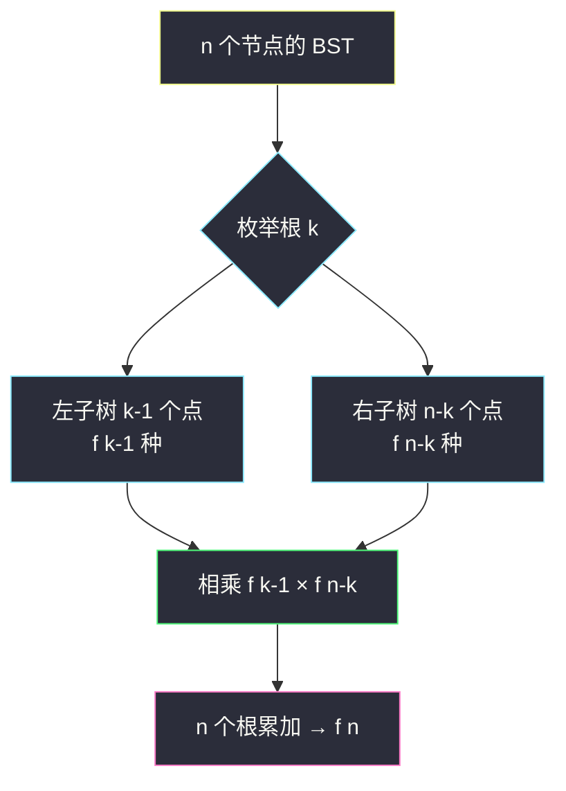
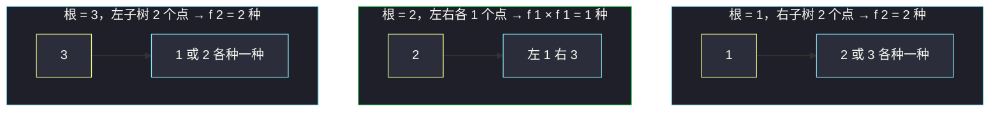

# 不同的二叉搜索树（树形 DP 视角 + 卡特兰数）

## 一、问题描述

给你一个整数 `n`，求恰由 `n` 个节点组成且节点值从 `1` 到 `n` 互不相同的**二叉搜索树（BST）**有多少种？返回不同结构 BST 的数量。

> 🔗 LeetCode 96：https://leetcode.cn/problems/unique-binary-search-trees/

**示例 1**

```
输入：n = 3
输出：5
解释：1~3 能组成 5 种不同结构的 BST
```

**示例 2**

```
输入：n = 1
输出：1
```

**直观理解**

`n = 3` 时的 5 种结构：

```
  1        1          2         3       3
   \        \        / \       /       /
    2        3      1   3     1       2
     \      /                  \     /
      3    2                    2   1
```

关键观察：**节点值是什么不重要，只看「左子树几个点、右子树几个点」**。选定一个根后，比它小的都进左子树、比它大的都进右子树，左右子树又各自是同一问题的更小规模版本——标准的**树形 DP / 分治计数**结构，答案就是**卡特兰数**。

---

## 二、暴力解法

### 直观思路

枚举 `1..n` 中每个数字 `k` 当根：左子树由 `1..k-1`（共 `k-1` 个点）构成，右子树由 `k+1..n`（共 `n-k` 个点）构成。左、右子树的方案数相乘，再把 `n` 种根的选择加起来：

```
f(n) = Σ (k=1..n) f(k-1) × f(n-k)
```

直接翻译成递归：

```java
// 暴力递归：枚举每个根，左右子树方案数相乘再累加
public static int numTrees1(int n) {
    if (n == 0) {
        return 1; // 空树也算一种结构
    }
    int ans = 0;
    for (int k = 1; k <= n; k++) {
        ans += numTrees1(k - 1) * numTrees1(n - k);
    }
    return ans;
}
```

### 复杂度

- **时间**：`O(卡特兰数级)`，约 `O(4ⁿ / n^0.5)`，`n = 19` 时已是天文数字级展开
- **空间**：`O(n)` 递归栈

### 🔴 瓶颈在哪里

`f(5)` 要算 `f(3) × f(1)`，`f(4)` 也要算 `f(3) × f(0)`……同一个 `f(k)` 被反复展开。**子问题重复求解**——和爬楼梯（class066 斐波那契）一模一样的病根，用记忆化 / 填表根治。

---

## 三、优化探索（核心章节）

### 3.1 观察特征

| 特征 | 说明 |
|------|------|
| 无后效性 | `f(m)` 只由规模更小的 `f(0)..f(m-1)` 决定，与「具体用了哪些数字」无关 |
| 值域连续，规模即状态 | `1..k-1` 与 `5..k+3` 只要个数相同，能构成的 BST 结构数就相同——**只有「个数」是可变参数** |
| 重叠子问题 | 暴力递归里 `f(小规模)` 大量重复 |
| 一个可变参数 | 按左程云「可变参数法」：1 个可变参数 → 1 维 dp 表 |

### 3.2 推导：从「选根」到卡特兰数

对 `n` 个节点，枚举根，左子树 `l` 个点、右子树 `n-1-l` 个点：

```
f(n) = f(0)×f(n-1) + f(1)×f(n-2) + ... + f(n-1)×f(0)
```

这正是课上 class147 Code04 的「公式 4」写法（`l` 与 `r = i-1-l` 双指针扫一遍累乘）：

```
f(0) = f(1) = 1
for i = 2 .. n:
    for l = 0, r = i-1; l < i; l++, r--:
        f(i) += f(l) * f(r)
```

这条递推数出来就是**卡特兰数** `C(n)`：`1, 1, 2, 5, 14, 42, 132 ...`



### 3.3 关键推导问题

| 问题 | 答案 |
|------|------|
| 为什么「结构数只与节点个数有关」？ | 中序遍历按序填 `1..m` 即可与任意有序集合一一对应，BST 结构只由形状决定 |
| `f(0) = 1` 还是 `0`？ | 取 `1`：空树是「一种」合法结构，保证只有一个孩子的根方案数正确（`f(1) = f(0)×f(0) = 1`） |
| 与卡特兰数什么关系？ | `f(n)` 就是第 `n` 个卡特兰数 `C(n) = C(2n, n) / (n+1)`，课上称为公式 4（递推版） |
| 卡特兰数有更快的公式吗？ | 有通项公式逐项递推 `C(n+1) = C(n)×2(2n+1)/(n+2)`，可 `O(n)` 算且少一层循环；本题 `n ≤ 19` 差别不大 |

### 3.4 一句话核心

> **枚举根，左 `l` 个点右 `i-1-l` 个点，`f(i) = Σ f(l)×f(i-1-l)`，从小到大填一维表。**

---

## 四、代码实现

### Java（主解：一维填表，对齐 class147 Code04）

```java
// 不同的二叉搜索树
// 1 <= n <= 19，返回 1..n 能组成多少种不同结构的 BST
// 测试链接 : https://leetcode.cn/problems/unique-binary-search-trees/
public class Solution {

    // f[i] : i 个节点能构成的 BST 结构数（卡特兰数）
    // 转移：f[i] = Σ f[l] * f[i-1-l]，枚举根后左 l 个、右 i-1-l 个
    // 依赖方向：f[i] 只依赖更小的 f[0..i-1]，i 从小到大填
    // 时间复杂度 O(n²)，空间复杂度 O(n)
    public static int numTrees(int n) {
        int[] f = new int[n + 1];
        f[0] = f[1] = 1;
        for (int i = 2; i <= n; i++) {
            // l 从左往右、r 从右往左，l + r = i - 1
            for (int l = 0, r = i - 1; l < i; l++, r--) {
                f[i] += f[l] * f[r];
            }
        }
        return f[n];
    }
}
```

### Python（同思路）

```python
class Solution:
    def numTrees(self, n: int) -> int:
        # f[i] : i 个节点的 BST 结构数
        f = [0] * (n + 1)
        f[0] = f[1] = 1
        for i in range(2, n + 1):
            for l in range(i):          # 左子树 l 个点，右子树 i-1-l 个点
                f[i] += f[l] * f[i - 1 - l]
        return f[n]
```

---

## 五、具体例子演示

以 `n = 3` 为例，完整跟踪 `f[0..3]` 的填表过程。

**初始**：`f[0] = 1`（空树），`f[1] = 1`（单节点）。

**填 `f[2]`**（2 个节点，枚举根，左子树 `l` 个 + 右子树 `1-l` 个）：

| 根的选择 | l（左点数） | r（右点数） | 贡献 f[l]×f[r] |
|------|------|------|------|
| 1 当根 | 0 | 1 | 1×1 = 1 |
| 2 当根 | 1 | 0 | 1×1 = 1 |

`f[2] = 1 + 1 = 2` ✓（`1→2` 右链、`2←1` 左链，正是两种）

**填 `f[3]`**：

| 根 | l | r | 贡献 |
|------|------|------|------|
| 1 当根 | 0 | 2 | 1×2 = 2 |
| 2 当根 | 1 | 1 | 1×1 = 1 |
| 3 当根 | 2 | 0 | 2×1 = 2 |

`f[3] = 2 + 1 + 2 = 5` ✓ 与题目示例一致。

**填 `f[4]`（顺手多看一步）**：

| 根 | l | r | 贡献 |
|------|------|------|------|
| 1 | 0 | 3 | 1×5 = 5 |
| 2 | 1 | 2 | 1×2 = 2 |
| 3 | 2 | 1 | 2×1 = 2 |
| 4 | 3 | 0 | 5×1 = 5 |

`f[4] = 14`，即卡特兰数 `C(4) = 14`。

对应 `n = 3`、根为 1 的 2 种结构（左 0 个点、右 2 个点 `2,3` 摆出 2 种）：



---

## 六、复杂度分析

| 版本 | 时间 | 空间 | 说明 |
|------|------|------|------|
| 暴力递归 | `O(4ⁿ/n^0.5)` | `O(n)` | 卡特兰数级展开，重复求解 |
| 一维填表（主解） | `O(n²)` | `O(n)` | 两层循环填表 |
| 卡特兰通项递推 | `O(n)` | `O(1)` | `C(k+1) = C(k)×2(2k+1)/(k+2)`，进阶可选 |

---

## 七、方法对比与总结

### 演进链

```
枚举根递归 → 加缓存/填表 f[i] = Σ f[l]×f[i-1-l] → 卡特兰通项 O(n)
```

### 易错点

1. **`f(0)` 初始化成 0**：只有单孩子时（`l=0, r=i-1`）会整项清零，答案错。空树必须算 1 种。
2. **把「BST」当约束硬用**：本题只数结构，`1..n` 与任意连续值域等价，别去枚举具体哪几个数字。
3. **内层循环边界**：`l` 取 `0..i-1`，注意是 `l < i` 而不是 `l <= i`（左右子树总点数是 `i-1`）。
4. **溢出误判**：`n ≤ 19` 时 `f(19) = 1767263190 < 2³¹-1`，`int` 恰好不溢出；若 `n` 更大就要换 `long`。

### 模板口诀

> **选根分左右，个数定规模；左乘右再累加，卡特兰数滚出来。**

---

## 八、举一反三

| 题目 | 链接 | 迁移点 |
|------|------|--------|
| 95. 不同的二叉搜索树 II | https://leetcode.cn/problems/unique-binary-search-trees-ii/ | 从「计数」变「枚举所有树」，同样的分治骨架 |
| 341. 扁平化嵌套列表迭代器外的树形计数 | https://leetcode.cn/problems/unique-binary-search-trees/ | 复习本文（卡特兰数原型） |
| 96 → 337. 打家劫舍 III | https://leetcode.cn/problems/house-robber-iii/ | 树形 DP 家族：状态从「子树规模」换成「偷/不偷」 |
| 968. 监控二叉树 | https://leetcode.cn/problems/binary-tree-cameras/ | 树形 DP 家族：每个节点三种状态取转移 |
| 1259. 不相交的握手 | https://leetcode.cn/problems/handshakes-that-dont-cross/ | 卡特兰数直接套：不相交配对方案数 |

**迁移一句**：凡是「枚举一个分割点 / 根，把规模拆成两部分，两部分方案数相乘再累加」的计数题，先想到卡特兰递推 `f(n) = Σ f(l)×f(n-1-l)`；在树上则是「左子树 × 右子树」的树形 DP 骨架。
