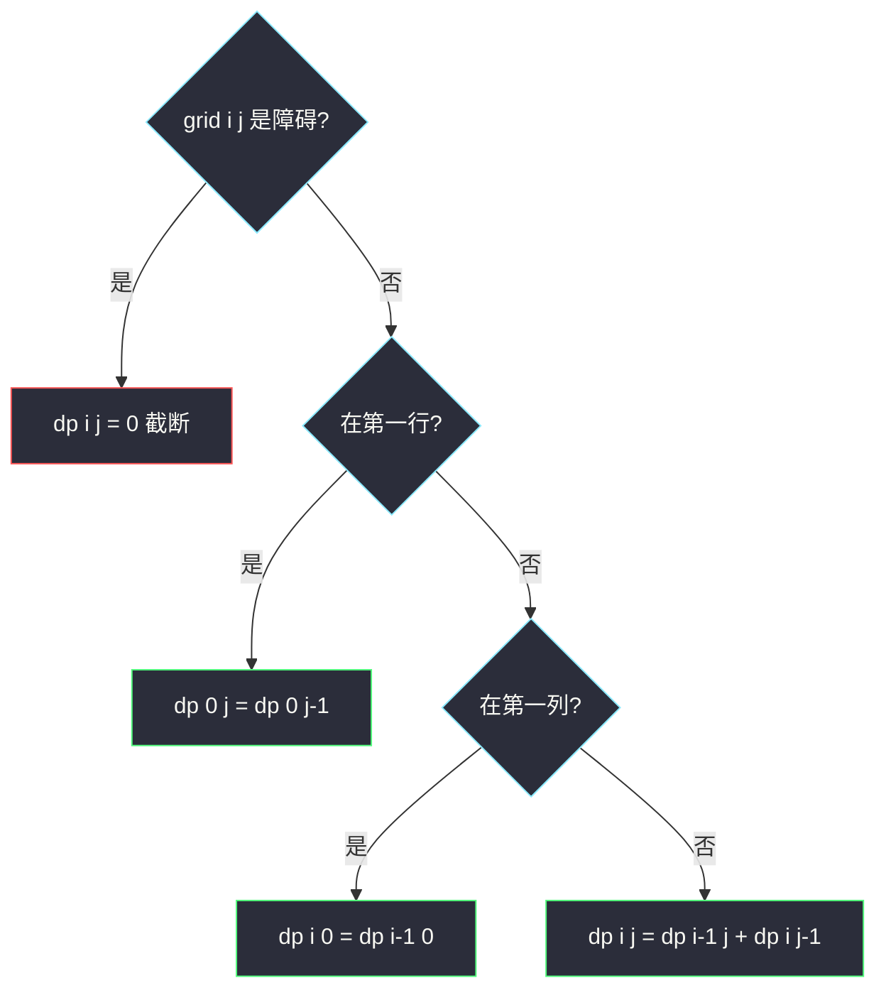
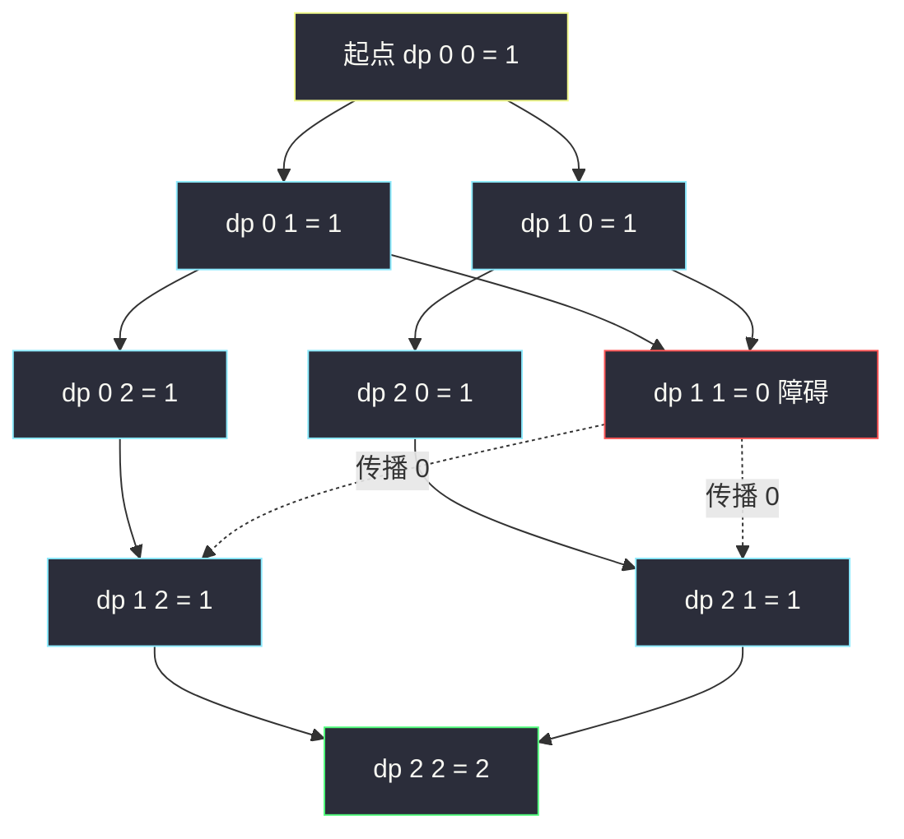

# 不同路径 II（网格 DP + 障碍处理）

## 一、问题描述

一个机器人位于 `m x n` 网格的左上角，每次只能**向下或向右**移动一步。网格中部分格子有障碍物（`obstacleGrid[i][j] = 1` 表示障碍，`0` 表示空地），问到达右下角共有多少条不同的路径。

> 🔗 LeetCode 63：https://leetcode.cn/problems/unique-paths-ii/

**示例 1**

```
输入：obstacleGrid = [[0,0,0],[0,1,0],[0,0,0]]
输出：2
解释：3x3 网格的正中间有一个障碍物，从左上角到右下角有 2 条路径：
1. 向右 -> 向右 -> 向下 -> 向下
2. 向下 -> 向下 -> 向右 -> 向右
```

**示例 2**

```
输入：obstacleGrid = [[0,1],[0,0]]
输出：1
解释：(0,1) 是障碍，只能 先向下、再向右 一条路。
```

**直观理解**

与 [#62 不同路径](./unique-paths.md) 唯一的区别是：**某些格子不能踩**。递推结构完全一样（最后一步来自上或来自左），只需要多一条规则——

```
障碍格：dp[i][j] = 0（没有路径能停在这里）
空地格：dp[i][j] = dp[i-1][j] + dp[i][j-1]
```

障碍就像在路径流里**截断**了通道：经过它的所有路径都被清零。

> 📚 课源码定位：左程云课没有本题原题，按 `class067/Code01_MinimumPathSum.java`（网格 DP：递归 → 记忆化 → 填表 → 空间压缩）与 `class069/Code04_PathsDivisibleByK.java`（同款路径计数）的骨架对齐；本题只是在转移前多一个「障碍短路」判断。

---

## 二、暴力解法（入门）

### 直观思路

与 #62 相同的自顶向下递归 `f(i, j)` = 从 `(0,0)` 走到 `(i,j)` 的路径数，只是遇到障碍直接返回 0：

```java
// 不同路径 II：直接递归
// f(i, j) : 从(0,0)到(i,j)的路径数；障碍格路径数为 0
public static int uniquePathsWithObstacles1(int[][] grid) {
    return f1(grid, grid.length - 1, grid[0].length - 1);
}

public static int f1(int[][] grid, int i, int j) {
    if (grid[i][j] == 1) {
        return 0; // 踩到障碍：此路不通
    }
    if (i == 0 && j == 0) {
        return 1; // 起点（且非障碍）
    }
    int up = 0, left = 0;
    if (i - 1 >= 0) {
        up = f1(grid, i - 1, j);
    }
    if (j - 1 >= 0) {
        left = f1(grid, i, j - 1);
    }
    return up + left;
}
```

### 复杂度

- **时间**：`O(2^(m+n))`（与 #62 同病：子问题 `f(i, j)` 被反复重算）
- **空间**：`O(m + n)`，递归栈

### 🔴 瓶颈在哪里

递归树里 `f(1,1)` 这类中间子问题被多条路径反复求解，网格一大就指数爆炸。加障碍**只会减少路径数，不会减少重复计算**——优化方向与 #62 完全一致：缓存子问题。

---

## 三、优化探索（核心章节）

### 3.1 障碍对四要素的影响

只改动一处，其余与 #62 逐字相同：

| 要素 | #62 不同路径 | #63 不同路径 II |
|------|--------------|-----------------|
| dp 定义 | 从 `(0,0)` 到 `(i,j)` 的路径数 | 同左 |
| 初始化 | 首行首列全 1 | 首行首列：**遇障碍起全 0**（障碍之后到不了） |
| 转移 | `dp[i][j] = dp[i-1][j] + dp[i][j-1]` | 同左，但**障碍格先置 0 再跳过** |
| 答案 | `dp[m-1][n-1]` | 同左（起点或终点是障碍时自然为 0） |

关键细节：首行初始化不能无脑全 1——一旦第一行某个格子是障碍，**它右边所有格子都到不了**（第一行只能从左边来），应全部为 0。用「前一个是 1 才继续是 1」的累积写法：

```java
dp[0][j] = 1;  // 若 grid[0][j]==1 或 dp[0][j-1]==0，则置 0
```



### 3.2 关键推导问题

| 问题 | 答案 |
|------|------|
| 为什么障碍格直接 `dp = 0` 就够了？ | 「路径数为 0」会让下游所有依赖它的格子自动少掉这些路径，截断天然传播，不需要额外标记 |
| 起点是障碍怎么办？ | 初始化时 `dp[0][0] = 1 - grid[0][0]`（或先判 `grid[0][0]==1` 返回 0），终点同理自然为 0 |
| 首行初始化为什么用累积式？ | 首行格子只能从左侧来，左侧为 0（含障碍截断）则它也是 0 |
| 结果会溢出吗？ | 约束 `1 ≤ m, n ≤ 100`，但题目保证答案 ≤ `2 x 10^5`（障碍够多）；Java 中间用 `int` 按本题数据规模可行，稳妥可用 `long` |
| 能空间压缩吗？ | 能，依赖只有「上一行同列 + 本行左格」，与 #62 同款一维滚动，障碍格置 0 即可 |

### 3.3 一句话核心

> **#62 的表格原封不动，障碍格填 0、首行首列改为累积式初始化——截断自动传播。**

---

## 四、代码实现详解

### Java（主解：自底向上填表）

```java
// 不同路径 II
// 网格中的障碍物和空位置分别用 1 和 0 来表示
// 返回从左上角到右下角的不同路径数
// 测试链接 : https://leetcode.cn/problems/unique-paths-ii/
// 对齐 class067/Code01 网格 DP 骨架 + 障碍截断规则
public class Solution {

    // 时间复杂度 O(m * n)，空间复杂度 O(m * n)
    public static int uniquePathsWithObstacles(int[][] grid) {
        int m = grid.length;
        int n = grid[0].length;
        // dp[i][j] : 从(0,0)走到(i,j)的路径数
        // 障碍格恒为 0；空地格 = 来自上 + 来自左
        // 依赖方向：上方和左侧，从上到下、从左到右填表
        int[][] dp = new int[m][n];
        dp[0][0] = grid[0][0] == 1 ? 0 : 1;
        // 首行：只能从左来，左为 0（含障碍）则持续为 0
        for (int j = 1; j < n; j++) {
            dp[0][j] = grid[0][j] == 1 ? 0 : dp[0][j - 1];
        }
        // 首列：只能从上来
        for (int i = 1; i < m; i++) {
            dp[i][0] = grid[i][0] == 1 ? 0 : dp[i - 1][0];
        }
        for (int i = 1; i < m; i++) {
            for (int j = 1; j < n; j++) {
                dp[i][j] = grid[i][j] == 1 ? 0 : dp[i - 1][j] + dp[i][j - 1];
            }
        }
        return dp[m - 1][n - 1];
    }
}
```

### Java（进阶：空间压缩）

```java
public class Solution {

    // 一维滚动：dp[j] 复用前是上一行，dp[j-1] 已是本行
    // 障碍格直接把 dp[j] 置 0（覆盖旧值，天然截断）
    // 时间 O(m * n)，空间 O(n)
    public static int uniquePathsWithObstacles2(int[][] grid) {
        int m = grid.length;
        int n = grid[0].length;
        int[] dp = new int[n];
        dp[0] = grid[0][0] == 1 ? 0 : 1;
        for (int j = 1; j < n; j++) {
            dp[j] = grid[0][j] == 1 ? 0 : dp[j - 1];
        }
        for (int i = 1; i < m; i++) {
            for (int j = 0; j < n; j++) {
                if (grid[i][j] == 1) {
                    dp[j] = 0;            // 障碍：截断
                } else if (j > 0) {
                    dp[j] += dp[j - 1];   // 上(旧dp[j]) + 左(新dp[j-1])
                }
                // j == 0 且非障碍：dp[0] 沿用上一行（只能从上来），无需改
            }
        }
        return dp[n - 1];
    }
}
```

### Python（同思路）

```python
# 不同路径 II：二维填表，O(m*n) / O(m*n)
class Solution:
    def uniquePathsWithObstacles(self, obstacleGrid: List[List[int]]) -> int:
        m, n = len(obstacleGrid), len(obstacleGrid[0])
        # dp[i][j]：从(0,0)到(i,j)的路径数；障碍格恒 0
        dp = [[0] * n for _ in range(m)]
        dp[0][0] = 0 if obstacleGrid[0][0] == 1 else 1
        for j in range(1, n):                       # 首行：累积式
            dp[0][j] = 0 if obstacleGrid[0][j] else dp[0][j - 1]
        for i in range(1, m):                       # 首列：累积式
            dp[i][0] = 0 if obstacleGrid[i][0] else dp[i - 1][0]
        for i in range(1, m):
            for j in range(1, n):
                dp[i][j] = 0 if obstacleGrid[i][j] \
                    else dp[i - 1][j] + dp[i][j - 1]
        return dp[m - 1][n - 1]
```

```python
# 空间压缩：一行数组滚动，O(m*n) / O(n)
class Solution:
    def uniquePathsWithObstacles(self, obstacleGrid: List[List[int]]) -> int:
        n = len(obstacleGrid[0])
        dp = [0] * n
        dp[0] = 0 if obstacleGrid[0][0] else 1
        for j in range(1, n):
            dp[j] = 0 if obstacleGrid[0][j] else dp[j - 1]
        for row in obstacleGrid[1:]:
            for j in range(n):
                if row[j] == 1:
                    dp[j] = 0
                elif j > 0:
                    dp[j] += dp[j - 1]
        return dp[-1]
```

---

## 五、具体例子演示

以示例 1 的 `3 x 3` 网格为例（`X` 表示障碍），端到端跟踪填表：

```
网格：            路径数含义：
.  .  .          dp[0][0] 是起点
.  X  .          dp[2][2] 是终点
.  .  .
```

### 第 1 步：初始化首行首列

首行 `[., ., .]` 无障碍，一路向右各 1 条；首列同理：

| dp | j=0 | j=1 | j=2 |
|----|-----|-----|-----|
| i=0 | 1 | 1 | 1 |
| i=1 | 1 | ? | ? |
| i=2 | 1 | ? | ? |

### 第 2 步：逐格填充

| 格子 | 类型 | 转移式 | 来自上 | 来自左 | dp 值 |
|------|------|--------|--------|--------|-------|
| (1,1) | **障碍 X** | 置 0，跳过 | — | — | **0** |
| (1,2) | 空地 | dp[0][2] + dp[1][1] | 1 | 0 | **1** |
| (2,1) | 空地 | dp[1][1] + dp[2][0] | 0 | 1 | **1** |
| (2,2) | 空地 | dp[1][2] + dp[2][1] | 1 | 1 | **2** |

### 第 3 步：读答案

终格 `dp[2][2] = 2`，与题目输出一致。注意 `(1,1)` 的障碍如何**向右下方传播 0**：`(1,2)` 的左来源被掐断、`(2,1)` 的上来源被掐断，最终只留下「贴上边走」和「贴左边走」两条路。



红框是障碍格（dp=0），虚线是「0 沿依赖方向传播」——不需要任何额外处理，转移式自动完成截断。

---

## 六、复杂度分析

| 版本 | 时间 | 空间 | 说明 |
|------|------|------|------|
| 暴力递归 | `O(2^(m+n))` | `O(m+n)` | 子问题重复求解，指数爆炸 |
| 记忆化搜索 | `O(mn)` | `O(mn)` | 每个 f(i,j) 只算一次 |
| 二维填表（主解） | `O(mn)` | `O(mn)` | 结构最清晰，障碍规则一目了然 |
| 一维滚动 | `O(mn)` | `O(n)` | 障碍格置 0 后继续滚动 |

---

## 七、方法对比与总结

### 与 #62 的增量（唯一要背的新东西）

```
1. 转移前判断：grid[i][j] == 1 → dp[i][j] = 0，直接下一格
2. 初始化改累积式：dp[0][j] = 障碍 ? 0 : dp[0][j-1]（首列同）
3. 起点判空：dp[0][0] = 1 - grid[0][0]，终点不用特判（自然为 0）
```

### 易错点

1. **首行首列初始化仍写全 1**：第一行障碍之后的格子到不了，必须改为累积式。
2. **忘记起点可能是障碍**：`dp[0][0]` 要先看 `grid[0][0]`；起点堵死答案就是 0。
3. **滚动版 j=0 处理错**：本行第 0 列非障碍时 `dp[0]` **保持上一行值**（只能从上来），不要 `+=` 任何东西。
4. **以为障碍要「绕路」单独处理**：dp=0 就是截断的全部语义，绕路天然被其他路径覆盖。

### 模板口诀

> **路径计数先抄 #62，障碍一格填个零；首行首列累积走，截断自动向下传。**

---

## 八、举一反三

| 题目 | 链接 | 迁移点 |
|------|------|--------|
| 62. 不同路径 | https://leetcode.cn/problems/unique-paths/ | 无障碍版本，本题的前置（本站已收录题解） |
| 64. 最小路径和 | https://leetcode.cn/problems/minimum-path-sum/ | 计数变最小和，障碍思想迁移为「不可达记 INF」 |
| 120. 三角形最小路径和 | https://leetcode.cn/problems/triangle/ | 网格变形 + 自底向上方向 |
| 980. 不同路径 III | https://leetcode.cn/problems/unique-paths-iii/ | 要**走遍所有空格**的哈密顿式路径 → 回溯/状压 DP，超出本题模板 |
| 2304. 网格中的最小路径代价 | https://leetcode.cn/problems/minimum-path-cost-in-a-grid/ | 「上/左」依赖改成「上一行任意列」，转移多一层循环 |

**迁移一句**：网格障碍题的套路高度统一——**合法格照常转移、非法格（障碍/越界）贡献恒等值**：计数题贡献 0，最值题贡献正无穷（取 min 时自动淘汰）。
