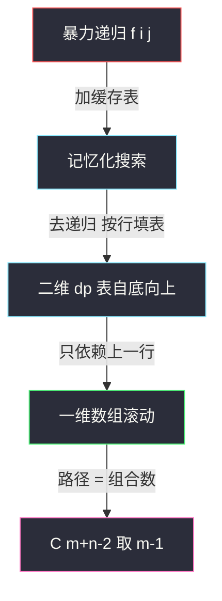
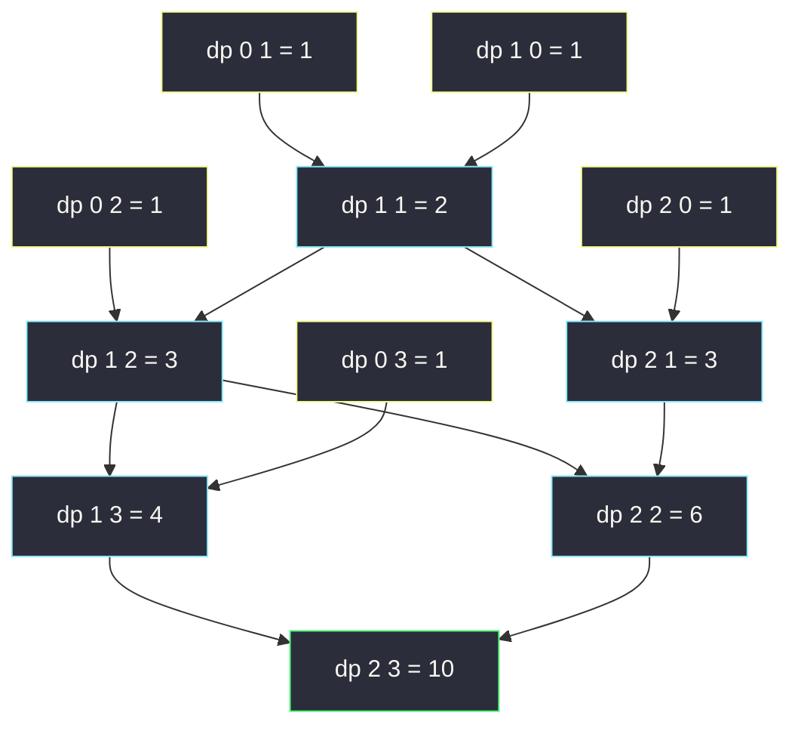

# 不同路径（网格 DP 入门：从递归到填表）

## 一、问题描述

一个机器人位于 `m x n` 网格的**左上角**（下图标记 `S`），它每次只能**向下或向右**移动一步，问到达**右下角**（标记 `F`）共有多少条不同的路径。

> 🔗 LeetCode 62：https://leetcode.cn/problems/unique-paths/

**示例 1**

```
输入：m = 3, n = 7
输出：28
```

**示例 2**

```
输入：m = 3, n = 2
输出：3
解释：从左上角开始，总共有 3 条路径可以到达右下角：
1. 向右 -> 向下 -> 向下
2. 向下 -> 向下 -> 向右
3. 向下 -> 向右 -> 向下
```

**直观理解**

每条路径由「若干次向右 + 若干次向下」组成，共走 `m + n - 2` 步。把所有路径全部枚举出来显然会爆炸（`m = n = 15` 时答案是天文数字）。
换一个方向想——**站在终点回头看**：到达 `(i, j)` 的最后一步，要么从上面的 `(i-1, j)` 走下来，要么从左边的 `(i, j-1)` 走过来。两类路径**不重不漏**，于是：

```
路径数(i, j) = 路径数(i-1, j) + 路径数(i, j-1)
```

这题是**网格 DP 的第一课**：从暴力递归出发，一路优化到 O(mn) 填表、O(n) 滚动数组，最后还有组合数学 O(min(m, n)) 的收官解法。

> 📚 课源码定位：左程云课没有本题原题，但同体系骨架清晰——
> `class067/Code01_MinimumPathSum.java`（最小路径和，同款网格 DP 四步演进）与
> `class069/Code04_PathsDivisibleByK.java`（矩阵中和能被 K 整除的路径，同款「从 (0,0) 走右/下到右下角」的路径计数递归 `f(i, j)`）。
> 本题按这套**可变参数法**骨架对齐：`i, j` 两个可变参数 → 二维 dp 表。

---

## 二、暴力解法（入门）

### 直观思路

把上面的分类讨论直接翻译成**自顶向下的递归**：`f(i, j)` 表示从 `(0, 0)` 走到 `(i, j)` 的路径数，最后一步要么来自上、要么来自左：

```java
// 不同路径：直接递归（对齐 class069/Code04 中 f(i,j) 的走法拆分）
// f(i, j) : 从(0,0)到(i,j)的路径数
public static int uniquePaths1(int m, int n) {
    return f1(m - 1, n - 1);
}

public static int f1(int i, int j) {
    if (i == 0 || j == 0) {
        return 1; // 第一行 / 第一列：只能一路向右或一路向下，仅 1 条
    }
    return f1(i - 1, j) + f1(i, j - 1);
}
```

### 复杂度

- **时间**：`O(2^(m+n))`（宽松上界，实际与路径数同阶，仍为指数级）
- **空间**：`O(m + n)`，递归栈深度

### 🔴 瓶颈在哪里

画出 `f(2, 2)` 的递归树：

```
            f(2,2)
           /      \
       f(1,2)      f(2,1)   ← 子问题重叠
       /    \      /    \
   f(0,2) f(1,1) f(1,1) f(2,0)
            ↑重复    ↑重复
```

同一个 `f(1, 1)` 被算了两遍；网格越大重复越多。**子问题被重复求解**——与爬楼梯（#70）的暴力递归是同一种病，DP 的第一个突破口永远在这里。

---

## 三、优化探索（核心章节）

### 3.1 可变参数法：几个可变参数就是几维表

课上反复强调的方法论：**递归函数里有几个可变参数，dp 表就是几维**。

`f(i, j)` 有两个可变参数 `i ∈ [0, m-1]`、`j ∈ [0, n-1]` → 一张 `m x n` 的二维表。这也是 `class069` 路径计数题里 dp 的造表方式（那题多一个余数参数 `r`，所以是三维表）。

### 3.2 暴力 → 优化：四步演进（对齐 class067 网格 DP 讲法）

1. **记忆化搜索**：递归照旧，`dp[i][j]` 当缓存，算过的直接返回 → `O(mn)`
2. **自底向上填表**：不写递归，按行从上到下、每行从左到右填 `dp[i][j] = dp[i-1][j] + dp[i][j-1]` → `O(mn)`
3. **空间压缩**：`dp[i][j]` 只依赖本行左边一格和上一行同列一格，一行数组滚动 → `O(n)` 空间
4. **组合数学**：总步数 `m+n-2` 中选出 `m-1` 步向下，答案 `C(m+n-2, m-1)` → `O(min(m, n))` 时间、`O(1)` 空间



### 3.3 关键推导问题

| 问题 | 答案 |
|------|------|
| 为什么 `dp[i][j] = dp[i-1][j] + dp[i][j-1]`？ | 按最后一步分类：从上来（贡献 `dp[i-1][j]` 条）或从左来（贡献 `dp[i][j-1]` 条），两类不重不漏 |
| 边界为什么全是 1？ | 第一行只能一路向右、第一列只能一路向下，各恰好 1 条路径 |
| 填表顺序有讲究吗？ | `dp[i][j]` 依赖**上方**与**左侧**，所以从上到下、从左到右即可保证依赖先就绪 |
| 为什么无后效性成立？ | 「怎么走到 `(i,j)`」不影响「从 `(i,j)` 出发还能怎么走」，`dp[i][j]` 只由更小下标决定 |
| 会溢出吗？ | 约束 `1 ≤ m, n ≤ 100`，`dp[99][99]` 约为 `2.3 x 10^58`，Java 用 `long`，结果再转 `int`（题目保证答案 ≤ `2 x 10^9`） |

### 3.4 一句话核心

> **最后一步分两类（来自上 / 来自左），首行首列全填 1，逐行相加填满整张表。**

---

## 四、代码实现详解

### Java（主解：自底向上填表）

```java
// 不同路径
// 一个机器人位于 m x n 网格的左上角，每次只能向下或向右移动一步
// 问到达右下角共有多少条不同的路径
// 测试链接 : https://leetcode.cn/problems/unique-paths/
// 对齐 class067/Code01 的网格 DP 骨架 + class069/Code04 的路径计数语义
public class Solution {

    // 时间复杂度 O(m * n)，空间复杂度 O(m * n)
    public static int uniquePaths(int m, int n) {
        // dp[i][j] : 从(0,0)走到(i,j)的路径数
        // 转移 : dp[i][j] = dp[i-1][j] + dp[i][j-1]（来自上 + 来自左）
        // 依赖方向 : 上方和左侧，所以从上到下、从左到右填表
        long[][] dp = new long[m][n];
        for (int j = 0; j < n; j++) {
            dp[0][j] = 1; // 第一行：只能一路向右
        }
        for (int i = 0; i < m; i++) {
            dp[i][0] = 1; // 第一列：只能一路向下
        }
        for (int i = 1; i < m; i++) {
            for (int j = 1; j < n; j++) {
                dp[i][j] = dp[i - 1][j] + dp[i][j - 1];
            }
        }
        return (int) dp[m - 1][n - 1];
    }
}
```

### Java（进阶：空间压缩 + 组合数学）

```java
public class Solution {

    // 空间压缩：dp[i][j] 只依赖上一行同列 dp[j] 和本行左边 dp[j-1]
    // 复用前，dp[j] 恰好是上一行的值，dp[j-1] 已更新为本行 —— 一维数组即可
    // 时间 O(m * n)，空间 O(n)
    public static int uniquePaths2(int m, int n) {
        long[] dp = new long[n];
        Arrays.fill(dp, 1); // 想象中的第 0 行全 1
        for (int i = 1; i < m; i++) {
            for (int j = 1; j < n; j++) {
                dp[j] += dp[j - 1]; // 上(旧dp[j]) + 左(新dp[j-1])
            }
        }
        return (int) dp[n - 1];
    }

    // 组合数学：路径 = m+n-2 步中选 m-1 步向下
    // 时间 O(min(m, n))，空间 O(1)
    public static int uniquePaths3(int m, int n) {
        long ans = 1;
        for (int i = 1, k = Math.min(m, n) - 1; i <= k; i++) {
            ans = ans * (m + n - 1 - i) / i; // 边乘边除，恒为整数
        }
        return (int) ans;
    }
}
```

### Python（同思路）

```python
# 不同路径：二维填表，O(m*n) / O(m*n)
class Solution:
    def uniquePaths(self, m: int, n: int) -> int:
        # dp[i][j]：从(0,0)到(i,j)的路径数 = 来自上 + 来自左
        dp = [[1] * n for _ in range(m)]  # 首行首列全 1
        for i in range(1, m):
            for j in range(1, n):
                dp[i][j] = dp[i - 1][j] + dp[i][j - 1]
        return dp[m - 1][n - 1]
```

```python
# 空间压缩：一行数组滚动，O(m*n) / O(n)
class Solution:
    def uniquePaths(self, m: int, n: int) -> int:
        dp = [1] * n
        for _ in range(1, m):
            for j in range(1, n):
                dp[j] += dp[j - 1]  # 上(旧) + 左(新)
        return dp[-1]
```

---

## 五、具体例子演示

以 `m = 3, n = 4`（3 行 4 列）为例，端到端跟踪二维填表。

### 第 1 步：初始化首行首列

第一行只能一路向右、第一列只能一路向下，全部填 1：

| dp | j=0 | j=1 | j=2 | j=3 |
|----|-----|-----|-----|-----|
| i=0 | 1 | 1 | 1 | 1 |
| i=1 | 1 | ? | ? | ? |
| i=2 | 1 | ? | ? | ? |

### 第 2 步：逐格填充（每步标出转移来源）

| 格子 | 转移式 | 来自上 | 来自左 | dp 值 |
|------|--------|--------|--------|-------|
| (1,1) | dp[0][1] + dp[1][0] | 1 | 1 | **2** |
| (1,2) | dp[0][2] + dp[1][1] | 1 | 2 | **3** |
| (1,3) | dp[0][3] + dp[1][2] | 1 | 3 | **4** |
| (2,1) | dp[1][1] + dp[2][0] | 2 | 1 | **3** |
| (2,2) | dp[1][2] + dp[2][1] | 3 | 3 | **6** |
| (2,3) | dp[1][3] + dp[2][2] | 4 | 6 | **10** |

### 第 3 步：读答案

终格 `dp[2][3] = 10`。验证组合数学：`C(3+4-2, 3-1) = C(5, 2) = 10`，两种方法一致。



黄框是边界初值，青框是逐格累加的中间值，绿框是最终答案 `10`。

---

## 六、复杂度分析

| 版本 | 时间 | 空间 | 说明 |
|------|------|------|------|
| 暴力递归 | `O(2^(m+n))` | `O(m+n)` | 递归树指数展开，m=n=23 就明显超时 |
| 记忆化搜索 | `O(mn)` | `O(mn)` | 每个 f(i,j) 只算一次，递归栈 O(m+n) |
| 二维填表（主解） | `O(mn)` | `O(mn)` | 依赖方向清晰，最好讲 |
| 一维滚动 | `O(mn)` | `O(n)` | 只依赖上一行 |
| 组合数学 | `O(min(m, n))` | `O(1)` | 面试提一句即可，DP 才是通法 |

---

## 七、方法对比与总结

### 网格 DP 通用套路（背下来）

```
1. 定义：dp[i][j] = 走到(或经过)(i,j)时，题目要的量（计数 / 最值 / 布尔）
2. 转移：按「最后一步来自哪」分类 —— 本题只有 上 / 左
3. 初始化：第一行 + 第一列按题意直接写出
4. 顺序：依赖谁就后填谁（上+左 → 从上到下、从左到右）
5. 压缩：只依赖上一行 → 一维数组滚动
```

### 易错点

1. **边界初始化漏一半**：首行和首列**都要**初始化，且本题全是 1（不是 0）。
2. **用 `int` 中间累加**：`dp` 表中间值可能远超 `int`（如 `dp[99][99] ≈ 2.3 x 10^58`），Java 中间过程用 `long`，返回前再转 `int`。
3. **滚动数组方向写反**：`dp[j] += dp[j-1]` 必须从左往右扫，保证 `dp[j-1]` 是本行新值、`dp[j]` 是上一行旧值。
4. **组合数写法**：`ans = ans * (m+n-1-i) / i` 边乘边除才是整数除法安全写法；先算大阶乘再除必溢出。

### 模板口诀

> **最后一步上或左，首行首列全填 1；逐行相加填满表，一行数组滚到底。**

---

## 八、举一反三

| 题目 | 链接 | 迁移点 |
|------|------|--------|
| 63. 不同路径 II | https://leetcode.cn/problems/unique-paths-ii/ | 同款计数，网格里加**障碍格**（dp 置 0） |
| 64. 最小路径和 | https://leetcode.cn/problems/minimum-path-sum/ | 计数变**最小和**：相加改 min+格值，class067 原题 |
| 120. 三角形最小路径和 | https://leetcode.cn/problems/triangle/ | 网格变三角，且可**自底向上**填表 |
| 931. 下降路径最小和 | https://leetcode.cn/problems/minimum-falling-path-sum/ | 依赖从「上/左」变「上/左上/右上」三方向 |
| 矩阵中和能被 K 整除的路径 | https://leetcode.cn/problems/paths-in-matrix-whose-sum-is-divisible-by-k/ | 同款路径计数多一个余数维 → 三维表，课上 `class069/Code04` 原题 |

**迁移一句**：网格上「只能往固定方向走」的题，先写 `f(i, j)` 按**最后一步来源**分类——计数就相加、最值就取 min/max 加格值，然后按依赖方向填表，一格不差。
