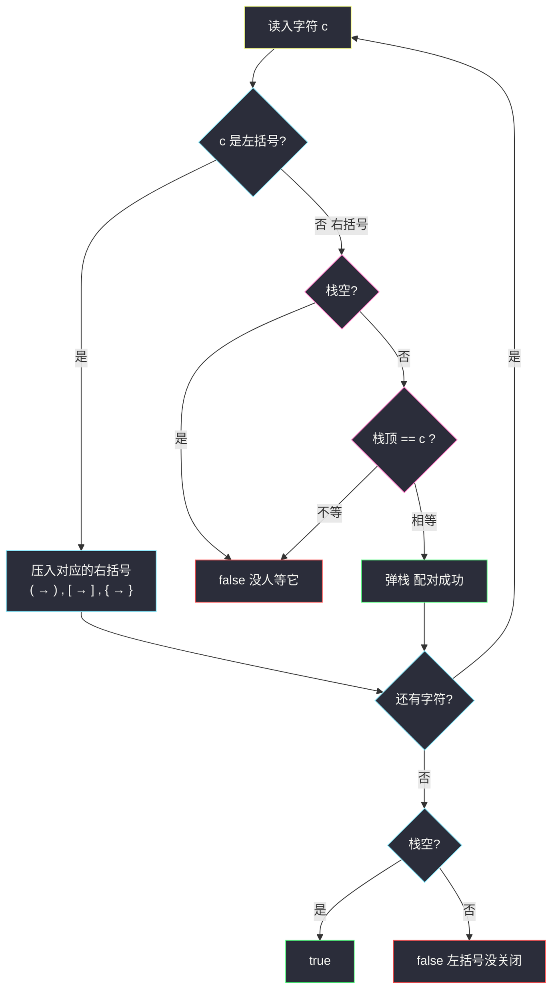
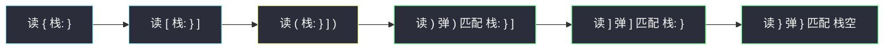

# 有效的括号（栈：最新打开的括号最先关闭）

## 一、问题描述

给定一个只包含 `'('`、`')'`、`'{'`、`'}'`、`'['`、`']'` 的字符串 `s`，判断字符串是否**有效**。

有效字符串需满足：

1. 左括号必须用**相同类型**的右括号闭合；
2. 左括号必须以**正确的顺序**闭合；
3. 每个右括号都有一个对应的同类型左括号。

> 🔗 LeetCode 20：https://leetcode.cn/problems/valid-parentheses/

**示例 1**

```
输入：s = "()"
输出：true
```

**示例 2**

```
输入：s = "()[]{}"
输出：true
```

**示例 3**

```
输入：s = "(]"
输出：false      类型不匹配
```

**示例 4**

```
输入：s = "([)]"
输出：false      顺序交错，非法
```

**示例 5**

```
输入：s = "{[]}"
输出：true       正确嵌套
```

**直观理解**

括号串是典型的**嵌套结构**：`{[()]}` 一层套一层。观察谁和谁配对——**最后被打开的左括号，一定最先被关闭**。这种「后进先出」的配对关系，正是**栈**的定义。这题是栈的地基题（课源码没有本题专门文件；同思想的进阶题见 `#32 最长有效括号`，对应 journey class066 Code06）。

---

## 二、暴力解法（入门）

### 直观思路

合法串中一定存在**相邻的完整配对**（`()`、`[]`、`{}`）——最内层那对一定是相邻的。于是不断把相邻配对当子串删掉，删到删不动为止：

- 若最后得到空串 → 每个括号都找到了搭档，且顺序正确 → 合法；
- 若还剩字符 → 有括号永远配不上 → 非法。

```java
public boolean isValid(String s) {
    while (s.contains("()") || s.contains("[]") || s.contains("{}")) {
        s = s.replace("()", "")
             .replace("[]", "")
             .replace("{}", "");
    }
    return s.isEmpty();
}
```

### 复杂度

- **时间**：`O(n²)`。每一轮 `contains` + `replace` 都要整体扫一遍并新建字符串；最坏（如 `((((...))))`）要删约 `n/2` 轮，每轮 `O(n)`。
- **空间**：`O(n)`，每轮生成新字符串。

### 🔴 瓶颈在哪里

明明**一次从左到右的扫描**就能拿到全部信息，暴力却反复从头重扫、反复分配新串。  
问题出在：删掉一对配对后，「谁正在等我配对」这个信息被丢掉了。需要一个结构在扫描时**记住所有还没配上的左括号**——栈。

---

## 三、优化探索（核心章节）

### 3.1 观察特征

| 特征 | 说明 |
|------|------|
| 后进先出的配对 | 「最后打开的先关闭」= LIFO = 栈 |
| 栈有明确不变式 | 任意时刻，栈中恰好是「已出现、尚未配对」的左括号；从栈底到栈顶嵌套逐层加深 |
| 右括号只能消栈顶 | 右括号到来时，栈顶必须是同类型左括号，否则立即非法 |
| 结束条件唯一 | 扫描完必须栈空——栈非空说明有左括号没等到关闭 |

### 3.2 暴力 → 优化：一遍扫描 + 栈

```
for c in s:
    若 c 是左括号 → 入栈（推荐存「它对应的右括号」）
    若 c 是右括号：
        栈空？        → false（没有左括号等它）
        栈顶 ≠ c ？   → false（类型不匹配 / 顺序错）
        否则          → 弹栈（配对成功）
扫描结束：
    栈空 → true；栈非空 → false（左括号多了）
```

**「压右括号」技巧**：遇到左括号时，入栈的不是它本身，而是它**等待的右括号**（`(` 压 `)`，`[` 压 `]`，`{` 压 `}`）。之后遇到右括号，只需拿它和栈顶做 `==` 比较，匹配逻辑提前一步完成，代码最短。



### 3.3 关键推导问题

| 问题 | 答案 |
|------|------|
| 用三个计数器分别数三种括号的数量，各为 0 行不行？ | 不行。`([)]` 三种计数最终都是 0，但顺序交错非法——**配对顺序**才是本质，计数只记数量丢掉了顺序信息 |
| 为什么「压右括号」可行？ | 合法性只关心「右括号来时，栈顶等待的左括号是否同类型」；入栈时就把映射做好，比较时一次 `==` 搞定，省去 switch/map 反查 |
| 右括号来时栈为什么必须非空？ | 栈空 = 当前没有任何未配对的左括号 = 这个右括号天生无主，立即 false，不必继续 |
| 扫描完为什么还要判栈空？ | 栈里剩的是「打开后一直没等到关闭」的左括号，如 `(((`；栈非空即 false |
| 长度为奇数要不要提前返回？ | 可以：奇数长度必 false，一个 `if` 的剪枝，顺手写上 |
| 栈最深能到多少？ | 全是左括号时 `O(n)`，这是必须的空间下界（不提前看完全串无法判断） |

### 3.4 一句话核心

> **左括号进栈等着，右括号找栈顶对暗号；对不上或没人，直接出局；收尾栈要清空。**

---

## 四、代码实现详解

### Java（主解：压右括号技巧版）

```java
// 有效的括号
// 测试链接 : https://leetcode.cn/problems/valid-parentheses/
public class Solution {

    public boolean isValid(String s) {
        // 奇数长度必不合法，直接剪枝
        if (s.length() % 2 == 1) {
            return false;
        }
        Deque<Character> stack = new ArrayDeque<>();
        for (int i = 0; i < s.length(); i++) {
            char c = s.charAt(i);
            if (c == '(') {
                stack.push(')');      // 左括号：压入它等待的右括号
            } else if (c == '[') {
                stack.push(']');
            } else if (c == '{') {
                stack.push('}');
            } else {
                // c 是右括号：栈空 或 栈顶不等 → 非法
                if (stack.isEmpty() || stack.pop() != c) {
                    return false;
                }
            }
        }
        return stack.isEmpty();        // 收尾必须栈空
    }
}
```

### Java（直观版：存左括号 + 反查）

初学者若觉得「压右括号」绕，可以先写「存左括号、遇到右括号反查该配谁」的直白版，两者完全等价：

```java
public class Solution {

    public boolean isValid(String s) {
        if (s.length() % 2 == 1) {
            return false;
        }
        Deque<Character> stack = new ArrayDeque<>();
        for (char c : s.toCharArray()) {
            if (c == '(' || c == '[' || c == '{') {
                stack.push(c);                    // 存左括号本身
            } else {
                if (stack.isEmpty()) {
                    return false;
                }
                char left = stack.pop();
                if ((c == ')' && left != '(')
                        || (c == ']' && left != '[')
                        || (c == '}' && left != '{')) {
                    return false;
                }
            }
        }
        return stack.isEmpty();
    }
}
```

### Python（同思路）

```python
# 有效的括号：压右括号技巧版
class Solution:
    def isValid(self, s: str) -> bool:
        if len(s) % 2 == 1:
            return False
        pairs = {'(': ')', '[': ']', '{': '}'}
        stack = []
        for c in s:
            if c in pairs:            # 左括号：压入对应的右括号
                stack.append(pairs[c])
            elif not stack or stack.pop() != c:
                return False
        return not stack
```

---

## 五、具体例子演示

### 例 1：`s = "{[()]}"`（合法，完整嵌套）

| 步骤 | 读入 | 动作 | 栈（底 → 顶） | 说明 |
|------|------|------|--------------|------|
| 1 | `{` | 压 `}` | `}` | 打开大括号 |
| 2 | `[` | 压 `]` | `} ]` | 嵌套加深 |
| 3 | `(` | 压 `)` | `} ] )` | 最内层 |
| 4 | `)` | 弹 `)` == `)` 匹配 | `} ]` | 最内层先关闭 |
| 5 | `]` | 弹 `]` == `]` 匹配 | `}` | 中层关闭 |
| 6 | `}` | 弹 `}` == `}` 匹配 | 空 | 最外层最后关闭 |
| 收尾 | — | 栈空 → | — | **true** |



栈的形状就是嵌套的形状：**后打开的先关闭**，黄色是最深时刻，绿色逐层回落。

### 例 2：`s = "([)]"`（交错，非法）

| 步骤 | 读入 | 动作 | 栈（底 → 顶） | 结果 |
|------|------|------|--------------|------|
| 1 | `(` | 压 `)` | `)` | — |
| 2 | `[` | 压 `]` | `) ]` | — |
| 3 | `)` | 弹 `]` ≠ `)` | `)` | **false**：`]` 比 `)` 更晚打开，必须先关 |

这正是计数器会误判、栈能识破的典型案例。

### 例 3：`s = "(("`（左括号剩余，非法）

| 步骤 | 读入 | 动作 | 栈 |
|------|------|------|----|
| 1 | `(` | 压 `)` | `)` |
| 2 | `(` | 压 `)` | `) )` |
| 收尾 | — | 栈非空 | **false** |

### 例 4：`s = ")("`（右括号打头，非法）

第 1 步读到 `)`，栈空 → 没有任何左括号等它，**立即 false**。可见右括号打头一步短路，连长度剪枝都不需要（长度 2 是偶数，靠的是栈空判断）。

---

## 六、复杂度分析

| 项目 | 复杂度 | 说明 |
|------|--------|------|
| 时间 | `O(n)` | 每个字符至多一次入栈、一次出栈；所有判断 O(1) |
| 空间 | `O(n)` | 最坏全是左括号（如 `((((`），栈深达 n/2 甚至 n |

对比暴力消除法的 `O(n²)` 时间：一遍扫描把「记住谁在等我」的信息存进了栈，重复扫描被彻底消灭。

---

## 七、方法对比与总结

### 方法对比

| | 暴力消除法 | 栈（主解） |
|--|-----------|-----------|
| 时间 | `O(n²)` | `O(n)` |
| 空间 | `O(n)` 字符串拷贝 | `O(n)` 栈 |
| 一遍扫完？ | 否，反复从头扫 | 是 |
| 可扩展性 | 仅能判合法性 | 同框架可解 32 / 856 / 1047 等 |

### 易错点

1. **忘判末尾栈空**：`((` 扫完栈里还剩两个，必须在结尾 `return stack.isEmpty()`，这一步漏掉样例 `((` 直接翻车。
2. **右括号来时栈空未短路**：`)(` 第一步就出界或误判，`stack.isEmpty() ||` 必须放在 `pop` 之前。
3. **误信计数器**：`([)]` 三种计数全 0 但非法——顺序信息只有栈能保住。
4. **用 `Stack` 还是 `Deque`**：Java 推荐 `ArrayDeque`（`Stack` 继承自 `Vector`，历史遗留、性能差）；Python 直接用 `list` 的 `append` / `pop`。
5. **弹出前先想清楚弹的是什么**：压右括号版弹出来的就是「期待的右括号」，直接与 `c` 比相等；存左括号版则要反查映射，别两版写混。

### 模板口诀

> **左进右查，栈顶对暗号；顶上不等或栈空，当场出局；扫完全清才算数。**

---

## 八、举一反三

| 题目 | 链接 | 迁移点 |
|------|------|--------|
| 32. 最长有效括号 | https://leetcode.cn/problems/longest-valid-parentheses/ | 栈里存**下标**而不是字符，匹配时顺便算长度（journey class066 Code06） |
| 22. 括号生成 | https://leetcode.cn/problems/generate-parentheses/ | 反过来：用回溯构造所有合法串，合法性用「左余量/右余量」维护 |
| 856. 括号的分数 | https://leetcode.cn/problems/score-of-parentheses/ | 栈匹配时层层结算分数，`()` 是 1，嵌套翻倍 |
| 1047. 删除字符串中的所有相邻重复项 | https://leetcode.cn/problems/remove-all-adjacent-duplicates-in-string/ | 同样的「入栈——和栈顶比较——相同则消」骨架，去掉括号语义 |

**迁移一句**：凡是「元素必须按**与出现顺序相反**的次序完成配对/抵消」的问题（括号匹配、消消乐、去重相邻项、表达式求值），第一反应就该是**栈**。
