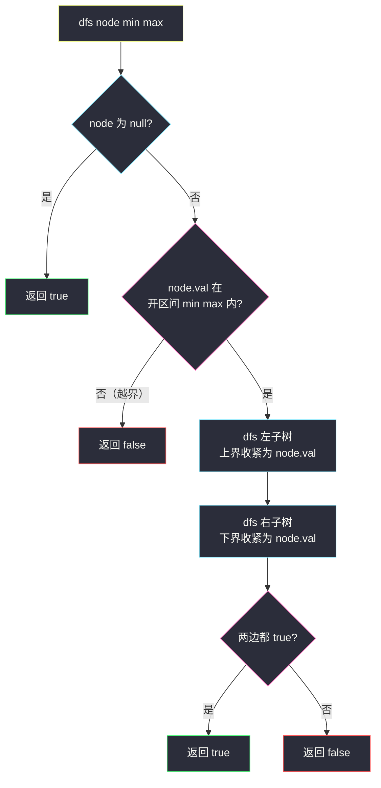
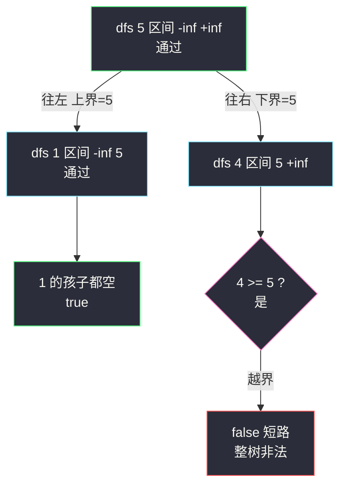

# 验证二叉搜索树（中序递增 / 区间递归）

## 一、问题描述

给你一个二叉树的根节点 `root`，判断其是否是一棵**合法的二叉搜索树（BST）**。

合法 BST 的定义：**每个节点**的左子树所有节点值都**严格小于**该节点值，右子树所有节点值都**严格大于**该节点值；左右子树也必须是 BST。

> 🔗 LeetCode 98：https://leetcode.cn/problems/validate-binary-search-tree/

**示例 1**

```
输入：root = [2,1,3]
输出：true
    2
   / \
  1   3     1 < 2 < 3，合法
```

**示例 2**

```
输入：root = [5,1,4,null,null,3,6]
输出：false
    5
   / \
  1   4
     / \
    3   6
3 和 6 都在 5 的右子树里，必须全部大于 5，但 3 < 5 → 不合法
```

**直观理解**

最经典的陷阱题：看每个节点只比「直接孩子」是不够的——示例 2 里节点 4 的两个孩子 3、6 满足 `3 < 4 < 6`，但 **3 作为 5 的右子树后代必须 > 5**，被局部检查漏掉了。正确的表述是：每个节点必须落在**祖先链传下来的开区间 `(min, max)`** 内；或者用 BST 中序遍历**严格递增**这一性质整体校验。

---

## 二、暴力解法（入门）

### 直观思路

利用性质：中序遍历 BST 得到严格递增序列。**先完整收集中序结果，再扫一遍检查相邻是否严格递增**。

```java
class Solution {
    public boolean isValidBST(TreeNode root) {
        List<Integer> order = new ArrayList<>();
        inorder(root, order);
        for (int i = 1; i < order.size(); i++) {
            if (order.get(i - 1) >= order.get(i)) {   // 不是严格递增
                return false;
            }
        }
        return true;
    }

    private void inorder(TreeNode node, List<Integer> order) {
        if (node == null) {
            return;
        }
        inorder(node.left, order);
        order.add(node.val);
        inorder(node.right, order);
    }
}
```

### 复杂度

- **时间**：`O(n)`，中序一遍 + 检查一遍。
- **空间**：`O(n)` 额外列表 + `O(h)` 递归栈。

### 🔴 瓶颈在哪里

时间已是 `O(n)` 没得再降，短板是**两趟遍历 + O(n) 额外数组**：其实遍历途中相邻两值比较就够了，数组纯属多余。更进一步，「区间递归」视角能把判断提前到**进入节点的一瞬间**，不用等序列生成。

而真正致命的错误解法——`isValidBST(node.left) && node.val > node.left.val && ...` 只比较直接孩子——连正确性都不具备（示例 2 即反例），必须先在心里把它枪毙。

---

## 三、优化探索（核心章节）

### 3.1 观察特征

| 特征 | 说明 |
|------|------|
| BST 中序有序 | 左 → 根 → 右恰好按「小 → 中 → 大」输出，合法性 ⇔ 中序严格递增 |
| 祖先即边界 | 节点往左走，父亲的值变成**上界**；往右走，父亲的值变成**下界**——约束沿路径**累积** |
| 整数边界坑 | 节点值可达 `±2³¹−1`，与 `Integer.MIN/MAX_VALUE` 撞车 → 用 `long` 或可空边界 |
| 短路优势 | 一旦发现逆序/越界立即 `false`，不必遍完整棵树 |

### 3.2 推导：区间递归的来历

定义递归 `dfs(node, min, max)`：判断以 `node` 为根的子树是否全部落在开区间 `(min, max)` 内。

- 初始根节点没有任何祖先约束：`dfs(root, -∞, +∞)`（用 `long` 表示）；
- 节点值越界（`node.val <= min || node.val >= max`）→ 返回 `false`；
- 进入左子树：左子树所有值必须 **< node.val** → 上界收紧为 `node.val`，下界不变；
- 进入右子树：下界收紧为 `node.val`，上界不变。

**不变式**：`dfs(node, min, max)` 返回 true ⇔ 该子树每个节点值都严格落在 `(min, max)` 内，且树内部左右关系正确。每往下一层，区间**只会收紧、绝不放宽**——这正是「只比直接孩子」丢失的约束被找回来的过程。

与课源码 class037 `Code05_ValidateBinarySearchTree` 双解一致：`isValidBST1` 用显式栈中序比较 `pre`，`isValidBST2` 用 `min/max` 区间（课上全局 `long min, max` 收集子树最值再比较，本篇改写成更直观的「区间下传」版，两者等价）。Morris 遍历 `O(1)` 空间版见 class124 `Code03_MorrisCheckBST`，作为拓展。



### 3.3 关键推导问题

| 问题 | 答案 |
|------|------|
| 为什么只比较直接孩子是错的？ | 孙子节点受的是「祖先链的最紧约束」，不是父亲一个人的约束；示例 2 的 3 违反的是与 5 的关系 |
| 两个视角怎么选？ | 中序视角贴合「BST = 有序」的直觉；区间视角贴合「搜索路径」的直觉（走左上界收紧、走右下界收紧）。面试任写一个、能讲清另一个即可 |
| 为什么用 `long` 边界？ | 节点值可达 `-2³¹` 与 `2³¹−1`，若边界初始化为 `Integer.MIN/MAX_VALUE`，单节点 `[2³¹−1]` 会被误判 |
| `>=` 和 `>` 的区别？ | 必须是**严格**递增 / 严格区间：BST 定义不允许相等。写成 `>` 会放过 `[2,2,2]` 这类重复 |
| Morris 版值得背吗？ | 思想值得（临时线索指针把空间压到 `O(1)`），代码在 class124 有完整版；面试先写稳的两版，主动提 Morris 是加分项 |

### 3.4 一句话核心

> **要么中序严格递增，要么每个节点落在祖先传下的 `(min, max)` 里——约束是沿路径累积的，不是父子俩的私事。**

---

## 四、代码实现

### Java（主解：区间递归）

```java
class Solution {
    public boolean isValidBST(TreeNode root) {
        return dfs(root, Long.MIN_VALUE, Long.MAX_VALUE);
    }

    // 子树所有值必须严格落在开区间 (min, max) 内
    private boolean dfs(TreeNode node, long min, long max) {
        if (node == null) {
            return true;
        }
        if (node.val <= min || node.val >= max) {   // 越界即非法
            return false;
        }
        return dfs(node.left, min, node.val)        // 往左：上界收紧
            && dfs(node.right, node.val, max);      // 往右：下界收紧
    }
}
```

### Java（可选：显式栈中序，边走边比 pre，对齐 class037 课上版）

```java
import java.util.ArrayDeque;
import java.util.Deque;

class Solution {
    public boolean isValidBST(TreeNode root) {
        Deque<TreeNode> stack = new ArrayDeque<>();
        TreeNode cur = root, pre = null;
        while (!stack.isEmpty() || cur != null) {
            if (cur != null) {              // 一路向左压栈
                stack.push(cur);
                cur = cur.left;
            } else {
                cur = stack.pop();          // 弹出即中序访问
                if (pre != null && pre.val >= cur.val) {
                    return false;           // 中序必须严格递增
                }
                pre = cur;
                cur = cur.right;
            }
        }
        return true;
    }
}
```

### Python（同思路两版）

```python
# 区间递归版
class Solution:
    def isValidBST(self, root: Optional[TreeNode]) -> bool:
        def dfs(node: Optional[TreeNode], lo: float, hi: float) -> bool:
            if node is None:
                return True
            if not (lo < node.val < hi):    # 越界即非法
                return False
            return dfs(node.left, lo, node.val) and dfs(node.right, node.val, hi)

        return dfs(root, float('-inf'), float('inf'))
```

```python
# 显式栈中序版
class Solution:
    def isValidBST(self, root: Optional[TreeNode]) -> bool:
        stack, cur, pre = [], root, None
        while stack or cur:
            if cur:
                stack.append(cur)
                cur = cur.left
            else:
                cur = stack.pop()
                if pre is not None and pre.val >= cur.val:
                    return False
                pre = cur
                cur = cur.right
        return True
```

---

## 五、具体例子演示

### 例 1（反例深入）：`root = [5,1,4,null,null,3,6]`——区间递归怎么抓到 3

```
    5
   / \
  1   4
     / \
    3   6
```

| 步 | 调用 | 节点值 vs 区间 | 结果 |
|----|------|---------------|------|
| 1 | dfs(5, −∞, +∞) | 5 在内 ✔ | 继续递归左右 |
| 2 | dfs(1, −∞, 5) | 1 ✔ | 左右为 null → true |
| 3 | dfs(4, 5, +∞) | 4 < 5 **越界** ✘ | **返回 false**，短路结束 |

注意第 3 步：**4 自己就先撞了下界**（4 在 5 的右子树里必须 > 5），连 3、6 都还没轮到查。局部视角（4 的孩子 3、6 满足 `3 < 4 < 6`）在这里完全无感，这正是区间约束的威力。



同一棵树用**中序视角**复查：中序 = `1, 5, 3, 4, 6`，相邻比较 `5 ≥ 3` 出现逆序 → false ✔ 两个视角殊途同归。

### 例 2：`root = [2,1,3]`——合法树

- dfs(2, −∞, +∞) ✔ → dfs(1, −∞, 2) ✔（左右空）→ dfs(3, 2, +∞) ✔（左右空）→ 全 true。
- 中序 = `1, 2, 3` 严格递增 ✔

### 例 3：边界单节点 `root = [2147483647]`（int 最大值）

dfs(2147483647, Long.MIN, Long.MAX)：值在 `(−∞, +∞)` 内 ✔（若边界用 `Integer.MAX_VALUE` 初始化，`node.val >= max` 误判 false——`long` 边界的存在意义）。

---

## 六、复杂度分析

| 写法 | 时间 | 空间 |
|------|------|------|
| 中序收集再检查（暴力） | `O(n)` | `O(n)` 列表 + `O(h)` 栈 |
| 区间递归（主解） | `O(n)` 最坏；首个越界即短路可提前退出 | `O(h)` 递归栈：平衡 `O(log n)`，链状 `O(n)` |
| 显式栈中序 | `O(n)`，逆序即提前 false | `O(h)` 显式栈 |
| Morris（拓展） | `O(n)` | `O(1)`，代价是临时改树结构 |

---

## 七、方法对比与总结

| | 只比直接孩子 ❌ | 中序比较 pre | 区间递归（主解） | Morris |
|--|-----------------|--------------|------------------|--------|
| 正确性 | **错误**（经典反例） | 正确 | 正确 | 正确 |
| 时间 | — | `O(n)` | `O(n)` | `O(n)` |
| 空间 | — | `O(h)` | `O(h)` | `O(1)` |
| 直观性 | 看似直观 | 贴「BST=有序」 | 贴「搜索路径约束累积」 | 指针绕 |
| 定位 | 用来当反面教材 | ✅ 备选 | ✅ 首选 | 拓展了解 |

**易错点**

1. **只比父子**：示例 2 直接反杀，面试写了基本就挂。
2. **边界用 int**：`[-2147483648]` / `[2147483647]` 单节点被误杀，边界必须 `long`（或可空 `Integer`）。
3. **闭区间 / 非严格比较**：`>=` 写成 `>` 会放过等值节点，BST 要求严格。
4. **中序比较忘判空 pre**：首个节点没有前驱，`pre != null` 别丢。
5. **想当然用 BFS 逐层比**：BST 合法性与「层」无关，BFS 除非同时携带区间，否则同样错。

**模板口诀**

> **走左上界紧，走右下界紧；越界即 false；中序看严格递增。**

---

## 八、举一反三

| 题目 | 链接 | 迁移点 |
|------|------|--------|
| 230. 二叉搜索树中第 K 小的元素 | https://leetcode.cn/problems/kth-smallest-element-in-a-bst/ | 同一性质的正向使用：中序第 k 个，本站已有题解 |
| 99. 恢复二叉搜索树 | https://leetcode.cn/problems/recover-binary-search-tree/ | 中序序列里的「逆序对」定位两个被交换的节点 |
| 700. 二叉搜索树中的搜索 | https://leetcode.cn/problems/search-in-a-binary-search-tree/ | 区间视角的日常版：沿路径与 node.val 比较 |
| 96. 不同的二叉搜索树 | https://leetcode.cn/problems/unique-binary-search-trees/ | 换个方向数「多少种 BST 形态」，区间分治变 DP |
| 94. 二叉树的中序遍历 | https://leetcode.cn/problems/binary-tree-inorder-traversal/ | 中序视角的地基，显式栈写法（本站已有题解） |

**迁移一句**：BST 一切题的根都是两条公理——**「中序有序」与「根划区间」**。判断用它们（#98），查询用它们（#230、#700），修复用它们（#99），构造还用它们（#108）。
