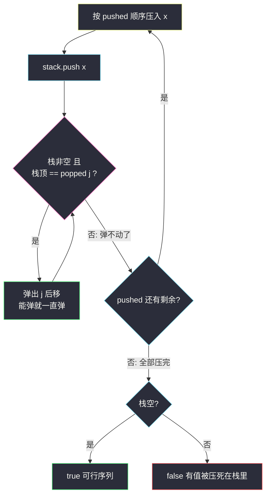
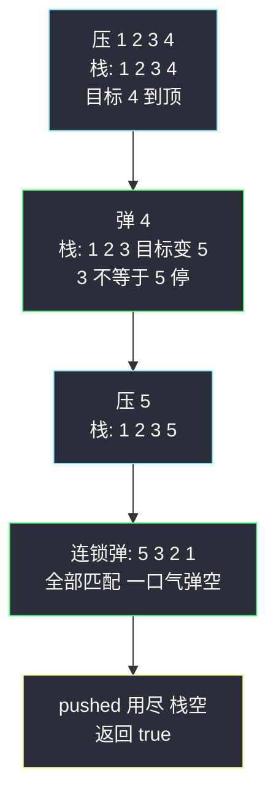

# 验证栈序列（栈模拟 + 贪心尽量弹）

## 一、问题描述

给定 `pushed` 和 `popped` 两个数组，每个数组中的值**互不相同**（是 `0` 到 `n-1` 的排列）。如果存在某种交错执行 `push`（按 `pushed` 顺序压入）和 `pop`（弹出栈顶）的操作序列，使得弹出的值依次组成 `popped` 数组，返回 `true`；否则返回 `false`。

> 🔗 LeetCode 946：https://leetcode.cn/problems/validate-stack-sequences/
>
> 约束：`0 <= pushed[i], popped[i] < n`；所有值互不相同；`1 <= n <= 1000`。

**示例 1**

```
输入：pushed = [1,2,3,4,5]，popped = [4,5,3,2,1]
输出：true
解释：push(1) push(2) push(3) push(4) pop(4) push(5) pop(5) pop(3) pop(2) pop(1)
```

**示例 2**

```
输入：pushed = [1,2,3,4,5]，popped = [4,3,5,1,2]
输出：false
解释：1 不能在 2 之前弹出（1 压入后 2 在其上方）
```

**直观理解**

栈的弹出序列是「被压入顺序约束」的：值 `x` 想被弹出时，所有**比它晚压入且还没弹出**的值都压在它头上。验证 `popped` 是否可行，最朴素的直觉就是**老老实实模拟**：按 `pushed` 顺序一个一个压栈，压完一个就看看栈顶——只要它恰好等于 `popped` 里下一个该弹的值，就立刻弹（而且能弹就一直弹）。全部压完后栈空则 `true`。本题课源码未收录原码，骨架对齐 `class014` 的栈基础操作与 `class052` 的「违规即答案」论证风格。

---

## 二、暴力解法（DFS 枚举每一步的两种选择）

### 直观思路

把「验证」当作「搜索」：任意时刻系统状态由三元组（已压到 `pushed[i]`、已弹到 `popped[j]`、当前栈内容）唯一决定，每一步只有两种转移——

1. 还能压（`i < n`）：压入 `pushed[i]`，`i+1`；
2. 还能弹（栈非空且栈顶 == `popped[j]`）：弹出，`j+1`。

只要存在一条走到 `(n, n, 空栈)` 的路径就返回 true。DFS 全枚举：

```java
class Solution {
    public boolean validateStackSequences(int[] pushed, int[] popped) {
        return dfs(pushed, popped, 0, 0, new ArrayDeque<Integer>());
    }

    private boolean dfs(int[] pushed, int[] popped, int i, int j, Deque<Integer> stack) {
        if (j == popped.length) {
            return true;                        // 弹完了：找到合法方案
        }
        // 选择一：弹（栈顶恰好匹配时才合法）
        if (!stack.isEmpty() && stack.peek() == popped[j]) {
            stack.pop();
            if (dfs(pushed, popped, i, j + 1, stack)) {
                return true;
            }
            stack.push(popped[j]);              // 回溯
        }
        // 选择二：压
        if (i < pushed.length) {
            stack.push(pushed[i]);
            if (dfs(pushed, popped, i + 1, j, stack)) {
                return true;
            }
            stack.pop();                        // 回溯
        }
        return false;
    }
}
```

### 复杂度

- **时间**：最坏指数级——每步两个分支，操作序列总数与卡特兰数同阶，`n` 稍大就爆炸
- **空间**：`O(n)` 递归深度 + 栈

### 🔴 瓶颈在哪里

1. **在搜一个根本不用搜的问题**：`popped` 一旦给定，每个状态的走向其实是**被唯一注定**的——弹的机会不弹，后面未必还有机会；
2. 指数级分支里绝大多数路径注定失败，纯浪费；
3. 本质：这是一道「**确定性模拟**」题，被当成了「搜索」题——把「能弹就弹」变成贪心规则，一切分支消失。

---

## 三、优化探索（核心章节）

### 3.1 观察特征

| 特征 | 说明 |
|------|------|
| 目标唯一确定 | `popped` 给死了下一个要弹的值，弹谁没有选择余地 |
| 弹的时机有约束 | 栈顶 == `popped[j]` 才能弹，约束只看栈顶一格 |
| 压入顺序固定 | `pushed` 顺序不能变，模拟路径唯一 |
| 「能弹就弹」不吃亏 | 关键交换性质（见 3.3）：立刻弹不会损失任何可行方案 |

### 3.2 暴力 → 优化：贪心模拟（一路压、能弹就弹）

```
validate:
    stack = 空栈; j = 0                       ← j: popped 上下一个待弹目标
    for x in pushed:
        stack.push(x)
        while 栈非空 且 栈顶 == popped[j]:    ← 能弹就一直弹
            stack.pop(); j++
    return 栈为空（等价于 j == n）
```

**唯一路径**：与 DFS 的「每步二选一」不同，这里每个动作都是被逼的——`for` 循环逼着压，`while` 条件逼着弹。整条模拟路径由输入唯一确定，没有分支，`O(n)` 一次走完。



### 3.3 关键推导问题

| 问题 | 答案 |
|------|------|
| **为什么「能弹就弹」不漏解（交换论证）** | 设某合法方案在「栈顶 == `popped[j]`」时选择先压后弹。把这一次 pop 与紧邻其前的 push 交换，弹出序列不变、合法性不变——于是任何合法方案都能改造成「每个匹配时机都立刻弹」的形态。所以贪心路径若失败，则一切方案都失败 |
| 弹不动时为什么要继续压而不是失败？ | 栈顶 ≠ `popped[j]` 只说明「现在弹不出」，不代表死局——压入后面的值后栈顶会变，`popped[j]` 可能随后到顶（示例 1 中 4 弹出后目标 5，正是压 5 后弹出的） |
| 为什么最终判「栈空」而不是「j == n」？ | 两者等价：压了 n 个、弹出 j 个，栈空 ⟺ j == n。判栈空更直观，也顺便说明「卡住的值被永久压死」就是 false 的本质 |
| 失败时刻能否提前发现？ | 能但没必要：`pushed` 用尽而栈顶不匹配目标时即注定失败，循环自然结束，O(1) 判空收尾即可 |
| 与 331 / 255 的区别？ | 331（前序序列化）用栈消解「子树补满」结构；255 用栈维护 BST 的上界下界。本题最纯粹：栈顶匹配即弹，零附加条件 |
| 数组模拟栈更快吗？ | 可以用 `int[] stack + 指针` 模拟（课上惯用写法），性能略好；`ArrayDeque` 语义更清楚，都能过 |

### 3.4 一句话核心

> **一路按序压、栈顶对上就弹到弹不动——栈空即真；贪心的正确性由交换论证兜底。**

---

## 四、代码实现详解

### Java（主解：ArrayDeque 边压边弹）

```java
// 验证栈序列：pushed 依次入栈，栈顶匹配 popped 目标就连弹到底
// 测试链接 : https://leetcode.cn/problems/validate-stack-sequences/
// 课源码未收录本题；骨架对齐 class014 栈基础 + class052 "违规即答案"式论证
class Solution {
    public boolean validateStackSequences(int[] pushed, int[] popped) {
        Deque<Integer> stack = new ArrayDeque<>();
        int j = 0;                                   // popped 中下一个待弹目标
        for (int x : pushed) {
            stack.push(x);
            while (!stack.isEmpty() && stack.peek() == popped[j]) {
                stack.pop();
                j++;
            }
        }
        return stack.isEmpty();
    }
}
```

内层 `while` 是灵魂：一次 push 可能触发**连续多次** pop（示例 1 中压 5 后连弹 5、3、2、1 四个）。写成 `if` 就漏掉「连锁弹」。

### Python（同思路）

```python
class Solution:
    def validateStackSequences(self, pushed: list[int], popped: list[int]) -> bool:
        stack: list[int] = []
        j = 0
        for x in pushed:
            stack.append(x)
            while stack and stack[-1] == popped[j]:
                stack.pop()
                j += 1
        return not stack
```

Python 也可以用 `int[] 指针` 模拟栈，但 list 版最短最清晰，面试默写零压力。

---

## 五、具体例子演示

### 例 1：`pushed = [1,2,3,4,5]`，`popped = [4,5,3,2,1]`，答案 `true`

| 步 | 动作 | 栈（底→顶） | 待弹目标 popped[j] | 说明 |
|----|------|-------------|--------------------|------|
| 1 | push 1 | [1] | 4 | 不匹配 |
| 2 | push 2 | [1,2] | 4 | 不匹配 |
| 3 | push 3 | [1,2,3] | 4 | 不匹配 |
| 4 | push 4 | [1,2,3,4] | 4 | 匹配！连锁弹开始 |
|  | pop 4 | [1,2,3] | 5 | 3 ≠ 5，连锁停止 |
| 5 | push 5 | [1,2,3,5] | 5 | 匹配！ |
|  | pop 5 | [1,2,3] | 3 | 匹配！继续弹 |
|  | pop 3 | [1,2] | 2 | 匹配！ |
|  | pop 2 | [1] | 1 | 匹配！ |
|  | pop 1 | [] | （耗尽） | 连锁弹一口气清空 |
| 6 | 压完 | [] | — | 栈空 → **true** ✅ |

**关键看点**：步骤 4 的「连锁弹」只弹了一个（4 弹出后栈顶 3 ≠ 目标 5，停下）；步骤 5 压入 5 后连锁弹**一口气弹掉 4 个**——同一个 `while`，两种火力。



### 例 2：`pushed = [1,2,3,4,5]`，`popped = [4,3,5,1,2]`，答案 `false`

| 步 | 动作 | 栈 | 目标 popped[j] | 结果 |
|----|------|-----|----------------|------|
| 1 | push 1,2,3 | [1,2,3] | 4 | 不匹配 |
| 2 | push 4 | [1,2,3,4] | 4 | 匹配，弹 4 |
|  | pop 4 | [1,2,3] | 3 | 匹配，弹 3 |
|  | pop 3 | [1,2] | 5 | 2 ≠ 5，停止 |
| 3 | push 5 | [1,2,5] | 5 | 匹配，弹 5 |
|  | pop 5 | [1,2] | 1 | 2 ≠ 1，停止 |
| 4 | pushed 用尽 | [1,2] | 1 | **卡死** → false ✅ |

**卡点剖析**：目标要弹 1，但 2 压在 1 上面；想先弹 2 吗？——`popped` 里 2 排在 1 **之后**，矛盾。1 和 2 这对「压入顺序 1→2、弹出顺序 1→2」恰好是栈不可能产生的顺序（栈必须后进先出），任何含这种逆序对的序列都 false。

### 例 3：最小对冲 `pushed = [1,2]`，`popped = [2,1]` → true

压 1（目标 2，不弹）→ 压 2（匹配，弹 2；连锁弹 1）→ 栈空 true。最短的「连锁弹」样本。

---

## 六、复杂度分析

| 项目 | DFS 暴力枚举 | 贪心模拟（主解） |
|------|--------------|------------------|
| 时间 | 指数级（卡特兰数量级） | **`O(n)`**：每个元素入栈一次、出栈至多一次，`i` 和 `j` 都只前进不回头 |
| 空间 | `O(n)` 递归 + 栈 | `O(n)` 栈（不计输入） |

`O(n)` 已是下界——至少要把两个数组各看一遍。模拟没有分支、没有回溯，是这类「序列验证」题的最优形态。

---

## 七、方法对比与总结

### 写法对比

| | DFS 枚举 | 贪心模拟（主解） |
|--|----------|------------------|
| 时间 | 指数级 | `O(n)` |
| 思维方式 | 搜索所有操作序列 | 确定性走唯一路径 |
| 正确性依据 | 自然正确 | 交换论证 |
| 面试定位 | 讲清「为什么不用搜」的台阶 | ✅ 必须默写 |

### 易错点

1. **内层写 `if` 不写 `while`**：漏掉连锁弹（例 1 步骤 5 连弹 4 个），经典 WA。
2. **弹不动时提前 return false**：误把「暂时弹不出」当死局——必须继续压，让后面的值把局面盘活。
3. **返回时只看 `j == popped.length` 却忘了栈**：两者其实等价，但中途 `break` 出 `for` 的写法容易漏判，直接以「压完后判栈空」收尾最稳。
4. **用 `Stack` 类**：能用但慢；`ArrayDeque` 是 Java 栈的现代标准。
5. **值互不相同这个条件被忽略**：本题保证是排列、无重复，`stack.peek() == popped[j]` 的等值判断才无歧义；若值可重复，此贪心不再显然成立。

### 模板口诀

> **按序压到底，栈顶对上弹到底；压完看栈空，空真余假。**

---

## 八、举一反三

| 题目 | 链接 | 迁移点 |
|------|------|--------|
| 735. 行星碰撞 | https://leetcode.cn/problems/asteroid-collision/ | 同批次站内题解（互引）：栈模拟 + 弹栈结算的另一种玩法 |
| 331. 验证二叉树的前序序列化 | https://leetcode.cn/problems/verify-preorder-serialization-of-a-binary-tree/ | 同款「栈顶匹配即消解」：叶子给槽位补位，槽尽树成 |
| 255. 验证前序遍历序列二叉搜索树 | https://leetcode.cn/problems/verify-preorder-sequence-in-bst/ | 栈模拟 + 维护「当前子树的上界」，比本题多一层约束 |
| 150. 逆波兰表达式求值 | https://leetcode.cn/problems/evaluate-reverse-polish-notation/ | 同批次站内题解（互引）：栈模拟「结算」的算术版 |
| 71. 简化路径 | https://leetcode.cn/problems/simplify-path/ | 栈处理序列的又一经典：路径段进出栈消解 `..` |

**迁移一句**：序列验证题的第一反应不是搜索，而是问「**每个状态的下一步是不是被唯一注定**」——被注定就确定性模拟（本题），有多重约束才需要栈上附加信息（331/255）或单调性（单调栈家族）。
