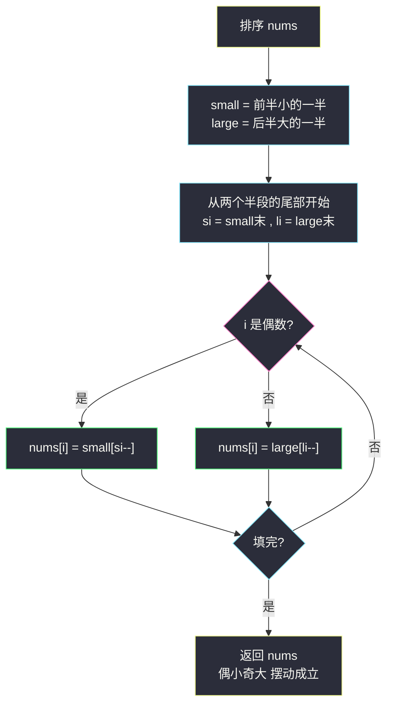
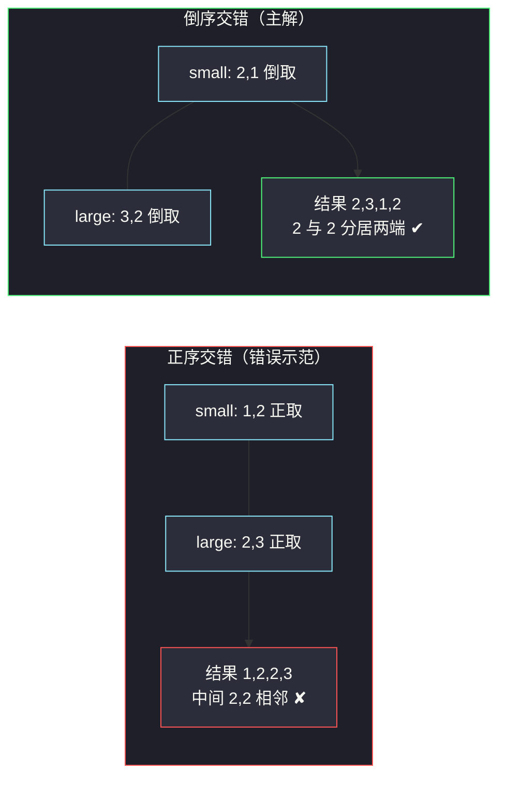

# 摆动排序 II（排序 + 倒序交错放置）

## 一、问题描述

给你一个整数数组 `nums`，将它重新排列成 `nums[0] < nums[1] > nums[2] < nums[3] > ...` 的顺序（下标从 0 开始，即**偶数位小于相邻奇数位**，严格不等）。

- 可以假设所有输入数组都可以得到符合题目要求的结果。
- 进阶：能否用 `O(n)` 时间复杂度 / `O(1)` 额外空间实现？（本文主解先讲通用的排序法，最优解见文末附录）

> 🔗 LeetCode 324：https://leetcode.cn/problems/wiggle-sort-ii/

**示例 1**

```
输入：nums = [1,5,1,1,6,4]
输出：[1,6,1,5,1,4]（答案不唯一）
解释：1 < 6 > 1 < 5 > 1 < 4 ✓
```

**示例 2（重复值密集）**

```
输入：nums = [1,3,2,2,3,1]
输出：[2,3,1,3,1,2]（答案不唯一）
解释：2 < 3 > 1 < 3 > 1 < 2 ✓
```

**直观理解**

排序后从中间「掰开」，小的一半与大的一半**交错**铺：偶数位放小的、奇数位放大的。难点全在**重复值**：`[1,2,2,3]` 若顺着放会得到 `1,2,2,3`——中间两个 2 相邻，`2 > 2` 不成立。解决办法出人意料地简单：**两半都从尾部（倒序）取**，让「跨界重复的中位数们」一个跑到序列开头、一个跑到序列结尾，天各一方。

---

## 二、暴力解法（入门）

### 直观思路

全排列枚举（swap 交换法，#46 骨架），逐个检查是否满足 `nums[0] < nums[1] > nums[2] ...`，找到即返回。

```java
boolean found = false;
void f(int[] nums, int i) {
    if (found) return;
    if (i == nums.length) {
        if (check(nums)) found = true;   // 满足摆动条件
        return;
    }
    for (int j = i; j < nums.length && !found; j++) {
        swap(nums, i, j);
        f(nums, i + 1);
        if (found) return;               // 找到后不再恢复现场，直接保留答案
        swap(nums, i, j);
    }
}
```

### 复杂度

- **时间**：最坏 `O(n! · n)`——全排列乘以每次校验。
- **空间**：`O(n)` 递归栈。

### 🔴 瓶颈在哪里

1. 阶乘级枚举对 `n ≤ 5×10⁴` 的数据规模完全不可行；
2. 枚举不利用任何结构：摆动序其实**几乎就是有序的**——排序后小半、大半交错即可，唯一障碍（重复值）有专门的破解姿势。

---

## 三、优化探索（核心章节）

### 3.1 观察特征

| 特征 | 结论 |
|------|------|
| `nums[i] < nums[i+1] > nums[i+2]`：峰值在奇数位 | 奇数位放大数、偶数位放小数 |
| n 个位置中偶数位 `⌈n/2⌉` 个、奇数位 `⌊n/2⌋` 个 | 小的一半取前 `⌈n/2⌉` 个、大的一半取剩下的 |
| 有解 ⟺ 中位数出现次数 ≤ `⌈n/2⌉` | 重复值是唯一障碍，集中在**中位数附近** |

### 3.2 排序 + 倒序交错

1. **排序** `nums`；
2. **切半**：`small = nums[0 .. ⌈n/2⌉-1]`（小的一半），`large = nums[⌈n/2⌉ .. n-1]`（大的一半）；
3. **倒序交错填充**：`nums[0] = small 尾`，`nums[1] = large 尾`，`nums[2] = small 尾-1`，……

**为什么必须「倒序」（核心）**：跨界的重复值只可能是**中位数 x**（出现在 small 尾部 + large 头部）。正序交错会让 small 的 x 与 large 的 x 在序列**中间相遇**（`[1,2,2,3]` → `1,2,2,3`，中间 `2,2` 相邻失败）；倒序交错让 small 里的 x **最先出场**（下标 0 一带）、large 里的 x **最后出场**（下标 n-1 一带），两者相隔整个序列，永不相邻。而同一半内部的重复值，因交错位一半一个，下标至少差 2，天然隔开。



### 3.3 关键推导问题

| 问题 | 答案 |
|------|------|
| 为什么不是简单交错（小大小大）就完事？ | 重复中位数会「撞」在中间；倒序把跨界重复拆到序列两端 |
| 为什么奇偶位的数量刚好？ | 偶数位 `⌈n/2⌉` 个恰好容纳「小的一半」；n 为奇数时中位数归入 small，末位是偶数位放小值，天然合法 |
| 同一半内部两个相等元素会相邻吗？ | 不会：它们落在同奇偶的下标上（都来自 small 或都来自 large），中间必隔一个另一半的元素，下标差 ≥ 2 |
| 摆动不等式为什么严格成立？ | 奇位取自 large、偶位取自 small，但跨界重复的中位数…… 见上：跨界重复已被倒序拆开，故相邻的一定「一个来自 small 一个来自 large 且值不同」？更准确说：相邻对中偶位值 ≤ 中位数 < 奇位值，或偶位值 < 中位数 ≤ 奇位值，只有恰等于中位数的跨界重复可能出问题，而它已被拆开，严格不等成立 |
| 题目保证有解意味着什么？ | 中位数出现次数 ≤ `⌈n/2⌉`；若违反（如 `[1,1,1,1]`）本题前提失效，无需处理 |

### 3.4 一句话核心

> **排序切两半，各自从尾倒着取、交错铺进偶位与奇位——跨界的中位数重复被顶到序列两端，相邻位置永远严格不等。**

---

## 四、代码实现详解

> 课源码：`class146/Code06_WiggleSortII.java` 讲的是**最优解**（`O(n)` 时间 + `O(1)` 额外空间：随机快速选择找中位数分区 + 完美洗牌算法原地交错）。站点主解按「简洁易懂优先」采用排序版 `O(n log n)`，最优解思路见文末附录。

### Java（主解：排序 + 倒序交错）

```java
// 摆动排序 II
// 测试链接 : https://leetcode.cn/problems/wiggle-sort-ii/
class Solution {

    public void wiggleSort(int[] nums) {
        Arrays.sort(nums);
        int n = nums.length;
        int half = (n + 1) / 2;                   // 小的一半的长度（奇数时多一个）
        int[] small = Arrays.copyOfRange(nums, 0, half);   // 小的一半
        int[] large = Arrays.copyOfRange(nums, half, n);   // 大的一半
        int si = half - 1, li = n - half - 1;     // 两个尾指针
        for (int i = 0; i < n; i++) {
            nums[i] = (i % 2 == 0) ? small[si--]  // 偶位放小的（倒序取）
                                   : large[li--]; // 奇位放大的（倒序取）
        }
    }
}
```

### Python（同思路）

```python
class Solution:
    def wiggleSort(self, nums: list[int]) -> None:
        """
        Do not return anything, modify nums in-place instead.
        """
        arr = sorted(nums)
        n = len(nums)
        half = (n + 1) // 2
        small = arr[:half]        # 小的一半
        large = arr[half:]        # 大的一半
        si, li = half - 1, n - half - 1
        for i in range(n):
            nums[i] = small[si] if i % 2 == 0 else large[li]
            if i % 2 == 0:
                si -= 1
            else:
                li -= 1
```

（Python 更简洁的等价写法：`nums[::2] = small[::-1]; nums[1::2] = large[::-1]`。）

---

## 五、具体例子演示

**例 A：`nums = [1,5,1,1,6,4]`**

- 排序：`[1,1,1,4,5,6]`；`n = 6`，`half = 3`；
- `small = [1,1,1]`，`large = [4,5,6]`；`si = 2`，`li = 2`；
- 交错填充：

| i | 奇偶 | 取自 | 值 | nums（填到当前） |
|---|------|------|-----|------------------|
| 0 | 偶 | `small[2]` | 1 | `[1]` |
| 1 | 奇 | `large[2]` | 6 | `[1,6]` |
| 2 | 偶 | `small[1]` | 1 | `[1,6,1]` |
| 3 | 奇 | `large[1]` | 5 | `[1,6,1,5]` |
| 4 | 偶 | `small[0]` | 1 | `[1,6,1,5,1]` |
| 5 | 奇 | `large[0]` | 4 | `[1,6,1,5,1,4]` |

校验：`1 < 6 > 1 < 5 > 1 < 4` ✓，输出 `[1,6,1,5,1,4]`。

**例 B：`nums = [1,2,2,3]`（展示倒序的必要性）**

- 排序：`[1,2,2,3]`；`half = 2`，`small = [1,2]`，`large = [2,3]`；
- **若正序交错**：`1,2,2,3` → 中间 `2 > 2` ✘（跨界重复的 2 在序列中段撞车）；
- **倒序交错**：

| i | 取自 | 值 | nums |
|---|------|-----|------|
| 0 | `small[1]` | 2 | `[2]` |
| 1 | `large[1]` | 3 | `[2,3]` |
| 2 | `small[0]` | 1 | `[2,3,1]` |
| 3 | `large[0]` | 2 | `[2,3,1,2]` |

校验：`2 < 3 > 1 < 2` ✓。两个 2 分别落在**下标 0 与下标 3**——正序时它们在下标 1、2 相邻，倒序后被顶到序列两端。



---

## 六、复杂度分析

| 项目 | 排序 + 倒序交错（主解） | 全排列暴力 | 课源码最优解 |
|------|--------------------------|------------|----------------|
| 时间 | `O(n log n)`：排序主导，填充 `O(n)` | `O(n! · n)` | `O(n)` |
| 空间 | `O(n)`：两个半段拷贝 | `O(n)` | `O(1)`（完美洗牌） |

---

## 七、方法对比与总结

| | 全排列暴力 | 排序 + 正序交错 | 排序 + 倒序交错（主解） |
|--|------------|------------------|--------------------------|
| 正确性 | 枚举必对 | 重复中位数中段撞车 | 跨界重复拆到两端 |
| 复杂度 | 阶乘 | `O(n log n)` 但**有错** | `O(n log n)` |

**易错点**

1. **正序交错**：`[1,2,2,3]` 直接小大正取，中段 `2,2` 相邻——这是本题最经典的错法；
2. **切半点**写成 `n/2`：奇数长度时小半少了中位数，末位（偶数位）可能放大值导致结尾非法；应为 `(n+1)/2`（小半多占一个）；
3. `Arrays.sort` 忘写或拷贝 `copyOfRange` 边界差一；
4. 以为答案唯一：摆动序大量不唯一，对拍时按「校验条件」验证而非比对字面。

**模板口诀**

> **排序切半各倒取，偶位铺小奇铺大；跨界重复两端放，中间不撞严格差。**

**附录：课上 O(n) + O(1) 最优解思路**（课源码 `class146/Code06_WiggleSortII.java`）

1. **`randomizedSelect`**：随机快速选择找到中位数并把数组原地分成 `< 中位 | == 中位 | > 中位` 三段，`O(n)` 期望，代替排序；
2. **完美洗牌（perfect shuffle）**：把「大的一半 + 小的一半」按 `A1 A2 ... B1 B2 ...` 的交错目标序，用「3 的幂 − 1 长度的循环节」+ 循环左移，**原地**完成交错重排，`O(n)`、`O(1)` 额外空间；
3. 再叠加「虚拟下标 `(1 + 2i) % (n|1)`」实现倒序交错的寻址，避免真拷贝。

这套手艺面试极少要求，理解「快速选择定中位 + 原地交错」两个支柱即可，默写主解的排序版。

---

## 八、举一反三

| 题目 | 链接 | 迁移点 |
|------|------|--------|
| 75. 颜色分类 | https://leetcode.cn/problems/sort-colors/ | 三段划分 partition 是快速选择与本题最优解共用的原子操作（[站内题解](/solutions/base/sort-colors.md)） |
| 215. 数组中的第 K 个最大元素 | https://leetcode.cn/problems/kth-largest-element-in-an-array/ | 最优解第一步「找中位数」即快速选择第 k 名（[站内题解](/solutions/base/kth-largest-element-in-an-array.md)） |
| 295. 数据流的中位数 | https://leetcode.cn/problems/find-median-from-data-stream/ | 中位数的动态维护（对顶堆），与「中位数出现次数 ≤ ⌈n/2⌉」的可行性判据呼应（[站内题解](/solutions/base/find-median-from-data-stream.md)） |
| 280. 摆动排序 | https://leetcode.cn/problems/wiggle-sort/ | 弱化版：只需 `≤ ≥` 非严格摆动，一次扫描交换即可，无需处理跨界重复 |

**迁移一句**：「**重排使相邻满足某种不等关系**」类题，先排序建立全局结构，再设计**放置寻址**（交错、倒序、两端）；重复值是这类题的命门，永远先问「相等的元素会不会被放到一起」。
