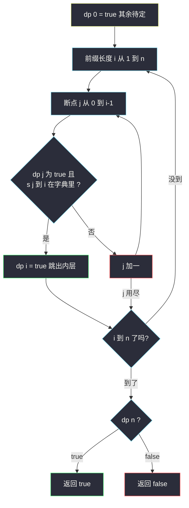
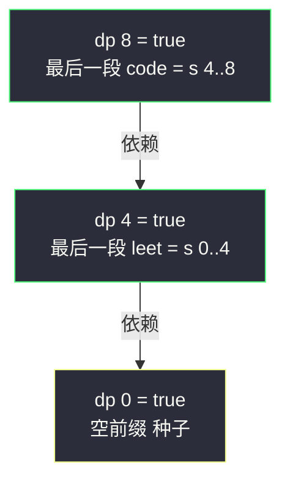

# 单词拆分（完全背包可行性 / 前缀串匹配 DP）

## 一、问题描述

给你字符串 `s` 和字符串列表 `wordDict` 作为字典，判断 `s` 能否被**拆分成一个或多个**字典中出现的单词（字典单词可**重复使用**）。

> 🔗 LeetCode 139：https://leetcode.cn/problems/word-break/

**示例 1**

```
输入：s = "leetcode", wordDict = ["leet","code"]
输出：true
解释：返回 true，因为 "leetcode" 可以拆成 "leet" + "code"
```

**示例 2**

```
输入：s = "applepenapple", wordDict = ["apple","pen"]
输出：true
解释：拆成 "apple" + "pen" + "apple"——注意单词可以重复使用
```

**直观理解**

「单词无限用 + 凑一个目标长度」——这就是**完全背包**：单词是物品（体积 = 单词长度，且要求**贴上的字符完全匹配**），字符串总长是容量，问「恰好拼满」的**可行性**。也可以完全脱离背包理解成经典前缀 DP：`dp[i]` = 前缀 `s[0..i)` 是否可拆分。

---

## 二、暴力解法

### 直观思路

从位置 0 出发递归：当前位置 `i`，枚举下一个单词的结束位置 `j`，若 `s[i..j)` 在字典里就跳过去：

```java
// 暴力递归 : s[i..] 能否全部拆成字典单词
public static boolean wordBreak1(String s, List<String> wordDict) {
    Set<String> dict = new HashSet<>(wordDict);
    return f(s, dict, 0);
}

public static boolean f(String s, Set<String> dict, int i) {
    if (i == s.length()) {
        return true; // 全部贴完
    }
    // 枚举下一个词的终点 j（词 = s[i..j)）
    for (int j = i + 1; j <= s.length(); j++) {
        if (dict.contains(s.substring(i, j)) && f(s, dict, j)) {
            return true;
        }
    }
    return false;
}
```

### 复杂度

- **时间**：最坏 `O(2ⁿ)` 级——"aaaa...ab" 配字典 {"a","aa","aaa",...} 时分支爆炸
- **空间**：`O(n)` 递归栈 + 子串开销

### 🔴 瓶颈在哪里

同一个「起点 i」会被不同拆法反复到达并重复搜索。**一个可变参数 i** → 一维表，缓存后必为多项式。

---

## 三、优化探索

### 3.1 可变参数分析与 dp 定义

递归里只有起点 `i` 一个可变参数 → 一维表（对齐 class074 完全背包模板的 `dp[j]` 容量表形态）。

| dp 定义 | 含义 |
|---------|------|
| `dp[i]` | 前缀 `s[0..i)`（长度 i）能否拆分成字典单词 |

### 3.2 转移方程推导

前缀 `s[0..i)` 的**最后一个单词**设为 `s[j..i)`，则它成立 ⟺ `s[j..i)` 在字典里 **且** 更短的前缀 `s[0..j)` 也成立：

```
dp[0] = true（空前缀）
dp[i] = 存在 j（0 <= j < i）使得 dp[j] == true 且 s[j..i) ∈ 字典
答案 = dp[n]
```

这就是完全背包「**再用一件物品**」的结构：`dp[i]` 由 `dp[j]`（更小容量）+ 一件「贴上 `s[j..i)` 的单词」转移而来；单词可无限复用，靠「外层扫容量、内层找物品」天然满足。

### 3.3 关键优化：用字典长度剪枝

内层枚举 `j` 有个浪费：`i - j` 是最后一个词的长度，若它不在字典长度集合里，`substring` 白做。先把字典词长存成 `HashSet<Integer>`，内层只试 `len = 词长集合`，复杂度从 `O(n²)` 降到 `O(n * L * 平均词长)`（L = 不同词长个数）。

### 3.4 关键问题

| 问题 | 答案 |
|------|------|
| 为什么单词能重复用？ | 转移只看「前缀 j 成立吗 + 这段在字典吗」，不消耗任何「用过」的标记——同一段词可反复贴 |
| 和 0-1 背包（#416）区别？ | 这里物品（单词）无使用上限，且体积要**字符级匹配**；遍历方向上完全背包正序即可 |
| dp[0] 为什么是 true？ | 空串可拆成「零个词」，是所有转移的种子 |
| 会不会把一个词用到自身重叠？ | 不会，每段 `s[j..i)` 是**不重叠**的连续片段拼接 |
| BFS/记忆化回溯呢？ | 与 dp 等价：把每个位置当节点、词典词当边，问 0→n 连通性 |

### 3.5 一句话核心

> **dp[0]=true，扫前缀长度 i，内层找断点 j：dp[j] 成立且 s[j..i) 是单词，则 dp[i] 成立。**



---

## 四、代码实现

### Java（主解：前缀 DP + 字典长度剪枝）

```java
// 单词拆分
// 判断 s 能否拆分成一个或多个字典单词（单词可重复用）
// 测试链接 : https://leetcode.cn/problems/word-break/
// 说明 : 课上 class074 Code03 是完全背包模板（dp[j] 由 dp[j-cost] 转移、
//        物品可重复用），本题按同一体系对齐 : 单词 = 物品、前缀长度 = 容量、
//        求"恰好拼满"的可行性
public class Solution {

    // 时间复杂度 O(n * L * k)，空间复杂度 O(n + 字典规模)
    // n = s 长度，L = 不同词长个数，k = 平均词长
    public static boolean wordBreak(String s, List<String> wordDict) {
        Set<String> dict = new HashSet<>(wordDict);
        Set<Integer> lens = new HashSet<>(); // 字典里出现过的词长
        for (String w : wordDict) {
            lens.add(w.length());
        }
        int n = s.length();
        // dp[i] : 前缀 s[0..i) 能否拆成字典单词
        boolean[] dp = new boolean[n + 1];
        dp[0] = true; // 空前缀
        // 依赖方向 : dp[i] 依赖更小的 dp[j]，容量正序推进（完全背包形态）
        for (int i = 1; i <= n; i++) {
            // 只尝试「最后一个词长度 = i - j 落在词长集合」的断点
            for (int j = i - 1; j >= 0; j--) {
                if (dp[j] && lens.contains(i - j)
                        && dict.contains(s.substring(j, i))) {
                    dp[i] = true;
                    break; // 找到一种拆法即可
                }
            }
        }
        return dp[n];
    }
}
```

### Java（简洁版：无剪枝的双重循环，好默写）

```java
// 时间复杂度 O(n² * k)，直观好背
public class Solution {

    public static boolean wordBreak(String s, List<String> wordDict) {
        Set<String> dict = new HashSet<>(wordDict);
        int n = s.length();
        boolean[] dp = new boolean[n + 1];
        dp[0] = true;
        for (int i = 1; i <= n; i++) {
            for (int j = 0; j < i; j++) {
                // 前缀 j 成立 + 末段是字典词
                if (dp[j] && dict.contains(s.substring(j, i))) {
                    dp[i] = true;
                    break;
                }
            }
        }
        return dp[n];
    }
}
```

### Python

```python
# 前缀 DP + 词长剪枝
class Solution:
    def wordBreak(self, s: str, wordDict: list[str]) -> bool:
        word_set = set(wordDict)
        lens = {len(w) for w in wordDict}
        n = len(s)
        # dp[i] : 前缀 s[:i] 能否拆成字典单词
        dp = [False] * (n + 1)
        dp[0] = True  # 种子 : 空前缀
        for i in range(1, n + 1):
            # 完全背包形态 : 更短前缀 dp[j] + 一件单词
            for j in range(i - 1, -1, -1):
                if dp[j] and (i - j) in lens and s[j:i] in word_set:
                    dp[i] = True
                    break
        return dp[n]
```

---

## 五、具体例子演示

以 `s = "leetcode"`（n = 8）、`wordDict = ["leet","code"]` 为例，逐格填 dp 表。

### dp 表逐格填充

| i | 前缀 s[0..i) | 尝试断点 j（要求 dp[j]=true 且 s[j..i) 在字典） | 结果 | 说明 |
|---|--------------|-------------------------------------------------|------|------|
| 0 | "" | —（种子） | **true** | 空前缀 |
| 1 | "l" | j=0: s[0..1)="l" 不在字典 | false | |
| 2 | "le" | j=0: "le" 不在字典 | false | |
| 3 | "lee" | j=0: "lee" 不在字典 | false | |
| 4 | "leet" | j=0: "leet" **在字典** 且 dp[0]=true | **true** | "leet" |
| 5 | "leetc" | j=4: "c" 不在字典；j=0: "leetc" 不在 | false | |
| 6 | "leetco" | j=4: "co" 不在字典；j=0: "leetco" 不在 | false | |
| 7 | "leetcod" | j=4: "cod" 不在 | false | |
| 8 | "leetcode" | j=4: dp[4]=true 且 "code" **在字典** | **true** | "leet"+"code" |

最终 `dp[8] = true` → 返回 **true**。

注意 5、6、7 行虽然 `dp[4]` 已为 true，但接上的尾段 "c"、"co"、"cod" 都不是单词，所以仍为 false——**前缀成立不等于后面能续上，尾段必须精确匹配**。

### 拆分链的回看



从 dp[8] 沿「最后一个词的起点」走回 dp[0]，读出拆分 `leet | code`。

### 反例快速验证

`s = "catsandog"`、`wordDict = ["cats","dog","sand","and","cat"]`：

| i | 前缀 | 成立吗 | 依据 |
|---|------|--------|------|
| 3 | "cat" | true | 单词 cat |
| 4 | "cats" | true | 单词 cats |
| 7 | "catsand" | true | cats+and 或 cat+sand |
| 8 | "catsando" | false | 尾段 "o"/"do"/"ndo"/"ando"/"sando" 全不是词 |
| 9 | "catsandog" | false | 尾段 "og"/"dog"(dp[6]=false)/... 全失败 |

`dp[9] = false` ✓（与官方示例 2 结论一致）。

---

## 六、复杂度分析

| 版本 | 时间 | 空间 | 说明 |
|------|------|------|------|
| 暴力递归 | `O(2ⁿ)` | `O(n)` | 重复搜索同一起点 |
| 记忆化回溯 | `O(n² · k)` | `O(n)` | 与填表同阶，k = 平均词长 |
| 前缀 DP（简洁版） | `O(n² · k)` | `O(n)` | substring 生成 O(k) |
| 前缀 DP + 词长剪枝（主解） | `O(n · L · k)` | `O(n)` | L = 不同词长个数，通常极小 |

---

## 七、方法对比与总结

### 完全背包视角的落位

| | 本题 #139 | #322 零钱兑换 | #518 零钱兑换 II |
|---|-----------|---------------|------------------|
| 物品 | 单词（要字符匹配） | 硬币 | 硬币 |
| 容量 | 前缀长度 | 金额 | 金额 |
| 问什么 | 可行性（or） | 最少件数（min） | 组合数（+） |
| 种子 | dp[0]=true | dp[0]=0，其余 ∞ | dp[0]=1 |

**同一个 dp[i] 表，换转移运算符就是另一道题。**

### 易错点

1. **dp[0] 忘置 true**：所有链的起点。
2. **尾段匹配写错区间**：`s[j..i)` 是左闭右开，Java 里 `s.substring(j, i)`、Python 里 `s[j:i]`，别越位。
3. **把「字典里有这个词」当「这段一定用它」**：DP 是对**所有**断点取 or，贪心拿最长词会错（如 "catsand" 若贪 cat 就可能接不上）。
4. **不剪枝在大字符串超时**：字典词长集合剪枝成本低收益大。
5. **重复使用问题**：单词当然可重复（示例 2 的 apple 出现两次），转移天然支持。

### 模板口诀

> **前缀长度当容量，末尾单词找断点；dp[j] 真且段在典，dp[i] 真到收工。**

---

## 八、举一反三

| 题目 | 链接 | 迁移点 |
|------|------|--------|
| 140. 单词拆分 II | https://leetcode.cn/problems/word-break-ii/ | 可行性 DP 打表 + 回溯收集全部拆法 |
| 131. 分割回文串 | https://leetcode.cn/problems/palindrome-partitioning/ | 「段要满足的性质」从「在字典」换成「是回文」 |
| 132. 分割回文串 II | https://leetcode.cn/problems/palindrome-partitioning-ii/ | 同一张前缀表求最少分割次数（min 版） |
| 322. 零钱兑换 | https://leetcode.cn/problems/coin-change/ | 完全背包求最少的原型 |
| 467. 环绕字符串中唯一的子字符串 | https://leetcode.cn/problems/unique-substrings-in-wraparound-string/ | 前缀/结尾型一维 DP 的另一变体（class066 Code07） |

**迁移一句**：**「把串/数组切成若干段、每段满足某性质」= 前缀 DP**——`dp[i]` 问前缀，枚举最后一段的起点，性质函数（在字典 / 是回文 / 是质数……）随题目换。
