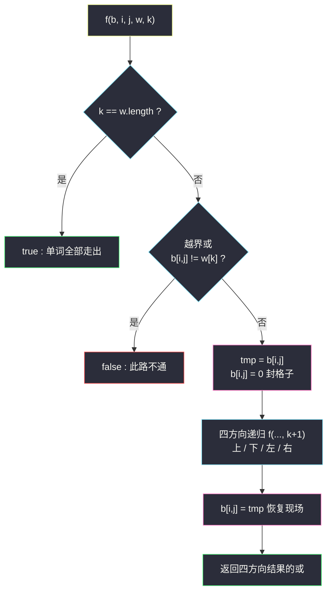
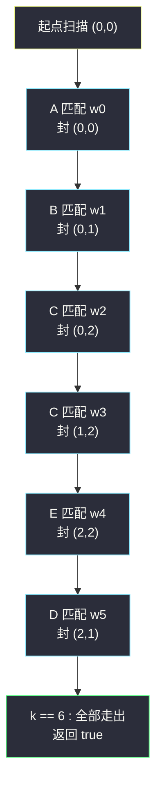

# 单词搜索（网格 DFS + 回溯）

## 一、问题描述

给定一个 `m x n` 二维字符网格 `board` 和一个字符串单词 `word`。如果 `word` 存在于网格中，返回 `true`；否则，返回 `false`。

单词必须按照字母顺序，通过**相邻**的单元格内的字母构成（相邻 = 水平相邻或垂直相邻）。**同一个单元格内的字母不允许被重复使用**。

> 🔗 LeetCode 79：https://leetcode.cn/problems/word-search/

**示例 1**

```
board = [["A","B","C","E"],
         ["S","F","C","S"],
         ["A","D","E","E"]]
word = "ABCCED"
输出：true
```

**示例 2（失败样例）**

```
同一个 board，word = "ABCB"
输出：false   （唯一能走出的 AB C... 之后 B 已被用过，无法回头）
```

**直观理解**

把网格想象成一张地图：从**任意起点**出发，每一步只能走上下左右相邻格子，脚下踩过的格子立刻「塌方」不能再踩。问能不能踩出一条恰好拼出 `word` 的路径。起点有 `m·n` 个候选、每步最多 4 个方向——这是最典型的**路径型回溯**：做选择（走进格子）→ 递归（往下走）→ 撤销选择（退出来，格子恢复可用）。

---

## 二、暴力解法（入门）

### 直观思路

对每个起点 `(i,j)` 做 DFS，维护一条路径 `path`。每层检查：格子是否越界、字符是否匹配、格子是否已在 `path` 里（用逐个比较判重）。走到 `path` 长度等于单词长度即成功。

```java
public boolean exist(char[][] board, String word) {
    char[] w = word.toCharArray();
    for (int i = 0; i < board.length; i++) {
        for (int j = 0; j < board[0].length; j++) {
            if (dfs(board, i, j, w, 0, new ArrayList<>())) {
                return true;
            }
        }
    }
    return false;
}

private boolean dfs(char[][] b, int i, int j, char[] w, int k, List<int[]> path) {
    if (k == w.length) return true;
    if (i < 0 || i == b.length || j < 0 || j == b[0].length || b[i][j] != w[k]) return false;
    for (int[] p : path) {          // 逐个判重：O(路径长)
        if (p[0] == i && p[1] == j) return false;
    }
    path.add(new int[]{i, j});      // 做选择
    boolean ans = dfs(b, i-1, j, w, k+1, path) || dfs(b, i+1, j, w, k+1, path)
               || dfs(b, i, j-1, w, k+1, path) || dfs(b, i, j+1, w, k+1, path);
    path.remove(path.size() - 1);   // 撤销选择
    return ans;
}
```

### 复杂度

- **时间**：`O(m·n · 4^L · L)`——起点 `m·n` 个，每步 4 个方向（暴力版没挡回头路，最坏 4 方向都试），深度 `L = word.length()`，每层还带 O(L) 判重
- **空间**：`O(L)` 路径 + 递归栈

### 🔴 瓶颈在哪里

1. 每层用 `path.contains` 判重，白付 O(L)；
2. 额外维护一条路径链，其实「在不在路径里」只需要一个**布尔标记**；
3. 每个起点 new 一个 `ArrayList`，重复分配。

标记本质是「进格子时打上、退格子时撤掉」——那干脆**把标记直接写在 board 上**：进入前把字符改掉，退出后改回来，一步到位。

---

## 三、优化探索（核心章节）

### 3.1 观察特征

| 特征 | 结论 |
|------|------|
| 同一格子不允许重复使用 | 必须有「走过即封死、退出即解封」的标记机制——回溯恢复现场 |
| 匹配失败立刻整枝报废 | 字符不相等直接 `return false`，天然强剪枝 |
| 网格里只有大写/小写字母 | 把格子改成 `0`（`\u0000`）绝不会与任何字母相等——board 可以**自己当 visited 用** |
| 状态里含「路径形状」 | 带路径的递归**无法改成动态规划**（课上明确强调），老老实实回溯 |

### 3.2 递归设计：`f(b, i, j, w, k)`

从 `(i,j)` 出发，`w[k...]` 后续部分能否被走出来。**注意判断顺序**（与课源码一致）：

1. `k == w.length` → 单词已全部走出，**直接 true**（这一步要在越界判断之前！最后一格匹配后下一步可能越界，但单词已经完成）；
2. `(i,j)` 越界或 `b[i][j] != w[k]` → false；
3. 匹配成功：`tmp = b[i][j]` 存底，`b[i][j] = 0` 封格子；四个方向递归 `k+1`；**无论成败，`b[i][j] = tmp` 恢复现场**再返回。



### 3.3 关键推导问题

| 问题 | 答案 |
|------|------|
| 为什么 `k == w.length` 要放在越界判断**前面**？ | 匹配完最后一个字母后，函数会从「下一格」递归进来，此时 `(i,j)` 可能越界，但单词已经走完——先判 k 再判越界才不会把成功误杀成 false |
| 封格子为什么用 `0`？ | `board` 只含字母（`'A'`~`'z'`，ASCII 都非 0），`char 0` 与任何字母都不相等，天然「此路不通」 |
| 为什么不能动态规划？ | 子问题状态包含「路径已占用了哪些格子」，状态空间爆炸且无重叠子问题；课上原话：**带路径的递归无法改 DP（或没必要）** |
| 复杂度里的 `3^L` 怎么来的？ | 起点第一步最多 4 个方向；进入新格子后，来的方向那格已被封为 `0`，字符必不匹配，实际每层最多 3 个有效分支 |
| 恢复现场只在失败分支需要吗？ | 不是——**成功路径也要恢复**。因为上层 `exist` 的双循环还要继续拿原始 board 试其它起点，board 被污染就全盘报废 |

### 3.4 一句话核心

> **把「走过」直接编码进 board：进格子前存底改 0，四方向递归回来后原样恢复——标记与撤销零成本。**

---

## 四、代码实现详解

### Java（主解：对齐课源码 class067）

```java
// 单词搜索（无法改成动态规划）
// 测试链接 : https://leetcode.cn/problems/word-search/
class Solution {

    public boolean exist(char[][] board, String word) {
        char[] w = word.toCharArray();
        for (int i = 0; i < board.length; i++) {
            for (int j = 0; j < board[0].length; j++) {
                if (f(board, i, j, w, 0)) {
                    return true;
                }
            }
        }
        return false;
    }

    // 从(i,j)出发，来到w[k]，请问后续能不能把word走出来w[k...]
    // 因为board会改其中的字符，用来标记哪些字符无法再用
    public boolean f(char[][] b, int i, int j, char[] w, int k) {
        if (k == w.length) {
            return true;
        }
        if (i < 0 || i == b.length || j < 0 || j == b[0].length || b[i][j] != w[k]) {
            return false;
        }
        // 不越界，b[i][j] == w[k]
        char tmp = b[i][j];
        b[i][j] = 0; // 封格子：0 与任何字母都不相等
        boolean ans = f(b, i - 1, j, w, k + 1)
                || f(b, i + 1, j, w, k + 1)
                || f(b, i, j - 1, w, k + 1)
                || f(b, i, j + 1, w, k + 1);
        b[i][j] = tmp; // 恢复现场，特别重要
        return ans;
    }
}
```

> 课源码：`src/class067/Code02_WordSearch.java`，主解与其完全同构（LC 提交时类名 `Solution` 即可）。

### Python

```python
# 单词搜索
# 测试链接 : https://leetcode.cn/problems/word-search/
class Solution:
    def exist(self, board: list[list[str]], word: str) -> bool:
        w = list(word)
        m, n = len(board), len(board[0])

        def f(i: int, j: int, k: int) -> bool:
            if k == len(w):
                return True
            if i < 0 or i == m or j < 0 or j == n or board[i][j] != w[k]:
                return False
            tmp = board[i][j]
            board[i][j] = "#"          # 封格子（'#' 不会与字母相等）
            ans = f(i - 1, j, k + 1) or f(i + 1, j, k + 1) \
                  or f(i, j - 1, k + 1) or f(i, j + 1, k + 1)
            board[i][j] = tmp          # 恢复现场
            return ans

        return any(f(i, j, 0) for i in range(m) for j in range(n))
```

---

## 五、具体例子演示

```
board:  A B C E        word = "ABCCED"（长度 6）
        S F C S
        A D E E
```

**端到端跟踪（成功路径）**——起点扫描从 `(0,0)` 开始：

| 步 | 格子 | 字符 | w[k] | 匹配? | 动作 | 封住后走向 |
|----|------|------|------|-------|------|-----------|
| 1 | (0,0) | A | A(0) | ✅ | 封(0,0)，k=1 | 试 (−1,0)✗ (1,0)S✗ (0,−1)✗ → (0,1) |
| 2 | (0,1) | B | B(1) | ✅ | 封(0,1)，k=2 | 试 (0,0)A✗已封 (1,1)F✗ → (0,2) |
| 3 | (0,2) | C | C(2) | ✅ | 封(0,2)，k=3 | 试 (0,1)已封 (0,3)E✗ (1,2)C → 递归 |
| 4 | (1,2) | C | C(3) | ✅ | 封(1,2)，k=4 | 试 (0,2)已封 (1,1)F✗ (2,2)E → 递归 |
| 5 | (2,2) | E | E(4) | ✅ | 封(2,2)，k=5 | 试 (1,2)已封 (2,1)D → 递归 |
| 6 | (2,1) | D | D(5) | ✅ | 封(2,1)，k=6 | 四方向递归进入 f(2,0) |
| 7 | (2,0) | — | — | — | **k==6 先于越界/字符判断命中** | 返回 **true** ✅ |

注意第 7 步：递归 f(2,0,...,6) 时第一行判断 `k == w.length` 直接成立——这正是「先判 k 再判格子」的价值。沿途所有封住的格子逐层 `b[i][j] = tmp` 恢复，board 还原，函数一路把 true 传回 `exist`。

**回溯现场（失败路径）**——`word = "ABCB"`：沿 A→B→C 走到 (0,2) 封住后，`w[3]='B'`：

| 位置 | 字符 | 结果 |
|------|------|------|
| (0,1) | 已封为 0 | ✗（恢复现场机制挡住回头路） |
| (0,3) | E ≠ B | ✗ |
| (1,2) | C ≠ B | ✗ |

(0,2) 的四方向全 false → **恢复 b[0][2]='C'**，退回 (0,1)→恢复 'B'→退回 (0,0)→恢复 'A'，再试其它起点，最终返回 false。



---

## 六、复杂度分析

| 项目 | 复杂度 | 说明 |
|------|--------|------|
| 时间 | `O(m·n · 3^L)` | 起点 `m·n` 个；起点第一步最多 4 方向，此后来的方向那格已被封，每层最多 3 个有效分支，`L` 为单词长度 |
| 空间 | `O(L)` | 递归栈深度 = 单词长度；原地标记不再需要 visited 数组与 path 链 |

对比暴力版：`O(m·n · 4^L · L)` → `O(m·n · 3^L)`，砍掉回头分支与判重开销；空间上彻底干掉辅助结构。

---

## 七、方法对比与总结

### 易错点

1. **忘写恢复现场的 `b[i][j] = tmp`** → board 被永久污染，其它起点/其它分支全部误判，最隐蔽也最致命。
2. **把 `k == w.length` 放在越界判断后面** → 成功路径在最后一格的下一跳被越界判死。
3. **四方向递归里不短路** → Java 用 `||` 天然短路；若先算完再或，最坏情况常数翻数倍。
4. 用 `visited` 数组时**忘了递归返回前清标记**——与忘恢复现场同罪。
5. Python 封格子不能用 `'\0'` 的思路时，选一个不可能出现的哨兵字符（如 `"#"`），恢复时必须还原原字符。

### visited 数组 vs 原地标记

| | visited 数组 | 原地标记（课上推荐） |
|--|--------------|----------------------|
| 额外空间 | `O(m·n)` | `O(1)` |
| 恢复操作 | 置 false | 还原 tmp 字符 |
| 出错概率 | 忘清标记 | 忘还原字符（同理） |
| 适用 | board 只读 / 多线程 | 单线程回溯，最干净 |

### 模板口诀

> **起点扫全图，入格存底改零；四向递归找后缀，退格还原原字符。**

---

## 八、举一反三

| 题目 | 链接 | 迁移点 |
|------|------|--------|
| 212. 单词搜索 II | https://leetcode.cn/problems/word-search-ii/ | 一批单词一起搜：Trie 树剪枝 + 同款网格回溯（课源码 `class045/Code03_WordSearchII.java`） |
| 1219. 黄金矿工 | https://leetcode.cn/problems/path-with-maximum-gold/ | 同款「走过即封、退出还原」网格回溯，改成收集最大价值 |
| 2328. 网格图中递增路径的数目 | https://leetcode.cn/problems/number-of-increasing-paths-in-a-grid/ | 网格 DFS，但无「不可回头」约束 → 可以记忆化，对比本题为何不能 DP |
| 46. 全排列 | https://leetcode.cn/problems/permutations/ | 「做选择 → 递归 → 撤销选择」在数组上的原型（[站内题解](/solutions/base/permutations.md)） |

**迁移一句**：路径型回溯的黄金三段式永远是 **「封住当前位置 → 递归后缀 → 恢复现场」**；网格题只是把「位置」从数组下标换成了 `(i,j)` 坐标，把「恢复」从 swap 换成了还原字符。
