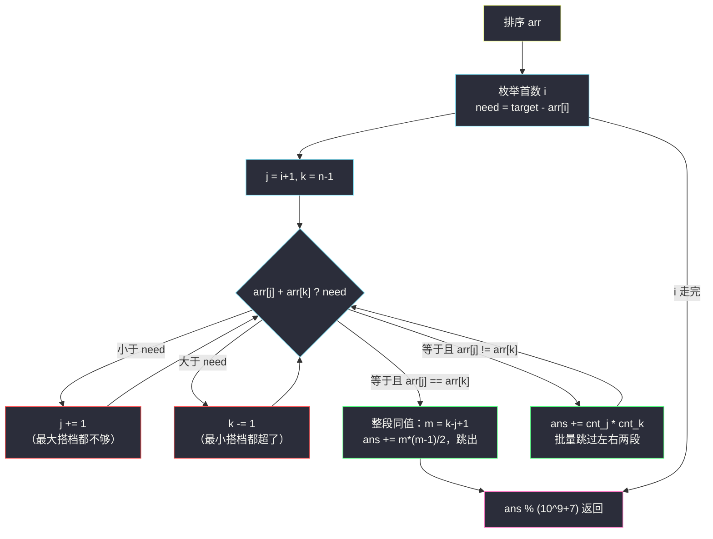

# 三数之和的多种可能（排序 + 相向双指针 · 相同值批量计数）

## 一、问题描述

给一个整数数组 `arr` 和一个目标值 `target`，统计满足 `arr[i] + arr[j] + arr[k] == target`（`i < j < k`）的**元组个数**。

注意：这里数的是「下标元组」的个数——即使两组下标取到的数值完全一样，只要下标不同就算不同的元组。答案可能很大，需对 `10^9 + 7` 取模。

> 🔗 LeetCode 923：https://leetcode.cn/problems/3sum-with-multiplicity/
>
> 数据范围：`3 <= arr.length <= 3000`，`0 <= arr[i] <= 100`，`0 <= target <= 300`。

**示例 1**

```
输入：arr = [1,1,2,2,3,3,4,4,5,5], target = 8
输出：20
解释：存在 20 个满足 i < j < k 且三数之和为 8 的元组。
```

**示例 2**

```
输入：arr = [1,1,2,2,2,2], target = 5
输出：12
解释：arr[i] = 1, arr[j] = arr[k] = 2 的组合共有 2 * C(4,2) = 2 * 6 = 12 个。
```

**直观理解**

这题长得像「三数之和」（#15），但目标反了过来：#15 只要**去重后的集合**，本题要**带重复计数**的元组总数。方向一反，「去重跳过」就要换成「相同值批量计数」——这正是本题最有味道的地方。

## 二、暴力解法（三重循环枚举）

### 直观思路

枚举所有下标三元组 `(i, j, k)`，直接验证三数之和。唯一要注意的是边算边取模，防止 Python 之外的语言溢出（Python 大整数不会溢出，但题目要求答案取模，最终返回时必须 `% MOD`）。

```python
class Solution:
    def threeSumMulti(self, arr: List[int], target: int) -> int:
        MOD = 10 ** 9 + 7
        n = len(arr)
        ans = 0
        for i in range(n):
            for j in range(i + 1, n):
                for k in range(j + 1, n):
                    if arr[i] + arr[j] + arr[k] == target:
                        ans += 1
        return ans % MOD
```

### 复杂度

- **时间**：`O(n^3)`。`n = 3000` 时约 `4.5 * 10^9` 次判断，必然超时。
- **空间**：`O(1)` 额外空间。

### 🔴 瓶颈在哪里

三重循环里有大量「两个数固定、第三个数单独扫」的浪费；而且数组里成片的相同值被一个一个地重复验证。把这两处浪费分别交给「排序 + 双指针」和「批量计数」，就能降到平方级。

## 三、优化探索（核心章节）

> 📚 本题在灵茶题单中属于 **§3.2 相向双指针家族**：排序后枚举一个锚点，剩下两个数用 `j`、`k` 相向而行。与普通两数之和双指针的差别在于**命中后不是各走一步，而是把同值的整段一口气数完**。

### 3.1 第一步：排序为什么不破坏答案

我们要数的是「下标元组」的个数，而两个数是否配对只看**数值**，与它们在原数组中的先后位置无关——排序只是把相同的值挤到一起、把整个数组变成「小 ←→ 大」的单调序列，不增也不减任何一对合法组合。于是可以先 `arr.sort()`。

排序的收益：

- **单调性**是双指针左右移动「安全」的前提（下面 3.3 详细说）；
- **相同值连续**，命中时才能用「连续段的长度」批量计数（3.4 的核心）。

### 3.2 第二步：枚举首数 i，问题塌缩成「两数之和」

固定最小的下标 `i` 之后，剩下要找的是区间 `[i+1, n-1]` 里和为 `need = target - arr[i]` 的**数对 `(j, k)` 的个数**（`j < k`）。三重循环降一维，变成 `n` 次「两数之和计数」。

### 3.3 相向双指针的单调性论证

设 `j < k`，`s = arr[j] + arr[k]`：

- 若 `s < need`：`arr[j]` 已经配上了**当前最大的搭档** `arr[k]` 都不够，那么区间里任何 `arr[k']`（`k' < k`）更小，`arr[j]` 与谁都不行 → `arr[j]` 出局，`j` 右移一步是安全的。
- 若 `s > need`：`arr[k]` 配上了**当前最小的搭档** `arr[j]` 都超了，`arr[j']`（`j' > j`）只会更大 → `arr[k]` 出局，`k` 左移一步是安全的。
- 若 `s == need`：命中，进入批量计数（3.4），数完后两端一起收缩。

每一步都让 `[j, k]` 严格变短，且绝不会漏数、错杀，所以一轮双指针是 `O(n)` 的。

### 3.4 命中之后：相同值批量计数（本题的灵魂）

普通双指针命中后 `j += 1; k -= 1` 各走一步、答案是 +1。本题因为有重复值，命中时**一片值一起命中**，必须分两种情况清账：

**情况 A：`arr[j] == arr[k]`。** 由于数组有序，区间 `[j, k]` 内**全部**都是这个值（首尾相等 ⇒ 中间夹的全相等），它们任意两个都能配成 `need`（`need = 2 * arr[j]`）。设段长 `m = k - j + 1`，贡献组合数：

```
C(m, 2) = m * (m - 1) / 2
```

数完这一段，`[j, k]` 内部没有任何未处理的数对，直接结束本轮（`break`）。

**情况 B：`arr[j] != arr[k]`。** 从 `j` 向右数出 `arr[j]` 的连续段长度 `cnt_j`，从 `k` 向左数出 `arr[k]` 的连续段长度 `cnt_k`。左段里任何一个都能和右段里任何一个配对（和都是 `need`），贡献：

```
cnt_j * cnt_k
```

然后把 `j` 跳到左段之后、`k` 跳到右段之前，继续双指针。

两种批量计数的示意图：



### 3.5 关于取模

加法过程中可以只在最后 `ans % MOD`（Python 大整数无溢出），其他语言（Java/C++）建议每轮命中后就 `%`，避免溢出。乘法 `m*(m-1)/2` 与 `cnt_j*cnt_k` 先算再取模即可，注意 `m*(m-1)` 必为偶数，整除安全。

## 四、代码实现

```python
from typing import List

class Solution:
    def threeSumMulti(self, arr: List[int], target: int) -> int:
        MOD = 10 ** 9 + 7
        arr.sort()
        n = len(arr)
        ans = 0

        for i in range(n - 2):
            need = target - arr[i]
            j, k = i + 1, n - 1
            while j < k:
                s = arr[j] + arr[k]
                if s < need:                    # arr[j] 配最大搭档都不够
                    j += 1
                elif s > need:                  # arr[k] 配最小搭档都超了
                    k -= 1
                else:                           # 命中，相同值批量计数
                    if arr[j] == arr[k]:
                        # 情况 A：区间 [j, k] 全部同值，任取两个
                        m = k - j + 1
                        ans += m * (m - 1) // 2
                        break                   # 本轮数对已清空
                    # 情况 B：数出左右两个同值段
                    cnt_j = 1
                    while arr[j] == arr[j + 1]:
                        j += 1
                        cnt_j += 1
                    cnt_k = 1
                    while arr[k] == arr[k - 1]:
                        k -= 1
                        cnt_k += 1
                    ans += cnt_j * cnt_k
                    j += 1                      # 跳过左右段后继续
                    k -= 1

        return ans % MOD
```

**逐行要点**

- `for i in range(n - 2)`：首数至少留两个位置给 `j`、`k`。
- `if arr[j] == arr[k]` 必须在命中分支里**先判**：它保证情况 B 里 `arr[j] != arr[k]`，因此 `while arr[j] == arr[j+1]` 的扫描不可能越过 `k`（两段之间必有别的值），边界安全。
- 情况 A 里用 `break` 而不是移动指针：段内数对已全部计入，继续移动只会数重。
- `cnt_j` / `cnt_k` 的内层 `while` 看似嵌套，但每个下标至多被 `j` 或 `k` 越过一次，总代价仍是 `O(n)`。

## 五、例子演示

以 `arr = [1,1,2,2,3,3,4,4,5,5]`，`target = 8` 为例。排序后不变，下标 `0..9`：

```
下标:  0  1  2  3  4  5  6  7  8  9
值:    1  1  2  2  3  3  4  4  5  5
```

**轮次 i = 0（arr[0] = 1，need = 7）**，`j` 从 1、`k` 从 9 出发：

| 轮 | l=j | r=k | arr[j] | arr[k] | 和 | 与 need 比较 | 动作 | 本轮贡献 | 累计 |
|----|-----|-----|--------|--------|----|--------------|------|----------|------|
| 1 | 1 | 9 | 1 | 5 | 6 | 6 < 7 | j = 2 | 0 | 0 |
| 2 | 2 | 9 | 2 | 5 | 7 | 命中，值不同 | 左段 [2,3] 长 2，右段 [8,9] 长 2 → 加 2*2 | 4 | 4 |
| 3 | 4 | 7 | 3 | 4 | 7 | 命中，值不同 | 左段 [4,5] 长 2，右段 [6,7] 长 2 → 加 2*2 | 4 | 8 |
| — | 6 | 5 | — | — | — | j > k | 结束本轮 | | **8** |

第 2 轮的批量计数展开看：`j=2` 的 `2` 向右扫到 `j=3`（同为 2），`cnt_j = 2`；`k=9` 的 `5` 向左扫到 `k=8`（同为 5），`cnt_k = 2`；`(2,8) (2,9) (3,8) (3,9)` 四个数对一起命中，`+4` 后 `j=4, k=7`。

**轮次 i = 2（arr[2] = 2，need = 6）**，`j` 从 3、`k` 从 9 出发：

| 轮 | l=j | r=k | arr[j] | arr[k] | 和 | 与 need 比较 | 动作 | 本轮贡献 | 累计 |
|----|-----|-----|--------|--------|----|--------------|------|----------|------|
| 1 | 3 | 9 | 2 | 5 | 7 | 7 > 6 | k = 8 | 0 | 0 |
| 2 | 3 | 8 | 2 | 5 | 7 | 7 > 6 | k = 7 | 0 | 0 |
| 3 | 3 | 7 | 2 | 4 | 6 | 命中，值不同 | 左段 [3,3] 长 1，右段 [6,7] 长 2 → 加 1*2 | 2 | 2 |
| 4 | 4 | 5 | 3 | 3 | 6 | 命中，arr[j] == arr[k] | 整段 [4,5] 长 m=2 → 加 C(2,2)=1 | 1 | 3 |
| — | 6 | 4 | — | — | — | j > k | 结束本轮 | | **3** |

第 4 轮是**情况 A** 的展示：`arr[j] == arr[k]` 说明 `[4,5]` 段内全是 3，任取两个之和恰为 `need`，组合数 `2*1/2 = 1`，加完直接结束。

**其余轮次汇总**（过程同理）：

| i | arr[i] | need | 命中数对 | 贡献 |
|---|--------|------|----------|------|
| 0 | 1 | 7 | (2,5)*4、(3,4)*4 | 8 |
| 1 | 1 | 7 | 同上（剩余数组中仍有 2,2,3,3,4,4,5,5） | 8 |
| 2 | 2 | 6 | (2,4)*2、(3,3)*1 | 3 |
| 3 | 2 | 6 | (3,3)*1 | 1 |
| 4 | 3 | 5 | 无 | 0 |
| 5 | 3 | 5 | 无 | 0 |
| 6 | 4 | 4 | 无 | 0 |

总计 `8 + 8 + 3 + 1 = 20`，与示例输出一致。

再验证示例 2：`arr = [1,1,2,2,2,2]`，`target = 5`。`i=0`：need=4，`j=1, k=5`，`1+2=3 < 4` → j=2；`2+2=4` 命中且 `arr[j] == arr[k]`，段 `[2,5]` 长 4，加 `C(4,2) = 6`，break。`i=1`：need=4，`j=2, k=5` 同样加 6。共 12。✅

## 六、复杂度

- **时间**：排序 `O(n log n)`；主循环外层 `n` 轮，每轮双指针 `j`、`k` 合计至多走 `O(n)` 步（批量跳过也计入），总计 `O(n^2)`。整体 `O(n^2)`，`n = 3000` 时约 `9 * 10^6` 次基本操作，轻松通过。
- **空间**：`O(1)` 额外空间（Python 的 `list.sort()` 底层为 Timsort，理论 `O(n)` 辅助空间；若在意可改用返回新数组的 `sorted` 视作 `O(n)`，一般不苛求）。

## 七、对比总结

| 解法 | 时间 | 空间 | 说明 |
|------|------|------|------|
| 三重循环 | `O(n^3)` | `O(1)` | `n=3000` 必超时 |
| 排序 + 枚举 i + 相向双指针 + 批量计数 | `O(n^2)` | `O(1)` | 本文主解，通用性好 |
| 值域计数（`0 ≤ arr[i] ≤ 100`） | `O(n + 101^2)` | `O(101)` | 值域极小时的另辟蹊径 |

**值域计数法**简述：用 `cnt[v]` 统计每个值出现次数，枚举两个值 `v1 ≤ v2` 满足 `v1 + v2 == target - v3`，按 `v1 == v2` 与否用 `C(cnt,2)` 或 `cnt[v1]*cnt[v2]` 组合数相乘。它把复杂度从 `n` 的平方搬到了值域 `V` 的平方，本题 `V = 101` 时飞快；但一旦值域放大（如普通整数），立刻失效——双指针解法不依赖值域大小，更通用。

**与 #15 三数之和的对照**（同一个框架、相反的计数方向）：

| | #15 三数之和 | #923 三数之和的多种可能 |
|---|---|---|
| 目标 | 求所有**不重复**的三元组 | 数**带重复计数**的元组个数 |
| 命中后 | 跳过相同值（去重） | 把相同值**整段数清**（计数） |
| 输出规模 | 至多 `O(n^2)` 个三元组 | 一个取模后的整数 |

框架骨架完全一致：排序 → 枚举首数 → `j/k` 相向 → 命中后处理同值段。差别只在命中后的动作是「跳」还是「数」。

## 八、举一反三

本题练的是「排序 + 相向双指针 + 相同值批量计数」，同一家族的题目：

1. **LeetCode 15 三数之和**：https://leetcode.cn/problems/3sum/ —— 同框架的「去重版」，命中后跳过同值段，建议对照着写一遍，体会「跳」与「数」的镜像关系。
2. **LeetCode 167 两数之和 II - 输入有序数组**：https://leetcode.cn/problems/two-sum-ii-input-array-is-sorted/ —— 相向双指针的入门款，本题去掉枚举 `i` 的那层就是它。
3. **LeetCode 18 四数之和**：https://leetcode.cn/problems/4sum/ —— 枚举两层首数，内层仍是相向双指针，注意用 `long` 防三数之和溢出。
4. **LeetCode 454 四数相加 II**：https://leetcode.cn/problems/4sum-ii/ —— 四个数组、允许 `O(n^2)` 哈希分组计数，与本文「值域计数法」同属「换一个计数维度」的思想。
