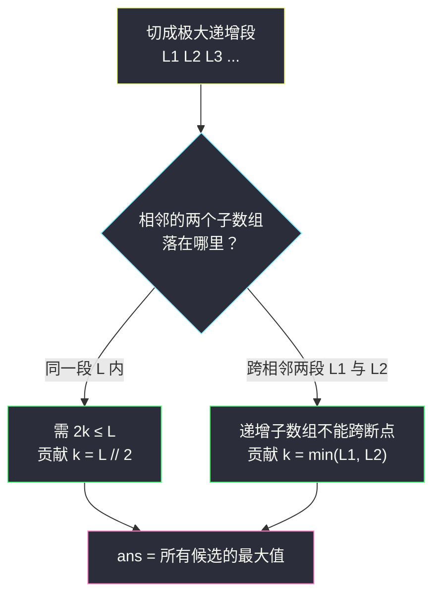

# 检测相邻递增子数组 II（分组循环 · 极大递增段的拼接）

## 一、问题描述

给定一个长度为 `n` 的整数数组 `nums`，求 `k` 的**最大值**，使得存在**两个相邻**且**长度均为 k** 的**严格递增**子数组：即存在下标 `a` 与 `b = a + k`，子数组 `nums[a..a+k-1]` 与 `nums[b..b+k-1]` 都严格递增。

> 🔗 LeetCode 3350：https://leetcode.cn/problems/adjacent-increasing-subarrays-detection-ii/

**示例 1**

```
输入: nums = [2,5,7,8,9,2,3,4,3,1]
输出: 3
解释: 下标 2 开始的 [7,8,9] 与下标 5 开始的 [2,3,4] 都严格递增，
      且后者紧贴前者（b = a + k = 2 + 3），k = 3 是最大可行值。
```

**示例 2**

```
输入: nums = [1,2,3,4,4,4,4,5,6,7]
输出: 2
解释: [1,2] 与 [3,4] 相邻且各自严格递增，k = 2 最大。
```

**直观理解**

注意两个子数组只要求**各自**严格递增，拼起来不要求整体递增——示例 1 中 `9 > 2` 处断开了，两段分别递增照样合法。所以「数组在哪断开」才是本题的全部关键信息：把数组切成一节节**极大递增段**，答案只依赖每段的长度。

## 二、暴力解法（入门）

### 直观思路

从大到小枚举 `k`（两段共占 `2k` 个元素，`k` 最大为 `n // 2`），再枚举第一段起点 `a`，逐个检查两段是否严格递增，找到即返回。

```python
class Solution:
    def maxIncreasingSubarrays(self, nums: List[int]) -> int:
        n = len(nums)

        def ok(start: int, k: int) -> bool:   # nums[start..start+k-1] 是否严格递增
            return all(nums[j] < nums[j + 1] for j in range(start, start + k - 1))

        for k in range(n // 2, 0, -1):        # 从大到小：一找到就返回
            for a in range(n - 2 * k + 1):
                if ok(a, k) and ok(a + k, k):
                    return k
        return 0
```

### 复杂度

- **时间**：`O(n³)`，`k`、`a`、逐元素检查三层嵌套。
- **空间**：`O(1)`。

### 🔴 瓶颈在哪里

同一段递增区间被翻来覆去检查了成千上万遍。「某段是否递增、递增多长」本质是**区间的固有属性**，完全可以先压缩成几个数字再用。

## 三、优化探索（核心章节）

> 本题属于 **灵茶题单 · 六、分组循环**（进阶篇）。讲法对齐灵神的分组循环模板：外层推进「组起点」，内层 `while` 消费同组的连续段，**组内收集答案、组间重置状态**。

### 3.1 观察特征

| 特征 | 说明 |
|------|------|
| 每个子数组自身严格递增 | 合法性只由「极大递增段」决定 |
| b = a + k（两段相邻） | 第二段起点恰好贴着第一段终点 |
| 拼接处允许断开 | 两个子数组可以分别落在**相邻的两段**里 |

### 3.2 关键推导：答案只有两种来源

把 `nums` 切成若干**极大严格递增段**（相邻两段之间必有一个不递增的断点）。任意合法方案 `[a, a+k)`、`[a+k, a+2k)` 只有两种落法：

**情形 A：两个子数组同在一段内（设段长 L）**

需要 `a + 2k - 1` 不越出段尾，即 `2k ≤ L`，最优取 `k = L // 2`（下取整）。

**情形 B：两个子数组分别落在相邻两段（设长度 L1、L2）**

断点处不递增，任何严格递增子数组都无法跨越断点，所以第一个子数组必须整个在前段、第二个整个在后段。取前段末尾 `k` 个、后段开头 `k` 个，二者天然相邻（`b = a + k` 自动成立），上界为 `k ≤ min(L1, L2)`，且该值一定能取到。

于是：

```python
ans = max(所有段的 L // 2, 所有相邻段的 min(L前, L后))
```

### 3.3 用灵神的分组循环模板怎么写

```python
i = 0
while i < n:
    start = i                      # 组起点
    i += 1
    while i < n and nums[i] > nums[i - 1]:   # 同组条件：仍在递增
        i += 1
    # 此刻 [start, i-1] 是一段极大递增段：组内收集答案，组间拼接上一组
```

本题的「组内收集」是 `ans = max(ans, run // 2)`；「组间拼接」是 `ans = max(ans, min(prev, run))`——用一个变量 `prev` 记住上一组的长度，在每组结束的瞬间做一次跨段更新，再把 `prev` 重置为本组长度。



### 3.4 等价的 DP 视角（对照）

定义 `f[i]` = 以 `i` 结尾的极大递增段长度：递增时 `f[i] = f[i-1] + 1`，否则 `f[i] = 1`。以 `i` 结尾的段长为 `f[i]`：

- 同段贡献 `f[i] // 2`；
- 跨段时，前一段的末尾下标恰好是 `i - f[i]`，其段长就是 `f[i - f[i]]`，贡献 `min(f[i], f[i - f[i]])`。

这与分组循环殊途同归——分组循环正是它的 `O(1)` 空间版本。

### 3.5 一句话核心

> **把数组切成极大递增段：段内贡献 `L // 2`，相邻两段贡献 `min(L前, L后)`，分组循环一趟全取最大。**

## 四、代码实现详解

### Python（主解：分组循环）

```python
class Solution:
    def maxIncreasingSubarrays(self, nums: List[int]) -> int:
        n = len(nums)
        ans = 0
        prev = 0                                   # 上一段的长度（组间信息）
        i = 0
        while i < n:
            start = i                              # 本段（组）起点
            i += 1
            while i < n and nums[i] > nums[i - 1]: # 同组条件：仍在严格递增
                i += 1
            run = i - start                        # 本段长度
            ans = max(ans, run // 2, min(prev, run))  # 组内 + 跨段一起更新
            prev = run                             # 组间重置：本段成为"上一段"
        return ans
```

**变量含义**

| 变量 | 含义 |
|------|------|
| `i` | 消费指针，永远指向「下一个尚未分组的元素」，只前进不后退 |
| `start` | 当前递增段的起点 |
| `run` | 当前递增段长度 `i - start` |
| `prev` | 上一段的长度，跨段拼接时用 |

**循环不变式**：每轮外层循环开始时，`i` 恰是某个极大递增段的起点，`prev` 是其前一段的长度；每轮结束后，`nums[start..i-1]` 是一段极大的严格递增段，且 `ans` 已覆盖「截止到当前」的所有候选答案。

### Java（最优解同款）

```java
class Solution {
    public int maxIncreasingSubarrays(int[] nums) {
        int n = nums.length, ans = 0, prev = 0, i = 0;
        while (i < n) {
            int start = i;
            i++;
            while (i < n && nums[i] > nums[i - 1]) {
                i++;
            }
            int run = i - start;
            ans = Math.max(ans, Math.max(run / 2, Math.min(prev, run)));
            prev = run;
        }
        return ans;
    }
}
```

## 五、具体例子演示

**示例 1**：`nums = [2,5,7,8,9,2,3,4,3,1]`。分组循环切出四组：

| 组 | 区间 | 内容 | run | run // 2 | min(prev, run) | ans 更新后 |
|----|------|------|-----|----------|----------------|-----------|
| 1 | [0,4] | 2,5,7,8,9 | 5 | 2 | min(0,5)=0 | 2 |
| 2 | [5,7] | 2,3,4 | 3 | 1 | min(5,3)=**3** | **3** |
| 3 | [8,8] | 3 | 1 | 0 | min(3,1)=1 | 3 |
| 4 | [9,9] | 1 | 1 | 0 | min(1,1)=1 | 3 |

最终答案 `3`，来自「第 1 段尾部的 `[7,8,9]` + 第 2 段头部的 `[2,3,4]`」这一跨段拼接，与官方解释完全一致。

**示例 2**：`nums = [1,2,3,4,4,4,4,5,6,7]`。切出四组：

| 组 | 区间 | 内容 | run | run // 2 | min(prev, run) | ans 更新后 |
|----|------|------|-----|----------|----------------|-----------|
| 1 | [0,3] | 1,2,3,4 | 4 | **2** | 0 | 2 |
| 2 | [4,4] | 4 | 1 | 0 | 1 | 2 |
| 3 | [5,5] | 4 | 1 | 0 | 1 | 2 |
| 4 | [6,9] | 4,5,6,7 | 4 | 2 | min(1,4)=1 | 2 |

最终答案 `2`：组 1 同段内 `[1,2]` 与 `[3,4]` 胜出；组 4 虽长 4，但前方只挂着长度 1 的孤段，跨段最多 `min(1,4)=1`。


## 六、复杂度分析

| 方法 | 时间 | 空间 | 说明 |
|------|------|------|------|
| 暴力枚举 k、a | `O(n³)` | `O(1)` | 同一区间被反复检查 |
| DP f[i] 版 | `O(n)` | `O(n)` | 与分组循环等价，多一个数组 |
| 分组循环（主解） | `O(n)` | `O(1)` | `i` 只前进，每个元素恰好进组一次 |

## 七、方法对比与总结

| | 暴力 | DP f[i] | 分组循环 |
|--|------|---------|----------|
| 思路 | 枚举后验证 | 以 i 结尾的段长 | 按极大递增段分组 |
| 时间 | `O(n³)` | `O(n)` | `O(n)` |
| 空间 | `O(1)` | `O(n)` | `O(1)` |

**易错点**

1. **漏掉跨段情形** `min(prev, run)`——示例 1 的答案 `3` 只能靠它得到，单看各段 `L // 2` 最大只有 2。
2. 误以为两个子数组拼起来也要整体递增，从而把跨段方案全部排除。
3. `prev` 初值应为 `0` 而非 `1`：第一段没有前一段，`min(0, run) = 0` 天然无害。
4. 组内更新（`run // 2`）与组间更新（`min`）都要在**段结束的瞬间**、`run` 定型后一起做。

**模板（分组循环，对齐灵神题单「六、分组循环」）**

```python
# i = 0
# while i < n:
#     start = i
#     i += 1
#     while i < n and <同组条件>:
#         i += 1
#     组内收集答案（run = i - start）
#     组间拼接 / 重置（prev）
```

## 八、举一反三

| 题目 | 关系 |
|------|------|
| [1446. 连续字符](https://leetcode.cn/problems/consecutive-characters/) | 分组循环入门：同字符连续段 |
| [3105. 最长的严格递增或严格递减子数组](https://leetcode.cn/problems/longest-strictly-increasing-or-strictly-decreasing-subarray/) | 同为递增段长度统计 |
| [674. 最长连续递增序列](https://leetcode.cn/problems/longest-continuous-increasing-subsequence/) | 单段最长，无拼接 |
| [228. 汇总区间](https://leetcode.cn/problems/summary-ranges/) | 分组循环直接输出每组区间 |

**思想迁移**

- 看到「连续递增 / 同字符 / 单调段」→ 先想分组循环切段，让「段长」成为唯一信息。
- 本题的「段内取一半、段间取 min」是分组循环的进阶套路：最优答案不一定全在组内，还藏在**相邻两组的拼接**里。
- 同批姊妹篇：`push-dominoes.md`（分组循环处理间隔段）、`unique-substrings-in-wraparound-string.md`（分组循环 + 按结尾去重计数）。
