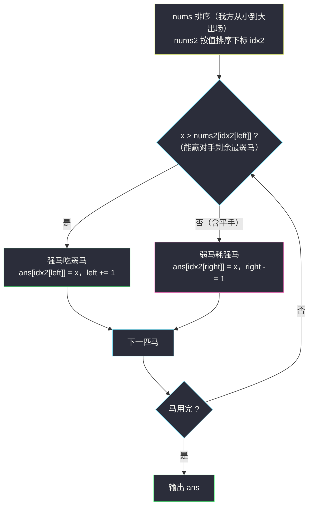
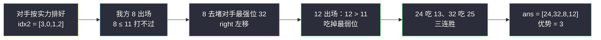

# 优势洗牌（田忌赛马 · 双序列配对）

## 一、问题描述

给定两个长度相等的下标从 `0` 开始的数组 `nums` 与 `nums2`。`nums` 相对于 `nums2` 的**优势**定义：把 `nums` 重排成排列 `A`，统计满足 `A[i] > nums2[i]` 的下标 `i` 的数目（比较对象是**原始顺序**的 `nums2`，不可重排）。

返回**优势最大**的任意一个排列 `A`。

> 🔗 LeetCode 870：https://leetcode.cn/problems/advantage-shuffle/
>
> 数据范围：`1 <= nums.length == nums2.length <= 10^5`，`0 <= nums[i], nums2[i] <= 10^9`。

**示例 1**

```
输入：nums = [2,7,11,15], nums2 = [1,10,4,11]
输出：[2,11,7,15]
解释：2>1 ✓、11>10 ✓、7>4 ✓、15>11 ✓，四个位置全部占优，优势为 4。
```

**示例 2**

```
输入：nums = [12,24,8,32], nums2 = [13,25,32,11]
输出：[24,32,8,12]
解释：24>13 ✓、32>25 ✓、8>32 ✗、12>11 ✓，优势为 3（已是最大）。
```

**直观理解**

两个故事的经典对照：#2592 是「一个序列自己配自己」，只问**个数**；本题是**两个序列配对**，还要**构造出方案**。这就是田忌赛马的完整版：

- 上等马吃对方下等马（强配弱，稳赢的先挑最软的柿子）；
- 下等马去耗对方上等马（反正赢不了，就堵最难的位置）。

---

## 二、暴力解法

枚举 `nums` 的全部排列，对每个排列统计优势位数，取最大的一个输出：

```python
class Solution:
    def advantageCount(self, nums: List[int], nums2: List[int]) -> List[int]:
        best, best_cnt = None, -1
        for perm in permutations(nums):              # O(n!) 个排列
            cnt = sum(p > q for p, q in zip(perm, nums2))
            if cnt > best_cnt:
                best, best_cnt = perm, cnt
        return list(best)
```

### 复杂度

- **时间**：`O(n! · n)`，`n = 10^5` 完全无从谈起；`n ≤ 8` 才能勉强跑。
- **空间**：`O(n)`。

### 🔴 瓶颈在哪里

位置组合爆炸，但「谁配谁」只取决于**两边的值**。与 #2592 一样，把 `nums`（我方马）和 `nums2`（对手）分别按实力排序后，配对关系立刻清晰——只是本题要记住每个值**该回到 `nums2` 的哪个下标**，所以对手那侧排的是**下标**。

---

## 三、优化探索（核心章节）

> 📚 本题在灵茶题单中属于 **§1.3 双序列配对**（贪心① A 路）：田忌赛马——我方弱马耗对方强马、强马吃对方弱马；无收益（含平手）也拿最弱的去换。

### 3.1 贪心：三条规则

我方马 `nums` 排序后**从小到大**出场；对手 `nums2` 按值排序（记录下标），用 `left` / `right` 指向对手**剩余最弱 / 最强**的位置：

1. **强马吃弱马**：当前最弱的我方马若能赢对手剩余最弱马（`x > nums2[idx2[left]]`），立刻占下这个最弱位置，`left += 1`；
2. **弱马耗强马**：若连对手最弱马都赢不了，这匹马对**任何**剩余对手都无胜算（对方剩余值 ≥ 最弱值）——把它派去堵对手**最强**的位置 `idx2[right]`，`right -= 1`，把好打的位子留给后面的强马；
3. **平手同败**：优势要求**严格大于**，`x == nums2[idx2[left]]` 走规则 2，拿最弱的去换。



### 3.2 为什么是对的

**规则 1（小配小）**：与 #2592 相同的交换论证——能赢对手最弱马的己方马不立刻上，换任何其它马都不会更好。设最优方案中当前马 `x` 去了更难的位置 `j`、最弱位置 `left` 由更大的马 `y ≥ x` 赢下：交换后 `x` 赢 `left`（`x > nums2[left]` 已知），`y` 去 `j`（`y ≥ x`，原来 `x` 能赢则 `y` 必能赢；若 `x` 在最优方案中作废，则 `y` 接管后作废不亏）。配对数不减。

**规则 2（弱马堵强位）**：这匹马放对手任何剩余位置都是败局，贡献恒为 0。放在**最强**位置 `right` 后，剩余问题变成「去掉一个最难位置」——对后面所有马而言，对手集合只变好不变坏。归纳可知不劣于放到其它任何位置。

### 3.3 为什么要排「下标」而不是值

输出 `A` 必须按 `nums2` 的**原始下标**归位。若直接对 `nums2` 排序，位置信息就丢了。排 `idx2 = sorted(range(n), key=lambda i: nums2[i])`，`idx2[left]` 始终是「对手剩余最弱马所在的原下标」，放置时不冲突：`left` 与 `right` 各自推进、每轮恰好填一个位置，`n` 轮填满。

### 3.4 一句话核心

> **田忌赛马：小马先挑软柿子；打不过的拿去堵对方最强的位置，好位置留给后面的强马。**

---

## 四、代码实现

### Python（主解）

```python
class Solution:
    def advantageCount(self, nums: List[int], nums2: List[int]) -> List[int]:
        n = len(nums)
        nums.sort()                                     # 我方马从小到大出场
        idx2 = sorted(range(n), key=lambda i: nums2[i])  # 对手按实力排序的下标
        ans = [0] * n
        left, right = 0, n - 1                          # 对手剩余最弱 / 最强
        for x in nums:
            if x > nums2[idx2[left]]:                   # 强马吃弱马
                ans[idx2[left]] = x
                left += 1
            else:                                       # 弱马耗对方最强马
                ans[idx2[right]] = x
                right -= 1
        return ans
```

**变量含义**

| 变量 | 含义 |
|------|------|
| `x` | 当前出场的我方马（排序后从小到大） |
| `idx2` | `nums2` 按值从小到大排序后的**原下标**序列 |
| `left` / `right` | 对手尚未被占的**最弱 / 最强**马在 `idx2` 中的位置 |
| `ans[idx]` | 放到 `nums2` 原下标 `idx` 处的我方马 |

**循环不变式**：第 `k` 轮结束后，恰有 `k` 个 `ans` 位置被填；`idx2[left..right]` 是对手剩余未占位置（且按实力有序）。因此每个位置恰被填一次，无冲突、无遗漏。

### Java（可选对照）

```java
class Solution {
    public int[] advantageCount(int[] nums, int[] nums2) {
        int n = nums.length;
        Integer[] idx2 = new Integer[n];
        for (int i = 0; i < n; i++) idx2[i] = i;
        Arrays.sort(nums);
        Arrays.sort(idx2, (a, b) -> Integer.compare(nums2[a], nums2[b])); // 防溢出写法
        int[] ans = new int[n];
        int left = 0, right = n - 1;
        for (int x : nums) {
            if (x > nums2[idx2[left]]) ans[idx2[left++]] = x;   // 强吃弱
            else                       ans[idx2[right--]] = x;  // 弱耗强
        }
        return ans;
    }
}
```

值域到 `10^9`，比较器务必用 `Integer.compare`，`(a, b) -> nums2[a] - nums2[b]` 的减法在极端值下可能溢出。

---

## 五、具体例子演示

### 示例 2 端到端：`nums = [12,24,8,32]`，`nums2 = [13,25,32,11]`

预处理：我方排序 `[8,12,24,32]`；对手值 `11(i3) < 13(i0) < 25(i1) < 32(i2)`，故 `idx2 = [3,0,1,2]`；`left = 0, right = 3`。

**排序后每一步的选择过程**

| 步 | 我方马 x（最小剩余） | 对手剩余最弱（位置） | 能赢 ? | 决策 | 放置 | 指针变化 |
|----|---------------------|---------------------|--------|------|------|---------|
| 1 | 8 | 11（`idx2[0]=3`） | 否 | 弱马耗强位 | `ans[2] = 8`（对手最强 32 所在） | `right: 3→2` |
| 2 | 12 | 11（`idx2[0]=3`） | **是** | 强吃弱 | `ans[3] = 12` | `left: 0→1` |
| 3 | 24 | 13（`idx2[1]=0`） | **是** | 强吃弱 | `ans[0] = 24` | `left: 1→2` |
| 4 | 32 | 25（`idx2[2]=1`） | **是** | 强吃弱 | `ans[1] = 32` | `left: 2→3` |

得到 `ans = [24, 32, 8, 12]`。逐位核验：`24>13 ✓`、`32>25 ✓`、`8>32 ✗`、`12>11 ✓` → 优势 **3**。

关键在第 1 步：`8` 连对手最弱的 `11` 都赢不了，若把它放到位置 3（对手值 11）会白白浪费一个可赢位置；放到位置 2（对手最强 `32`，反正谁都难赢），后面 `12` 精确吃掉 `11`。

### 示例 1 对照：`nums = [2,7,11,15]`，`nums2 = [1,10,4,11]`

我方排序 `[2,7,11,15]`；`idx2`（`1(i0) < 4(i2) < 10(i1) < 11(i3)`）`= [0,2,1,3]`：

| 步 | x | 对手最弱 | 能赢 ? | 放置 |
|----|---|---------|--------|------|
| 1 | 2 | 1（位置 0） | 是 | `ans[0] = 2` |
| 2 | 7 | 4（位置 2） | 是 | `ans[2] = 7` |
| 3 | 11 | 10（位置 1） | 是 | `ans[1] = 11` |
| 4 | 15 | 11（位置 3） | 是 | `ans[3] = 15` |

`ans = [2,11,7,15]`，四局全胜——实力碾压时永远走「强吃弱」分支。



---

## 六、复杂度分析

| 方法 | 时间 | 空间 | 说明 |
|------|------|------|------|
| 全排列枚举（暴力） | `O(n! · n)` | `O(n)` | 不可行 |
| 排序 + 双指针（主解） | `O(n log n)` | `O(n)` | 两次排序主导；`idx2` 与 `ans` 各 `O(n)` |

扫描本身 `O(n)`。`n = 10^5` 下毫无压力。

---

## 七、对比总结

**配对贪心一族**（同目录互引）：

| 题 | 序列数 | 需要构造 ? | 关键动作 |
|----|--------|-----------|---------|
| #2592 最大化数组的伟大值（`maximize-greatness-of-an-array.md`） | 1 | 否（只要个数） | 排序双指针，小顶配小底 |
| #870 本篇 | 2 | **是** | 田忌赛马：强吃弱 + 弱耗强 |
| #2576 求出最多标记下标（`find-the-maximum-number-of-marked-indices.md`） | 1 | 否 | 二分答案 + 「最大 k 对 vs 最小 k 对」判定 |
| #455 分发饼干 | 2 | 否 | 小饼干喂小胃口（只有「满足」没有「交换」） |

**易错点**

1. **平手不算赢**：`x == nums2[...]` 必须走「耗强位」分支（优势是严格大于）；
2. 败局马要填对手**最强**位置并推进 `right`——若随手填到 `idx2[left]` 且不动 `left`，下一轮会**覆盖**同一位置；若推进 `left` 则白白送掉一个可赢的位置；
3. 排的是 `nums2` 的**下标**，不能动 `nums2` 原数组（输出按原下标归位）；
4. Java 比较器用减法在 `10^9` 值域下有溢出风险，用 `Integer.compare`。

**模板（田忌赛马，Python）**

```python
a.sort()
idx = sorted(range(n), key=lambda i: b[i])   # 对手排序下标
left, right = 0, n - 1
for x in a:
    if x > b[idx[left]]:
        ans[idx[left]] = x; left += 1        # 强马吃弱马
    else:
        ans[idx[right]] = x; right -= 1      # 弱马耗强马
```

---

## 八、举一反三

| 题目 | 关系 |
|------|------|
| [2592. 最大化数组的伟大值](https://leetcode.cn/problems/maximize-greatness-of-an-array/) | 单序列退化版（只问个数），见同目录 `maximize-greatness-of-an-array.md` |
| [2576. 求出最多标记下标](https://leetcode.cn/problems/find-the-maximum-number-of-marked-indices/) | 同族二分答案版，见同目录 `find-the-maximum-number-of-marked-indices.md` |
| [455. 分发饼干](https://leetcode.cn/problems/assign-cookies/) | 双序列配对入门：`g[i] ≤ s[j]` 的满足型匹配 |
| [881. 救生艇](https://leetcode.cn/problems/boats-to-save-people/) | 排序 + 双端指针：最轻的人试着和最重的人同船 |
| [611. 有效三角形的个数](https://leetcode.cn/problems/valid-triangle-number/) | 排序后固定一边 + 双指针，配对计数的另一形态 |

**思想迁移**

- 双序列「比大小」类问题，先想田忌赛马：**能赢就挑最弱的赢，赢不了就去堵最强的**；
- 需要**还原方案**时，排序永远排「下标」而非值，用下标数组找回原位置；
- 口诀：**「田忌赛马排两队，小马先挑软柿子；打不过的去堵炮，最强对手它来耗。」**
