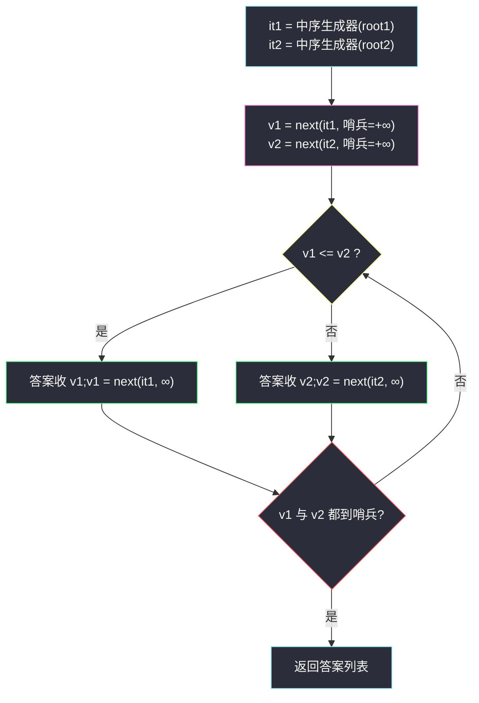

# 1305. 两棵二叉搜索树中的所有元素(All Elements in Two Binary Search Trees)

> 🔗 LeetCode 1305:https://leetcode.cn/problems/all-elements-in-two-binary-search-trees/
>
> 📚 灵茶题单小节:§2.9 二叉搜索树
>
> 同族文章:[#783 二叉搜索树节点最小距离](minimum-distance-between-bst-nodes.md)、[#530 二叉搜索树的最小绝对差](minimum-absolute-difference-in-bst.md)(中序有序族)、[#88 合并两个有序数组](https://leetcode.cn/problems/merge-sorted-array/)(归并的数组版)。

## 一、问题描述

给你 `root1` 和 `root2` 这两棵二叉搜索树,请你返回一个列表,其中包含**两棵树中的所有整数**并按**升序**排序。

**示例 1**

```text
输入:root1 = [2,1,4], root2 = [1,0,3]
输出:[0,1,1,2,3,4]
```

**示例 2**

```text
输入:root1 = [1,null,8], root2 = [8,1]
输出:[1,1,8,8]
```

> 数据范围:每棵树的节点数在 `[0, 5000]` 范围内,`-10⁵ <= Node.val <= 10⁵`。

**直观理解**:两棵 BST,每棵的中序遍历各自有序——"两段有序序列合并成一段",正是归并排序的合并步骤(merge)在树上的翻版。**值可以重复**(示例 1/2 各有双 `1`、双 `8`),归并时相等取谁都行。这是"BST = 有序结构"最直白的一次套用:先把"两棵树"翻译成"两条有序流",剩下的事归并早就写好了答案。

## 二、暴力解法

不利用任何有序性:两棵树各自随便遍历,把所有值倒进一个列表,整体排序。

```python
class Solution:
    def getAllElements(self, root1: Optional[TreeNode], root2: Optional[TreeNode]) -> List[int]:
        vals = []

        def collect(node):
            if node is None:
                return
            vals.append(node.val)              # 先序/后序都行,顺序无所谓
            collect(node.left)
            collect(node.right)

        collect(root1)
        collect(root2)
        return sorted(vals)
```

### 复杂度

- 时间:`O((m + n) log(m + n))`——收集 `O(m + n)`,`sorted` 排序占大头。`m, n ≤ 5000`,合计 10⁴ 个数,约 `10⁴ × 14 ≈ 1.4 × 10⁵` 次比较,轻松通过。
- 空间:`O(m + n)`。

能过,但把"两份现成的有序性"全部扔掉重排——数据范围稍一放大(比如每棵 `10⁶` 节点)就会吃紧。更本质的浪费在于:**排序所做的工作,树结构在建立时就已经付过费了**。

## 三、优化探索

### 观察 1:两棵 BST = 两条有序流

中序遍历 BST 得到严格递增序列——这条性质在 [#783](minimum-distance-between-bst-nodes.md) 有完整证明(左块最大值 < 根 < 右块最小值的递归展开)。于是:

```text
中序(root1) = a₁ < a₂ < … < aₘ
中序(root2) = b₁ < b₂ < … < bₙ
```

问题变成经典的**双路归并**:每次比较两路队头,小的出队进答案。相等时任取其一(相等值最终都会进答案,顺序无影响)。

### 观察 2:不必先物化数组——生成器边走边产

把中序遍历写成**生成器**,两棵树各自 `yield` 下一个值,归并循环里"谁小取谁、再向那棵树要下一个"。好处:

- 不用预先存两条完整数组,只活在"当前游标"上;
- 更接近问题的本质——我们需要的从来不是"两段数组",而是"下一个更小的元素"。

中序生成器用**显式栈**实现(迭代中序):栈里存放"从根一路向左压入的路径",`next` 时弹出栈顶、产出其值、再把它右子树的最左链压入——这正是 [#530](minimum-absolute-difference-in-bst.md) 非递归中序的同款机械。



### 观察 3:哨兵简化"流尽"判断

某棵树流尽后,比较逻辑仍要继续(另一路还有货)。给"流尽"返回一个 `+∞` 哨兵,统一比较分支——不再需要 `if it1 空 and it2 空` 的多重判断。值域上界 `10⁵`,哨兵用 `float('inf')` 绝无碰撞。

### 对照:三条路线

- 全收集 + `sorted`:暴力,`O((m+n) log(m+n))`;
- 两数组中序 + 双指针归并:`O(m + n)`,但要先各存一条数组;
- **双生成器 + 哨兵归并(本文)**:`O(m + n)`,惰性产出,只多耗两个栈。

### 循环不变量:为什么归并一定有序

归并循环的每一轮都在维持同一条不变量:**"答案列表是两路剩余元素的全局前缀,且自身升序"**。归纳:

- 初始:空列表,平凡成立;
- 保持:设两路剩余最小者为 `v1`、`v2`,则全局剩余最小者 = `min(v1, v2)`;循环体恰好取走它,追加后新答案仍是剩余元素的前缀、且末尾追加的值不小于之前末尾(升序保持)。

循环终止时(双哨兵),两路剩余为空,答案就是全部元素的全序——严谨性归档完毕。这条不变量同样适用于 [#88 合并两个有序数组](https://leetcode.cn/problems/merge-sorted-array/),是所有归并类题目的公共基石。

## 四、代码实现

```python
class Solution:
    def getAllElements(self, root1: Optional[TreeNode], root2: Optional[TreeNode]) -> List[int]:
        def inorder(root):
            """迭代中序生成器:每次产出下一个(最小的未访问)值"""
            stack, cur = [], root
            while stack or cur is not None:
                while cur is not None:          # 一路向左压栈
                    stack.append(cur)
                    cur = cur.left
                cur = stack.pop()               # 栈顶 = 当前最小
                yield cur.val
                cur = cur.right                 # 转向右子树
            # 生成器耗尽:后续 next 拿哨兵

        INF = float('inf')
        it1, it2 = inorder(root1), inorder(root2)
        v1 = next(it1, INF)                     # next 的第二参 = 耗尽时的缺省值
        v2 = next(it2, INF)
        ans = []
        while v1 < INF or v2 < INF:             # 只要还有一路未流尽
            if v1 <= v2:
                ans.append(v1)
                v1 = next(it1, INF)
            else:
                ans.append(v2)
                v2 = next(it2, INF)
        return ans
```

### 细节说明

- **`next(it, INF)` 的缺省值**:生成器耗尽时 `next` 抛 `StopIteration`,传第二参则安静返回缺省——这是把"流尽"翻译成哨兵的最省事写法,无需 try/except。
- **`v1 <= v2` 的等号**:相等时任取一路,两个等值最终相邻地进答案,与升序要求相容(本题允许重复值);写成 `<` 也正确,只是相等时先取 v2 一路。
- **迭代中序的栈语义**:任意时刻栈中节点自底向上构成"从某祖先一路向左"的路径,栈顶恒为"剩余未访问节点中的最小者"——这是"生成器按升序产出"的正确性来源,与 [#530](minimum-absolute-difference-in-bst.md) 的显式栈完全同构。
- **空树直接可用**:`root = None` 时生成器一次都不进循环,`next` 立刻拿到哨兵——边界零特判。
- **为什么合并后恰好有序**:归纳——每轮取走的都是"两路剩余最小者中的较小者",即全局剩余最小;序列严格不降(含等值相邻)。
- **不用 `heapq.merge`**:标准库 `heapq.merge(it1, it2)` 一行能完成归并,但面试场景建议手写——本题考的就是归并循环本身;工程代码里则推荐用标准库。
- **递归生成器版对照**(更短,深树慎用):

```python
def inorder(root):
    """递归中序生成器:三行写完,但挂起时保留整条递归链"""
    if root is None:
        return
    yield from inorder(root.left)
    yield root.val
    yield from inorder(root.right)
```

与显式栈版产出完全相同;区别只在挂起机制——递归版的"待续状态"存在调用栈里(深树爆栈风险),显式栈版存在列表里(可安全处理 `10⁴⁺` 节点)。两版对照着写一遍,对"生成器 = 可暂停的遍历"的理解会落地。

## 五、例子演示

**示例 1** `root1 = [2,1,4]`, `root2 = [1,0,3]` 端到端。

先看两棵树各自的中序流(生成器逐个产出的顺序):

```text
树1:      2            中序流: 1 → 2 → 4
         / 
        1   4

树2:      1            中序流: 0 → 1 → 3
         / \
        0   3
```

```mermaid
flowchart TD
    subgraph T1["root1 中序流"]
        A1["1"] --> A2["2"] --> A3["4"]
    end
    subgraph T2["root2 中序流"]
        B1["0"] --> B2["1"] --> B3["3"]
    end
    A1 -. "v1" .-> M{"v1 <= v2 ?"}
    B1 -. "v2" .-> M
    M -- "取较小者进答案" .-> ANS["答案: 0 1 1 2 3 4"]
    style A1 fill:#2b2d3a,stroke:#50fa7b,color:#f8f8f2
    style A2 fill:#2b2d3a,stroke:#50fa7b,color:#f8f8f2
    style A3 fill:#2b2d3a,stroke:#50fa7b,color:#f8f8f2
    style B1 fill:#2b2d3a,stroke:#f1fa8c,color:#f8f8f2
    style B2 fill:#2b2d3a,stroke:#f1fa8c,color:#f8f8f2
    style B3 fill:#2b2d3a,stroke:#f1fa8c,color:#f8f8f2
    style M fill:#2b2d3a,stroke:#ff5555,color:#f8f8f2
    style ANS fill:#1e1f29,stroke:#6272a4,color:#f8f8f2
```

两路初始 `v1 = 1`(树 1 的最小)、`v2 = 0`(树 2 的最小)。归并演化表:

| 轮次 | v1(树1) | v2(树2) | 比较 | 收进答案 | 推进 |
|---|---|---|---|---|---|
| 1 | 1 | **0** | `1 > 0` | 0 | 树2 → 1 |
| 2 | **1** | 1 | `1 <= 1` | 1 | 树1 → 2 |
| 3 | 2 | **1** | `2 > 1` | 1 | 树2 → 3 |
| 4 | **2** | 3 | `2 <= 3` | 2 | 树1 → 4 |
| 5 | 4 | **3** | `4 > 3` | 3 | 树2 → ∞(流尽) |
| 6 | **4** | ∞ | `4 <= ∞` | 4 | 树1 → ∞ |
| 7 | ∞ | ∞ | 双哨兵 | 停 | — |

答案 `[0,1,1,2,3,4]` ✅。第 2 轮展示相等处理:`v1 <= v2` 先取树 1 的 1,第 3 轮树 2 的 1 紧随其后,两个等值最终相邻。

**示例 2** `root1 = [1,null,8]`(只有右链,中序 `1,8`),`root2 = [8,1]`(中序 `1,8`):

| 轮次 | v1(树1) | v2(树2) | 收进 | 推进 |
|---|---|---|---|---|
| 1 | **1** | 1 | 1 | 树1 → 8 |
| 2 | 8 | **1** | 1 | 树2 → 8 |
| 3 | **8** | 8 | 8 | 树1 → ∞ |
| 4 | ∞ | **8** | 8 | 树2 → ∞ |

答案 `[1,1,8,8]` ✅——两棵树结构完全不同(右链 vs 左链),中序流却一模一样,"形状无关、中序说话"。

**边界用例速查**:

| 用例 | 输入 | 期望 | 考点 |
|---|---|---|---|
| 双空 | `[], []` | `[]` | 生成器立即耗尽,双哨兵直接停 |
| 单空 | `[2,1,4], []` | `[1,2,4]` | 一路哨兵,另一路独走 |
| 全负值 | `[-5,-10], [-3]` | `[-10,-5,-3]` | 值域含负,比较语义不变 |
| 等值交错 | `[1,1,1], [1,1]` | `[1,1,1,1,1]` | 重复值全部保留 |

**扩展思考:如果是 k 棵 BST 呢?** 双路比较 `v1 <= v2` 无法直接推广到 k 路——维护"k 路当前最小"需要一个小顶堆:每轮弹出堆顶(携带来源标记),向对应生成器要下一个值再入堆,总复杂度 `O((m+n) log k)`。这正是 [#23 合并 K 个升序链表](https://leetcode.cn/problems/merge-k-sorted-lists/)的套路:两路归并是 `k=2` 的特例(堆退化为一次比较)。把本文主解的 `if v1 <= v2` 看作"堆大小为 1 的退化弹堆",知识就串起来了。

### 常见错误清单

- **比较用 `<` 且漏想相等**:也能过(相等先取 v2),但若写成 `v1 < v2 取 v1,else 取 v2` 的不对称结构,改哨兵值时容易踩脏数据;统一 `<=` 最省心。
- **`next` 忘传缺省值**:生成器耗尽时抛 `StopIteration` 直接崩;缺省值就是哨兵机制的载体。
- **哨兵用 `10⁵`**:与值域上界相撞(等于上界的真实值会被当成"流尽");哨兵必须取值域外,`float('inf')` 永远安全。
- **递归中序写生成器再套归并**:递归生成器每次 `yield` 挂起整个递归链,深树 `10⁴` 时同样有栈深风险;显式栈版无此问题。

## 六、复杂度分析

- **时间:`O(m + n)`**——每个节点恰好被压栈/弹栈各一次,归并循环总轮数 `m + n`;对比暴力省掉 `log` 因子,数据范围放大后优势立现。
- **空间:`O(h₁ + h₂)`**——两个显式栈的峰值之和(答案列表不计入额外空间);两树各 `5000` 节点、最坏链形也只需 `10⁴` 栈容量,稳定。
- **量级感知**:本题规模下暴力 `≈ 1.4 × 10⁵` 次比较、归并 `= 10⁴` 次,两者都能过——所以本题的价值不在"能不能过",而在"有序结构怎么消费"。若把两棵树各放大到 `10⁶` 节点,`log` 因子就是 `2 × 10⁷` 对 `2 × 10⁶` 的差距;再进一步,若两棵树存在磁盘上不允许整体读入,生成器的惰性产出就是唯一解(流式归并,外排的基础件)。

## 七、对比总结

| 解法 | 时间 | 空间(额外) | 遍历方式 | 备注 |
|---|---|---|---|---|
| 全收集 + `sorted`(暴力) | `O((m+n) log(m+n))` | `O(m+n)` | 任意序 | 简单粗暴,丢弃有序性 |
| 中序物化数组 + 双指针 | `O(m+n)` | `O(m+n)` | 中序 | 常见题解写法 |
| **双生成器 + 哨兵归并(本文)** | `O(m+n)` | `O(h₁+h₂)` | 迭代中序 | 惰性、省数组 |

| 易错点 | 说明 |
|---|---|
| 哨兵与值域相撞 | 哨兵必须在值域之外,`float('inf')` 一劳永逸 |
| 相等值的处理 | 重复值合法,取谁都是升序;别手滑写去重 |
| 把两树先合成一棵再中序 | 合并两棵 BST 本身是 `O(m+n)` 但代码量翻倍,绕远路 |
| 中序生成器写成先序 | 先序产出无序流,归并的前提直接崩塌;产出序 = 中序序,别被"随便遍历"的暴力解带偏 |
| `while v1 < INF or v2 < INF` 写成 `and` | 一路流尽就提前停,另一路的尾部全部丢失;双哨兵是唯一停止条件 |

**一句话**:看到"多棵 BST 求全局有序",翻译成"多条有序流归并"——**BST 的中序就是排好序的流,归并是处理多条流的万能接口**。

## 八、举一反三

- [#783 二叉搜索树节点最小距离](minimum-distance-between-bst-nodes.md) / [#530 二叉搜索树的最小绝对差](minimum-absolute-difference-in-bst.md)(站内姊妹篇):"中序 = 有序"的三部曲前两作——最小差只看相邻,本文看全局合并。
- [#88 合并两个有序数组](https://leetcode.cn/problems/merge-sorted-array/):归并的数组版(且要求原地、从后往前),与本文互为镜像:那边怕覆盖,这边怕哨兵。
- [#4 寻找两个正序数组的中位数](https://leetcode.cn/problems/median-of-two-sorted-arrays/):归并思想进阶——不求全量合并,只要第 k 小,二分每次砍掉一半。
- [#173 二叉搜索树迭代器](https://leetcode.cn/problems/binary-tree-iterator/):本文 `inorder` 生成器的"类封装"版,`next()/hasNext()` 接口,同样是显式栈中序。
- [#2476 二叉搜索树最近节点查询](closest-nodes-queries-in-a-binary-search-tree.md)(站内):单树中序展开 + 二分查询——与本文"多树中序 + 归并"合看,凑齐"BST 序列化"的两种消费方式。
- [#653 两数之和 IV - 输入二叉搜索树](https://leetcode.cn/problems/two-sum-iv-input-is-a-bst/):中序流上的双指针找目标和——有序流的另一消费姿势;与本文归并、#2476 二分并列第三种。
- [#230 二叉搜索树中第 K 小的元素](https://leetcode.cn/problems/kth-smallest-element-in-a-bst/):中序生成器 `next` k 次師停——本文生成器的最小改动应用。

> **框架总结**:**BST 的中序遍历 = 一条按需产出的有序流**。多条流要合并用归并,流上要第 k 小用二分,流上要相邻统计用游标——#783、#1305、#4、#2476 一脉相承。
