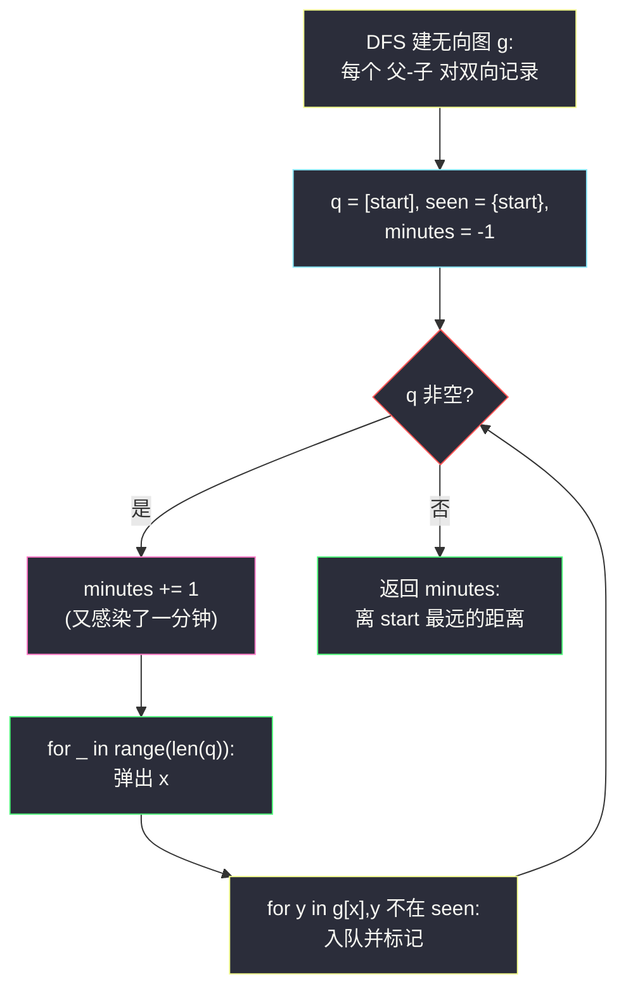
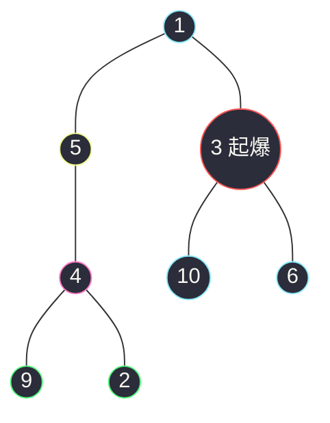

# 2385. 感染二叉树需要的总时间(Amount of Time for Binary Tree to Be Infected)

> 🔗 LeetCode 2385:https://leetcode.cn/problems/amount-of-time-for-binary-tree-to-be-infected/
>
> 📚 灵茶题单小节:§「无根树:建图 + 从源点 BFS」练习(树的偏心距)

## 一、问题描述

给你一棵二叉树的根节点 `root`,二叉树中节点的值**互不相同**。另给你一个整数 `start`。

在第 0 分钟,**感染**将会从值为 `start` 的节点开始爆发。每分钟,如果节点满足以下全部条件,就会被感染:

- 节点此前还没有被感染;
- 节点与一个已感染节点**相邻**。

返回感染整棵树需要的**分钟数**。

**示例 1**

```text
输入:root = [1,5,3,null,4,10,6,9,2], start = 3
输出:4
解释:节点按以下过程被感染:
- 第 0 分钟:节点 3
- 第 1 分钟:节点 1、10、6
- 第 2 分钟:节点 5
- 第 3 分钟:节点 4
- 第 4 分钟:节点 9 和 2
```

**示例 2**

```text
输入:root = [1], start = 1
输出:0
解释:第 0 分钟,树中唯一一个节点处于感染状态。
```

> 数据范围:树中节点的数目在范围 `[1, 10^5]` 内;`1 <= Node.val <= 10^5`;每个节点的值互不相同;树中必定存在值为 `start` 的节点。

**直观理解**

"相邻"包括**父节点**——感染是沿着无向边双向扩散的,而二叉树的指针只有父到子这一个方向。一旦把"父指针缺失"补上,二叉树就变回一棵普通的**无向树**,问题显出原形:第 `t` 分钟感染的,恰是到 `start` 距离为 `t` 的节点。所以答案就是——**离 start 最远的那个节点,它到 start 的距离**。图论里这个量有个名字:以 `start` 为中心的**偏心距**。

## 二、暴力解法

完全模拟:每分钟扫一遍全部节点,凡与感染者相邻且未感染者,标记为下一分钟感染,循环到全员感染。

```python
class Solution:
    def amountOfTime(self, root: Optional[TreeNode], start: int) -> int:
        nodes = {}                                   # 值 → 节点(值互不相同)
        parent = {}                                  # 值 → 父值

        def collect(node: Optional[TreeNode], fa: int) -> None:
            if node is None:
                return
            nodes[node.val] = node
            if fa >= 0:
                parent[node.val] = fa
            collect(node.left, node.val)
            collect(node.right, node.val)

        collect(root, -1)

        def infected_neighbors(v: int) -> List[int]:
            node = nodes[v]
            res = []
            if node.left:
                res.append(node.left.val)            # 左孩子
            if node.right:
                res.append(node.right.val)           # 右孩子
            if v in parent:
                res.append(parent[v])                # 父节点
            return res

        sick = {start}
        minutes = 0
        while len(sick) < len(nodes):                # 还有健康节点
            minutes += 1
            spread = []
            for v in sick:                           # 扫全部感染者找邻居
                for nb in infected_neighbors(v):
                    if nb not in sick:
                        spread.append(nb)
            sick.update(spread)                      # 同一分钟新增
        return minutes
```

### 复杂度

- 时间:`O(ans * n)`——每分钟全扫感染者与邻居,最坏(链形树,`start` 在端点)`ans = n - 1`,总计 `O(n^2)`,`n = 10^5` 时约百亿次操作,超时。
- 空间:`O(n)`。

它的语义最直白(逐分钟复现感染过程),是对拍的最佳基准;但"每分钟重新扫一遍已感染者"是纯粹的重复劳动——大部分感染者早就没有健康邻居了。

## 三、优化探索

### 观察 1:感染时刻 = 到 start 的距离

树中任意两点路径唯一。感染从 `start` 出发,沿路径逐节点推进,`v` 被感染当且仅当路径上所有前驱都已感染——所以 `v` 的感染时刻**恰是** `dist(start, v)`。于是"感染整棵树"的时间 = `max_v dist(start, v)`,与模拟过程殊途同归,但把"分钟"坍缩成了"距离"。

### 观察 2:补上父指针,二叉树变无向图

`TreeNode` 只有 `left`/`right`,感染却要往上走。两种补法:

- **建邻接表**:一次 DFS,每遇到非空的 `(父, 子)` 对就双向记录,得到无向图 `g`;
- **记 parent 映射**:只存 `孩子值 → 父值`,查邻居时左、右、父三处拼。

建邻接表多花一倍存储,但后续访问统一(不用分指针与映射两套);本文主解用邻接表。

### 观察 3:从 start 做一次 BFS,层号即感染时刻

BFS 按层扩散,第 `t` 层恰是距离 `t` 的节点——**感染过程与 BFS 逐层扩展一一对应**。最晚被弹出的层号就是答案。这不需要显式记距离:BFS 结束时最后处理的层数即最大距离。



### 与树直径的缘分

"离某个点最远的距离"是偏心距;"任意两点间最长路径"是直径。经典结论:**直径的两端点中至少一个是最远点候选**——对任意 `start`,`max_v dist(start, v)` 必在直径端点处取到。所以本题也可先两次 BFS 求直径端点 `u, v`,答案即 `max(dist(start,u), dist(start,v))`,三次 BFS 同为 `O(n)`。这一视角把单点查询升级成了"任意 start 都能 `O(1)` 换算"的结构化理解,树直径专篇(本站后续篇目)会展开。

### 换根 DP 视角(预告)

若题目改为"对每个可能的 start 都输出感染时间",一次 BFS 不够用——那就要换根 DP:`down[x]`(x 子树内最深)与 `up[x]`(经父侧最远)拼出任意起点的偏心距。本题只查一个 start,一次 BFS 足矣;第八章的延伸题里给出这族问题的入口。

## 四、代码实现

```python
class Solution:
    def amountOfTime(self, root: Optional[TreeNode], start: int) -> int:
        sys.setrecursionlimit(2 * 10 ** 5 + 10)      # 链形树深度可达 n
        g = defaultdict(list)

        def build(node: Optional[TreeNode], fa: Optional[TreeNode]) -> None:
            if node is None:
                return
            if fa is not None:                       # 无向边双向记录
                g[node.val].append(fa.val)
                g[fa.val].append(node.val)
            build(node.left, node)
            build(node.right, node)

        build(root, None)

        q = deque([start])
        seen = {start}                               # 已感染(已访问)集合
        minutes = -1                                 # 层号从 0 计
        while q:
            minutes += 1                             # 新的一分钟(新的一层)
            for _ in range(len(q)):                  # 当前分钟(层)快照
                x = q.popleft()
                for y in g[x]:                       # 左、右、父统一为邻居
                    if y not in seen:
                        seen.add(y)
                        q.append(y)
        return minutes
```

**细节说明**

- **`minutes` 初始 −1**:第一轮 `while` 处理的是 `start` 自己(第 0 分钟),`+= 1` 后归零;单节点树(示例 2)一轮结束,返回 0,语义精确。
- **`seen` 必不可少**:无向图 BFS 不判重会绕回已感染节点,队列爆炸;判入队时标记(而非出队时)避免同点重复入队。
- **`build` 传 `fa` 参数而非全局映射**:邻接表天然对称,父子边只在"子被访问"时记录一次。
- **递归深度**:`10^5` 链形树会溢出默认栈,抬高上限;也可以用显式栈收集 `(节点, 父)` 序列再建边,逻辑不变。
- **为什么 BFS 而非 DFS**:两者都 `O(n)`,但 BFS 的"层 = 分钟"与感染过程同构,解释成本最低;DFS 求最远也行(第七章对照),只是要额外 `max` 维护。

## 五、例子演示

用**示例 1** `root = [1,5,3,null,4,10,6,9,2], start = 3` 端到端走一遍。树结构:1 的左子 5、右子 3;5 的右子 4;4 的左子 9、右子 2;3 的左子 10、右子 6。



注意 mermaid 里画的是**无向边**(`---`)——感染可以双向传播,这正是建图后 `g` 的视角。

BFS 逐层推进(与官方感染时刻表完全同步):

| 轮次(分钟) | 进入时队列 | 弹出并感染 | 新入队(下一分钟感染) |
|---|---|---|---|
| 0 | `[3]` | 3 | 1(父)、10、6(左右孩子) |
| 1 | `[1,10,6]` | 1、10、6 | 5(1 的左子) |
| 2 | `[5]` | 5 | 4(5 的右子) |
| 3 | `[4]` | 4 | 9、2(4 的孩子) |
| 4 | `[9,2]` | 9、2 | 无(全员感染) |
| — | `[]` | 循环结束 | — |

`minutes` 最终为 **4**,与官方输出一致。对照距离视角:`dist(3, 9) = 3→1→5→4→9` 共 4 条边,是最远的节点——答案就是这条最长路径的长度。

对照**示例 2** `root = [1], start = 1`:建图后 `g` 为空;BFS 第一轮弹 1、无邻居,`minutes = 0`,一轮结束返回 0 ✅。

### 常见错误清单

- **只往孩子方向感染**:漏建父边,`start` 恰为根时侥幸正确,`start` 在深处时全树感染不完整——本题最典型的错误,示例 1 会错报 2(只感染 3 的子树侧)。
- **`minutes` 初始化为 0**:单节点树返回 1,全树都已感染却多算一分钟;从 −1 起步配合"先加后处理"才能对齐"第 0 分钟起爆"。
- **出队时才标记 seen**:同一节点被两个感染者同时发现,重复入队,层计数虚高(本题答案恰不会错,但队列规模翻倍,极端时退化)。
- **值做键却不检查互不相同**:题目保证值唯一;若在有重复值的树上跑,`g` 与 `seen` 全部串味——这是能用"值"当身份的前提,见第八章延伸讨论。
- **递归建图忘抬上限**:链形树 `10^5` 深度,默认递归栈直接溢出。

### 边界用例速查

| 用例 | 输入要点 | 期望 | 考点 |
|---|---|---|---|
| 单节点 | `root=[1], start=1` | 0 | 层号从 −1 起步 |
| 根起爆 | start = 根值 | 树高 | 退化层序遍历 |
| 叶起爆 | start = 某叶 | 该叶的偏心距 | 父边必补 |
| 链形树 | 全树一条链 | 链长 − max(两端深度) | 递归深度 + 上界 |
| 满二叉树 | start = 根 | ⌈log2(n+1)⌉ − 1 | 对数级答案 |

## 六、复杂度分析

- 时间:`O(n)`。建图 DFS 每节点一次、每边记录两次;BFS 每节点入队出队各一次、每条边两端各扫一次。
- 空间:`O(n)`。邻接表 `2(n-1)` 条记录、`seen` 与队列各 `O(n)`、递归栈最坏树高。

### 正确性问答

**问:BFS 的层号为什么恰好等于感染分钟?** 归纳:第 0 层是 `start`(第 0 分钟感染);假设第 `t` 层都在第 `t` 分钟感染,则与它们相邻的未感染点恰在第 `t + 1` 分钟感染,而 BFS 第 `t + 1` 层恰是"距离 `t+1` 的点"= 第 `t` 层的未访问邻居。两层归纳闭环。

**问:start 是根节点时答案是什么?** 树高(根到最深叶的距离)——感染只能向下扩散,BFS 退化为普通层序遍历,层号即深度。这是很好的 sanity check:手工构造深树验证。

**问:能否不建图,直接在树上 DFS 求"到 start 的距离"最大值?** 可以但要小心:一次 DFS 从根出发,任一节点 `x` 到 `start` 的路径可能"先上后下"(经过 LCA),单次自顶向下传深度不够,需返回 `(子树内到 start 的距离, 子树内到任一点最远距离)` 二元组后序合并——可行但易错,建图 BFS 把"上下行"统一成邻接关系,正确性更便宜。

**问:建邻接表和记 parent 映射,实测谁更快?** 渐近相同。邻接表访问统一(`for y in g[x]`),parent 映射查邻居要拼三处(左、右、父)但省一半存储;Python 下字典操作是主要开销,两者都在同一常数级别,按可读性选即可。

## 七、对比总结

| 解法 | 时间 | 空间 | 思路 | 备注 |
|---|---|---|---|---|
| 逐分钟模拟(暴力) | `O(ans * n)` | `O(n)` | 每分钟扫感染者找邻居 | 语义基准,对拍专用 |
| 建图 + BFS(本文) | `O(n)` | `O(n)` | 层 = 分钟,取最大层号 | 主解;与感染过程同构 |
| 建图 + DFS 求最远 | `O(n)` | `O(n)` | 递归维护 max 距离 | 与 BFS 等价,少队列多递归 |
| 两次 BFS 直径端点 | `O(n)` | `O(n)` | 答案 = `max(dist(start,u), dist(start,v))` | 结构化理解,直径视角 |

一句话:**补上父边,感染就是 BFS 逐层扩散;答案就是离起爆点最远的距离**。

从工程视角看,本题也是"把受限数据结构转成通用图模型"的教科书案例:指针只能向下,就把缺失的方向补回来,很多"二叉树里的图论题"都靠这一步破题。

### 常见问答

**问:答案的上界是多少?** `n - 1`:链形树且 `start` 在端点,感染沿链逐个推进。下界是 0(单节点树)。

**问:如果把"感染"改成"每分钟感染距离 ≤ 2 的节点"呢?** BFS 每层跨两步即可(层内扩展时走两层),骨架不变——"层 = 时间"的模型可按步长缩放。

## 八、举一反三

- [863. 二叉树中所有距离为 K 的结点](https://leetcode.cn/problems/all-nodes-distance-k-in-binary-tree/):同款"建图 + 从目标点 BFS",只是输出指定层而非最大层号——做它能加深"父边必补"的肌肉记忆。
- [543. 二叉树的直径](https://leetcode.cn/problems/diameter-of-binary-tree/):直径视角的入门版,后序合并左右深度;与本文"偏心距"互为表里。
- [1245. 树的直径](https://leetcode.cn/problems/tree-diameter/):无向树两次 BFS/DFS 求直径,正是三章"直径端点"论断的完整版(本站树直径篇预告)。
- [310. 最小高度树](https://leetcode.cn/problems/minimum-height-trees/):同样是"无向树 + 全局最远距离"的结构问题,中心与偏心距是一对孪生概念。
- 本站延伸阅读:[收集树中苹果的最少时间](./minimum-time-to-collect-all-apples-in-a-tree.md)——同样"二叉树/无向树定根后自底向上或从源点向外"的两姐妹:一个后序向父汇报、一个从源点向外 BFS;[最小高度树](./minimum-height-trees.md)的剥叶则是从外向内收缩,三篇合成"树上信息流"的三个方向。
