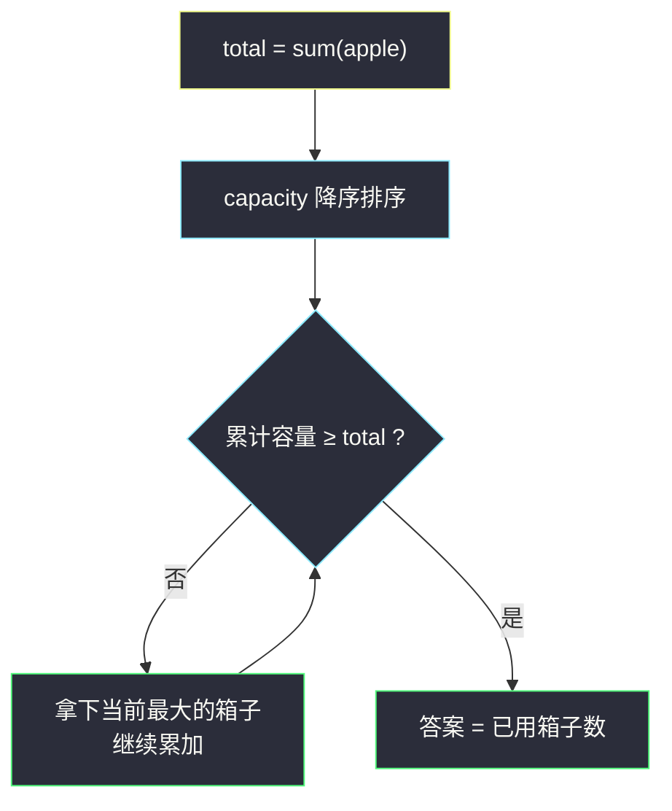
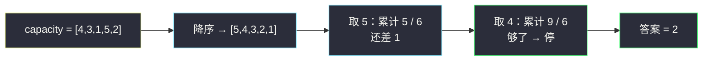

# 重新分装苹果（排序贪心 · 从最大开始）

## 一、问题描述

给你一个长度为 `n` 的数组 `apple` 和一个长度为 `m` 的数组 `capacity`：`apple[i]` 表示第 `i` 个包裹里的苹果数，`capacity[j]` 表示第 `j` 个箱子的容量。

现在要把所有包裹的苹果**重新分装**：苹果可以拆散、任意组合地装进箱子，唯一的限制是每个箱子装入的苹果总数不能超过它的容量。数据保证一定能全部装下。

返回装下全部苹果需要的**最少箱子数**。

> 🔗 LeetCode 3074：https://leetcode.cn/problems/apple-redistribution-into-boxes/
>
> 数据范围：`1 <= n, m <= 50`，`1 <= apple[i], capacity[j] <= 10^4`，苹果总量不超过箱子总容量。

**示例 1**

```
输入：apple = [1,3,2], capacity = [4,3,1,5,2]
输出：2
解释：苹果共 1+3+2 = 6 个，选容量 5 和 4 的两个箱子（如 5+1）即可装完。
```

**示例 2**

```
输入：apple = [5,5,5], capacity = [2,4,2,7]
输出：4
解释：苹果共 15 个，全部箱子的容量和恰好为 2+4+2+7 = 15，一个都不能少。
```

**直观理解**

苹果怎么分组**完全不重要**——既然可以任意拆装，`apple` 里只剩一个数字有意义：**总量** `sum(apple)`。问题立刻退化为：

> 从 `capacity` 中选**最少个数**的箱子，使容量之和 ≥ 苹果总量。

要个数最少，每个箱子就得尽量能装——「从最小/最大开始贪心」里标准的**从最大开始**。

---

## 二、暴力解法

枚举箱子集合的所有子集，在「容量和 ≥ 苹果总量」的子集里挑元素个数最小的：

```python
class Solution:
    def minimumBoxes(self, apple: List[int], capacity: List[int]) -> int:
        total, m = sum(apple), len(capacity)
        ans = m
        for mask in range(1 << m):          # 枚举所有子集
            s = cnt = 0
            for j in range(m):
                if mask >> j & 1:
                    s += capacity[j]
                    cnt += 1
            if s >= total:
                ans = min(ans, cnt)
        return ans
```

### 复杂度

- **时间**：`O(2^m · m)`，`m = 50` 时子集数约 `10^15`，完全不可行；只有 `m ≤ 20` 出头的数据才能枚举。
- **空间**：`O(1)`。

### 🔴 瓶颈在哪里

每个箱子只有「用 / 不用」两种状态，且箱子的价值只有**容量大小**一个维度。当个体的收益只分大小时，排序贪心几乎总是一击致命——不需要枚举组合。

---

## 三、优化探索（核心章节）

> 📚 本题在灵茶题单中属于 **§1.1 从最小/最大开始贪心**（贪心① A 路）：题目只关心「用多少个箱子」，那就把最值——最大容量的箱子——排在前面优先使用。

### 3.1 观察特征

| 特征 | 说明 |
|------|------|
| 苹果可任意拆装 | 分组方案无关紧要，只剩总量一个约束 |
| 目标是最少**个数** | 每个箱子的「价值」= 容量，越大越好 |
| `m ≤ 50`，值 ≤ 10^4 | 排序 + 线性扫描绰绰有余 |

### 3.2 贪心策略

1. 求 `total = sum(apple)`；
2. `capacity` **降序**排序；
3. 从头累加容量，第一次达到 `total` 就停，答案 = 已用的箱子个数。



### 3.3 为什么是对的（交换论证）

设最优解用了 `k` 个箱子，容量集合为 `S`。取「**容量最大的 k 个箱子**」组成的集合 `T`：逐个对应比较可得 `sum(T) ≥ sum(S) ≥ total`，所以 `T` 同样装得下——即「按容量从大到小取前 k 个」一定可行，贪心会在第 `k` 个（或更早）停下。

反过来，贪心本身是一个合法方案，用的个数不可能少于最优值。两个方向一夹：**贪心 = 最优**。

换个角度记：个数最少 ⟺ 平均每个箱子装得最多 ⟺ 优先挑最大的。「从最大开始」在覆盖总量类问题里几乎总是首选。

### 3.4 一句话核心

> **总量是唯一的约束，个数最少就优先拿最大的：排序、累加、够即停。**

---

## 四、代码实现

### Python（主解）

```python
class Solution:
    def minimumBoxes(self, apple: List[int], capacity: List[int]) -> int:
        total = sum(apple)
        capacity.sort(reverse=True)     # 从最大开始
        used = 0
        for c in capacity:
            total -= c                  # 当前最大箱子装进来
            used += 1
            if total <= 0:              # 装完了
                break
        return used
```

**变量含义**

| 变量 | 含义 |
|------|------|
| `total` | 剩余待装的苹果数，随装箱递减 |
| `used` | 已启用的箱子数 |
| `c` | 当前容量最大的剩余箱子 |

**循环不变式**：每轮结束时，`used` 个**最大**的箱子共装下 `sum(前 used 个容量)` 个苹果，`total` 是剩余量；而前 `used - 1` 个箱子不够装（否则上一轮就停了），所以 `used` 是「从最大开始取」意义下的最小个数。

### Java（可选对照）

```java
class Solution {
    public int minimumBoxes(int[] apple, int[] capacity) {
        long total = 0;
        for (int a : apple) total += a;
        Arrays.sort(capacity);                    // 升序
        int used = 0;
        for (int i = capacity.length - 1; i >= 0 && total > 0; i--) {
            total -= capacity[i];                 // 从最大开始拿
            used++;
        }
        return used;
    }
}
```

约束 `m ≤ 50`、值 ≤ 10^4，`int` 不会溢出，`long` 只是习惯性保险。

---

## 五、具体例子演示

以示例 1 端到端走一遍：`apple = [1,3,2]`，总量 `6`；`capacity = [4,3,1,5,2]` 降序排序为 `[5,4,3,2,1]`。

**排序后每一步的选择过程**

| 步 | 当前候选（剩余最大） | 是否启用 | 已累计容量 | 剩余待装苹果 |
|----|---------------------|---------|-----------|--------------|
| 1 | 5 | ✅ 启用 | 5 | 6 − 5 = 1 > 0，继续 |
| 2 | 4 | ✅ 启用 | 9 | 1 − 4 ≤ 0，**停止** |

答案：**2** 个箱子。实际装箱方案可以是：容量 5 的箱子装 5 个，容量 4 的箱子装剩下的 1 个。

**示例 2 对照**：`apple = [5,5,5]`（总量 15），`capacity` 降序 `[7,4,2,2]`：

| 步 | 当前候选 | 已累计容量 | 剩余待装 |
|----|---------|-----------|---------|
| 1 | 7 | 7 | 8 |
| 2 | 4 | 11 | 4 |
| 3 | 2 | 13 | 2 |
| 4 | 2 | 15 | 0 ✅ 停止 |

答案 **4**——总容量恰好卡满，一个箱子都省不掉。



---

## 六、复杂度分析

| 方法 | 时间 | 空间 | 说明 |
|------|------|------|------|
| 子集枚举（暴力） | `O(2^m · m)` | `O(1)` | `m = 50` 天文数字 |
| 排序贪心（主解） | `O(n + m log m)` | `O(1)` | 求和 + 排序 + 线性扫描 |

Python 的 `sort` 与 Java 的 `Arrays.sort`（基本类型双轴快排）都是原地排序，不额外开数组。

---

## 七、对比总结

**本题是「从最大开始贪心」的零门槛入门**：约束只有总量、个体只有大小、目标只有个数——三个「只有」凑齐，排序贪心就是标准答案。

**同类题的共同骨架**

| 题面要素 | 本题 | 通用套路 |
|----------|------|----------|
| 约束 | 容量和 ≥ 苹果总量 | 满足一个总量/阈值 |
| 个体 | 箱子只有容量一个属性 | 收益只分大小 |
| 目标 | 箱子个数最少 | 从最大的开始拿，够即停 |

**易错点**

1. 别去纠结「苹果怎么分组」——苹果可拆可合，怎么装都行，想多了浪费时间；
2. Python 升序排序忘了 `reverse=True`（Java 忘了从尾部开始拿），会得出「全用」的错解；
3. 停止条件写成 `total == 0` 会漏掉「累计容量超过剩余」的常见情形，必须用 `<= 0` 判断。

**模板（从最大开始，Python）**

```python
need = sum(apple)
used = 0
for c in sorted(capacity, reverse=True):
    used += 1
    need -= c
    if need <= 0:
        break
# used 即答案
```

---

## 八、举一反三

| 题目 | 关系 |
|------|------|
| [2279. 装满石头的背包的最大数量](https://leetcode.cn/problems/maximum-bags-with-full-capacity-of-rocks/) | 镜像题：预算固定、求「装满的背包最多」，排序后从最小缺口开始补 |
| [1710. 卡车上的最大单元数](https://leetcode.cn/problems/maximum-units-on-a-truck/) | 同款「从最大开始」：按每箱单元数降序装车，直到卡车装满 |
| [1509. 三次操作后最大值与最小值的最小差](https://leetcode.cn/problems/minimum-difference-between-largest-and-smallest-value-in-three-moves/) | 同属灵茶 §1.1 的姊妹题，见同目录 `minimum-difference-between-largest-and-smallest-value-in-three-moves.md`：排序后从两端枚举 |
| [1005. K 次取反后最大化的数组和](https://leetcode.cn/problems/maximize-sum-of-array-after-k-negations/) | 「从最小开始」的另一面：优先翻绝对值最大的负数 |
| [455. 分发饼干](https://leetcode.cn/problems/assign-cookies/) | 排序 + 配对的入场版，通往 §1.2/§1.3 的配对贪心 |

**思想迁移**

- 看到目标是「**最少个数 / 最多收益**」且个体收益只分大小，先问自己：排序后从哪一端开始拿？
- 覆盖总量类：**降序累加、够即停**；预算花销类：**升序累加、超即停**。
- 口诀：**「拆装只看总量，选箱专挑最大；排序加累加，够数就收工。」**
