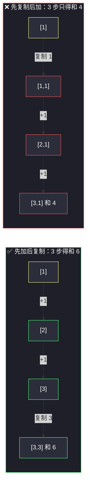
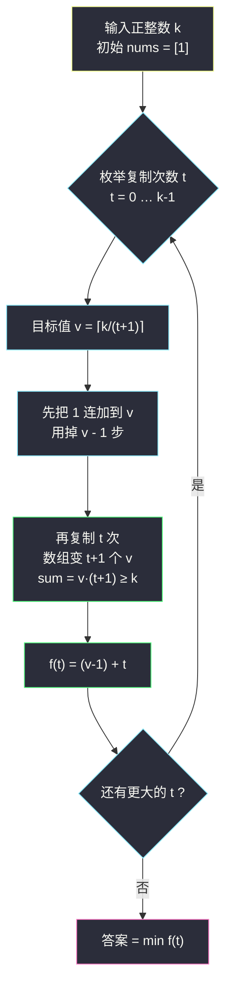

# 执行操作使数组元素之和大于等于 K（枚举复制次数 · 先加后复制的交换论证）

## 一、问题描述

给你一个**正整数** `k`。最初，你有一个数组 `nums = [1]`。

你可以对数组执行以下操作**任意次数**（可能为零），顺序任意：

1. 选择数组中的**任何一个元素**，将它的值**增加 1**；
2. **复制**数组中的任何一个元素，并将它**附加到数组的末尾**。

返回使得最终数组元素之**和**大于或等于 `k` 所需的**最少**操作次数。

> 🔗 LeetCode 3091：https://leetcode.cn/problems/apply-operations-to-make-sum-of-array-greater-than-or-equal-to-k/
>
> 数据范围：`1 <= k <= 10^5`。

**示例 1**

```
输入：k = 11
输出：5
解释：把元素 [1] 连加三次得到 [4]；再复制两次得到 [4,4,4]。
和 = 12 >= 11，总操作 3 + 2 = 5。
```

**示例 2**

```
输入：k = 1
输出：0      // 初始和已经 >= 1
```

**直观理解**

两种操作的成长曲线完全不同：`+1` 是**线性**增长——每花一步，总和只多 1；而「复制」是**放大器**——它把某个元素已经积累的成果原样翻一份。既然复制能放大成果，那么直觉上应当**先把一个元素养肥，再疯狂复制它**：花 3 步养出 `4`，复制 2 步就变成 12，摊下来每步平均增长 2.4；而纯加法每步只增长 1。问题只是「养到多肥、复制几次」的组合里哪个性价比最高——枚举量极小，这正是灵茶题单 §4.1「基础数学贪心：分类讨论 + 枚举量小的量」的典型形态。

---

## 二、暴力解法

最老实的做法是把每一种操作序列都搜出来：数组内容只关心**多重集合**（元素可重、无序），用「排序后的元组」做状态做 BFS，每层扩展「对每个不同值 +1」和「对每个不同值复制」两类后继，首次到达 `sum >= k` 的层数就是答案：

```python
from collections import deque

def min_operations_brute(k: int) -> int:
    """BFS 模拟所有操作序列，仅 k 很小时可跑（对拍用）。"""
    if 1 >= k:
        return 0
    start = (1,)
    q = deque([(start, 0)])
    seen = {start}
    while q:
        arr, step = q.popleft()
        for v in set(arr):                      # 对每个不同值
            inc = list(arr)                      # 操作 1：一个 v 变 v+1
            inc[inc.index(v)] = v + 1
            dup = list(arr)                      # 操作 2：复制一个 v（基于原数组）
            dup.append(v)
            for s in (tuple(sorted(inc)), tuple(sorted(dup))):
                if sum(s) >= k:
                    return step + 1
                if s not in seen:               # 去重
                    seen.add(s)
                    q.append((s, step + 1))
    return -1
```

### 复杂度

- **时间**：和小于 `k` 的多重集合数量指数级增长，`k = 11` 时尚可对拍，`k = 10^5` 完全不可行。
- **空间**：同为指数级（`seen` 集合）。

### 🔴 瓶颈在哪里

BFS 把「每一步选哪个元素动手」都当成不同的路，但题目**只关心最终的和**。操作的先后顺序里藏着巨大的结构性冗余——比如「先 +1 再复制」与「先复制再 +1」的代价相同，收益却差一倍。先把这个顺序结构想清楚，搜索空间就会塌缩成一个两重循环。

---

## 三、优化探索（核心章节）

> 📚 本题在灵茶题单中属于 **§4.1 基础（数学贪心：分类讨论 + 枚举量小的量）**。模板要点：**不要搜索操作序列，而是刻画「最优解长什么样」，再枚举那个量纲很小的自由变量**（本题 = 复制次数 `t`，最多 `k` 种取值）。

### 3.1 交换论证：所有 +1 都应该放在所有复制之前

> 📌 **引理**：存在一个最优方案，其全部 `+1` 操作都发生在全部复制操作之前。

设某个最优方案里，一次 `+1` 出现在某次复制**之后**。注意 `+1` 的效果是给「一个元素」加 1，而复制会把被复制元素的当前值**原样带走**——把这次 `+1` 移动到所有复制之前、作用于初始元素 `[1]` 上，那么后续每一次复制都会多带走这 1，最终总和不减（它从「只给一个副本 +1」变成「给之后每一个副本 +1」）。逐个把 `+1` 前移，代价不变、总和不减，引理得证。

于是最优解可以被刻画成两个参数：

- 加法次数 `a`（先把 `[1]` 养成 `[1 + a]`）；
- 复制次数 `t`（把 `[1 + a]` 复制成 `t + 1` 个相同的值）。

最终数组为 `t + 1` 个 `v`（其中 `v = 1 + a`），总和恰为：

```
sum = (1 + a) * (t + 1)
```

「中途再 +1」的方案不会更好——那 1 只进了一个副本，不如提前放进「母版」让所有副本共享。用一张图直观看两种时序的差别（同样 3 步）：



同样的操作步数，前者的每一次 `+1` 被 2 个副本共享，后者只能落在一个副本上——时序即收益。

### 3.2 固定 t：一次除法算出最少加法次数

固定复制次数 `t`（最终长度 `t + 1`），要求 `(1 + a) * (t + 1) >= k`，即：

```
1 + a >= ⌈k / (t + 1)⌉   →   a_min = ⌈k / (t + 1)⌉ - 1
```

利用恒等式 `⌈p/q⌉ - 1 = ⌊(p-1)/q⌋`（`p >= 1`），加法次数一步算出：

```
a_min = ⌊(k - 1) / (t + 1)⌋
```

该方案的代价为 `f(t) = t + ⌊(k - 1) / (t + 1)⌋`。这一步把内层的「逐个试加法」压成了 `O(1)`，相当于把 BFS 的整棵子树折叠成一行公式。



### 3.3 为什么「每步选收益最大的操作」是错的

一个诱人的在线贪心是：每一步都执行「使当前和增长最多」的操作（能复制就复制最大的）。它在 `k = 11` 上会走成：`[1] → 复制 → [1,1](和 2) → 复制 → [1,1,1](和 3) → ...`，一路只复制，直到 `k` 个 1 才凑够 `k - 1` 步——比最优的 5 步差了近一倍。原因在于复制在**当下**的收益是 `max`（看起来大），但它把「未来的加法收益」也锁定在了低基数上；`+1` 当下收益只有 1，却抬高了之后每一次复制的基数。这是典型的「局部收益无法刻画全局结构」——正确的打开方式不是模拟过程，而是 §3.1 那样先证明**最优解必然长成某种规范形态**，再在规范形态的参数空间里枚举。

（BFS 暴力的价值正在于此：拿 `min_operations_brute` 与公式 `t + ⌊(k-1)/(t+1)⌋` 对拍 `k = 1..20`，全部一致，公式有了实证背书。）

### 3.4 枚举上界：t 最多到 k-1，实际上 O(√k) 就够

- `t = k - 1`：一路复制不加，`k` 个 1 的和恰为 `k`，代价 `k - 1`；`t >= k` 时 `f(t) >= t >= k > k - 1` 必劣，故 `t ∈ [0, k-1]` 封顶，整体 `O(k)` 已通过。
- 更进一步：取 `t0 ≈ √k` 时 `f(t0) <= √k + √k = 2√k`；而当 `t > 2√k` 时 `f(t) >= t > 2√k`，必然不优。所以只需枚举 `t <= 2√k`，`k = 10^5` 时约 633 次——「枚举量小的量」在本题体现得淋漓尽致。

### 3.5 一句话核心

> **最优方案必是「先加后复制」：枚举复制次数 t，加法次数用一次除法 ⌊(k-1)/(t+1)⌋ 直接给出，取遍所有 t 的最小值。**

---

## 四、代码实现

### Python（主解：枚举复制次数）

```python
class Solution:
    def minOperations(self, k: int) -> int:
        # t = 0（纯加法）时代价 k-1，作为初始答案
        ans = k - 1
        for t in range(1, k):                    # 复制 t 次
            adds = (k - 1) // (t + 1)            # ⌈k/(t+1)⌉ - 1 的整数写法
            ans = min(ans, t + adds)             # t 次复制 + adds 次加法
            if t >= 640:                          # 已越过 2√k（k ≤ 1e5），可提前收工
                break
        return ans
```

**变量含义**

| 变量 | 含义 |
|------|------|
| `t` | 复制次数（最终数组长度 `t + 1`） |
| `adds = (k-1)//(t+1)` | 先把 `[1]` 加到 `v = adds + 1` 所需的加法次数 |
| `t + adds` | 该形态的总代价 `f(t)` |
| `ans` | 所有 `t` 中的最小代价 |

循环上限写 `2√k` 的截断（`k <= 10^5` 时 `2√k ≈ 633`，取 640 保险）；嫌边界烦也可以直接 `range(1, k)` 纯 `O(k)`，`10^5` 量级毫无压力。

等价的「一步到位」写法（不截断，最简形态）：

```python
class Solution:
    def minOperations(self, k: int) -> int:
        return min(t + (k - 1) // (t + 1) for t in range(k))
```

---

## 五、具体例子演示

以 `k = 11` 端到端走一遍。核心 = 枚举 `t`，对每个 `t` 给出**目标值 v、加法次数、复制次数与总代价**：

| t | 最终长度 t+1 | v = ⌈11/(t+1)⌉ | 加法 v-1 | 复制 t | 总代价 f(t) | 说明 |
|---|--------------|-----------------|----------|--------|-------------|------|
| 0 | 1 | 11 | 10 | 0 | 10 | 纯加法养一个 11 |
| 1 | 2 | 6 | 5 | 1 | 6 | [6,6] 和 12 |
| 2 | 3 | 4 | 3 | 2 | **5** ⭐ | [4,4,4] 和 12 |
| 3 | 4 | 3 | 2 | 3 | **5** ⭐ | [3,3,3,3] 和 12 |
| 4 | 5 | 3 | 2 | 4 | 6 | 复制开始过剩 |
| 5 | 6 | 2 | 1 | 5 | 6 | |
| 6 | 7 | 2 | 1 | 6 | 7 | t 增 1，加法省 0 |

**决策依据**：每一行都是「先加后复制」的规范形态——`v` 由除法 `⌈k/(t+1)⌉` 唯一确定，`f(t) = (v-1) + t`；两处并列最小 5，任取其一。

**最优方案的逐步执行表（t = 2，共 5 步）**：

| 步 | 操作 | 数组 | 当前和 | 依据 |
|----|------|------|--------|------|
| 1 | 元素 +1 | [2] | 2 | 先养肥：加法在复制前收益翻 3 倍 |
| 2 | 元素 +1 | [3] | 3 | 同上 |
| 3 | 元素 +1 | [4] | 4 | 到达 v = 4，停止加法 |
| 4 | 复制 4 | [4,4] | 8 | 开始收割 |
| 5 | 复制 4 | [4,4,4] | 12 | 12 >= 11，结束，共 5 步 ✓ |

**对照实验（顺序的代价）**：同样花 5 步但「先复制后加」：`[1] → [1,1] → [2,1] → [3,1] → [4,1] → [5,1]`，和仅 5 < 11——每一次晚到的 `+1` 都只落在一个副本上；而「先加后复制」让每次 `+1` 被后续所有复制共享，这就是 §3.1 交换论证的直观数据支撑。

**并列最优的 t = 3 方案（同样 5 步）**：目标 `v = ⌈11/4⌉ = 3`：

| 步 | 操作 | 数组 | 当前和 |
|----|------|------|--------|
| 1 | 元素 +1 | [2] | 2 |
| 2 | 元素 +1 | [3] | 3 |
| 3 | 复制 3 | [3,3] | 6 |
| 4 | 复制 3 | [3,3,3] | 9 |
| 5 | 复制 3 | [3,3,3,3] | 12 ✓ |

两个并列最优解共享同一个结构：**总和部压到 12**（比 11 刚好超出 1），说明最优解落在「加法与复制代价此消彼长」的平衡点上——`t` 再大，复制步数线性增加而加法省不动了（`v` 已接近 1）。

**边界**：`k = 1` 时 `t = 0` 给出 `f(0) = ⌊0/1⌋ = 0`，初始和 1 已达标，返回 0 ✓。

---

## 六、复杂度分析

| 方法 | 时间 | 空间 |
|------|------|------|
| BFS 模拟 | 指数级（状态为和 < k 的多重集合） | 指数级 |
| 枚举 t（全量） | `O(k)` | `O(1)` |
| 枚举 t（截断 2√k） | `O(√k)` | `O(1)` |

主解枚举 `t <= 2√k ≈ 633` 次、每次一次整除，**时间 `O(√k)`；只维护 `ans` 一个变量，空间 `O(1)`**。

---

## 七、对比总结

**§4.1 基础数学贪心家族**（贪心②·数学篇开篇，本批同小节见 `minimum-number-of-pushes-to-type-word-ii.md`）：

| 题 | 枚举的小量 | 每种取值的代价 |
|----|------------|----------------|
| #3091 本篇 | 复制次数 `t` | `t + ⌊(k-1)/(t+1)⌋`，除法一步到位 |
| #3016 按键次数 II | 无需枚举 | 频次排序后直接配对成本（排序不等式） |

**易错点**

1. **别把「复制任一元素」当成「整个数组翻倍」**：翻倍是 `sum × 2`，复制是 `sum += max`；本题复制 `t` 次的放大系数是 `t + 1`（线性），不是 `2^t`（指数），两种模型的最优解不同。
2. **加法必须在复制前**：交换论证不是「感觉」，`+1` 晚于复制就只落在一个副本上；这是本题唯一的贪心内核。
3. `⌈k/(t+1)⌉ - 1` 与 `⌊(k-1)/(t+1)⌋` 恒等（`k >= 1`），整数除法直接写后者，避免浮点。
4. 枚举上界：`t` 到 `k - 1` 即封顶（全靠复制）；想省事用 `2√k` 截断要能说清理由（`f(t0) <= 2√k` 而 `t > 2√k` 时 `f(t) > 2√k`）。
5. `k = 1` 的零操作边界：循环从 `t >= 1` 起步时别忘了初始 `ans = k - 1 = 0`。

---

## 八、举一反三

| 题目 | 关系 |
|------|------|
| [1802. 有界数组中指定下标处的最大值](https://leetcode.cn/problems/maximum-value-at-a-given-index-in-a-bounded-array/) | 对偶问题：固定操作预算（和），最大化某处峰值——同样「先养中心再摊两侧」的分配直觉 |
| [2234. 花园的最大总美丽值](https://leetcode.cn/problems/maximum-total-beauty-of-the-gardens/) | 「先加满部分、再整批收割」的放大结构加强版（Hard） |
| [2571. 将整数减少到零需要的最少操作数](https://leetcode.cn/problems/minimum-operations-to-reduce-an-integer-to-0/) | 同目录 `minimum-operations-to-reduce-an-integer-to-0.md`：位视角下的「最低 1 群体一起进位」，同属操作代价最小化 |
| [2139. 得到目标值的最少行动次数](https://leetcode.cn/problems/minimum-moves-to-reach-target-score/) | 双操作（+1 / ×2）从 1 到 target 的最少步数——把本题的「和」换成「单元素值」，乘法从线性变指数 |
| [1558. 得到目标数组的最少函数调用次数](https://leetcode.cn/problems/minimum-numbers-of-function-calls-to-make-target-array/) | 反向版本：从目标数组倒推回全零，每个元素的最低位决定 +1 次数、公共位数决定翻倍次数 |
| [870. 优势洗牌](https://leetcode.cn/problems/advantage-shuffle/) | 同目录 `advantage-shuffle.md`（贪心①§1.3）：同属「先刻画最优解形态、免搜索」的思路 |

**思想迁移**

- 遇到「两种操作求最少步数」先问：**操作的先后顺序有没有结构**？能用交换论证排出规范顺序（本题：加法全体在前），搜索空间立刻从指数塌缩成单层枚举。
- 枚举的变量要选**取值范围小、且固定它之后其余量能 O(1) 算出**的那个——本题选复制次数而非加法次数，正因为除法能把加法一步解出。
- 「放大器」类操作（复制、翻倍、进位）永远后置，「基础积累」类操作（+1）永远前置——与 `eat-pizzas.md`（贪心①§1.7）里「大披萨留在周末吃」是同一个时序贪心直觉。
- 口诀：**「先养母版后复制，枚举翻份一除清。」**
