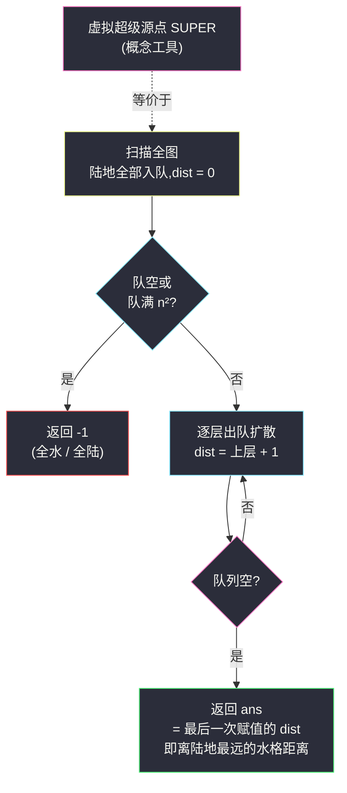
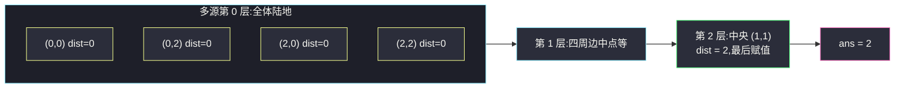

# 地图分析(多源 BFS · 值域单调扩散)

## 一、问题描述

给你一个 `n x n` 的矩阵 `grid`,`1` 表示陆地、`0` 表示水域。格子间的距离是**曼哈顿距离**:`|x0 - x1| + |y0 - y1|`。

如果网格上**存在**陆地和水域,请找到一个**水域**格子,使得它到**最近**陆地的距离最大,并返回这个最大距离;如果地图上只有陆地或只有水域,返回 `-1`。

> 🔗 LeetCode 1162:https://leetcode.cn/problems/as-far-from-land-as-possible/
>
> 数据范围:`1 <= n <= 100`,元素为 `0` 或 `1`。

**示例 1**

```text
grid = [[1,0,1],
        [0,0,0],
        [1,0,1]]
输出:2
解释:中央 (1,1) 到四角陆地的曼哈顿距离都是 2,是离陆地最远的水格。
```

**示例 2**

```text
grid = [[1,0,0],
        [0,0,0],
        [0,0,0]]
输出:4
解释:唯一陆地在 (0,0),最远水格是 (2,2),距离 2 + 2 = 4。
```

**直观理解**

单看「一个水格到最近陆地的距离」,这是一个 `min`(取所有陆地里的最近者);再对所有水格取 `max`——**max-min 嵌套**。如果老老实实「每个水格 × 每个陆格」去算,是四重循环;正确姿势是把**全部陆地同时当起点**做一次 BFS:水波纹从所有陆地一起往外扩,**每个水格第一次被碰到时的层数,就是它到最近陆地的距离**——最后被碰到的那格就是答案。

---

## 二、暴力解法

对每个水格,遍历所有陆格求最近距离,再取全局最大:

```python
class Solution:
    def maxDistance(self, grid: List[List[int]]) -> int:
        n = len(grid)
        lands = [(i, j) for i in range(n) for j in range(n) if grid[i][j] == 1]
        if not lands or len(lands) == n * n:       # 全水或全陆
            return -1
        ans = 0
        for i in range(n):
            for j in range(n):
                if grid[i][j] == 0:                 # 每个水格
                    d = min(abs(i - x) + abs(j - y) for x, y in lands)
                    ans = max(ans, d)
        return ans
```

### 复杂度

- **时间**:`O(n⁴)`——水格最多 `n²` 个、陆格最多 `n²` 个,`n = 100` 时约 `10^8` 次配对,Python 会超时。
- **空间**:`O(n²)` 存陆地点集。

### 🔴 瓶颈在哪里

同一个陆地对无数水格重复贡献「距离」;而水格要的只是**最近**一层信息。BFS 的层扩散恰好按「距离从小到大」供给格子:第 `d` 层扩到的格子,到源点的最小距离就是 `d`。把**所有陆地点放进第 0 层**,一次扩散即可给全图盖章。

---

## 三、优化探索(核心章节)

> 📚 本题出自灵茶题单一期 **§二、网格图 BFS**(网格图 BFS 篇),是**多源 BFS** 的代表题:全部源点同时入队、第一次到达即最短、距离随层单调扩散——灵神模板三要点齐活。

### 3.1 观察特征

| 特征 | 说明 |
|------|------|
| 内层是 `min`(到最近陆地) | 多个起点同时扩散时自动取 min |
| 外层是 `max`(最远水格) | 距离值随层单调不减,最后赋值即最大 |
| 距离口径是曼哈顿 | 4 方向 BFS 在无障碍图上恰好等于曼哈顿距离(3.4) |
| 全陆/全水 → -1 | 源点集合为空、或无可扩散格,两句话判掉 |

### 3.2 关键一步:全部陆地同层入队

```text
扫描全图:每个陆地点 dist = 0 且入队       # 多源:源点全在第 0 层
若队列为空(全水)或队列长度 == n²(全陆) → 返回 -1
BFS:队首出队,4 个界内且 dist == -1 的邻居:
        dist[邻居] = dist[队首] + 1
        ans = dist[邻居]                  # 赋值序列单调不减
        入队
返回 ans                                  # 最后一次赋的值就是最大距离
```

### 3.3 为什么多源 BFS 等价于「到最近源点的距离」?

两种理解:

1. **超级源点**:虚构节点 `SUPER`,向每块陆地连一条权 0 的边。从 `SUPER` 做单源 BFS 与「全部陆地同时入队」完全等价(第 0 层都是全体陆地),于是普通 BFS 的「首达即最短」原样成立——首达层数 = 到**最近**陆地的距离。
2. **归纳**:第 `d` 层恰好是「最近陆地距离 ≤ d」的全部格子,而距离恰为 `d` 的格子在 `d - 1` 层的邻居里被首次赋值。

而 BFS 赋值序列**单调不减**(层号只增不减),所以 `ans` 每次被覆盖都不会变小——**最后一次赋值就是全图最大距离**,无需再扫一遍 `dist`。



### 3.4 为什么 4 方向 BFS 的步数 = 曼哈顿距离?

无障碍网格上,4 方向扩散 `d` 层覆盖的格子恰好构成一个**菱形**:`|x - x0| + |y - y0| <= d`——这正是曼哈顿距离的「球」。若途中有障碍(其他题),BFS 步数是**绕行最短路**,就会大于曼哈顿距离;本题全图可自由通行,两者严格相等。

### 3.5 一句话核心

> **陆地点全体当源同入队;首达即最近,层号即距离;值域单调,最后一次赋值就是答案。**

---

## 四、代码实现

### Python(主解:多源 BFS)

```python
class Solution:
    def maxDistance(self, grid: List[List[int]]) -> int:
        n = len(grid)
        q = deque()
        dist = [[-1] * n for _ in range(n)]
        for i in range(n):
            for j in range(n):
                if grid[i][j] == 1:            # 全部陆地:多源第 0 层
                    dist[i][j] = 0
                    q.append((i, j))
        if len(q) == 0 or len(q) == n * n:     # 全水 / 全陆
            return -1
        ans = -1
        while q:
            x, y = q.popleft()
            for nx, ny in ((x + 1, y), (x - 1, y), (x, y + 1), (x, y - 1)):
                if 0 <= nx < n and 0 <= ny < n and dist[nx][ny] == -1:
                    dist[nx][ny] = dist[x][y] + 1
                    ans = dist[nx][ny]          # 赋值单调不减,最后一次即最大
                    q.append((nx, ny))          # 入队即判重
        return ans
```

**变体(先灌满再扫最大)**:不维护 `ans`,BFS 结束后 `return max(max(row) for row in dist)`。多一次 `O(n²)` 扫描,逻辑更直白;两版都对,主解利用单调性省这步。

**变量含义**

| 变量 | 含义 |
|------|------|
| `q` | 初始为**全体陆地**,之后是各层边界(波前) |
| `dist[i][j]` | 到最近陆地的距离;`-1` = 未访问 |
| `ans` | 最后一次赋的 `dist`,即离陆地最远的水格距离 |

**循环不变式**:任意时刻,`dist` 已赋值的格子恰为「最近陆地距离 ≤ 当前层」的全部格子,且每个格子的值等于其真实最近距离;`ans` 等于已赋值格子的最大 `dist`。

### Java(最优解环节)

```java
class Solution {
    public int maxDistance(int[][] grid) {
        int n = grid.length;
        Queue<int[]> q = new ArrayDeque<>();
        int[][] dist = new int[n][n];
        for (int[] row : dist) Arrays.fill(row, -1);
        for (int i = 0; i < n; i++)
            for (int j = 0; j < n; j++)
                if (grid[i][j] == 1) {
                    dist[i][j] = 0;
                    q.add(new int[]{i, j});
                }
        if (q.isEmpty() || q.size() == n * n) return -1;
        int[][] dirs = {{1, 0}, {-1, 0}, {0, 1}, {0, -1}};
        int ans = -1;
        while (!q.isEmpty()) {
            int[] p = q.poll();
            for (int[] d : dirs) {
                int nx = p[0] + d[0], ny = p[1] + d[1];
                if (0 <= nx && nx < n && 0 <= ny && ny < n && dist[nx][ny] < 0) {
                    dist[nx][ny] = dist[p[0]][p[1]] + 1;
                    ans = dist[nx][ny];          // 单调:最后一次即最大
                    q.add(new int[]{nx, ny});
                }
            }
        }
        return ans;
    }
}
```

---

## 五、具体例子演示

以示例 2 端到端走主解:

```text
grid:
1 0 0
0 0 0
0 0 0
(唯一陆地在 (0,0),退化为单源扩散,便于看清层结构)
```

**按层扩展表**(`dist` 快照,`.` 表示未访问):

| 层号 | 本层格子(出队) | 本层新入队 | dist 矩阵快照 |
|------|------------------|------------|----------------|
| 0(dist=0) | (0,0) 陆地 | (0,1) (1,0) | `0 1 . / 1 . . / . . .` |
| 1(dist=1) | (0,1) (1,0) | (0,2) (1,1) (2,0) | `0 1 2 / 1 2 . / 2 . .` |
| 2(dist=2) | (0,2) (1,1) (2,0) | (1,2) (2,1) | `0 1 2 / 1 2 3 / 2 3 .` |
| 3(dist=3) | (1,2) (2,1) | **(2,2)** | `0 1 2 / 1 2 3 / 2 3 4` |
| 4(dist=4) | (2,2) | — | 队列空,`ans = 4` |

逐层说明:

- **层 0**:全体陆地(此处仅 (0,0))入队,`dist = 0`;`len(q) = 1`,不是 0 也不是 9,继续。
- **层 1**:(0,0) 的右侧 (0,1)、下方 (1,0) 被赋 1——菱形半径 1。
- **层 2**:菱形半径 2,共 3 个新格。
- **层 3**:半径 3,新格 (1,2)、(2,1)。
- **层 4**:(2,2) 最后被赋 `dist = 4`,**`ans` 的最后一次赋值** → 返回 4 ✓。

**示例 1 快验**:四角陆地同入第 0 层,第 1 层扩到四条边中点与 (1,0)(0,1) 等,第 2 层首次碰到中央 (1,1)——它是最后被赋值的水格,`ans = 2` ✓。多源的意义直观可见:**四个波前同时推进,中央格在「最快到达它」的那个陆地的层里被盖章**。



---

## 六、复杂度分析

| 方法 | 时间 | 空间 | 说明 |
|------|------|------|------|
| 暴力逐对配对 | `O(n⁴)` | `O(n²)` | 水格 × 陆格全配对 |
| 多源 BFS(主解) | `O(n²)` | `O(n²)` | 每格恰入队一次,4 邻居各查一次 |

---

## 七、对比总结

**单源 → 多源,一步之遥**:

| 场景 | 做法 | 本批对应 |
|------|------|----------|
| 一个起点到目标/全图 | 单源 BFS | #1091、#1926 |
| 一类格子(全体源)到每格的最近距离 | 多源 BFS:源点**同层入队** | 本篇、#542、#994 |
| 一类格子的最远影响范围 | 多源 BFS 的**最大层数** | 本篇、#994(轮数) |

**易错点**

1. **忘了 -1 边界**:全水(源集合空)与全陆(无可扩散格)都要返回 `-1`;判据分别是队空、队列长度等于 `n²`。
2. **源点也要标 `dist = 0`**:漏标会把陆地当成未访问格重新扩散,答案错乱。
3. **入队即判重**(入队同时赋 `dist`),出队才判重会重复入队。
4. `ans` 取「最后一次赋值」依赖**值域单调**;若改用 `max` 扫描则无此心智负担,两版等价。
5. 本题距离是**曼哈顿**才与 4 向 BFS 步数一致;换 8 方向题(如 #1091)的口径是切比雪夫式绕行,别混用方向数组。

**模板(多源 BFS,Python)**

```python
q = deque()
dist = [[-1] * n for _ in range(n)]
for i in range(n):
    for j in range(n):
        if 是源(grid[i][j]):
            dist[i][j] = 0
            q.append((i, j))          # 全部源点同层入队
# (按需判 -1)
while q:
    x, y = q.popleft()
    for nx, ny in 四方向:
        if 界内 and dist[nx][ny] == -1:
            dist[nx][ny] = dist[x][y] + 1
            q.append((nx, ny))
# 答案 = max(dist) 或最后一次赋值
```

---

## 八、举一反三

| 题目 | 关系 |
|------|------|
| [542. 01 矩阵](https://leetcode.cn/problems/01-matrix/) | **完全同构**:从所有 0 扩散,求每格到最近 0 的距离 |
| [994. 腐烂的橘子](https://leetcode.cn/problems/rotting-oranges/) | 多源(烂橘子)按层计分钟,最大层数即答案 |
| [1765. 地图中的最高点](https://leetcode.cn/problems/map-of-highest-peak/) | 多源 BFS 直接生成高度矩阵,模板原样套 |
| [1091. 二进制矩阵中的最短路径](https://leetcode.cn/problems/shortest-path-in-binary-matrix/) | 同批姊妹题 `shortest-path-in-binary-matrix.md`:单源 BFS 最短路 |
| [1926. 迷宫中离入口最近的出口](https://leetcode.cn/problems/nearest-exit-from-entrance-in-maze/) | 同批姊妹题 `nearest-exit-from-entrance-in-maze.md`:反向做多源即「出口→入口」 |
| [2258. 逃离火灾](https://leetcode.cn/problems/escape-the-spreading-fire/) | 多源 BFS(火势扩散)+ 二分/双人 BFS,Hard 综合 |

**思想迁移**

- 「每格到**某类格子**的最近距离」→ 一律多源 BFS;**max-min 嵌套**的距离问题几乎都是它的化身。
- 多源 = 虚拟超级源点连 0 权边;理解了这个等价,「为什么同时入队就是取 min」不再神秘。
- 口诀:**「源点齐入第 0 层,层层扩散首达近;值域单调往上走,最后一层即答案。」**
