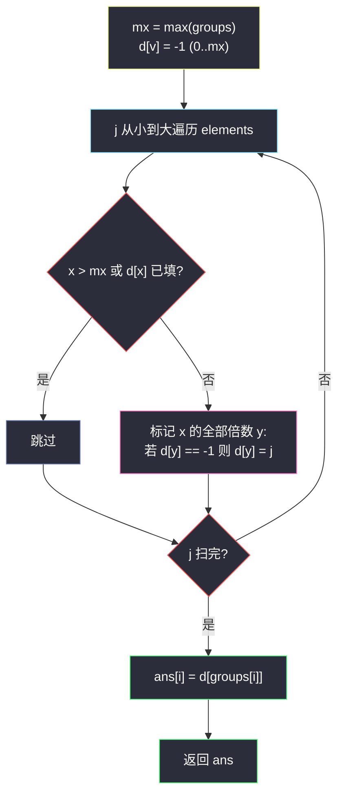

# 3447. 将元素分配给有约束条件的组（Assign Elements to Groups with Constraints）

> 题目来源：[https://leetcode.cn/problems/assign-elements-to-groups-with-constraints/](https://leetcode.cn/problems/assign-elements-to-groups-with-constraints/)
>
> 灵茶题单小节定位：§1.5 因子

## 一、问题描述

给你一个整数数组 `groups`，其中 `groups[i]` 表示第 `i` 组的大小。另给你一个整数数组 `elements`。

请你根据以下规则为每个组分配**一个**元素：

- 如果 `groups[i]` 能被 `elements[j]` 整除，则下标为 `j` 的元素可以分配给组 `i`。
- 如果有多个元素满足条件，则分配**最小的下标** `j` 的元素。
- 如果没有元素满足条件，则分配 `-1`。

返回一个整数数组 `assigned`，其中 `assigned[i]` 是分配给组 `i` 的元素的索引，若无合适的元素，则为 `-1`。

注意：一个元素可以分配给多个组。

**数据范围**：

- `1 <= groups.length <= 10⁵`
- `1 <= elements.length <= 10⁵`
- `1 <= groups[i] <= 10⁵`
- `1 <= elements[i] <= 10⁵`

**示例 1**：

```text
输入：groups = [8,4,3,2,4], elements = [4,2]
输出：[0,0,-1,1,0]
解释：elements[0]=4 分给组 0、1、4；elements[1]=2 分给组 3；组 2 无合适元素。
```

**示例 2**：

```text
输入：groups = [2,3,5,7], elements = [5,3,3]
输出：[-1,1,0,-1]
```

**示例 3**：

```text
输入：groups = [10,21,30,41], elements = [2,1]
输出：[0,1,0,1]
```

**核心思考点**：对每个组问「能整除我的元素里下标最小是谁」。直接双重循环是 `O(n·m)`（10¹⁰）必超时。换视角：预处理数组 `d[v]` = 「值为 `v` 的最小元素下标」，再对每个**元素值** `x` 把 `x` 的所有倍数 `v` 标记上 `d[v] = min(已有, j)`——倍数标记总代价是调和级数 `M/1 + M/2 + ... ≈ M ln M`，最后 `O(1)` 查表每个组。

## 二、暴力解法

### 思路

对每个组 `groups[i]`，从左到右扫 `elements`，第一个满足 `groups[i] % elements[j] == 0` 的 `j` 即答案。

### 代码

```python
def assignElementsBrute(groups: list[int], elements: list[int]) -> list[int]:
    ans = []
    for g in groups:
        pick = -1
        for j, e in enumerate(elements):
            if g % e == 0:
                pick = j
                break
        ans.append(pick)
    return ans
```

### 复杂度

- 时间：`O(n·m)`，`n = m = 10⁵` 时 10¹⁰ 次取模，必然超时。
- 空间：`O(1)`（不计输出）。小数据可用于对拍基准。

## 三、优化探索

### 3.1 换视角：从「每个组找因子」到「每个因子标倍数」⭐

`g % e == 0` 等价于 `e` 是 `g` 的因子、`g` 是 `e` 的倍数。与其对每个 `g` 枚举 `elements` 找因子，不如对每个**元素值** `x` 枚举 `x` 的全部倍数 `x, 2x, 3x, ... ≤ mx`，把「值 `v` 的候选下标」打进去。倍数枚举的总步数：

```text
mx/1 + mx/2 + mx/3 + ... + mx/mx ≈ mx · ln(mx)   （调和级数）
```

`mx = 10⁵` 时约 `10⁵ × 12 ≈ 1.2×10⁶`——从 10¹⁰ 降六个数量级。这就是「**因子与倍数互为镜像**」的经典转化，与埃氏筛的标记结构完全同构。

### 3.2 竞争最小下标：先到先得 ⭐

题目要「多个可用元素取最小下标」。按 `j` 从小到大遍历 `elements`，标记时只写「尚未被写过」的格子（`if d[y] == -1: d[y] = j`）——先到的 `j` 必然更小，天然满足要求，无需 min 比较。

两个额外剪枝：

- **重复值只处理一次**：`d[x] != -1` 说明更小的下标已处理过值 `x`，跳过；
- **`x > mx` 跳过**：大于所有组的元素不可能是任何组的因子，标记无意义。



### 3.3 为什么按 j 升序处理就够了？

倍数标记是「多方竞争写同一格」的过程：值 `v` 可能同时是 `x₁`（下标 `j₁`）与 `x₂`（下标 `j₂ > j₁`）的倍数。按 `j` 升序处理 + 只写空格，等价于对每个格子取 `min j`。若乱序处理就必须写 `d[y] = min(d[y], j)`，正确性相同但慢一点——升序 + 空格判断是最省写法。

## 四、代码实现

### 主解：调和级数倍数标记

```python
class Solution:
    def assignElements(self, groups: List[int], elements: List[int]) -> List[int]:
        mx = max(groups)
        d = [-1] * (mx + 1)                 # d[v]: 能整除 v 的最小元素下标
        for j, x in enumerate(elements):
            if x > mx or d[x] != -1:        # 太大 or 重复值已处理
                continue
            for y in range(x, mx + 1, x):   # 标记 x 的全部倍数
                if d[y] == -1:
                    d[y] = j
        return [d[g] for g in groups]
```

### 细节说明

- **`d[x] != -1` 判重的妙处**：`x` 是 `x` 自己的倍数（`y` 从 `x` 起），处理过一次值 `x` 后 `d[x]` 必非 `-1`，天然挡住后续同值——不需要额外哈希集合。
- **`groups[i] = 1`**：任何元素都能整除 1？不对——是 `1 % e == 0` 仅当 `e = 1`。查表 `d[1]`：只有值为 1 的元素标记过它；若无 1 元素则 `-1`。逻辑自洽（`1` 的因子只有 1）。
- **重复组大小**：查表 `O(1)`，重复值无额外成本。
- **值域若达 10⁹**：不能开 `d` 数组，改对每个 `g` 枚举 `⌊√g⌋` 内因子并在因子→下标的小表里查——本题 `10⁵` 值域走调和级数最优。
- **Java 版（可选）**：数组 `int[] d`，双重循环同构，注意内层 `for (int y = x; y <= mx; y += x)`。

## 五、例子演示

**示例 1 端到端：groups = [8,4,3,2,4], elements = [4,2]，mx = 8**

| 步骤 | 标记动作 | d 数组状态（下标 0..8） |
|---|---|---|
| j=0, x=4 | 倍数 4, 8 填 0 | `[-, -, -, -, 0, -, -, -, 0]` |
| j=1, x=2 | 倍数 2→0? 已空则填 1；4 已填跳过；6 填 1；8 已填 | `[-, -, 1, -, 0, -, 1, -, 0]` |
| 查表 | 组 8→`d[8]=0`；组 4→`d[4]=0`；组 3→`d[3]=-1`；组 2→`d[2]=1`；组 4→`d[4]=0` | |

返回 `[0, 0, -1, 1, 0]` ✅。注意下标 3 始终无人标记（3 不是 4 也不是 2 的倍数），正确落到 `-1`。

**示例 2 端到端：groups = [2,3,5,7], elements = [5,3,3]，mx = 7**

| 步骤 | 标记 | d（1..7） |
|---|---|---|
| j=0, x=5 | 5 填 0 | `[., -, -, -, -, 0, -, -]` |
| j=1, x=3 | 3, 6 填 1 | `[., -, -, 1, -, 0, 1, -]` |
| j=2, x=3 | `d[3] = 1 ≠ -1`，**判重跳过** | 不变 |

查表：组 2→`-1`、组 3→`1`、组 5→`0`、组 7→`-1`，返回 `[-1, 1, 0, -1]` ✅。第三步的判重跳过省掉一整轮倍数循环——重复元素越多收益越大。

**示例 3：groups = [10,21,30,41], elements = [2,1]，mx = 41**：j=0 的 2 标记 2,4,...,40；j=1 的 1 标记全部空格（含 1,3,...,41 的奇数与未被 2 覆盖处）。查表：10→0、21→1、30→0、41→1，返回 `[0,1,0,1]` ✅——偶数组拿到下标 0 的元素 2，奇数组落到下标 1 的元素 1。

## 六、复杂度分析

设 `n = len(groups)`，`m = len(elements)`，`M = max(groups) ≤ 10⁵`：

- **时间复杂度：`O(n + m + M log M)`**
  - 倍数标记是调和级数 `Σₓ M/x ≤ M·(1 + 1/2 + ... ) ≈ M ln M ≈ 1.2×10⁶`；
  - 判重让每个**不同值**至多触发一轮倍数循环，总标记次数以调和级数为上界；
  - 查表 `O(n)`。整体约两毫秒级。
- **空间复杂度：`O(M)`**——`d` 数组。

## 七、对比总结

| 维度 | 暴力（组 × 元素） | 主解（值 × 倍数标记） |
|---|---|---|
| 时间 | `O(n·m) = 10¹⁰` | `O(M log M) ≈ 10⁶` |
| 空间 | `O(1)` | `O(M)` |
| 视角 | 每组找因子 | 每因子认领倍数 |
| 同构结构 | — | 埃氏筛 / 遍历倍数的因子问题 |

**套路归纳**：「整除关系批量处理」的标准二选一——①值域小（≤10⁶）：**调和级数倍数标记**，把 `a % b == 0` 的询问变成 `O(1)` 查表；②值域大但询问对象小：对每个 `g` 枚举 `⌊√g⌋` 因子。竞争「最小下标」用**升序处理 + 只写空格**实现。凡是「因子筛选 / 倍数配对 / 整除查询」的题，先想调和级数这一招。

## 八、举一反三

1. **[2427. 公因子的数目](https://leetcode.cn/problems/number-of-common-factors/)**：本批姊妹篇 `number-of-common-factors.md`，因子计数入门，与本篇合成灵神题单 §1.5「因子」双联。
2. **[1492. n 的第 k 个因子](https://leetcode.cn/problems/the-kth-factor-of-n/)**：单数因子枚举，值域大时的替代方案（枚举到 √n）。
3. **[1952. 三除数](https://leetcode.cn/problems/three-divisors/)**：因子个数判断的小练习。
4. **[2183. 统计可以被 K 整除的下标对数目](https://leetcode.cn/problems/count-array-pairs-divisible-by-k/)**：整除配对的 Hard 版，gcd + 因子计数。
5. **[204. 计数质数](https://leetcode.cn/problems/count-primes/)**：埃氏筛——与本篇倍数标记结构完全同构，对照体会「调和级数标记」家族。

**同族互引**：调和级数标记在同目录 `count-subarrays-with-score-less-than-k.md` 等前缀和题之外并不多见，最直接的亲戚是埃氏筛（`closest-prime-numbers-in-range.md`，#2523）——同一个「从 i²/i 开始跳步标记」骨架，一个筛质数一个配因子。
