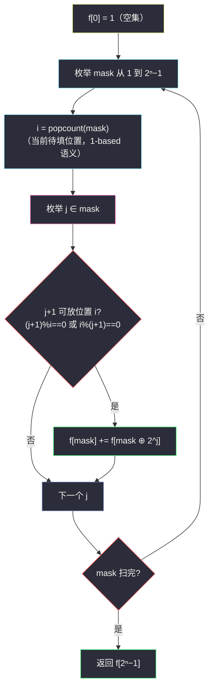

# 526. 优美的排列（Beautiful Arrangement）

> 题目来源：[https://leetcode.cn/problems/beautiful-arrangement/](https://leetcode.cn/problems/beautiful-arrangement/)
>
> 灵茶题单小节定位：§B 带约束的排列计数（回溯 → 状压 DP）

## 一、问题描述

假设有从 1 到 n 的 n 个整数。用这些整数构造一个数组 `perm`（下标从 1 开始），只要满足下述条件**之一**，该数组就是一个**优美的排列**：

- `perm[i]` 能够被 `i` 整除
- `i` 能够被 `perm[i]` 整除

给你一个整数 `n`，返回可以构造的**优美排列的数量**。

**数据范围**：

- `1 <= n <= 15`

**示例 1**：

```text
输入：n = 2
输出：2
解释：[1,2]（perm[1]=1 被 1 整除、perm[2]=2 被 2 整除）
     [2,1]（perm[1]=2 被 1 整除、位置 2 被 perm[2]=1 整除）
```

**示例 2**：

```text
输入：n = 1
输出：1
```

**核心思考点**：n ≤ 15 是**状压 DP 的信号灯**（2¹⁵ = 32768 个子集状态）。两条路线：①回溯——按位置 1..n 逐个填数，vis 标记已用，整除剪枝；②状压 DP——`f[mask]` = 已填数字集合为 mask 的方案数，转移枚举「下一个位置放哪个数」。回溯直观、DP 稳定 `O(2ⁿ·n²)` 无栈深顾虑；两者必须都会——回溯是思考入口，状压是标准答案形态。

## 二、暴力解法

### 思路

`itertools.permutations` 全排列逐个检查整除条件。`n = 15` 时 15! ≈ 1.3×10¹² 不可行，n ≤ 8 对拍够用。

### 代码

```python
from itertools import permutations

def countArrangementBrute(n: int) -> int:
    def ok(perm):
        return all((perm[i - 1] % i == 0) or (i % perm[i - 1] == 0)
                   for i in range(1, n + 1))
    return sum(1 for p in permutations(range(1, n + 1)) if ok(p))
```

### 复杂度

- 时间：`O(n! · n)`。`n = 15` 天文数字。
- 空间：`O(n)`。

## 三、优化探索

### 3.1 回溯：按位置填数 + 整除剪枝 ⭐⭐

排列生成的两种经典顺序——「按位置枚举可选数」（本题选它）：位置 `i` 从小到大，每层从**未用**的数里挑一个满足 `x % i == 0 or i % x == 0` 的填入。约束在**填入时刻**即检查（而非整列排完再验），剪枝发生在搜索树早期——比如位置 1 什么都能放，位置 13 只能放 1 或 13（n ≤ 15 时 13 的因子/倍数）。

为什么「按位置」而非「按数找位置」？两者对称可行，但「按位置」让剪枝条件直接对应题面（第 i 个位置接受哪些数），且 vis 回溯写法最短。

### 3.2 状压 DP：子集递推 ⭐⭐

回溯的重复子问题：**「剩余可用的数字集合」相同**时，后续能完美填完的方案数与前面怎么填的无关。把「已用集合」编码为 bitmask `mask`：

```text
f[mask] = 已用集合为 mask（当前要填位置 popcount(mask)+1）的方案数
f[0] = 1
f[mask] = Σ_{j ∈ mask, 可放(popcount(mask), j)} f[mask ⊕ 2^j]
```

位置编号 = `popcount(mask)`（填到第几个），数 `j+1` 必须满足与该位置的整除关系。答案 `f[(1<<n) − 1]`。`O(2ⁿ·n)` 状态 × `O(1)` 单次判断（预处理 `match[i][j]` 或即时算）。

### 3.3 对称性剪枝的进阶（可选）⭐

数字 1 可以放在任何位置——有贪心把「放 1 的位置」提出来乘 `n` 倍？不成立：1 只用一次，其余 n−1 个数的排列依赖 1 的位置选择，不能简单相乘（不同 1 的位置下剩余位置约束不同）。**正确**的进阶是按「约束从紧到松」重排位置填序（先填因子少的位置 13、11 等质数位），缩小搜索树；状压 DP 则无此必要。此段作为「想当然被否决」的思维留档。



## 四、代码实现

### 主解：状压 DP

```python
class Solution:
    def countArrangement(self, n: int) -> int:
        full = (1 << n) - 1
        f = [0] * (1 << n)
        f[0] = 1
        for mask in range(1, 1 << n):
            i = mask.bit_count()              # 当前待填位置（1-based）
            for j in range(n):
                if mask >> j & 1:             # 数 j+1 在集合里
                    x = j + 1
                    if x % i == 0 or i % x == 0:
                        f[mask] += f[mask ^ (1 << j)]
        return f[full]
```

### 对照：回溯版（doocs 风格）

```python
class Solution:
    def countArrangement(self, n: int) -> int:
        vis = [False] * (n + 1)

        def dfs(i: int) -> int:               # 正在填位置 i
            if i > n:
                return 1
            total = 0
            for x in range(1, n + 1):
                if not vis[x] and (x % i == 0 or i % x == 0):
                    vis[x] = True
                    total += dfs(i + 1)
                    vis[x] = False
            return total

        return dfs(1)
```

### 细节说明

- **`mask.bit_count()` 就是位置号**：已放 k 个数 ⟺ 正在填第 k+1 个位置——「位置」不必显式存。
- **`mask ^ (1 << j)` 去掉 j**：异或即「移出集合」（j 一定在集合内，先判 `mask >> j & 1`）。
- **枚举 mask 升序的正确性**：`f[mask]` 只依赖更小的 `f[mask ⊕ 2^j]`（少一位），升序保证先算完。
- **回溯版 `i > n` 返回 1**：所有位置填满即得一个合法排列（每步已过约束）。
- **`n = 1`**：状压 `f[1] = f[0] = 1`（x=1, i=1 整除成立）；回溯 `dfs(1)` 选 1 直接到 `dfs(2)` 返回 1——都是 1 ✅。
- **Python 3.10+ 才有 `int.bit_count`**；老版本用 `bin(mask).count("1")`。

## 五、例子演示

**示例 1 端到端：n = 2**

| mask | 二进制 | i = popcount | j 遍历 | 判定 | f[mask] |
|---|---|---|---|---|---|
| 00 | — | — | — | 初始 | f[0] = 1 |
| 01 | {1} | 1 | j=0（数1） | 1%1==0 ✓ | f[01] = f[00] = 1 |
| 10 | {2} | 1 | j=1（数2） | 2%1==0 ✓ | f[10] = 1 |
| 11 | {1,2} | 2 | j=0（数1）：填到位置 2，2%1==0 ✓ | f[01] | f[11] = 1 + 1 = **2** |
| | | | j=1（数2）：2%2==0 ✓ | f[10] | |

`f[11] = 2` → 返回 **2** ✅。两个方案：`[1,2]`（mask 01→11，最后放 2 在位置 2）与 `[2,1]`（mask 10→11，最后放 1 在位置 2）——「最后放入的数」与「转移来源」一一对应，恰是 DP 的组合意义。

**回溯版对照（n = 2）**：`dfs(1)`：x=1（✓）→ `dfs(2)`：x=2（✓）→ `dfs(3)` 返回 1；x=2（✓）→ `dfs(2)`：x=1（2%1==0 ✓）→ 返回 1。合计 2 ✅。

**自造例子 n = 3**：状压算得 `f[111] = 3`（排列 `[1,2,3]`、`[3,2,1]`、`[2,1,3]`？逐一验证：`[1,2,3]` 全部 ✓；`[2,1,3]`：pos1=2（2%1✓）、pos2=1（2%1✓）、pos3=3 ✓；`[3,2,1]`：pos1=3✓、pos2=2✓、pos3=1（3%1✓）；`[3,1,2]`? pos3=2：3%2≠0、2%3≠0 ✗。共 3 个 ✅——回溯与暴力同样得 3。

## 六、复杂度分析

设 `n ≤ 15`：

- **状压 DP 时间：`O(2ⁿ · n)`**——32768 × 15 ≈ 5×10⁵；**空间 `O(2ⁿ)`**。
- **回溯时间**：最坏指数但剪枝后远小于 `n!`（实测 n=15 毫秒级）；**空间 `O(n)`**。

## 七、对比总结

| 维度 | 暴力全排列 | 回溯 | 状压 DP |
|---|---|---|---|
| 时间 | `O(n!·n)` | 指数（剪枝大幅削减） | `O(2ⁿ·n)` 严格上界 |
| 空间 | `O(n)` | `O(n)` | `O(2ⁿ)` |
| 可控性 | 差 | 好 | 上界明确 |
| 泛化 | — | 加约束最灵活 | 约束需可按位置判定 |

**套路归纳**：**「n ≤ 15~20 的排列/子集问题 ⇒ 状压 DP」**是条件反射级的识别信号。状态设计两件套：`mask` 记「用了哪些」，`popcount(mask)` 免存「进行到第几位」（当进度恰好等于元素个数时）。转移 = 枚举集合内最后一个放入的元素（或下一个要放的），从去掉它的子集累加。回溯与状压是同一棵搜索树的前后两世：回溯 = 树上 DFS，状压 = 把树按「剩余集合」合并同类项。识别信号之外还要记得整除约束可以「即时判断」，无需预处理表。

## 八、举一反三

1. **[1986. 完成任务的最少工作时间段](https://leetcode.cn/problems/minimum-number-of-work-sessions-to-finish-the-tasks/)**：状压 DP + 装箱，`mask` 的进阶应用。
2. **[2305. 公平分发饼干](https://leetcode.cn/problems/fair-distribution-of-cookies/)**：本批姊妹篇——分配型状压（子集枚举 + 最小化最大值），与本题计数型对照。
3. **[46. 全排列](https://leetcode.cn/problems/permutations/)** / **[47. 全排列 II](https://leetcode.cn/problems/permutations-ii/)**：无约束排列生成，回溯基本功。
4. **[1879. 两个数组最小的异或值之和](https://leetcode.cn/problems/minimum-xor-sum-of-two-arrays/)**：配对型状压 DP（`f[mask]` = 一侧用 mask 的最小代价），转移结构与本题同型。
5. **[1079. 活字印刷](https://leetcode.cn/problems/letter-tile-possibilities/)**：本批姊妹篇——无约束多重集排列计数，回溯去重手法与本题互补。

**同族互引**：灵茶题单「回溯 → 状压」过渡题；批内 `special-permutations.md`（#2741）把「优美条件」换成「相邻整除」，是本题的**相邻约束**升级版（状压加一维「最后放的数」）。
