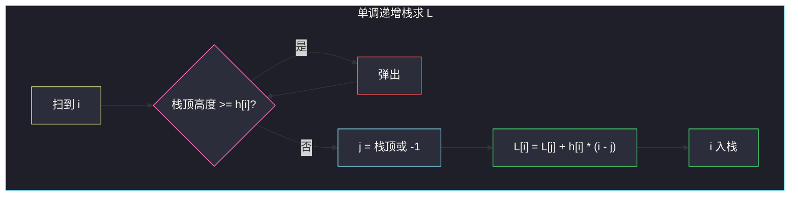

# 2866. 美丽塔 II（Beautiful Towers II）

> 题目来源：[https://leetcode.cn/problems/beautiful-towers-ii/](https://leetcode.cn/problems/beautiful-towers-ii/)
>
> 灵茶题单小节定位：§11.2 单调栈优化 DP

## 一、问题描述

给你长度为 `n`、下标从 0 开始的整数数组 `maxHeights`。要在坐标轴上建 `n` 座塔，第 `i` 座高度为 `heights[i]`。

称这些塔是**美丽**的，当且仅当：

- `1 <= heights[i] <= maxHeights[i]`
- `heights` 是一个**山脉数组**：存在下标 `i`（峰顶），使得
  - 对所有 `0 < j <= i`，有 `heights[j - 1] <= heights[j]`（峰左侧非降）
  - 对所有 `i <= k < n - 1`，有 `heights[k + 1] <= heights[k]`（峰右侧非增）

返回所有美丽方案中，高度和的最大值。

**数据范围**：

- `1 <= n == maxHeights.length <= 10^5`
- `1 <= maxHeights[i] <= 10^9`

**示例 1**：

```text
输入：maxHeights = [5,3,4,1,1]
输出：13
解释：heights = [5,3,3,1,1]，峰值在 i = 0。
1 ≤ heights[i] ≤ maxHeights[i]，且从峰向右非增。高度和 13 最大。
```

**示例 2**：

```text
输入：maxHeights = [6,5,3,9,2,7]
输出：22
解释：heights = [3,3,3,9,2,2]，峰值在 i = 3。高度和 22。
```

**示例 3**：

```text
输入：maxHeights = [3,2,5,5,2,3]
输出：18
解释：heights = [2,2,5,5,2,2]，峰值可在 i = 2 或 i = 3。高度和 18。
```

**核心思考点**：峰顶可以枚举。固定峰 `i` 后，最优高度被「越靠近峰越高、但不超过 `maxHeights`」唯一确定——从峰向两边走，`h[j] = min(maxHeights[j], 邻接的更靠近峰的那座)`。朴素枚举峰是 `O(n²)`；用单调栈预处理「以 `i` 为峰时左侧能贡献的最大和」与右侧，整体 `O(n)`。

## 二、暴力解法

枚举每一个峰顶，从峰向两边贪心封顶，求 `sum(h)` 的最大。

```python
def maximumSumOfHeightsBrute(maxHeights):
    n = len(maxHeights)
    best = 0
    for peak in range(n):
        h = [0] * n
        h[peak] = maxHeights[peak]
        for i in range(peak - 1, -1, -1):
            h[i] = min(maxHeights[i], h[i + 1])
        for i in range(peak + 1, n):
            h[i] = min(maxHeights[i], h[i - 1])
        best = max(best, sum(h))
    return best
```

这就是 [#2865 美丽塔 I](https://leetcode.cn/problems/beautiful-towers-i/) 的过法（`n ≤ 10^3`）。本题 `n = 10^5`，`O(n²)` 超时。暴力仍是对的，只适合当对拍基准。

为什么「从峰向两边取 `min(上界, 内侧高度)`」最优：高度既有上界，又必须单峰。离峰越远还要 ≤ 更靠近峰的那一座，所以每位都已经顶到约束；再故意变矮只会把更外侧的上限一起拉下来，总和不会变大。

### 复杂度

- 时间：`O(n²)`。
- 空间：`O(n)`。

瓶颈：相邻两个峰的左侧形状高度相似，大量 `min` 前缀被重复计算。单调栈能找出「左侧第一个严格更矮的位置」，把一段平台一次性结算。

## 三、优化探索

### 3.1 固定峰之后高度被写死 ⭐

以 `i` 为峰时最优解一定取 `heights[i] = maxHeights[i]`（再矮只会让两边上限更紧）。向左第 `k` 座：

```text
h[k] = min(maxHeights[k], maxHeights[k+1], ..., maxHeights[i])
```

向右同理。所以左侧和 `L[i] = Σ_{k=0..i} min(maxHeights[k..i])`。

### 3.2 最近严格更矮位置 ⭐⭐

在 `i` 左边找最近的 `j`，满足 `maxHeights[j] < maxHeights[i]`（没有则 `j = -1`）。则：

- 下标 `j+1 .. i` 上，`min(maxHeights[·..i])` 全等于 `maxHeights[i]`（这段里每个值都 ≥ `maxHeights[i]`）
- 下标 `0 .. j` 的 `min` 前缀**与以 `j` 为峰时的左侧完全相同**（因为 `maxHeights[j]` 已经比 `i` 更小，再往左不会被 `i` 卡住）

于是：

```text
L[i] = L[j] + maxHeights[i] * (i - j)     j 存在
L[i] = maxHeights[i] * (i + 1)            j = -1
```

`j` 正是单调栈「左边第一个更小」查询。栈里保持 `maxHeights` **严格递增**（弹出 `≥` 当前值）。右侧对称，反转数组做一遍再翻回来。

以 `i` 为峰的总和 = `L[i] + R[i] - maxHeights[i]`（峰被左右各加了一次）。



### 3.3 弹出等号的原因

`maxHeights[j] == maxHeights[i]` 时，`min(maxHeights[j..i])` 仍等于这个高度，`j` 这段也应并入「全是 `h[i]`」的平台，不能当「严格更矮的分界」。所以弹出条件是 `≥`，不是 `>`。

## 四、代码实现

### 主解：左右各一次单调栈

```python
class Solution:
    def maximumSumOfHeights(self, maxHeights: List[int]) -> int:
        n = len(maxHeights)

        def side_sum(h: List[int]) -> List[int]:
            L = [0] * n
            st = []                       # 存下标，对应高度严格递增
            for i in range(n):
                while st and h[st[-1]] >= h[i]:
                    st.pop()
                j = st[-1] if st else -1
                L[i] = (L[j] if j >= 0 else 0) + h[i] * (i - j)
                st.append(i)
            return L

        L = side_sum(maxHeights)
        R = side_sum(maxHeights[::-1])[::-1]
        return max(L[i] + R[i] - maxHeights[i] for i in range(n))
```

Java 里 `h[i] * (i - j)` 与答案都要用 `long`：`maxHeights[i] ≤ 10^9`，`n ≤ 10^5`，乘积到 `10^14`。

```java
class Solution {
    public long maximumSumOfHeights(List<Integer> maxHeights) {
        int n = maxHeights.size();
        long[] h = new long[n];
        for (int i = 0; i < n; i++) h[i] = maxHeights.get(i);
        long[] L = side(h);
        reverse(h);
        long[] R = side(h);
        reverse(R);
        long ans = 0;
        for (int i = 0; i < n; i++)
            ans = Math.max(ans, L[i] + R[i] - maxHeights.get(i));
        return ans;
    }
    long[] side(long[] h) {
        int n = h.length;
        long[] L = new long[n];
        Deque<Integer> st = new ArrayDeque<>();
        for (int i = 0; i < n; i++) {
            while (!st.isEmpty() && h[st.peek()] >= h[i]) st.pop();
            int j = st.isEmpty() ? -1 : st.peek();
            L[i] = (j >= 0 ? L[j] : 0) + h[i] * (i - j);
            st.push(i);
        }
        return L;
    }
    void reverse(long[] a) {
        for (int i = 0, j = a.length - 1; i < j; i++, j--) {
            long t = a[i]; a[i] = a[j]; a[j] = t;
        }
    }
}
```

### 细节说明

- **`n = 1`**：`L = R = maxHeights[0]`，答案就是它。
- **整段递减**（峰在最左）：左侧栈一直为空，`L[i] = h[i] * (i+1)`，与「全部被封成 `h[i]`」一致。
- **不要把 `O(n²)` 当主解**：那是 I 的过法；II 的考点就是这段栈转移。
- **乘法溢出**：`h[i] * (i - j)` 在 Java 里先把 `h[i]` 升成 `long`。
- **栈内存的是下标不是高度**：用高度当栈元素会丢「宽度 `i - j`」。
- **右侧不要手写对称逻辑**：反转数组复用 `side_sum`，少一份镜像 bug。
- **平台（相邻相等）**：示例 3 两个 5 都能当峰，弹出 `≥` 后它们共享同一段平台和，答案相同。若改成弹出 `>`，等号处会切错平台，和会偏小。

## 五、例子演示

**示例 1：`[5,3,4,1,1]` 求 L**

| i | h[i] | 弹栈后 j | 计算 | L[i] | 含义（以 i 为右端峰的左侧和） |
|---|---|---|---|---|---|
| 0 | 5 | -1 | 5×1 | 5 | `[5]` |
| 1 | 3 | -1（5 被弹出） | 3×2 | 6 | `[3,3]` |
| 2 | 4 | 1（3 < 4） | 6 + 4×1 | 10 | `[3,3,4]` |
| 3 | 1 | -1 | 1×4 | 4 | `[1,1,1,1]` |
| 4 | 1 | 3 | 4 + 1×1 | 5 | `[1,1,1,1,1]` |

右侧 `R`（对称）后：

| 峰 i | L[i] | R[i] | L+R−h | 对应 heights |
|---|---|---|---|---|
| 0 | 5 | 13 | **13** | `[5,3,3,1,1]` |
| 1 | 6 | 8 | 11 | `[3,3,3,1,1]` |
| 2 | 10 | 6 | 12 | `[3,3,4,1,1]` |
| 3 | 4 | 2 | 5 | 全 1 |
| 4 | 5 | 1 | 5 | 全 1 |

最大 **13** ✅。

再核对 `i = 0` 的 `R`：峰在最左，右侧必须非增。`h = [5,3,4,1,1]` 往右封：`5, min(3,5)=3, min(4,3)=3, min(1,3)=1, min(1,1)=1`，右侧含峰的和是 13，与表一致。

**示例 2**：峰在 `i = 3`、`h = 9`。左侧三个 6、5、3 都被 9 卡住，变成 `3,3,3`；右侧 `2,7` 变成 `2,2`。和 22 ✅。

从栈的角度看 `i = 3`：`h[3]=9` 比左边 6、5、3 都大，弹出直到空，`j = -1`，`L[3] = 9 * 4 = 36`？不对——左边 6、5、3 **都小于 9**，不会被弹出到空。

严格递增栈扫到 9 之前是 `[2]`（高度 3，因为 6、5 已被 3 弹出）。`3 < 9`，`j = 2`，`L[3] = L[2] + 9 * (3-2)`。`L[2]` 是以高度 3 为峰的左侧 `[3,3,3]` 和 9，再加一座 9，得 18，即 `[3,3,3,9]`。右侧对称得 `[9,2,2]` 和 13。`18+13-9=22`。

**示例 3**：双峰平台 `5,5`，`i = 2` 与 `i = 3` 得到同一组 `[2,2,5,5,2,2]`，和 18 ✅。

## 六、复杂度分析

- **时间复杂度：`O(n)`**——每个下标至多入栈、出栈一次，左右各一遍。
- **空间复杂度：`O(n)`**——`L`、`R` 与栈。

## 七、对比总结

| 维度 | 枚举峰 + 两边扫 | 单调栈 DP |
|---|---|---|
| 时间 | `O(n²)`（I 能过） | `O(n)`（II 必须） |
| 关键查询 | 无 | 左侧最近严格更小 |
| 转移 | 现场 `min` | `L[i] = L[j] + h[i]*(i-j)` |

**易错点**

- 峰顶高度没取满 `maxHeights[i]`（再矮只会让两边上限更紧，绝不会更优）。
- 单调栈弹出条件写成 `>`：相等高度应并入当前平台。
- `L[i] + R[i]` 忘了减回峰顶，峰被算了两次。
- 用 `O(n²)` 交 II，`n = 10^5` 必 TLE。

**套路归纳**：形如 `dp[i] = 某段全变成 A[i] + 更左边已经算好的 dp[j]`，且分段点是「最近更小 / 更大」，就是 **单调栈优化 DP**。直方图最大矩形、子数组最小值之和都是同一块积木：栈维护候选分界，一段高度一次性乘上宽度。

## 八、举一反三

1. **[2865. 美丽塔 I](https://leetcode.cn/problems/beautiful-towers-i/)**：同一题，`n ≤ 10^3`，暴力枚举峰即可；对照着看栈优化省掉了什么。
2. **[84. 柱状图中最大的矩形](https://leetcode.cn/problems/largest-rectangle-in-histogram/)**：最近更小元素决定能向两边扩到哪，单调栈经典题。
3. **[907. 子数组的最小值之和](https://leetcode.cn/problems/sum-of-subarray-minimums/)**：每个元素作为最小值管辖的区间，仍是左右最近更小。
4. **[1856. 子数组最小乘积的最大值](https://leetcode.cn/problems/maximum-subarray-min-product/)**：最小值 × 区间和，栈 + 前缀和。
5. **[1793. 好子数组的最大分数](https://leetcode.cn/problems/maximum-score-of-a-good-subarray/)**：同目录 `maximum-score-of-a-good-subarray.md`，最小值与区间的另一种耦合。
