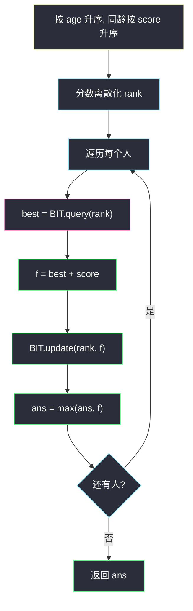

# 1626. 无矛盾的最佳球队（Best Team With No Conflicts）

> 题目来源：[https://leetcode.cn/problems/best-team-with-no-conflicts/](https://leetcode.cn/problems/best-team-with-no-conflicts/)
>
> 灵茶题单小节定位：§11.4 树状数组 / 线段树优化 DP

## 一、问题描述

第 `i` 名球员分数 `scores[i]`、年龄 `ages[i]`。球队得分为入选球员分数之和。矛盾定义：**年龄更小**的球员分数**严格大于**年龄更大的球员。同龄之间无矛盾。求一支无矛盾球队的最大得分。

**数据范围**：

- `1 <= scores.length == ages.length <= 1000`
- `1 <= scores[i] <= 10^6`
- `1 <= ages[i] <= 1000`

**示例 1**：

```text
输入：scores = [1,3,5,10,15], ages = [1,2,3,4,5]
输出：34
解释：年龄与分数同时递增，全选 1+3+5+10+15=34。
```

**示例 2**：

```text
输入：scores = [4,5,6,5], ages = [2,1,2,1]
输出：16
解释：最佳是后三名（两名年龄 1 的 5 分 + 年龄 2 的 6 分）。同龄可选多人。
```

**示例 3**：

```text
输入：scores = [1,2,3,5], ages = [8,9,10,1]
输出：6
解释：前三名 1+2+3=6；年龄 1 的 5 分无法与更老却更低分的人共存。
```

**核心思考点**：按**年龄升序、同龄按分数升序**后，无矛盾 ⇔ 选出的分数序列**非降**。于是变成「最大加权非降子序列」。`O(n²)` DP 能过；灵神定位是把内层 `max{ f[j] | score[j] ≤ score[i] }` 用树状数组维护，单次 `O(log n)`。

## 二、暴力解法

### 思路

枚举 `2^n` 个子集，检查每一对是否出现「更年轻却严格更高分」，合法则更新分数和。

### 代码

```python
def bestTeamScoreBrute(scores: list[int], ages: list[int]) -> int:
    n = len(scores)
    ans = 0
    for mask in range(1, 1 << n):
        team = [i for i in range(n) if mask >> i & 1]
        ok = True
        for a in team:
            for b in team:
                if ages[a] < ages[b] and scores[a] > scores[b]:
                    ok = False
                    break
            if not ok:
                break
        if ok:
            ans = max(ans, sum(scores[i] for i in team))
    return ans
```

### 复杂度

- 时间：`O(2^n · n²)`。`n = 1000` 不可用。
- 空间：`O(n)`。

## 三、优化探索

### 3.1 排序把「年龄约束」消掉 ⭐⭐

冲突只发生在「年龄严格更小 ∧ 分数严格更大」。先按 `age` 升序、`age` 相同按 `score` 升序。处理到 i 时，左边全是年龄 ≤ 当前。

- 与同龄：题面规定无矛盾；排序已保证左边同龄分数 ≤ 当前，选不选都合法。
- 与更年轻：若对方分数 `> 当前` 则冲突，所以只能接在 **分数 ≤ 当前** 的人后面。

因此：在这个顺序下选一个**分数非降**子序列，权和最大。`f[i]` = 以排序后第 i 人结尾的最大得分：

```text
f[i] = scores[i] + max({ f[j] | j < i 且 score[j] ≤ score[i] } ∪ {0})
```

答案 `max(f)`。这就是加权 LIS，`O(n²)`。

### 3.2 树状数组维护「分数 ≤ x 的最大 f」⭐⭐⭐

内层是值域上的前缀 max。把分数离散化成 rank（1-index），树状数组每个下标存「该分数对应的 f 的历史最大值」，`query(r)` 取 rank `≤ r` 的 max，`update(r, f[i])` 写入。

循环不变式：处理 i 之前，BIT 里已是左边所有人的 `f`；先查后更新，不会接到自己。同分数多人：因为同龄已按分数排序、不同龄则当前更年长，接上同分数的人合法，`query` 含等号正好。

### 3.3 另一种排序（按分数）也对 ⭐

按分数升序、同分数按年龄升序，则内层变成「年龄 ≤ 当前的最大 f」，BIT 开在年龄上（年龄已 ≤ 1000，甚至不用离散化）。与「按年龄 + BIT 开在分数」对偶。本篇跟灵神：年龄排序 + 分数 BIT。



## 四、代码实现

### 主解之一：`O(n²)` 加权 LIS

```python
class Solution:
    def bestTeamScore(self, scores: list[int], ages: list[int]) -> int:
        a = sorted(zip(ages, scores))       # age, 然后 score
        n = len(a)
        f = [0] * n
        for i in range(n):
            best = 0
            for j in range(i):
                if a[j][1] <= a[i][1]:
                    best = max(best, f[j])
            f[i] = best + a[i][1]
        return max(f)
```

### 最优：离散化 + 树状数组前缀 max

```python
class BIT:
    def __init__(self, n: int):
        self.n = n
        self.c = [0] * (n + 1)
    def update(self, i: int, val: int) -> None:
        while i <= self.n:
            self.c[i] = max(self.c[i], val)
            i += i & -i
    def query(self, i: int) -> int:         # [1..i] 的 max
        r = 0
        while i:
            r = max(r, self.c[i])
            i -= i & -i
        return r

class Solution:
    def bestTeamScore(self, scores: list[int], ages: list[int]) -> int:
        a = sorted(zip(ages, scores))
        vals = sorted(set(sc for _, sc in a))
        rank = {v: i + 1 for i, v in enumerate(vals)}
        bit = BIT(len(vals))
        ans = 0
        for _, score in a:
            r = rank[score]
            best = bit.query(r) + score
            bit.update(r, best)
            ans = max(ans, best)
        return ans
```

BIT 结点存的是 max 不是和：`update` 用 `max` 而不是 `+=`。`query` 的初值 0 对应「谁也不接，只选自己」。

### 细节说明

- **必须先年龄后分数**：只按年龄不按分数，同龄两人分数乱序时，`score[j] ≤ score[i]` 可能漏掉本可同队的人（或把顺序理解拧了）。同龄按分数升序后，左边同龄一定可接。
- **单人队**：`best = 0`，`f = score`，不会漏。
- **树状数组下标从 1**：`rank` 从 1 编号；`query(0)` 不会被调用。
- **`n = 1000`**：`O(n²)` 稳过，BIT 是 §11.4 要练的模板。

## 五、例子演示

**示例 2 逐步：scores = [4,5,6,5], ages = [2,1,2,1]**

排序（age, score）：`(1,5), (1,5), (2,4), (2,6)`。离散化分数 `{4,5,6}` → rank 1,2,3。

| 步 | 人 | rank | query(≤rank) | f = query+score | update 后 BIT 语义（各 rank 上的 max f） |
|---|---|---|---|---|---|
| 1 | (1,5) | 2 | 0 | **5** | rank2 ← 5 |
| 2 | (1,5) | 2 | 5 | **10** | rank2 ← 10 |
| 3 | (2,4) | 1 | 0（没有 ≤4 的） | **4** | rank1 ← 4 |
| 4 | (2,6) | 3 | 10 | **16** | rank3 ← 16 |

`ans = 16` ✅。第 3 人分数 4 接不到两名 5 分（会倒序），只能单干；第 4 人接上两名 5 分。

**示例 3：scores = [1,2,3,5], ages = [8,9,10,1]**

排序：`(1,5), (8,1), (9,2), (10,3)`。

| 人 | 可接（分数≤） | f |
|---|---|---|
| (1,5) | 无 | 5 |
| (8,1) | 无（5>1） | 1 |
| (9,2) | (8,1) | 1+2=3 |
| (10,3) | (8,1),(9,2) | 3+3=**6** |

`max = 6` ✅（5 与 6 取大）。年轻高分的 5 无法进入后三人的非降链。

**示例 1** 全员分数随年龄递增，每人接上一个，`f` 一路累加到 34。

## 六、复杂度分析

设 `n` 为人数，`U` 为离散后分数种类数（`U ≤ n`）：

- **`O(n²)` DP**：时间 `O(n²)`，空间 `O(n)`。
- **BIT**：时间 `O(n log n)`（排序 + 每次 `O(log U)` 查改），空间 `O(n)`。

## 七、对比总结

| 维度 | 子集枚举 | `O(n²)` LIS | BIT |
|---|---|---|---|
| 时间 | `O(2^n n²)` | `O(n²)` | `O(n log n)` |
| 排序 | 不需要 | 年龄+分数 | 同左 |
| 转移 | — | 枚举 j | 值域前缀 max |
| 定位 | 对拍 | 能过的主解 | §11.4 最优 |

**套路归纳**：**二维偏序上的最大权和**——先按一维排序消掉一层，另一维用树状数组查前缀 max。BIT 从「前缀和」换成「前缀 max」只改合并函数；不能再做区间减法。同龄/同分要用「含等号」的 `query(rank)`，排序次序保证等号合法。

## 八、举一反三

1. **[300. 最长递增子序列](https://leetcode.cn/problems/longest-increasing-subsequence/)**：无权 LIS，二分 `O(n log n)` 或同样 BIT。
2. **[354. 俄罗斯套娃信封](https://leetcode.cn/problems/russian-doll-envelopes/)**：宽排序后对高做 LIS，二维偏序经典题。
3. **[1691. 堆叠长方体的最大高度](https://leetcode.cn/problems/maximum-height-by-stacking-cuboids/)**：三维排序 + 加权 LIS。
4. **[2826. 将三个组排序](https://leetcode.cn/problems/sorting-three-groups/)**：值域很小的 LIS 变形，见 `sorting-three-groups.md`。
5. **[307. 区域和检索 - 数组可修改](https://leetcode.cn/problems/range-sum-query-mutable/)**：BIT 入门（前缀和版），见 `range-sum-query-mutable.md`。

**同族互引**：§11.4 树状数组优化 DP；BIT 零件在 `range-sum-query-mutable.md`、`minimum-adjacent-swaps-to-reach-the-kth-smallest-number.md`。加权非降子序列与 `sorting-three-groups.md` 同属 LIS 支线。
