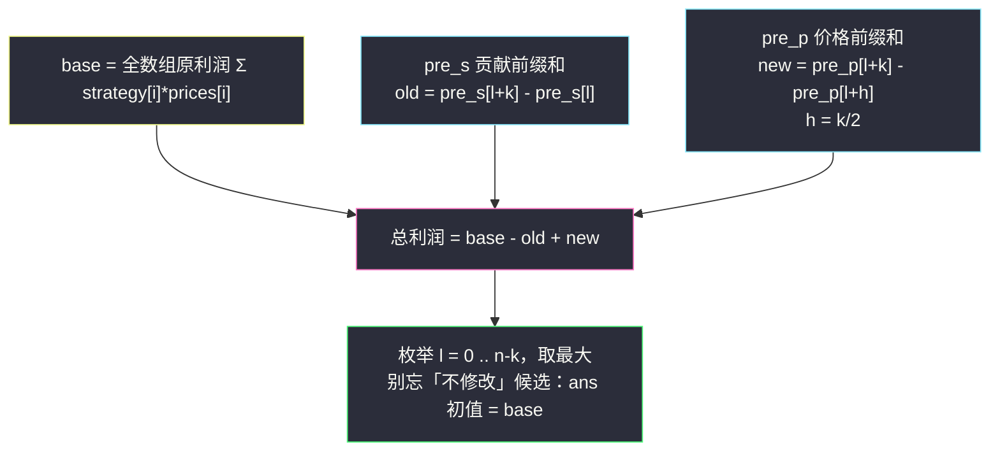
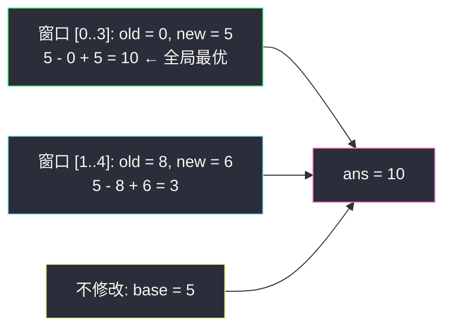

# 按策略买卖股票的最佳时机（前缀和 · 枚举定长修改窗口）

## 一、问题描述

给定长度为 `n` 的整数数组 `prices` 和同长度的整数数组 `strategy`：

- `prices[i]` 表示第 `i` 天的股票价格；
- `strategy[i] ∈ {-1, 0, 1}` 描述第 `i` 天的操作：`-1` 表示**买入**，`0` 表示**持有**（什么都不做），`1` 表示**卖出**。

按策略执行后的**总利润**为：

`Σ strategy[i] * prices[i]`

（买入计入负贡献，卖出计入正贡献，持有贡献为 0。）

现在允许你**至多执行一次修改**：选出**恰好 k 个**（`k` 为偶数）**连续**下标，把这 `k` 个元素改成——前 `k/2` 个为 `0`、后 `k/2` 个为 `1`。求修改后（或保持不变）能取得的最大利润。

> 🔗 LeetCode 3652：https://leetcode.cn/problems/best-time-to-buy-and-sell-stock-using-strategy/
>
> （2025 年新题，以上为题面转述，细节以题目页为准。）
>
> 约定：`2 <= k <= n`，`k` 为偶数，`n`、`q` 级别为 10^5，暴力重算每个窗口必然超时。

**示例 1**

```
输入：prices = [4, 2, 8], strategy = [-1, 0, 1], k = 2
输出：10
解释：把前两个下标（0 和 1）的元素改成 [0, 1]，
strategy 变为 [0, 1, 1]，利润 = 0*4 + 1*2 + 1*8 = 0 + 2 + 8 = 10。
```

不修改时利润为 `(-1)*4 + 0*2 + 1*8 = 4`，可见「抹掉买入、白记一次卖出」的修改极其划算。

**示例 2（讲解自拟）**

```
输入：prices = [3, 1, 4, 1, 5], strategy = [-1, -1, 1, 0, 1], k = 4
输出：10
解释：把下标 0..3 改成 [0, 0, 1, 1]，
strategy 变为 [0, 0, 1, 1, 1]，利润 = 0 + 0 + 4 + 1 + 5 = 10。
```

**直观理解**

修改的本质是「**局部重写**」：窗口内原来的贡献被整体替换成一个新的、只依赖 `prices` 的固定贡献（前半清零、后半全记卖出）。于是总利润 = 窗口外不动 + 窗口内替换。枚举窗口位置是 `O(n)` 个候选，难点只剩：**每个窗口的「原贡献」与「新贡献」如何 O(1) 算出**——这正是前缀和的舞台。

---

## 二、暴力解法

枚举所有起点 `l ∈ [0, n-k]`，对每个窗口花 `O(k)` 重新计算：窗口内的原贡献之和、以及把后半段全记卖出后的新贡献之和，取最大。

```python
class Solution:
    def maximumProfit(self, prices: List[int], strategy: List[int], k: int) -> int:
        n = len(prices)
        base = sum(s * p for p, s in zip(prices, strategy))   # 不修改的利润
        ans = base
        for l in range(n - k + 1):
            old = sum(strategy[t] * prices[t] for t in range(l, l + k))        # 窗口原贡献
            new = sum(prices[t] for t in range(l + k // 2, l + k))             # 新贡献
            ans = max(ans, base - old + new)
        return ans
```

### 复杂度

- **时间**：`O(nk)`，最坏 `O(n²)`（`n = 10^5` 时约 `10^10` 次运算）。
- **空间**：`O(1)`。

### 🔴 瓶颈在哪里

`n - k + 1` 个窗口互相大面积重叠，每个却都从头重算。窗口只滑动一格，变化的只有进出两个端点——「重叠区间的区间量查询」，前缀和的标准靶子。

---

## 三、优化探索（核心章节）

> 📚 本题在灵茶题单中属于 **§1.1 一维前缀和**：预处理前缀数组，把任意子区间的和压成 O(1) 的两式相减。本题要用**两个**前缀和分别伺候「原贡献」和「新贡献」。

### 3.1 把修改翻译成代数

设窗口为 `[l, l+k-1]`，`h = k/2`。修改后：

- 窗口外贡献不变：`Σ_{t ∉ 窗口} strategy[t] * prices[t]`；
- 窗口前半 `[l, l+h-1]` 全置 0：贡献 `0`；
- 窗口后半 `[l+h, l+k-1]` 全置 1：贡献 `Σ prices[t]`。

于是总利润：

`base − old(l) + new(l)`

其中 `base = Σ strategy[t] * prices[t]`（全数组原利润），`old(l)` = 窗口内原贡献，`new(l)` = 窗口后半段价格和。

### 3.2 两个前缀和数组

| 前缀数组 | 定义 | 用途 |
|----------|------|------|
| `pre_s[i] = Σ_{t < i} strategy[t] * prices[t]` | 贡献前缀和 | `old(l) = pre_s[l+k] − pre_s[l]` |
| `pre_p[i] = Σ_{t < i} prices[t]` | 价格前缀和 | `new(l) = pre_p[l+k] − pre_p[l+h]` |

`O(n)` 预处理后，每个窗口的候选答案变成常数次加减法。



### 3.3 窗口结构图

把窗口 `[l, l+k-1]` 画开：

```
下标:     l   ……  l+h-1 | l+h  ……  l+k-1
原状态:   strategy[t]      | strategy[t]
改为:     0 0 0 … 0        | 1 1 1 … 1
贡献:     全 0             | Σ prices[t]
```

窗口外（`< l` 与 `> l+k-1`）完全不动。注意新贡献里**没有 strategy 什么事**——前半被抹成 0，后半清一色记卖出，所以 `new` 只依赖 `prices` 的区间和。

### 3.4 一句话核心

> **总利润 = base − (窗口贡献前缀差) + (后半窗口价格前缀差)；两个 O(n) 前缀数组 + 一趟 O(n) 枚举，把 O(nk) 压成 O(n)。**

---

## 四、代码实现

### Python 主解

```python
class Solution:
    def maximumProfit(self, prices: List[int], strategy: List[int], k: int) -> int:
        n = len(prices)
        h = k // 2

        pre_s = [0] * (n + 1)      # 贡献前缀和：Σ strategy[t]*prices[t]
        pre_p = [0] * (n + 1)      # 价格前缀和：Σ prices[t]
        for i, (p, s) in enumerate(zip(prices, strategy)):
            pre_s[i + 1] = pre_s[i] + s * p
            pre_p[i + 1] = pre_p[i] + p

        base = pre_s[n]            # 不修改时的利润
        ans = base                 # 「至多一次修改」：允许不修改
        for l in range(n - k + 1):
            old = pre_s[l + k] - pre_s[l]          # 窗口 [l, l+k-1] 内原贡献
            new = pre_p[l + k] - pre_p[l + h]      # 窗口后半 [l+h, l+k-1] 的 Σ prices
            ans = max(ans, base - old + new)
        return ans
```

**变量含义**

| 变量 | 含义 |
|------|------|
| `h` | 半窗长 `k/2`（`k` 为偶数，整除无歧义） |
| `pre_s` | `strategy[i]*prices[i]` 的前缀和，负责「窗口内被抹掉的旧贡献」 |
| `pre_p` | `prices[i]` 的前缀和，负责「窗口后半的新贡献」 |
| `base` | 完全不修改的利润，同时是答案下界 |

**不变式**：`pre_s[i]` 恰好等于前 `i` 天贡献之和，故任意闭区间 `[a, b]` 的和 = `pre[b+1] − pre[a]`；`old`、`new` 均按此展开。

### Java

```java
// 按策略买卖股票的最佳时机
// 测试链接 : https://leetcode.cn/problems/best-time-to-buy-and-sell-stock-using-strategy/
class Solution {
    public long maximumProfit(int[] prices, int[] strategy, int k) {
        int n = prices.length, h = k / 2;
        long[] preS = new long[n + 1];
        long[] preP = new long[n + 1];
        for (int i = 0; i < n; i++) {
            preS[i + 1] = preS[i] + (long) strategy[i] * prices[i];
            preP[i + 1] = preP[i] + prices[i];
        }
        long base = preS[n];
        long ans = base;
        for (int l = 0; l + k <= n; l++) {
            long old = preS[l + k] - preS[l];
            long fresh = preP[l + k] - preP[l + h];
            ans = Math.max(ans, base - old + fresh);
        }
        return ans;
    }
}
```

> ⚠️ 提交前按题目页的函数签名/返回类型核对（新题偶有 `long` 与 `int` 之差）；累加建议一律 `long` 防溢出。

---

## 五、具体例子演示

**示例 1：`prices = [4, 2, 8]`，`strategy = [-1, 0, 1]`，`k = 2`（h = 1）**

第一步，构建两个前缀数组（`pre[i]` 表示前 `i` 项之和，第 0 列是哨兵 0）：

| 前缀下标 i | 0（哨兵） | 1 | 2 | 3 |
|-------------|-----------|---|---|---|
| pre_s[i]    | 0 | −4 | −4 | 4 |
| pre_p[i]    | 0 | 4 | 6 | 14 |

（过程：贡献序列 = [(−1)*4, 0*2, 1*8] = [−4, 0, 8]，价格序列 = [4, 2, 8]，各自从左往右累加。）

`base = pre_s[3] = 4`。第二步，枚举窗口（`n − k + 1 = 2` 个）：

| l | 窗口 | old = pre_s[l+2] − pre_s[l] | new = pre_p[l+2] − pre_p[l+1] | base − old + new |
|---|-------|------------------------------|-------------------------------|------------------|
| 0 | [0,1] | −4 − 0 = −4 | 6 − 4 = 2 | 4 − (−4) + 2 = **10** |
| 1 | [1,2] | 4 − (−4) = 8 | 14 − 6 = 8 | 4 − 8 + 8 = 4 |

`ans = max(4, 10, 4) = 10` ✓——正是示例 1 的答案：把前两个元素改成 `[0, 1]`，白得 `2 + 8 = 10`。

**示例 2：`prices = [3, 1, 4, 1, 5]`，`strategy = [-1, -1, 1, 0, 1]`，`k = 4`（h = 2）**

第一步，前缀数组逐项表（同样含哨兵列）：

| 前缀下标 i | 0（哨兵） | 1 | 2 | 3 | 4 | 5 |
|-------------|-----------|---|---|---|---|---|
| pre_s[i]    | 0 | −3 | −4 | 0 | 0 | 5 |
| pre_p[i]    | 0 | 3 | 4 | 8 | 9 | 14 |

（过程：贡献序列 = [(−1)*3, (−1)*1, 1*4, 0*1, 1*5] = [−3, −1, 4, 0, 5]，价格序列 = [3, 1, 4, 1, 5]，各自累加。）

`base = pre_s[5] = 5`。第二步，枚举窗口（`5 − 4 + 1 = 2` 个）：

| l | 窗口 [l, l+k-1] | 后半 [l+h, l+k-1] | old = pre_s[l+4] − pre_s[l] | new = pre_p[l+4] − pre_p[l+2] | base − old + new |
|---|-------|-----|-----|-----|------------------|
| 0 | [0..3] | [2..3] | 0 − 0 = 0 | 9 − 4 = 5（prices[2]+prices[3] = 4+1） | 5 − 0 + 5 = **10** |
| 1 | [1..4] | [3..4] | 5 − (−3) = 8 | 14 − 8 = 6（prices[3]+prices[4] = 1+5） | 5 − 8 + 6 = 3 |

`ans = max(5, 10, 3) = 10` ✓。手工核对最优窗口：strategy 变为 `[0, 0, 1, 1, 1]`，利润 = `0 + 0 + 4 + 1 + 5 = 10`，与公式一致。



**对着上表盯一眼：两个高频偏移笔误**

1. `old = pre_s[l+k] − pre_s[l]`：当 `l = 0` 时是 `pre_s[k] − pre_s[0]`，而 `pre_s[0]` 是哨兵 0——别把第 1 个元素的值（`pre_s[1]`）当成 `pre_s[0]` 用；
2. `new = pre_p[l+k] − pre_p[l+h]`：后半窗口从下标 `l+h` 开始，减数是 `pre_p[l+h]`（不是 `pre_p[l+h-1]`，也不要丢掉 `l` 只写 `pre_p[h]`）。

---

## 六、复杂度分析

| 方法 | 时间 | 空间 | 说明 |
|------|------|------|------|
| 暴力逐窗重算 | `O(nk)` | `O(1)` | 窗口重叠部分被反复计算 |
| 双前缀和 + 枚举窗口（主解） | `O(n)` | `O(n)` | 预处理 + 一趟枚举 |
| 双前缀和 → 定长滑窗增量 | `O(n)` | `O(1)` | 窗口只滑动一格，`old/new` 各用增量维护 |

---

## 七、对比总结

**「定长窗口 + 前缀和」模板**

1. 把「修改/操作」翻译成代数：`总收益 = base − 被覆盖部分原值 + 覆盖部分新值`；
2. 原值、新值各配一个前缀数组（本题 `pre_s`、`pre_p`）；
3. 枚举窗口起点，每步 O(1) 合成候选；
4. 若操作可选，`ans` 初值别忘了 `base`。

**易错点**

1. **「至多一次修改」** → 答案下界是不修改的 `base`，`ans` 必须以 `base` 起步。
2. `new` 的区间是 `[l+h, l+k-1]`，对应前缀差 `pre_p[l+k] − pre_p[l+h]`，偏移 `l+h` 极易写错。
3. 前缀数组第 0 项是哨兵 0：区间 `[a, b]` 的和是 `pre[b+1] − pre[a]`，别把 `pre[0]` 当成第一个元素。
4. `k` 恰为窗口长度（不是上界）：枚举范围是 `l ∈ [0, n-k]`。
5. Java 溢出：贡献和可能达到 `n * max(prices) * 2` 量级，累加用 `long`。

---

## 八、举一反三

| 题目 | 关系 |
|------|------|
| [1052. 爱生气的书店老板](https://leetcode.cn/problems/grumpy-bookstore-owner/) | **同型母题**：定长窗口内「替换贡献」取最大，前缀和/滑窗皆可 |
| [643. 子数组最大平均数 I](https://leetcode.cn/problems/maximum-average-subarray-i/) | 定长窗口和最裸的形态 |
| [1423. 可获得的最大点数](https://leetcode.cn/problems/maximum-points-you-can-obtain-from-cards/) | 定长窗口取反视角（留中间丢两端），窗口思想变形 |
| [1031. 两个非重叠子数组的最大和](https://leetcode.cn/problems/maximum-sum-of-two-non-overlapping-subarrays/) | 定长窗口和 + 前后缀配合，本题进阶版 |
| 同批 [#1523 在区间范围内统计奇数数目](https://leetcode.cn/problems/count-odd-numbers-in-an-interval-range/) | 见同目录 `count-odd-numbers-in-an-interval-range.md`：前缀函数差的最纯形态 |
| 同目录 [#930 和相同的二元子数组](https://leetcode.cn/problems/binary-subarrays-with-sum/) | 见 `binary-subarrays-with-sum.md`：前缀思想的滑窗化身 |

**思想迁移**

- 「**至多一次修改使总收益最大**」几乎等价于「**枚举修改窗口，窗口内收益换血**」：把修改的收益差写成 `new − old`，问题变成求 `max(new(l) − old(l))`，两个前缀和各自伺候。
- 修改长度固定（本题恰 `k`）→ 定长窗口；修改长度任意 → 变长窗口或 DP。
- 口诀：**「改窗算差值，前后缀伺候；base 别忘兜，偏移 l 加 h。」**

---
