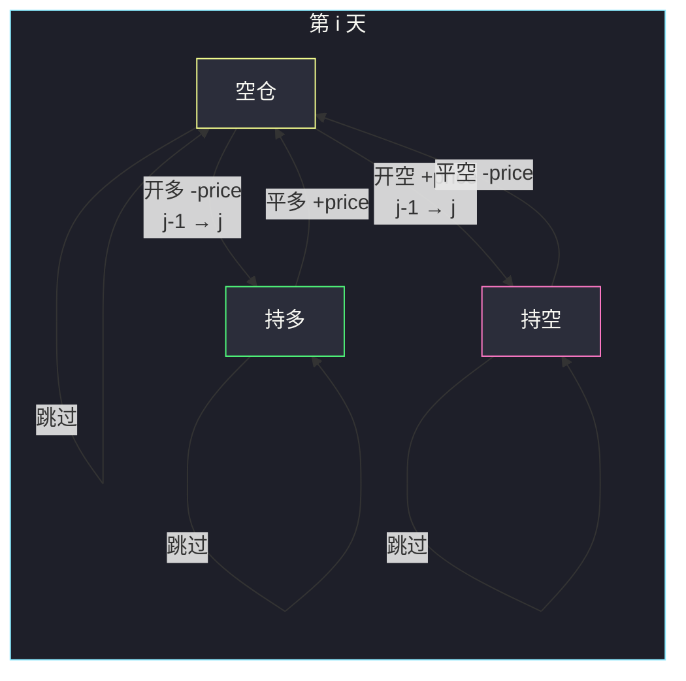

# 3573. 买卖股票的最佳时机 V（Best Time to Buy and Sell Stock V）

> 题目来源：[https://leetcode.cn/problems/best-time-to-buy-and-sell-stock-v/](https://leetcode.cn/problems/best-time-to-buy-and-sell-stock-v/)
>
> 灵茶题单小节定位：§6.1 买卖股票

## 一、问题描述

给你整数数组 `prices`（`prices[i]` 是第 `i` 天价格）和整数 `k`。最多进行 `k` 笔交易，每笔可以是下面两种之一：

- **普通多头**：第 `i` 天买入、之后第 `j` 天卖出（`i < j`），利润 `prices[j] - prices[i]`；
- **空头**：第 `i` 天卖出、之后第 `j` 天买回，利润 `prices[i] - prices[j]`。

同一时刻只能有一笔进行中；必须先结束当前交易才能开下一笔；**同一天不能做两次买卖**（不能当天平仓再开仓）。求最大总利润。

**数据范围**：

- `2 <= prices.length <= 10^3`
- `1 <= prices[i] <= 10^9`
- `1 <= k <= prices.length / 2`

**示例 1**：

```text
输入：prices = [1,7,9,8,2], k = 2
输出：14
解释：第 0 天买 1、第 2 天卖 9（+8）；第 3 天空头卖 8、第 4 天买回 2（+6）。合计 14。
```

**示例 2**：

```text
输入：prices = [12,16,19,19,8,1,19,13,9], k = 3
输出：36
解释：12 买 / 19 卖（+7）；19 空头 / 8 买回（+11）；1 买 / 19 卖（+18）。合计 36。
```

**核心思考点**：经典股票 DP 多一个「持空」状态。第 `i` 天、已用 `j` 笔、状态 ∈ {空仓, 持多, 持空}。开仓消耗一笔额度，平仓不消耗。平仓从「昨天的持仓」转移，因此无法同天衔接。记忆化不要用 `-1` 当未访问哨兵：持多利润是 `-prices[i]`，价格为 1 时恰好是 `-1`，会把算过的状态当成没算过，直接 TLE。

## 二、暴力解法

### 思路

DFS 枚举每一天：跳过、开多、开空、平多、平空。结束时必须空仓（未平仓的交易不算）。与主解三维数组独立。

### 代码

```python
def maximumProfitBrute(prices: list[int], k: int) -> int:
    n = len(prices)
    best = 0

    def dfs(i: int, used: int, st: int, profit: int) -> None:
        nonlocal best
        if i == n:
            if st == 0:
                best = max(best, profit)
            return
        dfs(i + 1, used, st, profit)
        if st == 0:
            if used < k:
                dfs(i + 1, used + 1, 1, profit - prices[i])
                dfs(i + 1, used + 1, 2, profit + prices[i])
        elif st == 1:
            dfs(i + 1, used, 0, profit + prices[i])
        else:
            dfs(i + 1, used, 0, profit - prices[i])

    dfs(0, 0, 0, 0)
    return best
```

### 复杂度

- 时间：大约 `O(3^n)` 量级。`n = 1000` 不可用；对拍缩到 `n ≤ 7`。
- 空间：`O(n)` 递归栈。

## 三、优化探索

### 3.1 三个状态，额度记在开仓上 ⭐

`f[i][j][s]` = 前 `i` 天（下标 `0..i`）、已经**开过** `j` 笔、当天结束时状态为 `s` 的最大利润。

- `s = 0` 空仓；
- `s = 1` 持多（手里有一张多单）；
- `s = 2` 持空。

`j` 在开仓时 +1，平仓不变。`f[*][0][0] = 0` 表示一笔都不做。因为所有 `j` 的空仓都可以从「什么都不做」过来，求的是**至多** `k` 笔。

### 3.2 转移：平仓看昨天持仓，开仓看昨天空仓 ⭐⭐

```text
空仓: f[i][j][0] = max(
        f[i-1][j][0],                 继续空
        f[i-1][j][1] + prices[i],      昨天持多，今天卖
        f[i-1][j][2] - prices[i]     昨天持空，今天买回
     )
持多: f[i][j][1] = max(
        f[i-1][j][1],                 继续持多
        f[i-1][j-1][0] - prices[i]   昨天空仓，今天开多（用掉第 j 笔）
     )
持空: f[i][j][2] = max(
        f[i-1][j][2],
        f[i-1][j-1][0] + prices[i]    昨天空仓，今天开空
     )
```

开仓来自 `f[i-1][..][0]` 而不是 `f[i][..][0]`：今天刚平掉的空仓不能今天再开，满足「不能同天衔接」。隔天平仓再开是允许的——示例 1 就是第 2 天平多、第 3 天开空。

### 3.3 初值与哨兵 ⭐⭐

第 0 天：对 `j = 1..k`，

- `f[0][j][1] = -prices[0]`（当天开多）；
- `f[0][j][2] = prices[0]`（当天开空）；
- `f[0][j][0] = 0`。

答案是 `f[n-1][k][0]`（必须空仓）。

若改成记忆化 `dfs(i, j, s)`，**不要把数组填成 -1 表示未访问**：持多的合法利润就是 `-prices[i]`，`prices[i]` 可为 1。空仓走了一笔亏钱的交易后中间状态也可能是负数。用 `None` / 单独 `vis` / 或像本题这样直接递推。



## 四、代码实现

### 主解：三维 DP

```python
class Solution:
    def maximumProfit(self, prices: list[int], k: int) -> int:
        n = len(prices)
        f = [[[0] * 3 for _ in range(k + 1)] for _ in range(n)]
        for j in range(1, k + 1):
            f[0][j][1] = -prices[0]
            f[0][j][2] = prices[0]
        for i in range(1, n):
            for j in range(1, k + 1):
                f[i][j][0] = max(
                    f[i - 1][j][0],
                    f[i - 1][j][1] + prices[i],
                    f[i - 1][j][2] - prices[i],
                )
                f[i][j][1] = max(f[i - 1][j][1], f[i - 1][j - 1][0] - prices[i])
                f[i][j][2] = max(f[i - 1][j][2], f[i - 1][j - 1][0] + prices[i])
        return f[n - 1][k][0]
```

### 对照：滚动到「上一天」两个维度（省掉天数）

```python
class Solution:
    def maximumProfit(self, prices: list[int], k: int) -> int:
        emp = [0] * (k + 1)
        long = [0] + [-prices[0]] * k
        short = [0] + [prices[0]] * k
        for p in prices[1:]:
            ne, nl, ns = emp[:], long[:], short[:]
            for j in range(1, k + 1):
                ne[j] = max(emp[j], long[j] + p, short[j] - p)
                nl[j] = max(long[j], emp[j - 1] - p)
                ns[j] = max(short[j], emp[j - 1] + p)
            emp, long, short = ne, nl, ns
        return emp[k]
```

滚动时必须先拷贝再写：`nl[j]` 依赖的是**昨天**的 `emp[j-1]`，同一轮里 `ne[j]` 已经是今天的空仓。

### 细节说明

- **利润用 Python int**：`prices[i]` 到 `10^9`，`k` 到 500，乘起来会超 32 位；Java/C++ 要 `long`。
- **`k` 上界 `n/2`**：一笔至少占两天，额度不会比这更大。
- **不做交易利润为 0**：空仓初值 0，不会被亏钱路径带下去（`max` 会留下 0）。
- **记忆化哨兵**：`memo[i][j][1]` 合法值可以是 `-1`；空头持仓本身是 `+prices` 多为正，但平空后的空仓中间值仍可能为负。一律不要用 `-1` 当「没算过」。
- **对拍**：`n ≤ 7`、`k ≤ n/2`、价格 `1..12`，DFS 枚举跳过/开多/开空/平仓（结束必须空仓）400 组。价格里故意包含 1，专门打「持多利润 = -1」这条。官方两个示例与递推表已对齐。

## 五、例子演示

**示例 1：`prices = [1,7,9,8,2], k = 2`**

下表每个格子是 `(空仓, 持多, 持空)`。持多等于「已实现利润 − 当前买入价」，所以会出现 `-1`。

| 天 i | 价 | j=1 (空, 多, 空头) | j=2 (空, 多, 空头) |
|---|---|---|---|
| 0 | 1 | (0, -1, 1) | (0, -1, 1) |
| 1 | 7 | (6, -1, 7) | (6, -1, 7) |
| 2 | 9 | (8, -1, 9) | (8, -1, 15) |
| 3 | 8 | (8, -1, 9) | (8, 0, 16) |
| 4 | 2 | (8, -1, 9) | (**14**, 6, 16) |

读第 4 天 `j=2` 空仓 14 的一条路径：

- 第 0 天开多 −1，第 2 天卖 9 → 空仓 8（`j=1`）；
- 第 3 天开空：空仓 8 + 价 8 = 持空 16（`j=2`）；
- 第 4 天买回 2：16 − 2 = **14**。

若第 2 天就把第二笔开成空头（持空 15），第 4 天买回只有 13，不如上面这条。

**示例 2** 三笔：多头 12→19（+7）、空头 19→8（+11）、多头 1→19（+18），终点空仓 36。中间隔天开仓，没有同天平仓再开。

## 六、复杂度分析

设 `n = len(prices)`：

- **时间复杂度：`O(n · k)`**——每天每种额度三个状态常数转移。
- **空间复杂度：`O(n · k)`**；滚动后 `O(k)`。

## 七、对比总结

| 维度 | DFS 枚举路径 | 三维 DP | 记忆化 DFS |
|---|---|---|---|
| 时间 | 指数 | `O(nk)` | 同左（状态数 `nk·3`） |
| 同天衔接 | 平仓跳到 `i+1` 自然禁止 | 开仓读 `i-1` 的空仓 | 同样读「下一天」 |
| 哨兵 | 不需要 | 直接递推 | **禁止 -1** |

**套路归纳**：§6.1 买卖股票的统一骨架是「天数 × 已用次数 × 持仓状态」。普通题只有空仓/持多；本题加持空，开多 `-p`、开空 `+p`，平仓符号相反。次数记在开仓，平仓只改状态。同一天不能开新仓，靠「从昨天空仓转移」卡住。

## 八、举一反三

1. **[121. 买卖股票的最佳时机](https://leetcode.cn/problems/best-time-to-buy-and-sell-stock/)**：`k = 1` 且只有多头。
2. **[122. 买卖股票的最佳时机 II](https://leetcode.cn/problems/best-time-to-buy-and-sell-stock-ii/)**：无限次多头，`k` 维可以压掉。
3. **[123. 买卖股票的最佳时机 III](https://leetcode.cn/problems/best-time-to-buy-and-sell-stock-iii/)**：`k = 2` 多头。
4. **[188. 买卖股票的最佳时机 IV](https://leetcode.cn/problems/best-time-to-buy-and-sell-stock-iv/)**：至多 `k` 笔多头，本题是它加上空头状态。
5. **[309. 买卖股票的最佳时机含冷冻期](https://leetcode.cn/problems/best-time-to-buy-and-sell-stock-with-cooldown/)**：平仓后还要再空一天，和「不能同天衔接」是同一类约束，只是冷冻更长。

**同族互引**：同目录 `best-time-to-buy-and-sell-stock-using-strategy.md` 是前缀和改策略，不是次数 DP。本题与 188 共用 `f[i][j][持仓]` 骨架，多出来的只是 `s=2` 那一维。
