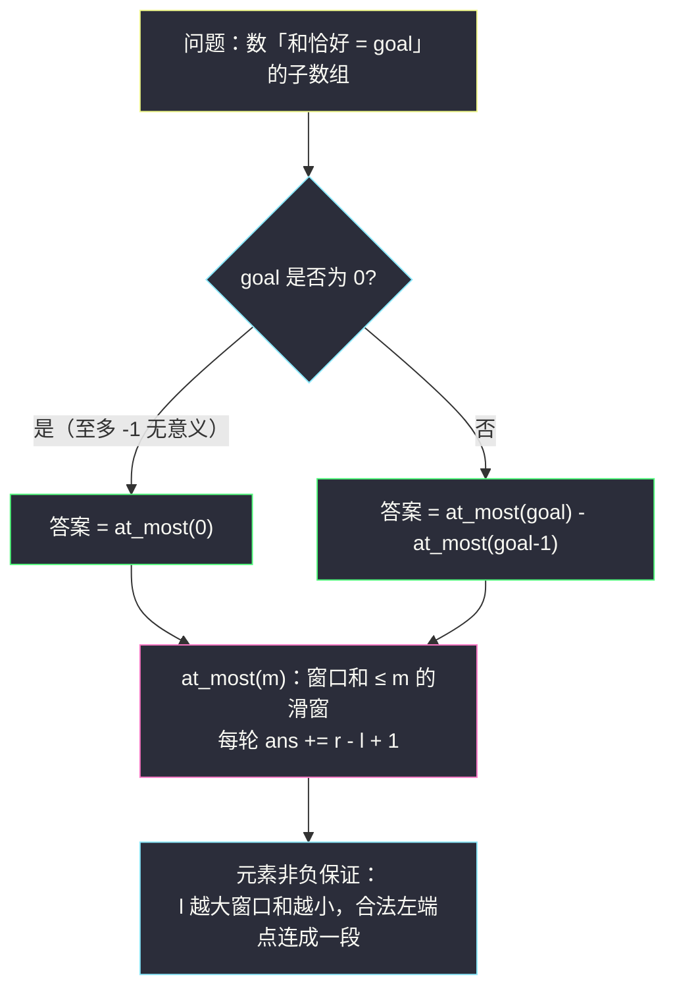
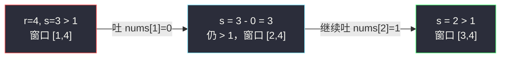

# 和相同的二元子数组（不定长滑窗 · 恰好 = 至多 − 至多）

## 一、问题描述

给你一个二元数组 `nums`（元素只会是 `0` 或 `1`），和一个整数 `goal`，请你统计并返回有多少个**非空子数组**的元素和**恰好等于** `goal`。

> 🔗 LeetCode 930：https://leetcode.cn/problems/binary-subarrays-with-sum/
>
> 数据范围：`1 <= nums.length <= 3 * 10^4`，`nums[i]` 不是 `0` 就是 `1`，`0 <= goal <= nums.length`。

**示例 1**

```
输入：nums = [1,0,1,0,1], goal = 2
输出：4
解释：有 4 个满足要求的子数组：[1,0,1]、[1,0,1,0]、[0,1,0,1]、[1,0,1]。
```

**示例 2**

```
输入：nums = [0,0,0,0,0], goal = 0
输出：15
解释：所有子数组的和都是 0，数组共有 15 个非空子数组。
```

**直观理解**

元素非负、目标和固定——这是「**恰好型**」计数。与 [#1248 统计「优美子数组」](https://leetcode.cn/problems/count-number-of-nice-subarrays/)（见同批题解 `count-number-of-nice-subarrays.md`）**完全同构**：那里把「是否为奇数」映射成 1/0，本题的元素天生就是 1/0，`goal` 对应那里的 `k`。因此同一个套路直接平移：**恰好(goal) = 至多(goal) − 至多(goal−1)**。

本题多了一个必须小心的边界：`goal = 0` 时 `goal − 1 = -1`，「至多 −1 个」的窗口没有意义，要提前返回 0。

---

## 二、暴力解法

枚举所有子数组 `[i..j]`，累加元素和，等于 `goal` 就计入答案。元素非负，和只增不减，超过 `goal` 可提前剪枝。

```python
class Solution:
    def numSubarraysWithSum(self, nums: List[int], goal: int) -> int:
        n, ans = len(nums), 0
        for i in range(n):
            s = 0                        # 当前子数组的元素和
            for j in range(i, n):
                s += nums[j]
                if s == goal:
                    ans += 1
                elif s > goal:           # 非负元素，和只会更大，提前剪枝
                    break
        return ans
```

### 复杂度

- **时间**：`O(n²)`（最坏如全 0 且 `goal = 0` 时无剪枝，恰好 `n(n+1)/2` 次）。
- **空间**：`O(1)`。

### 🔴 瓶颈在哪里

`n = 3 * 10^4` 时 `n²/2 ≈ 4.5 * 10^8`，超时。和 #1248 一样，问题出在每个起点都从零累加，没有复用窗口信息。

---

## 三、优化探索（核心章节）

> 📚 本题在灵茶题单中属于 **§2.3 求子数组个数**（不定长滑动窗口 · 第三类），与 #1248 是同一小节的姊妹题。灵神（lyl）处理「和恰好为 goal」的标准转换：**恰好(goal) = 至多(goal) − 至多(goal−1)**，两趟「固定右端点、数合法左端点」的滑窗搞定。

### 3.1 观察特征

| 特征 | 说明 |
|------|------|
| 连续子数组 | 滑动窗口 `[l..r]` |
| 元素非负（0/1） | 窗口和 `s` 随 `r` 增大不减、随 `l` 增大不增 → 单调性完备 |
| 求和恰好为 goal 的**个数** | 恰好型，先转「至多」 |

### 3.2 「恰好」的左端点不连续（回顾反例）

固定右端点 `r` 时，「和恰好 = goal」的左端点可能孤立存在。取 `nums = [1,1,1,1]`、`goal = 2`、`r = 3`：

| 左端点 l | 子数组 | 和 | 恰好为 2？ |
|---------|--------|----|-----------|
| 0 | `[1,1,1,1]` | 4 | ✗ |
| 1 | `[1,1,1]` | 3 | ✗ |
| 2 | `[1,1]` | 2 | ✓ |
| 3 | `[1]` | 1 | ✗ |

合法左端点只有 `{2}`，不连成一段 → 直接滑窗数不了。

而「和 ≤ m」的左端点一定连成一段 `[L, r]`（`l` 越大窗口越短、和越小）→ 可滑窗。于是用差集思想：

> **恰好(goal) = 至多(goal) − 至多(goal−1)**

「和 ≤ goal」挖掉「和 ≤ goal−1」，剩下的正是「和 = goal」。



### 3.3 「至多」的滑窗（固定 r 数左边）

和 #1248 的 `at_most` 只差一行贡献函数（那边是 `x % 2`，这边是 `x` 本身）：

- 纳入 `nums[r]`：`s += nums[r]`；
- 若 `s > m`：吐左 `s -= nums[l]; l += 1`（0 元素吐了不影响 `s`，但窗口变短，务必继续吐而不是死等）；
- `ans += r - l + 1`：以 `r` 结尾、和 ≤ m 的子数组个数。

**关键细节**：吐左的循环条件只看 `s > m`，**不是**看吐的是不是 0。连续一堆 0 会被一口气吐掉——正确，因为左端点在 `[l, r]` 内任取都合法，吐 0 不改变「以 r 结尾的合法个数」的计数起点。

### 3.4 与 #1248 的同构映射

| 本题（#930） | #1248 |
|--------------|-------|
| 元素 `0/1` | `nums[i] % 2` 映射成 `0/1` |
| 窗口和 `s` | 窗口内奇数个数 `cnt` |
| `goal` | `k` |
| `goal = 0` 需保护 `at_most(-1) = 0` | `k >= 1` 天然无此边界 |

### 3.5 一句话核心

> **0/1 数组的「和恰好为 goal」=「和 ≤ goal」减「和 ≤ goal−1」；两趟固定右端点的单调滑窗，各数一遍 `r - l + 1`，相减即答案。**

---

## 四、代码实现

### Python（主解：至多转换，模板与 #1248 完全一致）

```python
class Solution:
    def numSubarraysWithSum(self, nums: List[int], goal: int) -> int:
        def at_most(m: int) -> int:
            """元素和「至多 m」的子数组个数（m < 0 时没有任何子数组满足）"""
            if m < 0:                        # goal = 0 时会传进来 -1，必须保护
                return 0
            ans = s = l = 0
            for r, x in enumerate(nums):
                s += x                       # 纳入 nums[r]
                while s > m:                 # 和超了，收缩左端（可能连吐多个 0）
                    s -= nums[l]
                    l += 1
                ans += r - l + 1             # 以 r 结尾、和 ≤ m 的子数组个数
            return ans
        return at_most(goal) - at_most(goal - 1)
```

**变量含义**

| 变量 | 含义 |
|------|------|
| `m` | 「至多」的上限，先 `goal` 后 `goal-1` |
| `s` | 当前窗口 `[l..r]` 的元素和 |
| `l` / `r` | 窗口左右端，均只前进 |
| `r - l + 1` | 以 `r` 结尾的合法子数组个数 |

**循环不变式**：每轮累加前，窗口和 `s ≤ m` 且 `l` 是满足该性质的最小左端点。

### Java（最优解同款写法）

```java
// 和相同的二元子数组
// 测试链接 : https://leetcode.cn/problems/binary-subarrays-with-sum/
class Solution {
    public int numSubarraysWithSum(int[] nums, int goal) {
        return atMost(nums, goal) - atMost(nums, goal - 1);
    }

    // 元素和至多 m 的子数组个数
    private int atMost(int[] nums, int m) {
        if (m < 0) {
            return 0;
        }
        int ans = 0, s = 0;
        for (int l = 0, r = 0; r < nums.length; r++) {
            s += nums[r];
            while (s > m) {
                s -= nums[l];
                l++;
            }
            ans += r - l + 1;
        }
        return ans;
    }
}
```

---

## 五、具体例子演示

以 `nums = [1,0,1,0,1]`、`goal = 2` 端到端走一遍。

**第一趟：`at_most(2)`（和 ≤ 2 的子数组个数）**

| r | nums[r] | 进窗后 s | 动作 | 窗口 [l, r] | 本轮累加 r-l+1 | ans |
|---|---------|---------|------|------------|----------------|-----|
| 0 | 1 | 1 | 合法 | [0, 0] | 1 | 1 |
| 1 | 0 | 1 | 合法 | [0, 1] | 2 | 3 |
| 2 | 1 | 2 | 合法（=2 未超） | [0, 2] | 3 | 6 |
| 3 | 0 | 2 | 合法 | [0, 3] | 4 | 10 |
| 4 | 1 | 3 > 2 | 吐 nums[0]=1，s=2，l=1 | [1, 4] | 4 | **14** |

**第二趟：`at_most(1)`（和 ≤ 1 的子数组个数）**

| r | nums[r] | 进窗后 s | 动作 | 窗口 [l, r] | 本轮累加 r-l+1 | ans |
|---|---------|---------|------|------------|----------------|-----|
| 0 | 1 | 1 | 合法 | [0, 0] | 1 | 1 |
| 1 | 0 | 1 | 合法 | [0, 1] | 2 | 3 |
| 2 | 1 | 2 > 1 | 吐 nums[0]=1，s=1，l=1 | [1, 2] | 2 | 5 |
| 3 | 0 | 1 | 合法 | [1, 3] | 3 | 8 |
| 4 | 1 | 2 > 1 | 吐 nums[1]=0（s 不变）→ 吐 nums[2]=1，s=1，l=3 | [3, 4] | 2 | **10** |

注意 `r = 4` 这一步：吐掉下标 1 的 `0` 后 `s` 仍为 2，**继续吐**下标 2 的 `1` 才恢复合法——这就是「连吐 0」的典型场景。

**相减：14 − 10 = 4** ✓（对应 `[1,0,1]`、`[1,0,1,0]`、`[0,1,0,1]`、`[1,0,1]`）

**再看 goal = 0 的边界**：`nums = [0,0,0,0,0]`。`at_most(0)` 中 `s` 始终为 0，每轮累加 `r+1`，得 `1+2+3+4+5 = 15`；`at_most(-1)` 命中保护直接返回 0；答案 `15 - 0 = 15` ✓。



（上图为 `at_most(1)` 在 `r = 4` 处的连吐过程示意：0 元素吐掉后和不变，循环条件只认 `s > m`。）

---

## 六、复杂度分析

| 方法 | 时间 | 空间 | 说明 |
|------|------|------|------|
| 暴力枚举 | `O(n²)` | `O(1)` | 每个起点重新累加 |
| 至多转换滑窗 | `O(n)` | `O(1)` | 两趟窗口，`l`、`r` 各至多前进 n 次 |

---

## 七、对比总结

**同模板三兄弟**

| 题 | 贡献函数 f(x) | 恰好 = 至多 − 至多 |
|----|---------------|---------------------|
| #1248 优美子数组 | `x % 2` | 恰好 k 个奇数 |
| #930 二元子数组（本篇） | `x` | 和恰好为 goal |
| #713 乘积小于 K | 乘积（不能减） | 无需转换，直接数 |

**易错点**

1. **`goal = 0` 的保护**：`at_most(-1)` 若不提前 return，`while s > -1` 恒真 → 死循环/越界。这是本题相对 #1248 最容易翻车的地方。
2. 吐左的循环条件是 `while s > m`，不要写成「吐到和恰好变化」——0 元素必须照吐。
3. `ans += r - l + 1` 的含义是以 `r` 结尾的合法个数，不是 1。
4. 本解法依赖**元素非负**；若数组可含负数（如 #560），和失去单调性，滑窗失效，只能用前缀和 + 哈希。

**模板（至多型求个数，Python 版）**

```python
def at_most(m):
    if m < 0: return 0
    ans = s = l = 0
    for r, x in enumerate(nums):
        s += x
        while s > m:
            s -= nums[l]; l += 1
        ans += r - l + 1
    return ans
# 恰好 goal 个 = at_most(goal) - at_most(goal - 1)
```

---

## 八、举一反三

| 题目 | 关系 |
|------|------|
| [1248. 统计「优美子数组」](https://leetcode.cn/problems/count-number-of-nice-subarrays/) | **同构母题**，见同批题解 `count-number-of-nice-subarrays.md`，先看它再看本篇事半功倍 |
| [560. 和为 K 的子数组](https://leetcode.cn/problems/subarray-sum-equals-k/) | 恰好型的另一条路：前缀和 + 哈希；含负数时唯一可行 |
| [713. 乘积小于 K 的子数组](https://leetcode.cn/problems/subarray-product-less-than-k/) | 灵神 §2.3 入门题：「越长越不合法」直接数，不转换 |
| [1358. 包含所有三种字符的子字符串数目](https://leetcode.cn/problems/number-of-substrings-containing-all-three-characters/) | 同小节「越长越合法」形态，固定 r 数左边，见 `number-of-substrings-containing-all-three-characters.md` |
| [2962. 统计最大元素出现至少 K 次的子数组](https://leetcode.cn/problems/count-subarrays-where-max-element-appears-at-least-k-times/) | 「至少」形态，同小节，见 `count-subarrays-where-max-element-appears-at-least-k-times.md` |
| [2488. 统计中位数为 K 的子数组](https://leetcode.cn/problems/count-subarrays-with-median-k/) | 「恰好型」的进阶版：把「大于 K / 小于 K 的个数差」转成两个「至少/至多」计数 |

**思想迁移**

- 「非负数组 + 和恰好为 goal」→ **恰好 = 至多 − 至多**，O(n) 时间 O(1) 空间。
- 遇到 `goal`、`k` 可能为 0 的计数题，先检查 `at_most(k-1)` 会不会收到负数参数。
- 口诀：**「目标可为零，减一变负数；先判再滑窗，两趟差出数。」**
