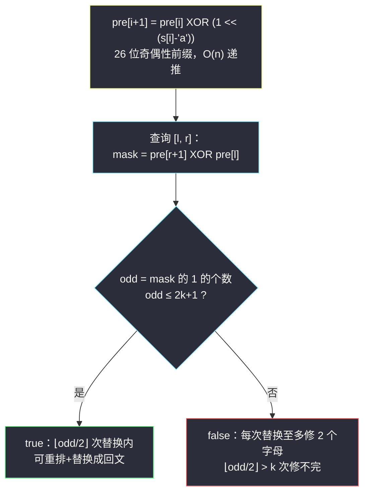
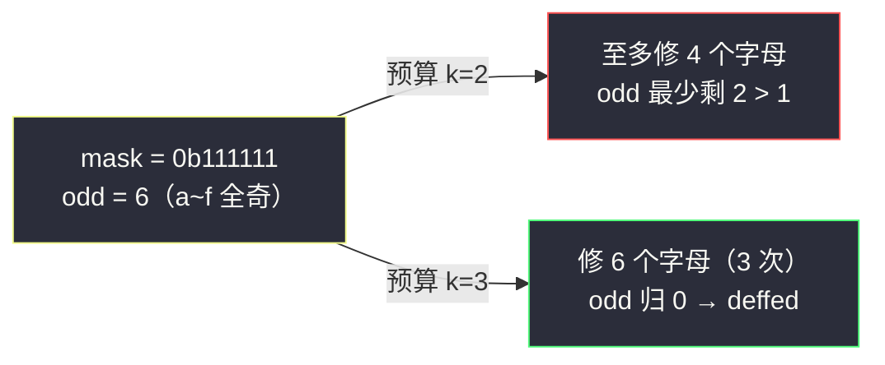

# 构建回文串检测（状态压缩前缀和 · 26 位奇偶性异或）

## 一、问题描述

给你一个字符串 `s`（仅含小写英文字母）和一个查询数组 `queries`，其中 `queries[i] = [left, right, k]`。

每个查询互相独立，允许执行如下操作处理子串 `s[left..right]`（`left`、`right` 均为下标，两端包含）：

1. **重新排列**子串中的字符（顺序任意）；
2. 将其中**至多 `k` 个**字符**替换**成任意小写英文字母。

若能通过上述操作把子串变成回文串，该查询答案为 `true`，否则为 `false`。返回所有查询的答案数组。

> 🔗 LeetCode 1177：https://leetcode.cn/problems/can-make-palindrome-from-substring/
>
> 数据范围：`1 <= s.length, queries.length <= 10^5`，`0 <= queries[i][0] <= queries[i][1] < s.length`，`0 <= queries[i][2] <= s.length`。

**示例 1（讲解自拟）**

```
输入：s = "abcbc", queries = [[0,1,0],[0,1,1],[0,4,0],[1,4,1]]
输出：[false, true, true, true]
解释：
- [0,1,0]: 子串 "ab"，a、b 各 1 次（2 个奇数字母），0 次替换修不完 → false
- [0,1,1]: "ab" 把 a 改成 b 得 "bb" → true
- [0,4,0]: "abcbc" 中 a:1, b:2, c:2，只有 1 个奇数字母，可排成 "bcabc" → true
- [1,4,1]: "bcbc" 全偶，本身就是 "bccb" → true
```

**示例 2（讲解自拟）**

```
输入：s = "abcdef", queries = [[0,5,2],[0,5,3],[2,5,1]]
输出：[false, true, false]
解释：
- [0,5,2]: "abcdef" 六个字母全奇（odd=6），需要 ⌊6/2⌋=3 次替换，预算只有 2 → false
- [0,5,3]: 3 次替换足够，如 a→d, b→e, c→f 得 "ddeeff"，排成 "deffed" → true
- [2,5,1]: "cdef" 四个字母全奇（odd=4），需要 2 次 > 1 → false
```

**直观理解**

字符串可以重排，说明**字符的顺序完全不重要，只有每个字母出现次数的奇偶性重要**。而「回文」对奇偶性的要求是刻在骨子里的：回文串从中间对折，除中心一个字符外全部成对——即**出现次数为奇数的字母至多 1 个**。于是问题变成：区间内有多少个字母出现奇数次？配上替换预算，一次比较出答案。

---

## 二、暴力解法

对每个查询，遍历子串统计 26 个字母的出现次数，数出奇数字母个数 `odd`，再判断能否修补。

```python
from collections import Counter

class Solution:
    def canMakePaliQueries(self, s: str, queries: List[List[int]]) -> List[bool]:
        ans = []
        for l, r, k in queries:
            cnt = Counter(s[l:r + 1])           # 统计区间内每个字母出现次数
            odd = sum(c % 2 for c in cnt.values())   # 出现奇数次的字母个数
            ans.append(odd <= 2 * k + 1)
        return ans
```

判定式的来历见 3.1 节，先记住结论：`odd ≤ 2k + 1`。

### 复杂度

- **时间**：`O(q * L)`，`L` 为子串长度，最坏 `O(n * q) = 10^10`。
- **空间**：`O(26)`。

### 🔴 瓶颈在哪里

`10^5` 个查询、每个平均扫上万字符——同一批字符被成千上万次地重复统计。区间统计问题，前缀和的信号灯已经亮起；只是这次要统计的不是「和」，而是**26 个字母各自的奇偶性**。

---

## 三、优化探索（核心章节）

> 📚 本题在灵茶题单中属于 **§1.4 状态压缩前缀和**：把「26 个字母的出现次数奇偶性」压进一个 26 位整数（bitmask），前缀之间用异或递推，任意区间的状态 = 两个前缀状态异或。这是前缀和家族里「加法 → 异或」的换血版本。

### 3.1 判定条件：odd ≤ 2k + 1

先解决「给定 `odd`（出现奇数次的字母数）与预算 `k`，何时可回文化」。

- **一次替换翻转两个字母的奇偶性**：把某处的 `x` 改成 `y`（`x != y` 才有意义），`x` 次数减一、`y` 次数加一，两者的奇偶性同时翻转。所以一次替换最多让 `odd` 下降 2。
- 回文只要求 `odd ≤ 1`（长度为奇时中心恰好容纳 1 个奇数字母；长度为偶时要求 `odd = 0`，它也满足 `odd ≤ 1`）。
- 从 `odd` 降到 `1`（或 `0`）需要 `(odd - 1) / 2` 次替换（`odd` 为偶数时降到 `0` 需要 `odd / 2` 次），两种情况统一为 `⌊odd / 2⌋` 次；且每次挑两个奇数字母配对修改即可达成，`⌊odd/2⌋` 次既必要又充分。
- 判定 `⌊odd/2⌋ ≤ k`，等价变形：`odd ≤ 2k + 1`（`odd` 为整数，两边乘 2 加 1）。

### 3.2 26 个奇偶性压进一个整数

维护 26 维的奇偶向量太重，但注意到每维只有 0/1 两种取值——天然是**二进制位**：

- 第 `c` 位（`c = 0..25` 对应 `a..z`）表示字母 `c` 当前出现次数的奇偶性（1 奇 0 偶）；
- 处理一个字符 `ch`：`mask XOR (1 << (ord(ch) - ord('a')))`——出现一次翻转一次，与「次数模 2」完全一致。

### 3.3 异或前缀和：区间状态 O(1) 查询

定义 `pre[i]` = 子串 `s[0..i-1]` 的奇偶性 mask（`pre[0] = 0`），递推：

`pre[i + 1] = pre[i] XOR (1 << (ord(s[i]) - 97))`

关键一步——**为什么区间状态是两个前缀的异或**？设 `P(x)` 表示前缀 `s[0..x-1]` 的奇偶向量。任意一维（字母 c 的计数）满足：

`cnt(l..r) = cnt(0..r) - cnt(0..l-1)`

对模 2 取余后，减法就是加法、加法就是异或：`(cnt_r + cnt_{l-1}) mod 2 = cnt_r mod 2 XOR cnt_{l-1} mod 2`。所以：

`区间 [l, r] 的 mask = pre[r + 1] XOR pre[l]`

`odd` 就是这个 mask 二进制表示中 1 的个数（popcount）。



### 3.4 为什么普通前缀和不行、异或是刚需

若坚持用「26 个计数的前缀和数组」`pre_cnt[i][c]`，也能做：区间某字母次数 = `pre_cnt[r+1][c] - pre_cnt[l][c]`，再逐个判奇偶——空间 `O(26n)`、每次查询 `O(26)`，总时间 `O(26(n + q))`，也能过但常数大、代码长。异或版把 26 维打包成 1 个机器整数（Python 大整数/Java int 恰好 32 位），减法换异或，一次位运算完成全部 26 维的区间相减——**状态压缩前缀和的本质：用「XOR 可以做前缀差」这个性质，把一整组计数前缀和折叠成一个数**。

### 3.5 一句话核心

> **把 26 个字母的奇偶性压成 26 位 mask 做异或前缀；区间 mask = pre[r+1] XOR pre[l]，popcount 后比较 `odd ≤ 2k + 1`，每次查询 O(1)。**

---

## 四、代码实现

### Python 主解

```python
class Solution:
    def canMakePaliQueries(self, s: str, queries: List[List[int]]) -> List[bool]:
        n = len(s)
        pre = [0] * (n + 1)                   # pre[i]：s[0..i-1] 的 26 位奇偶性 mask
        for i, ch in enumerate(s):
            pre[i + 1] = pre[i] ^ (1 << (ord(ch) - 97))

        ans = []
        for l, r, k in queries:
            mask = pre[l] ^ pre[r + 1]        # 区间 [l, r] 的奇偶性
            odd = mask.bit_count()            # 出现奇数次的字母个数
            ans.append(odd <= 2 * k + 1)      # ⌊odd/2⌋ ≤ k 的等价形式
        return ans
```

> 💡 `int.bit_count()` 需要 Python 3.10+；低版本写 `bin(mask).count('1')`。

**变量含义**

| 变量 | 含义 |
|------|------|
| `pre[i]` | 前 `i` 个字符的字母奇偶性 mask（第 c 位 = 字母 chr(97+c) 出现次数的奇偶） |
| `mask` | 当前查询区间 `[l, r]` 的奇偶性 mask |
| `odd` | `mask` 中 1 的个数 = 出现奇数次的字母种数 |
| `2 * k + 1` | 预算 `k` 次替换（每次修两个字母）+ 中心白送 1 个奇数字母 |

**不变式**：`pre[i]` 恰为 `s[0..i-1]` 的奇偶向量；对任意 `l <= r`，`pre[l] ^ pre[r+1]` 的第 c 位为 1 当且仅当字母 c 在 `[l, r]` 中出现奇数次。

### Java

```java
// 构建回文串检测
// 测试链接 : https://leetcode.cn/problems/can-make-palindrome-from-substring/
class Solution {
    public List<Boolean> canMakePaliQueries(String s, int[][] queries) {
        int n = s.length();
        int[] pre = new int[n + 1];
        for (int i = 0; i < n; i++) {
            pre[i + 1] = pre[i] ^ (1 << (s.charAt(i) - 'a'));
        }
        List<Boolean> ans = new ArrayList<>(queries.length);
        for (int[] q : queries) {
            int mask = pre[q[0]] ^ pre[q[1] + 1];
            ans.add(Integer.bitCount(mask) <= 2 * q[2] + 1);
        }
        return ans;
    }
}
```

26 位 mask 在 `int` 的 32 位里放得下，`Integer.bitCount` 直接可用。

---

## 五、具体例子演示

以自拟示例 1 `s = "abcbc"` 端到端走一遍。

**第一步：构建异或前缀数组（逐项表）**

| i | s[i] | 位 | pre[i+1] = pre[i] ^ (1<<位) | 二进制（c b a 顺序展示低 3 位） | 语义（奇数字母集合） |
|---|------|----|------------------------------|--------------------------------|----------------------|
| 0 | a | 0 | `0 ^ 1 = 1` | 001 | {a} |
| 1 | b | 1 | `1 ^ 2 = 3` | 011 | {a, b} |
| 2 | c | 2 | `3 ^ 4 = 7` | 111 | {a, b, c} |
| 3 | b | 1 | `7 ^ 2 = 5` | 101 | {a, c} |
| 4 | c | 2 | `5 ^ 4 = 1` | 001 | {a} |

即 `pre = [0, 1, 3, 7, 5, 1]`（十进制）。

**第二步：逐查询计算**

| 查询 [l, r, k] | 子串 | mask = pre[l] ^ pre[r+1] | 二进制 | odd | 需替换 ⌊odd/2⌋ | 判定 odd ≤ 2k+1 | 结果 |
|----------------|------|---------------------------|--------|-----|----------------|------------------|------|
| [0, 1, 0] | "ab" | pre[0] ^ pre[2] = 0 ^ 3 = 3 | 011 | 2 | 1 | 2 ≤ 1? 否 | false |
| [0, 1, 1] | "ab" | 0 ^ 3 = 3 | 011 | 2 | 1 | 2 ≤ 3? 是 | true |
| [0, 4, 0] | "abcbc" | pre[0] ^ pre[5] = 0 ^ 1 = 1 | 001 | 1 | 0 | 1 ≤ 1? 是 | true |
| [1, 4, 1] | "bcbc" | pre[1] ^ pre[5] = 1 ^ 1 = 0 | 000 | 0 | 0 | 0 ≤ 3? 是 | true |

输出 `[false, true, true, true]` ✓。

抽查一行加深理解：`[1, 4, 0]` 若存在，子串 "bcbc" 中 b、c 各 2 次全偶，mask = 0、popcount = 0——**全偶的串无需任何替换必能排成回文**（如 "bccb"）。

**再验证示例 2 的「每次替换至多修 2 个」**：`s = "abcdef"`，查询 `[0, 5, 2]`。六个字母各出现 1 次，`mask = 0b111111`，`odd = 6`，需要 `⌊6/2⌋ = 3` 次替换，预算 `k = 2` 不够 → false；而 `[0, 5, 3]` 恰好 3 次 → true。直观构造：a→d、b→e、c→f 得到 `ddeeff`，重排为 `deffed`，3 次替换确实成回文。



---

## 六、复杂度分析

| 方法 | 时间 | 空间 | 说明 |
|------|------|------|------|
| 暴力逐查询统计 | `O(n * q)` | `O(26)` | 最坏 10^10，超时 |
| 26 维计数前缀和 | `O(26(n + q))` | `O(26n)` | 能过，但常数和代码量都大 |
| 状态压缩前缀和（主解） | `O(n + q)` | `O(n)` | 每个前缀一个整数，查询一次异或 + popcount |

`popcount` 对 26 位整数是常数时间（现代 CPU 单指令；`Integer.bitCount` / `int.bit_count`）。

---

## 七、对比总结

**前缀和家族的「加法 → 异或」换血**

| 家族成员 | 前缀递推 | 区间查询 | 语义 |
|----------|----------|----------|------|
| 一维前缀和 | `pre[i+1] = pre[i] + a[i]` | `pre[r+1] - pre[l]` | 区间和 |
| 异或前缀和 | `pre[i+1] = pre[i] ^ a[i]` | `pre[r+1] ^ pre[l]` | 区间异或 |
| 本题状态压缩版 | `pre[i+1] = pre[i] ^ bit(s[i])` | `pre[r+1] ^ pre[l]` | 26 个计数同时取模 2 |

异或版的通用性来自两条性质：`x XOR x = 0`（自消）与逐位独立——任何「模 2 的计数系统」都可以这样折叠。

**易错点**

1. 区间是**闭**区间：`mask = pre[l] ^ pre[r+1]`，忘写 `+1` 是头号 bug（会把 `s[r]` 漏掉）。
2. 判定是 `odd ≤ 2k + 1`，不是 `odd ≤ k`——一次替换修**两个**字母，且中心白送一个。
3. 「重排」是免费的：别把题做成了「逐位对称比较」的编辑距离版，那会把预算要求放大很多。
4. 查询之间**相互独立**：替换是假想的，不真的修改 `s`，前缀数组全程只读。
5. Python 3.10 以下没有 `int.bit_count()`，用 `bin(mask).count('1')`。

---

## 八、举一反三

| 题目 | 关系 |
|------|------|
| [1371. 每个元音包含偶数次的最长子字符串](https://leetcode.cn/problems/find-the-longest-substring-containing-vowels-in-even-counts/) | 同款 26 位（此处 5 位）奇偶 mask + **前缀出现哈希**，求最长子串 |
| [1542. 找出最长的超赞子字符串](https://leetcode.cn/problems/find-the-longest-awesome-substring/) | mask 状态压缩 + 哈希的完全体：枚举 27 种目标状态取最长 |
| [1915. 最美子字符串](https://leetcode.cn/problems/number-of-wonderful-substrings/) | 计数版：统计满足条件的 (前缀, 前缀) 对数 |
| [560. 和为 K 的子数组](https://leetcode.cn/problems/subarray-sum-equals-k/) | 普通前缀和 + 哈希计数的祖师爷，先吃透它再看 1542 |
| 同目录 [#930 和相同的二元子数组](https://leetcode.cn/problems/binary-subarrays-with-sum/) | 见 `binary-subarrays-with-sum.md`：前缀思想的另一分支（滑窗） |
| 同目录 [#1248 统计「优美子数组」](https://leetcode.cn/problems/count-number-of-nice-subarrays/) | 见 `count-number-of-nice-subarrays.md`：奇偶性计数的滑窗写法，与本题互为镜像 |

**思想迁移**

- 字符串可**重排** ⟹ 只关心字符频次；频次只问**奇偶** ⟹ 压成 bitmask；要**区间**奇偶 ⟹ 异或前缀和。三步推理链可以套到一大批字符串题上。
- 「区间 + 多维 0/1 状态」的组合，优先考虑状态压缩前缀和；若还要求「最值/计数」再叠加哈希表（1542 套路）。
- 口诀：**「重排看奇偶，26 位压一数；前缀做异或，区间一 ^ 出；奇数剩几个，除二别忘一。」**

---
