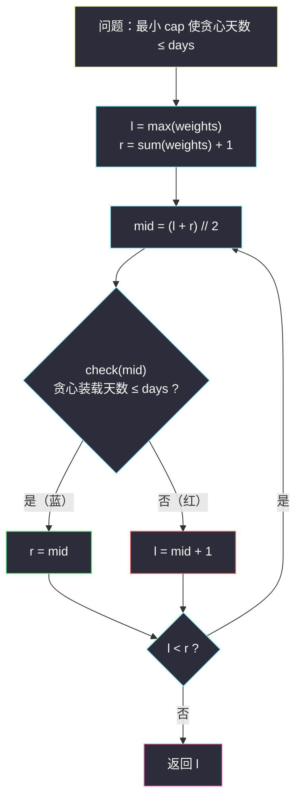

# 在 D 天内送达包裹的能力（二分答案 · 求最小 + 贪心判定）

## 一、问题描述

传送带上的包裹必须在 `days` 天内从港口运走。传送带上第 `i` 个包裹的重量为 `weights[i]`。每天，传送带都会**按顺序**装载包裹，当天装载的总重量**不能超过船的最大运载重量** `cap`（船每天只有一个来回，包裹不可拆分）。

返回能在 `days` 天内将传送带上所有包裹送达的**最低运载能力** `cap`。

> 🔗 LeetCode 1011：https://leetcode.cn/problems/capacity-to-ship-packages-within-d-days/
>
> 数据范围：`1 <= days <= weights.length <= 5 * 10^4`，`1 <= weights[i] <= 500`。

**示例**

```
输入：weights = [3,2,2,4,1,4], days = 3
输出：6
解释：cap = 6 时：第 1 天 [3,2]，第 2 天 [2,4]，第 3 天 [1,4]，恰好 3 天。

输入：weights = [1,2,3,1,1], days = 4
输出：3
解释：cap = 2 连重量 3 的单件都装不走；cap = 3 时可分 4 天运完。

输入：weights = [1,3,2], days = 2
输出：4
解释：cap = 4：第 1 天 [1,3]，第 2 天 [2]；cap = 3 需要 3 天，来不及。
```

**直观理解**

船的运载能力 `cap` 越大，需要的天数越少。「days 天内运完」对 `cap` 又是**左假右真**——跑 §2.1 的「二分答案求最小」。本题的新意在于 **check 不是简单求和，而是一趟贪心模拟**：给定 `cap`，按顺序连续装载，数出最少需要几天。

---

## 二、暴力解法

`cap` 从 `max(weights)` 逐个试到 `sum(weights)`，每个 `cap` 用贪心模拟数天数，第一个天数 ≤ days 的就是答案。

```python
class Solution:
    def shipWithinDays(self, weights: List[int], days: int) -> int:
        def need_days(cap: int) -> int:
            need, cur = 1, 0
            for w in weights:
                if cur + w > cap:        # 今天装不下，开新的一天
                    need += 1
                    cur = w
                else:
                    cur += w
            return need

        cap = max(weights)
        while need_days(cap) > days:
            cap += 1
        return cap
```

### 复杂度

- **时间**：`O(n * S)`，`S = sum(weights) <= 2.5 * 10^7`，n = `5 * 10^4`，乘起来 `10^12` 量级，超时。
- **空间**：`O(1)`。

### 🔴 瓶颈在哪里

又是「可行性随候选值单调变化，却线性试探」。与前几篇一样，二分答案直接把试探次数压成 `O(log S)`。

---

## 三、优化探索（核心章节）

> 📚 本题在灵茶题单中属于 **§2.1 求最小**（二分答案）。前几篇的 check 是 `O(n)` 的取整求和，本篇升级为 `O(n)` 的**贪心判定**——这是二分答案进阶的标志形态。

### 3.1 单调性：载重越大，天数越少

设 `need(cap)` = 载重为 `cap` 时按最优策略（贪心连续装载）所需的最少天数：

- `cap` 变大 → 每天能装的更多 → `need(cap)` **单调不增**；
- 所以「`need(cap) <= days`」在载重轴上**左假右真**：船太小（红）运不完，船够大（蓝）能按时运完。

答案 = 最小的蓝色 `cap`。


### 3.2 check：贪心连续装载为什么正确

给定 `cap`，从左到右扫包裹，**当天装得下就继续装，装不下就开新的一天**：

```
need = 1, cur = 0
for w in weights:
    if cur + w > cap:   need += 1; cur = w     # 明天再装 w
    else:               cur += w               # 今天装下
```

**贪心正确性（交换论证一句话）**：若存在某种分法 ≤ days 天，那么「每样贪心地尽量前置装载」不会比它更差——把包裹尽量塞进前面的天，后面各天的起始位置只会更靠后，需要的天数只会更少。因此 `need(cap)` 就是该载重下的最小天数，check 结果可信。

**下界与上界**：

- 下界 `l = max(weights)`：包裹不可拆分，船至少要装得下最重的那一件（示例 2 里 `cap = 2` 时天数为无穷大，连 3 都搬不走）；
- 上界 `sum(weights)`：一天全装走，1 ≤ days 天必然可行 → `check(sum)` 必真 → `r = sum + 1`。

### 3.3 模板（求最小，红蓝染色）

与前几篇**一字不差**，变的只是 check 的内部实现：



### 3.4 一句话核心

> **载重越大天数越少 → 在 `[max(weights), sum(weights)]` 上跑「求最小」模板；check 是一趟 O(n) 贪心：装得下就装，装不下开新天。**

---

## 四、代码实现

### Python（主解）

```python
class Solution:
    def shipWithinDays(self, weights: List[int], days: int) -> int:
        def check(cap: int) -> bool:
            # 载重 cap 时，贪心连续装载需要的天数是否 <= days
            need, cur = 1, 0                 # 至少需要 1 天
            for w in weights:
                if cur + w > cap:            # 今天装不下了
                    need += 1
                    cur = w                  # w 留给明天
                else:
                    cur += w
            return need <= days

        l, r = max(weights), sum(weights) + 1   # 下界：装得下最重单件；上界：一天全装
        while l < r:
            mid = (l + r) // 2
            if check(mid):
                r = mid
            else:
                l = mid + 1
        return l
```

**变量含义**

| 变量 | 含义 |
|------|------|
| `cap` / `mid` | 猜测的船的运载能力 |
| `cur` | 当天已装载的总重量 |
| `need` | 贪心分出的天数（初始为 1，不是 0） |
| `l` | 红区右边界：更小的载重都来不及 |
| `r` | 蓝区左边界：它及更大的载重都可行 |
| 返回值 `l` | 能在 days 天内运完的最低运载能力 |

### Java（最优解同款写法）

```java
class Solution {
    public int shipWithinDays(int[] weights, int days) {
        int l = 0, r = 1;
        for (int w : weights) {
            l = Math.max(l, w);
            r += w;                            // r = sum + 1
        }
        while (l < r) {
            int mid = l + (r - l) / 2;
            if (check(weights, mid, days)) {
                r = mid;
            } else {
                l = mid + 1;
            }
        }
        return l;
    }

    // 载重 cap 时贪心装载，天数是否 <= days
    private boolean check(int[] weights, int cap, int days) {
        int need = 1, cur = 0;
        for (int w : weights) {
            if (cur + w > cap) {
                need++;
                cur = w;
            } else {
                cur += w;
            }
        }
        return need <= days;
    }
}
```

数值范围温和（`sum <= 2.5 * 10^7`），Java 用 int 即可。

---

## 五、具体例子演示

以 `weights = [3,2,2,4,1,4]`、`days = 3` 端到端走一遍。`max = 4`，`sum = 16`，初始 `l = 4`，`r = 17`。

| 轮次 | l | r | mid | 贪心分组 | 天数 | ≤ 3 ? | 染色 | 动作 |
|------|---|---|-----|----------|------|-------|------|------|
| 1 | 4 | 17 | 10 | [3,2,2] [4,1,4] | 2 | ✓ | 蓝 | `r = 10` |
| 2 | 4 | 10 | 7 | [3,2,2] [4,1] [4] | 3 | ✓ | 蓝 | `r = 7` |
| 3 | 4 | 7 | 5 | [3,2] [2] [4,1] [4] | 4 | ✗ | 红 | `l = 6` |
| 4 | 6 | 7 | 6 | [3,2] [2,4] [1,4] | 3 | ✓ | 蓝 | `r = 6` |

`l == r == 6`，循环结束，返回 **6** ✓。

**答案 cap = 6 的贪心明细**（逐包裹走一遍）：

| 包裹 w | cur + w | 是否 ≤ 6 | 动作 | 当天装载 | need |
|--------|---------|----------|------|----------|------|
| 3 | 3 | ✓ | 装入 | [3] | 1 |
| 2 | 5 | ✓ | 装入 | [3,2] | 1 |
| 2 | 7 | ✗ | 开新天 | [2] | 2 |
| 4 | 6 | ✓ | 装入 | [2,4] | 2 |
| 1 | 7 | ✗ | 开新天 | [1] | 3 |
| 4 | 5 | ✓ | 装入 | [1,4] | 3 |

3 天 ≤ days = 3，`check(6)` 为真 ✓；而 `check(5)` 需要 4 天（红），分界恰在 6。

**示例 3 一句话**：`weights = [1,3,2]`、`days = 2`，从 `l = 3` 起：`check(3)` 分组 [1] [3] [2] = 3 天 ✗ → 推到 4；`check(4)` 分组 [1,3] [2] = 2 天 ✓，答案 **4**。

---

## 六、复杂度分析

| 方法 | 时间 | 空间 | 说明 |
|------|------|------|------|
| 暴力递增 | `O(n * S)`，S = sum(weights) | `O(1)` | `10^12` 量级超时 |
| 二分答案 | `O(n log S)` | `O(1)` | `log2(2.5*10^7) ≈ 25` 轮 × O(n) check |

---

## 七、对比总结

**§2.1 四题全家福**（收官总表）：

| 题 | 二分对象 | check | check 类型 |
|----|----------|-------|-----------|
| #875 珂珂 | 速度 k | Σ⌈p/k⌉ ≤ h | 取整求和 |
| #1283 除数 | 除数 d | Σ⌈x/d⌉ ≤ threshold | 取整求和 |
| #2187 旅途 | 时间 t | Σ⌊t/x⌋ ≥ totalTrips | 取整求和 |
| #1011 本题 | 载重 cap | 贪心天数 ≤ days | **贪心模拟** |

**易错点**

1. `need` 初始为 **1** 不是 0：哪怕只有一件包裹也要运一天；写成 0 会把天数少算一。
2. 开新天的条件是 `cur + w > cap`，此时 `cur` 重置为 `w`（今天的头一件），别漏。
3. 下界用 `max(weights)` 而不是 1：`cap < max(weights)` 时最重那件包裹永远装不上船（贪心里它自带的天数会把结果推得远超 days，check 虽仍会正确返回假，但白白多跑轮次）；更重要的是 `cap >= max(weights)` 是「每件都装得走」的物理前提，语义才成立，二分区间也更小。
4. 判定用 `need <= days` 而不是 `== days`：天数少于 days 是合法的（可以提前运完），「恰好等于」会把可行域挖空。

**模板回顾（求最小，§2.1 通用）**

```python
def ship_within_days(weights: List[int], days: int) -> int:
    l, r = max(weights), sum(weights) + 1   # check(上界) 必真
    while l < r:
        mid = (l + r) // 2
        if check(mid): r = mid     # 真收右
        else:          l = mid + 1 # 假收左
    return l
```

---

## 八、举一反三

| 题目 | 关系 |
|------|------|
| [875. 爱吃香蕉的珂珂](https://leetcode.cn/problems/koko-eating-bananas/) | §2.1 起手题，取整求和型 check，见 `koko-eating-bananas.md` |
| [1283. 使结果不超过阈值的最小除数](https://leetcode.cn/problems/find-the-smallest-divisor-given-a-threshold/) | 与 #875 同构，见 `find-the-smallest-divisor-given-a-threshold.md` |
| [2187. 完成旅途的最少时间](https://leetcode.cn/problems/minimum-time-to-complete-trips/) | check 方向反转型，见 `minimum-time-to-complete-trips.md` |
| [410. 分割数组的最大值](https://leetcode.cn/problems/split-array-largest-sum/) | **同款贪心 check 的 Hard**：二分「最大段和」，check 恰好是本题的连续切分 |
| [1482. 制作 m 束花所需的最少天数](https://leetcode.cn/problems/minimum-number-of-days-to-make-m-bouquets/) | 二分天数，check 是线性扫描统计连续窗口 |
| [2560. 打家劫舍 IV](https://leetcode.cn/problems/house-robber-iv/) | 二分「能偷到的最大值」，check 是一遍贪心/DP |

**思想迁移**

- 判断一道题能不能二分答案，只问一句：**「候选值变大，验证是变容易还是变难？」**——有单调分界就能二分。
- check 的形态从「求和」升级到「贪心」，复杂度仍是一趟 O(n)；再往后还能是 DP、BFS，只要它是**判定**即可。
- 口诀：**「船大天数少，贪心来报到；装不下开新天，收右找最小。」**
