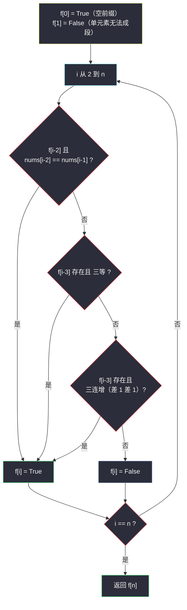

# 2369. 检查数组是否存在有效划分（Check if There Is a Valid Partition For The Array）

> 题目来源：[https://leetcode.cn/problems/check-if-there-is-a-valid-partition-for-the-array/](https://leetcode.cn/problems/check-if-there-is-a-valid-partition-for-the-array/)
>
> 灵茶题单小节定位：§A 线性 DP 入门（划分可行性）

## 一、问题描述

给你一个下标从 0 开始的整数数组 `nums`，你必须将数组划分为一个或多个**连续**子数组。

如果获得的这些子数组中每个都能满足下述条件**之一**，则可以称其为数组的一种**有效**划分：

- 子数组**恰**由 2 个相等元素组成，例如，子数组 `[2,2]`。
- 子数组**恰**由 3 个相等元素组成，例如，子数组 `[4,4,4]`。
- 子数组**恰**由 3 个**连续递增**元素组成，并且相邻元素之间的差值为 1。例如，子数组 `[3,4,5]`，但是子数组 `[1,3,5]` 不符合要求。

如果数组**至少**存在一种有效划分，返回 `true`，否则返回 `false`。

**数据范围**：

- `2 <= nums.length <= 10⁵`
- `1 <= nums[i] <= 10⁶`

**示例 1**：

```text
输入：nums = [4,4,4,5,6]
输出：true
解释：数组可以划分成子数组 [4,4] 和 [4,5,6]。这是一种有效划分。
```

**示例 2**：

```text
输入：nums = [1,1,1,2]
输出：false
解释：该数组不存在有效划分。
```

**核心思考点**：划分是「从左到右切若干刀」，每一段独立合法——天然的无后效性结构。定义 `f[i]` = 前 `i` 个元素（`nums[0..i-1]`）能否有效划分，最后一段只可能是「长度 2」或「长度 3」，枚举这两种切法并检查段内条件即可递推。这是**线性 DP 判可行**的最小完整样例。

## 二、暴力解法

### 思路

写一个指数级搜索：从位置 `0` 出发，尝试切出长度 2 或长度 3 的合法段，递归处理剩余后缀，任何一条路走通即 `true`。不带记忆化时重复子问题爆炸。

### 代码

```python
def validPartitionBrute(nums: list[int]) -> bool:
    n = len(nums)
    def ok2(a, b):                    # 长度 2 段：两等
        return a == b
    def ok3(a, b, c):                 # 长度 3 段：三等或三连增
        return a == b == c or (b - a == 1 and c - b == 1)
    def dfs(i):
        if i == n:
            return True
        if i + 1 < n and ok2(nums[i], nums[i + 1]) and dfs(i + 2):
            return True
        if i + 2 < n and ok3(nums[i], nums[i + 1], nums[i + 2]) and dfs(i + 3):
            return True
        return False
    return dfs(0)
```

### 复杂度

- 时间：最坏 `O(2^(n/2))`——每个起点两种分支（例：`[1,1,1,2,2,3,...]` 大量重叠子问题）。`n = 10⁵` 必然超时，小数组可作对拍基准。
- 空间：`O(n)` 递归栈。

## 三、优化探索

### 3.1 重叠子问题：后缀可行性只算一次 ⭐

「从下标 `i` 到末尾能否划分」这个子问题被所有前缀路径共享——`[1,1,1,2]` 中 `dfs(2)`、`dfs(3)` 被反复调用。加 `@cache`（记忆化搜索）或改自底向上递推，每个后缀只算一次，`O(1)` 转移 ⇒ 总 `O(n)`。doocs 题解采用自顶向下记忆化，本文主解用**递推**（两者完全等价，见第四节对照）。

### 3.2 状态设计：前缀定义 vs 后缀定义 ⭐

- 后缀式 `dfs(i)`：下标 `i..n-1` 能否划分——记忆化搜索的天然形态；
- 前缀式 `f[i]`：前 `i` 个（`nums[0..i-1]`）能否划分——递推的天然形态，`f[0] = True`（空前缀，啥都不切即有效）。

前缀式的转移（考察最后一段，即**最优子结构从右端拼接**）：

```text
f[i] = (f[i-2] 且 nums[i-2] == nums[i-1])                        # 末段两等
    或 (f[i-3] 且 nums[i-3] == nums[i-2] == nums[i-1])           # 末段三等
    or (f[i-3] 且 nums[i-2]+1 == nums[i-1] 且 nums[i-3]+1 == nums[i-2])  # 末段三连增
```

答案 `f[n]`。

### 3.3 空间压缩：只看最近 3 格 ⭐

转移只依赖 `f[i-2]` 与 `f[i-3]`——保留三个布尔滚动即可 `O(1)` 空间。数据量 `10⁵` 下 `O(n)` 布尔数组也无压力，压缩版展示「转移半径小 ⇒ 滚动数组」的通用手法。



## 四、代码实现

### 主解：递推 + 布尔数组

```python
class Solution:
    def validPartition(self, nums: List[int]) -> bool:
        n = len(nums)
        f = [False] * (n + 1)
        f[0] = True                          # 空前缀
        for i in range(2, n + 1):
            a, b, c = nums[i-2], nums[i-1], (nums[i-3] if i >= 3 else None)
            if f[i - 2] and a == b:          # 末段 [a, b] 两等
                f[i] = True
            elif i >= 3 and f[i - 3]:
                if a == b == c:              # 末段 [c, a, b] 三等
                    f[i] = True
                elif c + 1 == a and a + 1 == b:   # 三连增
                    f[i] = True
        return f[n]
```

### 进阶：记忆化搜索（自顶向下）

```python
from functools import cache

class Solution:
    def validPartition(self, nums: List[int]) -> bool:
        n = len(nums)
        @cache
        def dfs(i: int) -> bool:             # nums[i:] 能否有效划分
            if i == n:
                return True
            ok = i + 1 < n and nums[i] == nums[i + 1] and dfs(i + 2)
            if not ok and i + 2 < n:
                ok = nums[i] == nums[i+1] == nums[i+2] and dfs(i + 3) \
                    or nums[i] + 1 == nums[i+1] == nums[i+2] - 1 and dfs(i + 3)
            return ok
        return dfs(0)
```

### 滚动三变量版（O(1) 空间，可选）

```python
class Solution:
    def validPartition(self, nums: List[int]) -> bool:
        # p2 = f[i-3], p1 = f[i-2], p0 = f[i-1] 滚动
        p2, p1, p0 = True, False, False      # f[0], f[1], (f[-1] 占位)
        n = len(nums)
        cur = False
        for i in range(1, n):
            cur = False
            if i >= 1 and p1 and nums[i-1] == nums[i]:
                cur = True
            if not cur and i >= 2 and p2:
                if nums[i-2] == nums[i-1] == nums[i]:
                    cur = True
                elif nums[i-2] + 1 == nums[i-1] == nums[i] - 1:
                    cur = True
            p2, p1, p0 = p1, p0, cur
        return cur
```

（滚动版下标易错，工程上推荐数组版；此处展示思路即可。）

### 细节说明

- **`f[1] = False`**：单个元素组不成任何合法段，这是「`n = 2` 且两元素不等 ⇒ False」的来源。
- **三连增判定 `c + 1 == a and a + 1 == b`**：注意下标映射——`f[i]` 的末三元素是 `nums[i-3], nums[i-2], nums[i-1]`，文中主解局部变量 `a, b, c` 对应 `nums[i-2], nums[i-1], nums[i-3]`，阅读时别混淆。
- **`elif` 短路**：三种条件互斥时用 `elif` 少做判断；逻辑上用 `or` 连接亦可，不影响结果。
- **记忆化版三连增写法**：`nums[i]+1 == nums[i+1] == nums[i+2]-1` 利用链式比较一次判两步差。
- **与「完全背包可行性」同构**：转移像「用长度 2/3 的段拼满前缀」，段型固定三类——这正是线性 DP 划分题的通用模型。

## 五、例子演示

**示例 1 端到端：nums = [4,4,4,5,6]**

| i | 考察末段 | 条件检查 | f[i] |
|---|---|---|---|
| 0 | —（初始） | 空前缀 | **True** |
| 1 | `[4]` 长度 1 | 无法成段 | False |
| 2 | `[4,4]` 两等 | f[0]=T 且 4==4 | **True** |
| 3 | `[4,4,4]` 三等 | f[0]=T 且 4==4==4 | **True**（两等 `[4,4]`+f[1]=F 不通） |
| 4 | 末段 `[4,5]` / `[4,4,5]` | 4≠5；4==4 但 4≠5 | False |
| 5 | 末段 `[5,6]` / `[4,5,6]` | f[3]=T 且 5≠6 ✗；f[2]=T 且 4+1=5、5+1=6 ✓ | **True** |

`f[5] = True` → 返回 **true** ✅。对应划分正是 `[4,4] | [4,5,6]`：`f[2]` 记录前段两等，末段三连增接上。

**示例 2：nums = [1,1,1,2]**：`f[0]=T`；`f[1]=F`；`f[2]=T`（两等）；`f[3]=T`（三等）；`f[4]`：末段 `[1,2]` 不等 ✗，末段 `[1,1,2]` 三等 ✗ 三连增 ✗（1==1 但 1≠2）→ **False**，返回 **false** ✅。前三个 1 无论怎么切（`[1,1]|[1,...]` 或 `[1,1,1]|[...]`），剩下的 2 都孤掌难鸣。

**自造例子：nums = [1,2,3,4,5]**（纯三连增链）：`f[3]=T`（123）；`f[4]=F`（末段 [4] 不行、[2,3,4] 接 f[1]=F）；`f[5]=F`（末段 [3,4,5] 接 f[2]=F；[4,5] 不等）→ **false**：五连增恰好无法被 2/3 段拼满（2+3 组合需要 5 个数末段是 [3,4,5] 且前缀 [1,2] 两等不成立）。

## 六、复杂度分析

设 `n = len(nums)`：

- **时间复杂度：`O(n)`**——每个前缀 `O(1)` 转移（常数种段型检查）。
- **空间复杂度：`O(n)`** 布尔数组；记忆化版含 `O(n)` 递归栈 + `O(n)` cache；滚动版 `O(1)`。

## 七、对比总结

| 维度 | 暴力搜索 | 记忆化搜索 | 递推（主解） | 滚动递推 |
|---|---|---|---|---|
| 时间 | `O(2^(n/2))` | `O(n)` | `O(n)` | `O(n)` |
| 空间 | `O(n)` 栈 | `O(n)` | `O(n)` | `O(1)` |
| 写法直觉 | 直译定义 | 从搜索平滑过渡 | 结构清晰 | 下标易错 |
| 教学定位 | 认识重叠子问题 | DP 三步走的桥梁 | 标准形态 | 空间优化意识 |

**套路归纳**：**「划分型」线性 DP** 三步定式——①定义 `f[i]` 为前 `i` 个的可行性（或最值/计数）；②枚举**最后一段**的形状（本题：两等 / 三等 / 三连增），从 `f[i-2]`、`f[i-3]` 转移；③初始化 `f[0] = True`（空串合法），答案 `f[n]`。可行性 DP 用 `or` 连接各转移，最值 DP 用 `min/max`，计数 DP 用 `+`——同一骨架换运算符即通吃三类问法。转移只回看常数格时上滚动数组。

## 八、举一反三

1. **[139. 单词拆分](https://leetcode.cn/problems/word-break/)**：划分段型从「2/3 定长规则」换成「字典词」，同一 `f[i]` 骨架的字符串版。
2. **[91. 解码方法](https://leetcode.cn/problems/decode-ways/)**：最后一段长 1 或 2 的计数型划分 DP，`or` 换 `+`。
3. **[983. 最低票价](https://leetcode.cn/problems/minimum-cost-for-tickets/)**：最后一段（1/7/30 天通票）的最小型划分 DP。
4. **[1043. 分隔数组以得到最大和](https://leetcode.cn/problems/partition-array-for-maximum-sum/)**：末段长度 ≤ k 的最值型划分，转移回看 k 格。
5. **[2707. 字符串中的额外字符](https://leetcode.cn/problems/extra-characters-in-a-string/)**：批 21 待写的字典划分 DP，与 #139 同族的反向形态（最小化落单字符）。

**同族互引**：本题是灵茶题单线性 DP 入门首题；批 21 的 `extra-characters-in-a-string.md`（#2707）是它「最小化代价」版进阶，刷完本题再去看如何把布尔转移改成 `min`。
