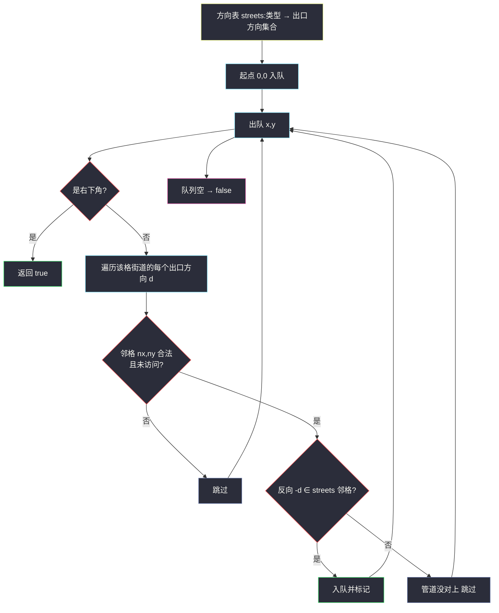

# 1391. 检查网格中是否存在有效路径（Check if There Is a Valid Path In a Grid）

> 题目来源：[https://leetcode.cn/problems/check-if-there-is-a-valid-path-in-a-grid/](https://leetcode.cn/problems/check-if-there-is-a-valid-path-in-a-grid/)
>
> 灵茶题单小节定位：§一、网格图 DFS（建图建模篇：先造「方向表」再搜）

## 一、问题描述

给你一个 `m × n` 网格，每个格子表示一条街道。`grid[i][j]` 的值表示街道的类型，共六种（下面用方位示意图辅助理解，`·` 表示该侧不通）：

```text
1 ──    2 │     3 ·│    4 │·    5 ··    6 ··
        ═╪═      ─┘     └─     ─┐      ┌─
                ··     ··     ·│      │·
```

准确语义（左/右/上/下 表示该街道通向哪个方向的邻格）：

- `1`：左、右
- `2`：上、下
- `3`：左、下
- `4`：右、下
- `5`：左、上
- `6`：右、上

你从左上角 `(0, 0)` 出发，沿街道行走（每一步：当前格的街道通向某方向，且 **相邻格的街道也通向反方向**，两格才真正连通）。判断能否到达右下角 `(m-1, n-1)`，能则返回 `true`。

**数据范围**：

- `1 <= m, n <= 400`
- `1 <= grid[i][j] <= 6`

**示例 1**：

```text
输入：grid = [[2,4,3],
             [6,5,2]]
输出：true
解释：(0,0) 2 通上下 → 下到 (1,0) 6 通右上 → 右到 (1,1) 5 通左上
     → 上到 (0,1) 4 通右下 → 右到 (0,2) 3 通左下 → 下到 (1,2) 2，即右下角。
```

**核心思考点**：本题的算法部分（网格搜索）并不难，**真正的难点是建模**——把六种街道翻译成「每格的出口方向集合」，并认识到「我通向你 ⇔ 你通向我」的对称性，之后就是一次普通的 DFS/BFS 连通性判定。

## 二、暴力解法

### 思路

最笨的办法：把「格子之间的连通关系」显式建成邻接表——对每一对相邻格子 `(a, b)`，检查 `a` 的街道是否通向 `b` **且** `b` 的街道是否通向 `a`，双向都成立才连边。然后从 `(0,0)` 做普通 DFS 判连通。

「检查双向」如果每次都去 if-else 六类街道硬编码，代码会又长又容易错。

### 代码

```python
def hasValidPathBrute(grid: list[list[int]]) -> bool:
    m, n = len(grid), len(grid[0])

    # 六类街道的出口方向（暴力版：直接 if-else 硬编码）
    def go_left(t):  return t in (1, 3, 5)
    def go_right(t): return t in (1, 4, 6)
    def go_up(t):    return t in (2, 5, 6)
    def go_down(t):  return t in (2, 3, 4)

    adj = {}                                  # 显式邻接表
    for x in range(m):
        for y in range(n):
            adj[(x, y)] = []
            t = grid[x][y]
            # 左邻 (x, y-1)：我通左 且 他通右
            if y - 1 >= 0 and go_left(t) and go_right(grid[x][y - 1]):
                adj[(x, y)].append((x, y - 1))
            if y + 1 < n and go_right(t) and go_left(grid[x][y + 1]):
                adj[(x, y)].append((x, y + 1))
            if x - 1 >= 0 and go_up(t) and go_down(grid[x - 1][y]):
                adj[(x, y)].append((x - 1, y))
            if x + 1 < m and go_down(t) and go_up(grid[x + 1][y]):
                adj[(x, y)].append((x + 1, y))

    # 普通 DFS 判连通
    visited = set()
    def dfs(x: int, y: int) -> bool:
        if (x, y) == (m - 1, n - 1):
            return True
        visited.add((x, y))
        for nx, ny in adj[(x, y)]:
            if (nx, ny) not in visited and dfs(nx, ny):
                return True
        return False

    return dfs(0, 0)
```

### 复杂度

- 时间：`O(m·n)`——每格建边 4 次检查、DFS 每格至多访问一次，其实不慢；
- 空间：`O(m·n)`——邻接表 + visited。

它的问题不是复杂度，而是 **代码冗长**：四个方向各写一遍双向判断，建图逻辑重复。能否不建显式图、边搜边判断？

## 三、优化探索

### 3.1 用「方向表」消灭 if-else

定义 `streets[t]` = 类型 `t` 格子通向的方向集合：

```python
DIRS = {'左': (0, -1), '右': (0, 1), '上': (-1, 0), '下': (1, 0)}
streets = [None,
           {(0,-1), (0,1)},     # 1 左右
           {(-1,0), (1,0)},     # 2 上下
           {(0,-1), (1,0)},     # 3 左下
           {(0,1), (1,0)},      # 4 右下
           {(0,-1), (-1,0)},    # 5 左上
           {(0,1), (-1,0)}]     # 6 右上
```

### 3.2 对称性：只查一次「我的出口」就够

关键观察：`(dx, dy)` 是 `a` 的出口方向时，`(-dx, -dy)` 是邻格 `b` 的入口方向。因为街道是「实体道路」，**`a` 通向 `b` 当且仅当 `b` 通向 `a`**（想象两截管道必须严丝合缝对接）。因此：

> 邻格 `b` 与 `a` 连通 ⇔ `(dx,dy) ∈ streets[a]` **且** `(-dx,-dy) ∈ streets[b]`。

这与暴力版的双向检查完全等价，但配合方向表后只需一行判断，也 **不需要显式邻接表**——搜索时现场判断即可。

### 3.3 搜索骨架：BFS（或 DFS 均可）

从 `(0,0)` 出发 BFS：出队 `(x,y)`，遍历 `streets[grid[x][y]]` 中的每个方向 `(dx,dy)`，邻格 `(nx,ny)` 合法且未访问且反向可接（`(-dx,-dy) ∈ streets[grid[nx][ny]]`）则入队。若队空还没到右下角则 `false`。

顺带一提一个常见疑问：**起点或终点会不会「半开通」就误判？** 不会——入口与出口用同一套方向表，`(0,0)` 只能从它拥有的方向离开，判断天然自洽。



## 四、代码实现

### 主解：方向表 + BFS

```python
from collections import deque

def hasValidPath(grid: list[list[int]]) -> bool:
    m, n = len(grid), len(grid[0])
    # 方向表：streets[t] = 类型 t 的格子通向哪些方向 (dx, dy)
    streets = [None,
               {(0, -1), (0, 1)},     # 1：左右
               {(-1, 0), (1, 0)},     # 2：上下
               {(0, -1), (1, 0)},     # 3：左下
               {(0, 1), (1, 0)},      # 4：右下
               {(0, -1), (-1, 0)},    # 5：左上
               {(0, 1), (-1, 0)}]     # 6：右上

    visited = [[False] * n for _ in range(m)]
    visited[0][0] = True
    q = deque([(0, 0)])
    while q:
        x, y = q.popleft()
        if (x, y) == (m - 1, n - 1):
            return True
        for dx, dy in streets[grid[x][y]]:        # 只走「我的出口」
            nx, ny = x + dx, y + dy
            if 0 <= nx < m and 0 <= ny < n and not visited[nx][ny] \
                    and (-dx, -dy) in streets[grid[nx][ny]]:   # 邻格能接住
                visited[nx][ny] = True
                q.append((nx, ny))
    return False
```

### 细节说明

- **入队即标记**：`visited` 在入队时置 `True`，防止同一格重复入队（BFS 标准姿势，同 `shortest-path-in-binary-matrix.md`）。
- **方向表用元组集合**：`(-dx, -dy) in streets[...]` 是 `O(1)` 查询，反向判断一行搞定；比暴力版四个布尔函数清爽得多。
- **为什么 BFS/DFS 都行**：本题只要连通性、不要最短步数，两种搜索只是队列/栈的区别。灵神题单把它放在 DFS 小节，DFS 版把 `q.popleft()` 换成 `q.pop()`（栈）即可。
- **注意「管道对接」错误**：单向检查（只看 `(dx,dy) ∈ streets[a]`）是常见 bug——例如 `a=1`（左右）向右、邻格 `b=5`（左上）虽含「左」入口可接，但若邻格是 `b=3`（左下）也含「左」……都含「左」所以能接？真正错例是 `b=2`（上下）：`a` 向右伸管子，`b` 左右都不通，管子悬空。必须双向确认。

## 五、例子演示

用示例 1 的网格端到端走一遍：

```text
grid = 2 4 3       2=上下  4=右下  3=左下
       6 5 2       6=右上  5=左上  2=上下
```

**BFS 逐步表**：

| 步 | 出队格 | 街道与出口方向 | 逐方向检查 | 动作 | 队列 |
|---|---|---|---|---|---|
| 1 | (0,0) | 2：上、下 | 上 (−1,0) 越界；下 (1,0)=6，反向「上」∈ {右上} ✓ | (1,0) 入队 | [(1,0)] |
| 2 | (1,0) | 6：右、上 | 上 (0,0) 已访问；右 (1,1)=5，反向「左」∈ {左上} ✓ | (1,1) 入队 | [(1,1)] |
| 3 | (1,1) | 5：左、上 | 左 (1,0) 已访问；上 (0,1)=4，反向「下」∈ {右下} ✓ | (0,1) 入队 | [(0,1)] |
| 4 | (0,1) | 4：右、下 | 右 (0,2)=3，反向「左」∈ {左下} ✓；下 (1,1) 已访问 | (0,2) 入队 | [(0,2)] |
| 5 | (0,2) | 3：左、下 | 左 (0,1) 已访问；下 (1,2)=2，反向「上」∈ {上下} ✓ | (1,2) 入队 | [(1,2)] |
| 6 | (1,2) | 2：上、下 | **是右下角 (m-1,n-1)** | **返回 true** | — |

**反例演示**（自造 2×2，说明「管道没对上」）：

```text
grid = 1 1       (0,0)=1 向右伸管 → (0,1)=1 的「左」能接 ✓
       1 2       (0,1)=1 继续向右 → 越界；(0,1) 无向下管
                 (1,0)=1 无上下管，(1,1)=2 无左管——整体断成两截
```

BFS 从 `(0,0)` 走到 `(0,1)` 后无路可走，队列清空，返回 `false`——虽然四格街道各自「看起来」都通着什么，但管道没有形成从左上到右下的连续通路。

```mermaid
flowchart LR
    subgraph G["示例 1 的管道通路"]
        A["(0,0) 2"] -- "下↕上" --> B["(1,0) 6"]
        B -- "右→左" --> C["(1,1) 5"]
        C -- "上↑下" --> D["(0,1) 4"]
        D -- "右→左" --> E["(0,2) 3"]
        E -- "下↓上" --> F["(1,2) 2 ✓终点"]
    end
    style G fill:#1e1f29,stroke:#6272a4
    style A fill:#2b2d3a,stroke:#f1fa8c,color:#f8f8f2
    style B fill:#2b2d3a,stroke:#8be9fd,color:#f8f8f2
    style C fill:#2b2d3a,stroke:#8be9fd,color:#f8f8f2
    style D fill:#2b2d3a,stroke:#8be9fd,color:#f8f8f2
    style E fill:#2b2d3a,stroke:#8be9fd,color:#f8f8f2
    style F fill:#2b2d3a,stroke:#50fa7b,color:#f8f8f2
```



## 六、复杂度分析

设 `N = m × n`：

- **时间复杂度：`O(N)`**
  - 每格至多入队一次；出队时检查的出口方向至多 2 个（六种街道都恰有 2 个出口），每次检查 `O(1)` 集合查询，总计 `O(N)`。
  - 对比暴力版同为 `O(N)`，但方向表版省去了显式邻接表的构建遍历，常数更小、代码减半。
- **空间复杂度：`O(N)`**
  - `visited` 矩阵 `O(N)`、队列最坏 `O(N)`；方向表 `streets` 大小恒为 6，`O(1)`。

## 七、对比总结

| 维度 | 暴力（显式建图） | 主解（方向表 + 现场判断） |
|---|---|---|
| 时间 | `O(N)` | `O(N)` |
| 空间 | `O(N)`（邻接表额外开销） | `O(N)`（无邻接表） |
| 代码量 | 四方向 × 双向检查，重复冗长 | 一张方向表 + 两行判断 |
| 建模清晰度 | 连通规则淹没在 if-else 里 | 「出口 × 反向入口」一句说清 |
| 易错点 | 双向判断漏写一边 | 方向表抄错某个类型 |

**套路归纳**：网格图搜索题的第一步永远是 **把语义翻译成数据**——本题是「街道类型 → 出口方向集合」；上一题（#2684）是「严格递增 → 方向与值约束」。表建对了，搜索本身只是模板。

## 八、举一反三

1. **[1034. 边界着色](https://leetcode.cn/problems/coloring-a-border/)**：同样在网格上沿「同分量」连通搜索，遍历型 DFS 的对照篇（见本站 `coloring-a-border.md`）。
2. **[1091. 二进制矩阵中的最短路径](https://leetcode.cn/problems/shortest-path-in-binary-matrix/)**：把「管道对接」换成「值为 0 才可走」的八方向 BFS（见本站 `shortest-path-in-binary-matrix.md`）。
3. **[490. 迷宫](https://leetcode.cn/problems/the-maze/)**（会员题）：通道判定从「格子街道」变为「整行整列滑行」，连通规则升级版。
4. **[1971. 寻找图中是否存在路径](https://leetcode.cn/problems/find-if-path-exists-in-graph/)**：脱离网格的一般图连通判定，并查集 / DFS 通用模板。
5. **[1444. 穿过网格的安全路径](https://leetcode.cn/problems/number-of-ways-of-cutting-a-pizza/)** 之外更贴切的是 **[1559. 二维网格图中探测环](https://leetcode.cn/problems/detect-cycles-in-2d-grid/)**：同字符四连通 + DFS 跳过父格，与本篇同为「建规则再搜索」。

**同族互引**：本篇与 `coloring-a-border.md`（分量遍历）、`detect-cycles-in-2d-grid.md`（环检测）同属「网格图 DFS 建模三部曲」：一篇学建方向表、一篇学分量收集、一篇学环判定，搜索骨架完全一致，差异只在连通规则。
