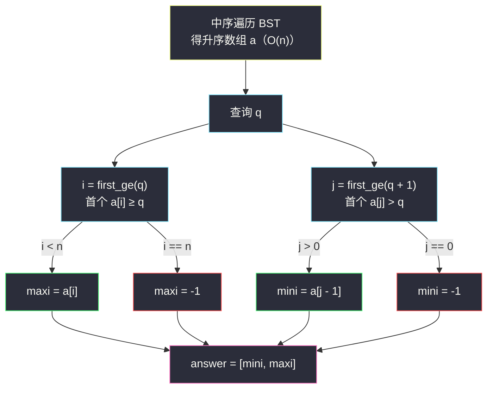
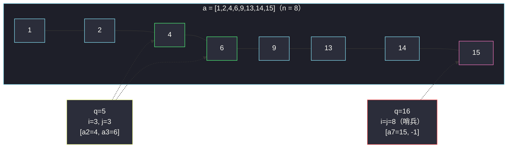

# 二叉搜索树最近节点查询（中序展开 + 两次二分）

## 一、问题描述

给你一棵**二叉搜索树**的根节点 `root`，和一个长度为 `m` 的整数数组 `queries`。

请你返回一个长度为 `m` 的二维数组 `answer`，其中 `answer[i] = [mini, maxi]`：

- `mini` 是树中**小于等于** `queries[i]` 的**最大值**（不存在则为 `-1`）；
- `maxi` 是树中**大于等于** `queries[i]` 的**最小值**（不存在则为 `-1`）。

> 🔗 LeetCode 2476：https://leetcode.cn/problems/closest-nodes-queries-in-a-binary-search-tree/
>
> 数据范围：树中节点数在 `[2, 10^5]`，`1 <= Node.val <= 10^6`，树中所有节点值**互不相同**；`1 <= m <= 10^5`，`1 <= queries[i] <= 10^6`。

**示例 1**

```
输入：root = [6,2,13,1,4,9,15,null,null,null,null,null,null,14], queries = [2,5,16]
输出：[[2,2],[4,6],[15,-1]]
解释：树的中序遍历（即升序序列）为 [1,2,4,6,9,13,14,15]。
- q = 2：≤2 的最大值是 2，≥2 的最小值是 2 → [2,2]；
- q = 5：≤5 的最大值是 4，≥5 的最小值是 6 → [4,6]；
- q = 16：≤16 的最大值是 15，≥16 不存在 → [15,-1]。
```

树形结构：

```
            6
          /   \
         2     13
        / \   /  \
       1   4 9    15
                  /
                 14
```

**示例 2**

```
输入：root = [4,null,9], queries = [3,7,4]
输出：[[-1,4],[4,9],[4,4]]
解释：中序序列为 [4,9]。q=3 比所有值小 → mini 不存在；q=4 恰好在树中 → 两边都是 4。
```

**直观理解**

BST 的中序遍历是升序序列——这相当于**预处理免费送来一个有序数组**。查询「≤ q 的最大 / ≥ q 的最小」就是在这个有序数组上做两次边界二分。这正是灵茶题单 §1.2 的思想：**先把无序结构整理成有序（本题只花一次 `O(n)` 中序），再让每次查询享受 `O(log n)`**。

---

## 二、暴力解法

把所有节点值收集进数组（不排序也行，中序本身有序），对每个查询线性扫一遍，维护「≤ q 的最大值」与「≥ q 的最小值」。

```python
class Solution:
    def closestNodes(self, root: Optional[TreeNode], queries: List[int]) -> List[List[int]]:
        a = []
        def dfs(node):                 # 中序收集（此处演示用，主解换迭代版）
            if node:
                dfs(node.left)
                a.append(node.val)
                dfs(node.right)
        dfs(root)
        ans = []
        for q in queries:
            mini, maxi = -1, -1
            for x in a:                # 线性扫描
                if x <= q:
                    mini = max(mini, x)
                else:
                    maxi = x if maxi == -1 else min(maxi, x)
                    break              # 有序数组，遇到第一个 > q 即可停
            ans.append([mini, maxi])
        return ans
```

（若数组无序，内层不能 `break`，只能完整扫。）

### 复杂度

- **时间**：`O(n + q * n)`（每个查询线性扫）。
- **空间**：`O(n)`（存节点值数组；递归栈最坏 `O(n)`）。

### 🔴 瓶颈在哪里

`n = q = 10^5` 时 `q * n ≈ 10^10`，超时。问题出在明明拿到的是**有序**序列，查询却还在一格一格挪——有序就应该二分。

---

## 三、优化探索（核心章节）

> 📚 本题在灵茶题单中属于 **§1.2 二分进阶（排序 / 预处理 + 二分）**：预处理 = 中序遍历展开成有序数组；每个查询 = 两次「求满足 `check(x)` 的最小 `x`」的二分。灵神模板口诀：红蓝染色、`l = 下界`，`r = 上界 + 1`，循环内 `if (check(mid)) r = mid else l = mid + 1`，答案 `l`。

### 3.1 预处理：BST 中序 = 升序数组

中序遍历（左 → 根 → 右）天然升序，不需要任何排序成本。**注意工程细节**：树最坏退化成链（深度 `10^5`），Python 递归默认栈深 1000 会直接爆栈——用**迭代栈**写中序最稳。

### 3.2 两次二分：统一成「首个 ≥ target」

设中序数组为 `a`（长度 `n`），查询值为 `q`：

| 要找的 | 说法 | 二分形态 |
|--------|------|----------|
| `maxi`：≥ q 的最小值 | 首个 `a[i] >= q` 的下标 `i` | 直接「求最小满足」 |
| `mini`：≤ q 的最大值 | 首个 `a[j] > q` 的下标 `j`，则 `mini = a[j-1]` | 「首个 > q」=「首个 ≥ q+1」 |

妙处在于**节点值和查询值都是整数**：「严格大于 q」等价于「大于等于 q+1」。于是两次查询共用**同一个**二分函数 `first_ge(target)`，只是传参 `q` 与 `q+1` 不同：



### 3.3 边界的自洽性（为什么 −1 不用特判流程）

- `q` 比所有值都小：`first_ge(q) = 0` → `maxi = a[0]`；`first_ge(q+1) = 0` → `mini = -1`（`j = 0` 无前驱）✓；
- `q` 比所有值都大：两次都返回 `n` → `maxi = -1`、`mini = a[n-1]` ✓；
- `q` 恰好在树中：`first_ge(q)` 命中它本身，`first_ge(q+1)` 停在它后一位 → `mini = maxi = q` ✓。

哨兵 `r = n`（上界 + 1）把「不存在」编码进了返回值，越界判断只剩 `i < n` 与 `j > 0` 两处，自然又不易错。

### 3.4 替代方案对比：在树上直接走？

也可以不展开数组，每个查询从根往下走 `O(h)`：往左走前记 `maxi` 候选，往右走前记 `mini` 候选。**平衡**树上是 `O(q log n)`，但题目不保证平衡，链状树退化为 `O(q * n)`——与查询次数强相关时，先花 `O(n)` 摊平成数组，换来每次严格 `O(log n)` 的最坏保证，更稳。

### 3.5 一句话核心

> **BST 查询批量来时，先中序摊平成有序数组；「≤ q 最大」=「首个 > q 的前一个」，而「首个 > q」=「首个 ≥ q+1」——两次二分共用同一个函数。**

---

## 四、代码实现

### Python（主解：迭代中序 + 二分模板）

```python
class Solution:
    def closestNodes(self, root: Optional[TreeNode], queries: List[int]) -> List[List[int]]:
        # 1) 迭代中序遍历：BST → 升序数组（链状树也不爆栈）
        a = []
        stack, node = [], root
        while stack or node:
            while node:                 # 一路向左压栈
                stack.append(node)
                node = node.left
            node = stack.pop()          # 弹出即访问（左已处理完）
            a.append(node.val)
            node = node.right           # 转向右子树
        n = len(a)

        def first_ge(target: int) -> int:
            """求满足 a[x] >= target 的最小 x；不存在返回 n（哨兵）"""
            l, r = 0, n                 # r = 上界 + 1
            while l < r:
                mid = (l + r) // 2
                if a[mid] >= target:    # check(mid)：mid 可能是答案
                    r = mid
                else:
                    l = mid + 1
            return l

        ans = []
        for q in queries:
            i = first_ge(q)             # 首个 >= q  → maxi 候选
            j = first_ge(q + 1)         # 首个 > q（整数域：> q 即 >= q+1）
            maxi = a[i] if i < n else -1
            mini = a[j - 1] if j > 0 else -1
            ans.append([mini, maxi])
        return ans
```

等价写法（`bisect` 标准库，`bisect_left(a, q)` 即 `first_ge(q)`）：

```python
from bisect import bisect_left

class Solution:
    def closestNodes(self, root: Optional[TreeNode], queries: List[int]) -> List[List[int]]:
        a, stack, node = [], [], root
        while stack or node:
            while node:
                stack.append(node)
                node = node.left
            node = stack.pop()
            a.append(node.val)
            node = node.right
        n = len(a)
        ans = []
        for q in queries:
            i = bisect_left(a, q)          # 首个 >= q
            j = bisect_left(a, q + 1)      # 首个 > q
            ans.append([a[j - 1] if j > 0 else -1,
                        a[i] if i < n else -1])
        return ans
```

**变量含义**

| 变量 | 含义 |
|------|------|
| `a` | 中序展开后的升序数组（本题的「预处理」） |
| `first_ge(t)` | 首个 `a[x] >= t` 的下标，`n` 表示不存在 |
| `i` / `j` | `maxi` 的落点 / 「首个 > q」的落点（`mini = a[j-1]`） |

**循环不变式**：`[0, l)` 全部 `< target`，`[r, n)` 全部 `>= target`；`l == r` 即为分界。

### Java（最优解同款写法）

```java
// 二叉搜索树最近节点查询
// 测试链接 : https://leetcode.cn/problems/closest-nodes-queries-in-a-binary-search-tree/
class Solution {
    public List<List<Integer>> closestNodes(TreeNode root, List<Integer> queries) {
        List<Integer> a = new ArrayList<>();
        Deque<TreeNode> stack = new ArrayDeque<>();
        TreeNode node = root;
        while (!stack.isEmpty() || node != null) {   // 迭代中序
            while (node != null) {
                stack.push(node);
                node = node.left;
            }
            node = stack.pop();
            a.add(node.val);
            node = node.right;
        }
        int n = a.size(), m = queries.size();
        List<List<Integer>> ans = new ArrayList<>();
        for (int qi = 0; qi < m; qi++) {
            int q = queries.get(qi);
            int i = firstGe(a, n, q);       // 首个 >= q
            int j = firstGe(a, n, q + 1);   // 首个 > q
            int mini = j > 0 ? a.get(j - 1) : -1;
            int maxi = i < n ? a.get(i) : -1;
            ans.add(Arrays.asList(mini, maxi));
        }
        return ans;
    }

    private int firstGe(List<Integer> a, int n, int target) {
        int l = 0, r = n;                   // r = 上界 + 1
        while (l < r) {
            int mid = l + (r - l) / 2;
            if (a.get(mid) >= target) {
                r = mid;
            } else {
                l = mid + 1;
            }
        }
        return l;
    }
}
```

---

## 五、具体例子演示

以示例 1 的树端到端走一遍。中序展开得 `a = [1,2,4,6,9,13,14,15]`，`n = 8`。

**查询 q = 5：求 maxi（首个 `a[i] >= 5`）**

| 轮次 | l | mid | r | a[mid] | check（≥ 5 ?） | 动作 |
|------|---|-----|---|--------|-----------------|------|
| 1 | 0 | 4 | 8 | 9 | ✓ | r = 4 |
| 2 | 0 | 2 | 4 | 4 | ✗ | l = 3 |
| 3 | 3 | 3 | 4 | 6 | ✓ | r = 3 |
| 结束 | 3 | — | 3 | — | — | i = 3 |

`i = 3 < 8` → `maxi = a[3] = 6` ✓。

**查询 q = 5：求 mini（首个 `a[j] > 5`，即 `first_ge(6)`）**

| 轮次 | l | mid | r | a[mid] | check（> 5 ?） | 动作 |
|------|---|-----|---|--------|-----------------|------|
| 1 | 0 | 4 | 8 | 9 | ✓ | r = 4 |
| 2 | 0 | 2 | 4 | 4 | ✗ | l = 3 |
| 3 | 3 | 3 | 4 | 6 | ✓ | r = 3 |
| 结束 | 3 | — | 3 | — | — | j = 3 |

`j = 3 > 0` → `mini = a[2] = 4` ✓。答案 `[4, 6]`。

**查询 q = 2：两次二分快速核对**

- `first_ge(2)`：mid=4（9 ✓ r=4）→ mid=2（4 ✓ r=2）→ mid=1（2 ✓ r=1）→ mid=0（1 ✗ l=1）→ `i = 1`，`maxi = a[1] = 2`；
- `first_ge(3)`：mid=4（9 ✓ r=4）→ mid=2（4 ✓ r=2）→ mid=1（2 ✗ l=2）→ `j = 2`，`mini = a[1] = 2`。
- 答案 `[2, 2]` ✓（q 恰好在树中，两边都收敛到它）。

**查询 q = 16：越过上界的哨兵路径**

- `first_ge(16)`：mid=4（9 ✗ l=5）→ mid=6（14 ✗ l=7）→ mid=7（15 ✗ l=8）→ `i = 8 = n` → `maxi = -1`；
- `first_ge(17)`：同样一路 ✗ → `j = 8` → `mini = a[7] = 15`。
- 答案 `[15, -1]` ✓。

三次查询拼起来：`[[2,2],[4,6],[15,-1]]` ✓。留意 `q = 2` 与 `q = 16` 的对照：一个「命中树中值」两端相等，一个「越过全体」时 `maxi` 用哨兵 `n` 判无、`mini` 取数组末尾——边界全部被 `i < n`、`j > 0` 两条判断接住。



（上图：绿色为 `q=5` 夹住的答案对；粉色 `14`/`15` 一侧是 `q=16` 的 `mini` 落点，`maxi` 落到哨兵位置。）

---

## 六、复杂度分析

| 方法 | 时间 | 空间 | 说明 |
|------|------|------|------|
| 暴力（每查询线性扫） | `O(n + q * n)` | `O(n)` | 有序性完全没用上 |
| 树上直接走（不展开） | `O(n / 平衡时 q * h)` | `O(h)` | 链状退化 `O(q * n)`，不稳 |
| 中序展开 + 二分（主解） | `O(n + q log n)` | `O(n)` | 预处理 `O(n)`，单查询两次 `O(log n)` |

量级感受：`n = q = 10^5` 时 `q log n ≈ 10^5 × 17 ≈ 1.7 × 10^6`，轻松通过。

---

## 七、对比总结

**本篇把 §1.2 的「预处理 + 二分」推进一步：预处理不一定是排序，凡是能一次性产出有序序列的手段（BST 中序、前缀和、计数桶……）都算。**

| 题 | 有序性来源 | 每次二分 |
|----|-----------|----------|
| #1385 距离值 | 手动排序 `arr2` | 一次，判区间非空（见 `find-the-distance-value-between-two-arrays.md`） |
| #2300 成功对数 | 手动排序 `potions` | 一次，数后缀长度（见 `successful-pairs-of-spells-and-potions.md`） |
| #2476 本篇 | BST 中序（免费） | 两次，`first_ge(q)` 与 `first_ge(q+1)` 夹出答案对 |

**易错点**

1. **递归爆栈**：`n` 可达 `10^5` 且树可能退化成链，Python 递归中序务必换迭代栈（或 `sys.setrecursionlimit`，但治标不治本）。
2. `mini` 不是「首个 `<= q` 的位置」——有序数组里那是从左往右最后一个 ≤ q 的，正向找要写「求最大」形态；转成「首个 `> q` 再取前驱」就能和 `maxi` 共用「求最小」模板，少一套代码少一种错法。
3. `-1` 的两处来源别混：`maxi = -1` 是 `i == n`（q 比谁都大），`mini = -1` 是 `j == 0`（q 比谁都小）。
4. 「`> q` 等价 `>= q+1`」依赖**整数**值域；若值可能是小数，此捷径失效，只能老老实实写严格比较的 `check`。

---

## 八、举一反三

| 题目 | 关系 |
|------|------|
| [1385. 两个数组间的距离值](https://leetcode.cn/problems/find-the-distance-value-between-two-arrays/) | 同批姊妹篇（同 §1.2），见 `find-the-distance-value-between-two-arrays.md` |
| [2300. 咒语和药水的成功对数](https://leetcode.cn/problems/successful-pairs-of-spells-and-potions/) | 同批姊妹篇（同 §1.2），见 `successful-pairs-of-spells-and-potions.md` |
| [173. 二叉搜索树迭代器](https://leetcode.cn/problems/binary-search-tree-iterator/) | 同款「迭代栈中序」基本功，`next()` 每次吐一个升序值 |
| [230. 二叉搜索树中第 K 小的元素](https://leetcode.cn/problems/kth-smallest-element-in-a-bst/) | 中序展开后 O(1) 定位第 k 小 |
| [270. 最接近的二叉搜索树值](https://leetcode.cn/problems/closest-binary-search-tree-value/) | 本题的单查询、单侧版本（浮点值域，注意 `q+1` 捷径失效） |
| [2563. 统计公平数对的数目](https://leetcode.cn/problems/count-the-number-of-fair-pairs/) | 有序数组上左右边界二分作差，见同目录 `count-the-number-of-fair-pairs.md` |

**思想迁移**

- BST 的本质 = 「动态维护的有序数组」：批量查询先摊平（中序 `O(n)`），查询端就全是纯二分问题。
- 「严格大于 x」⟺「大于等于 x+1」，整数题里这一个恒等式能把两套模板合成一套。
- 口诀：**「中序摊平白得序，左界右界同函数；严格大即加一比，越界哨兵判无路。」**
