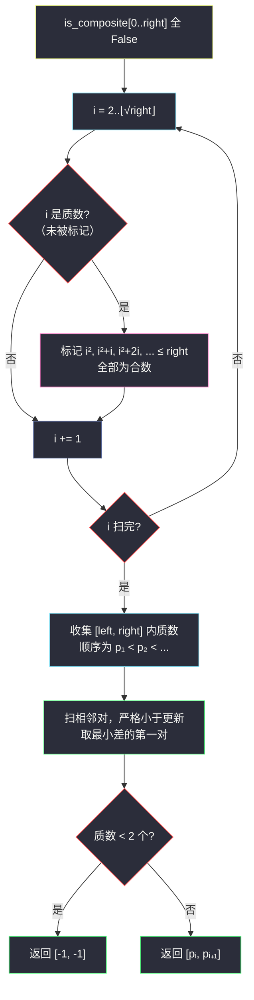

# 2523. 范围内最接近的两个质数（Closest Primes in Range）

> 题目来源：[https://leetcode.cn/problems/closest-prime-numbers-in-range/](https://leetcode.cn/problems/closest-prime-numbers-in-range/)
>
> 灵茶题单小节定位：§1.2 预处理质数（筛质数）

## 一、问题描述

给你两个正整数 `left` 和 `right`，请你找到两个整数 `num1` 和 `num2`，它们满足：

- `left <= num1 < num2 <= right`
- `num1` 和 `num2` 都是**质数**
- `num2 - num1` 是满足上述条件的质数对中的**最小值**

请你返回正整数数组 `ans = [num1, num2]`。如果有多个整数对满足上述条件，请你返回 `num1` **最小**的质数对。如果不存在符合题意的质数对，请你返回 `[-1, -1]`。

**数据范围**：

- `1 <= left <= right <= 10⁶`

**示例 1**：

```text
输入：left = 10, right = 19
输出：[11,13]
解释：10 到 19 之间的质数为 11, 13, 17, 19。
质数对的最小差值是 2，[11,13] 和 [17,19] 都可以得到最小差值。
由于 11 比 17 小，我们返回第一个质数对。
```

**示例 2**：

```text
输入：left = 4, right = 6
输出：[-1,-1]
解释：给定范围内只有一个质数，所以题目条件无法被满足。
```

**核心思考点**：把 `[left, right]` 内的质数**按序**筛出来，答案一定出现在**相邻**两个质数之间（若最优对不相邻，夹在中间的质数能让差更小）。预处理用**埃氏筛**或**线性筛**一次筛到 `right`，再线性扫相邻对即可。

## 二、暴力解法

### 思路

对每个 `x ∈ [left, right]` 用试除法判断质数（枚举到 `⌊√x⌋`），收集全部质数到列表，再扫相邻对取最小差。不筛表，逐点判素。

### 代码

```python
from math import isqrt

def closestPrimesBrute(left: int, right: int) -> list[int]:
    def is_prime(x: int) -> bool:
        if x < 2:
            return False
        for d in range(2, isqrt(x) + 1):
            if x % d == 0:
                return False
        return True

    ps = [x for x in range(max(left, 2), right + 1) if is_prime(x)]
    if len(ps) < 2:
        return [-1, -1]
    ans, best = [-1, -1], float("inf")
    for a, b in zip(ps, ps[1:]):
        if b - a < best:
            best = b - a
            ans = [a, b]
    return ans
```

### 复杂度

- 时间：`O((right − left) · √right)`——每个数判素 `O(√x)`。`right = 10⁶`、区间全长时约 `10⁶ × 1000 = 10⁹` 次除法，会超时。
- 空间：`O(π(right))`，质数个数。

## 三、优化探索

### 3.1 关键观察：最优质数对必相邻 ⭐

设区间内质数按序为 `p₁ < p₂ < ... < pₖ`。若答案取 `pᵢ` 与 `pⱼ`（`j ≥ i+2`，中间至少隔一个质数 `pᵢ₊₁`），那么：

- `pᵢ₊₁ − pᵢ < pⱼ − pᵢ`（更近的同侧对）；
- `pⱼ − pⱼ₋₁ < pⱼ − pᵢ`（另一侧）。

任何跨质数对都严格劣于某个相邻对。所以只需在筛出的质数序列上**扫一遍相邻差**，取最小；差相同时取最先出现的（即 `num1` 最小）——顺序扫描用**严格小于**比较更新，天然保留第一对。

### 3.2 埃氏筛：标记合数，剩下的就是质数 ⭐⭐

**埃拉托斯特尼筛法**：从 2 开始，把每个质数的倍数标记为合数。关键剪枝是「从 `i²` 开始标记」——小于 `i²` 的 `i` 的倍数 `i·m`（`m < i`）早被更小的因子 `m` 的筛程标记过。

标记总次数 `n/2 + n/3 + n/5 + ... ≈ n·log log n`，近乎线性。



### 3.3 一个可证的加速：相邻质数差 > 1 时可提前终止 ⭐

除 2 和 3 以外，所有质数都 ≠ ±1 mod 6 之外的余数……更实用的结论：**若区间内质数对的最小差可能为 1 或 2**——差为 1 只有 `(2, 3)`；差为 2 是孪生质数。扫描时一旦遇到差 ≤ 2 可立即返回（差 1/2 已是最小可能，且当前对 `num1` 最小——前面的对差更大）。本题值域下实测加速明显，但属于锦上添花，主流程不依赖它。

## 四、代码实现

### 主解：埃氏筛 + 相邻扫描

```python
class Solution:
    def closestPrimes(self, left: int, right: int) -> List[int]:
        # 1) 埃氏筛：is[i] = True 表示 i 是合数
        is_comp = [False] * (right + 1)
        for i in range(2, right + 1):
            if not is_comp[i] and i * i <= right:
                for j in range(i * i, right + 1, i):
                    is_comp[j] = True
        # 2) 收集区间质数
        ps = [x for x in range(max(left, 2), right + 1) if not is_comp[x]]
        if len(ps) < 2:
            return [-1, -1]
        # 3) 扫相邻对，严格小于更新（并列保留 num1 最小的第一对）
        ans, best = [-1, -1], float("inf")
        for a, b in zip(ps, ps[1:]):
            if b - a < best:
                best, ans = b - a, [a, b]
        return ans
```

### 进阶：线性筛（欧拉筛）

埃氏筛中一个合数会被它的每个质因子各标记一次；线性筛保证**每个合数只被最小质因子标记一次**，严格 `O(n)`。`right` 达 `10⁸` 或多组查询时更划算，本题 `10⁶` 两种都秒过：

```python
class Solution:
    def closestPrimes(self, left: int, right: int) -> List[int]:
        is_comp = [False] * (right + 1)
        primes = []
        for i in range(2, right + 1):
            if not is_comp[i]:
                primes.append(i)
            for p in primes:
                if i * p > right:
                    break
                is_comp[i * p] = True
                if i % p == 0:          # p 是 i 的最小质因子，保证合数只标一次
                    break
        ps = [x for x in primes if x >= left]
        if len(ps) < 2:
            return [-1, -1]
        ans, best = [-1, -1], float("inf")
        for a, b in zip(ps, ps[1:]):
            if b - a < best:
                best, ans = b - a, [a, b]
        return ans
```

### 细节说明

- **埃氏筛外层条件写法**：`if not is_comp[i] and i*i <= right` 把「是否质数」与「i² 是否越界」合并；也可以外层只到 `⌊√right⌋`（`for i in range(2, isqrt(right)+1)`），筛完再统一收集——两者等价，后者更快一点。
- **`left = 1` 边界**：收集时从 `max(left, 2)` 起，1 不是质数。
- **并列时返回 num1 最小**：严格小于 `<` 更新，第一个达到最小差的对保留，天然满足。
- **区间内质数 < 2 个返回 [-1,-1]**：含「零个」与「恰好一个」两种情形（示例 2）。

## 五、例子演示

**示例 1 端到端：left = 10, right = 19**

| 步骤 | 内容 |
|---|---|
| 埃氏筛到 19 | `i=2`：标记 4,6,...,18；`i=3`：标记 9,15（12,18 已标）；`i=4`：已标跳过；`⌊√19⌋=4`，外层结束 |
| 收集 [10,19] 质数 | `ps = [11, 13, 17, 19]` |
| 相邻扫描 | (11,13) 差 2 → 更新；(13,17) 差 4 → 不更新；(17,19) 差 2 → **不小于** best=2，跳过 |
| 返回 | `[11, 13]` ✅（并列保留第一对，num1=11 最小） |

注意最后一步：`(17,19)` 差也是 2，但因为用**严格小于**比较，先到的 `(11,13)` 胜出——这正是题面「多个整数对满足条件返回 num1 最小」的实现要点。若误写成 `<=`，示例 1 就会错答 `[17,19]`（对拍必抓）。

**示例 2：left = 4, right = 6**：筛后收集得 `ps = [5]`，长度 1 < 2，返回 `[-1, -1]` ✅。

**自造例子：left = 1, right = 10**：`ps = [2, 3, 5, 7]`，相邻差依次 1, 2, 2 → 最小差 1 的对 `(2, 3)`，返回 `[2, 3]`（差 1 只可能是这一对，验证 3.3 的提前终止想法）。

## 六、复杂度分析

设 `n = right`：

- **时间复杂度：`O(n log log n)`**（埃氏筛）或严格 `O(n)`（线性筛）+ 收集与扫描 `O(n − left)`。
  - 对比暴力 `O((n − left)·√n)`：`10⁶` 时 10⁹ 次 → 10⁶ 次，千倍差距。
- **空间复杂度：`O(n)`**——标记数组与质数列表。

## 七、对比总结

| 维度 | 暴力（逐点试除） | 主解（埃氏筛） | 进阶（线性筛） |
|---|---|---|---|
| 时间 | `O(n√n)` | `O(n log log n)` | `O(n)` |
| 空间 | `O(π(n))` | `O(n)` | `O(n)` |
| 10⁶ 值域 | 超时 | 毫秒级 | 毫秒级 |
| 合数被标次数 | — | 每个质因子一次 | 恰好一次（最小质因子） |
| 实现难度 | 低 | 低 | 中（break 双条件） |

**套路归纳**：区间质数问题三板斧——①「范围预处理」用筛（埃氏够用，线性更优），一次筛多次查询把成本摊薄；②「最接近对」必在**排序序列的相邻元素**间产生，扫一遍即可（该结论对任意有序序列的最小差对成立）；③「并列取首个」用严格小于比较。埃氏筛的「从 i² 开始」与线性筛的「`i % p == 0` 即 break」是两处必背细节。

## 八、举一反三

1. **[204. 计数质数](https://leetcode.cn/problems/count-primes/)**：筛法的裸题入门，埃氏/线性筛直接数个数。
2. **[2761. 和等于目标值的质数对](https://leetcode.cn/problems/prime-pairs-with-target-sum/)**：筛出质数表后双指针配对，与本题「筛 + 区间内扫描」的骨架同源。
3. **[762. 二进制表示中质数个计算置位](https://leetcode.cn/problems/prime-number-of-set-bits-in-binary-representation/)**：小值域判素的技巧（质数集合查表），体会判素 vs 筛表的适用边界。
4. **[1998. 数组的最大公因数排序](https://leetcode.cn/problems/gcd-sort-of-an-array/)**：质因数分解 + 并查集 + 排序判定，筛思想向图论扩展。
5. **[1015. 可被 K 整除的最小整数](https://leetcode.cn/problems/smallest-integer-divisible-by-k/)**：换个方向的数论小题，与质数家族互为调剂。

**同族互引**：本批 `most-frequent-prime.md`（#3044）用**单点判素**处理零散大数，与本题的**批量筛表**构成「判断质数」小节的一体两面；灵茶题单 §1.2 的「预处理」三字正是指先筛后查的查询模式。
