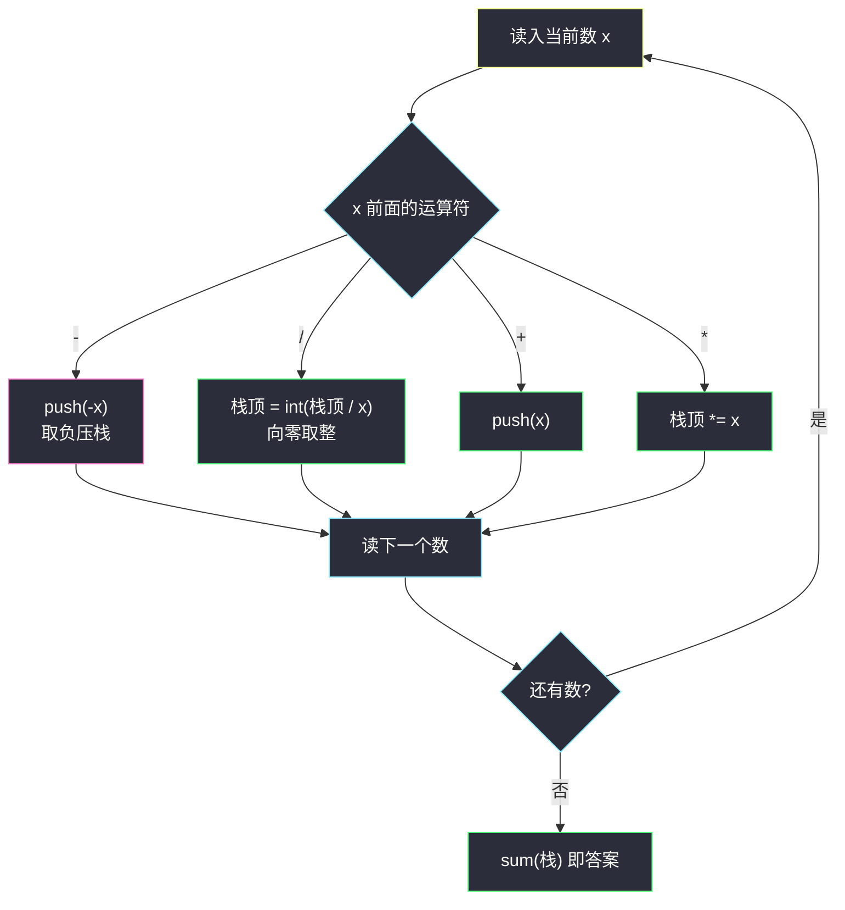

# 笨阶乘（表达式求值 × 栈式一遍扫描）

## 一、问题描述

正整数 `n` 的**笨阶乘** `clumsy(n)` 定义为：把 `n, n-1, …, 2, 1` 依次写下来，数字之间按 **`*`、`/`、`+`、`-` 的固定顺序循环插入**运算符（第一个运算是 `*`，然后 `/`，然后 `+`，然后 `-`，再回到 `*`，依此类推）。运算按标准优先级：**乘除优先于加减**，同级从左到右；除法是**整数除法（向零取整）**。

例如 `clumsy(10) = 10 * 9 / 8 + 7 - 6 * 5 / 4 + 3 - 2 * 1 = 12`。

给定 `n`，返回 `clumsy(n)` 的值。

> 🔗 LeetCode 1006：https://leetcode.cn/problems/clumsy-factorial/
>
> 数据范围：`1 <= n <= 10^4`，结果保证在 32 位整数范围内。

**示例**

| 输入 | 输出 | 展开式 |
|------|------|--------|
| `n = 4` | `7` | `4 * 3 / 2 + 1` |
| `n = 10` | `12` | `10*9/8 + 7 - 6*5/4 + 3 - 2*1 = 11 + 7 - 7 + 3 - 2` |
| `n = 1` | `1` | 只有数字 `1`，无运算符 |

**直观理解**

这不是一道「阶乘」题，而是一道披着阶乘外衣的**表达式求值**题：给定的不是任意表达式，而是一串数字 + 循环出现的运算符，但求值规则（乘除优先、加减从左到右）与 [#227 基本计算器 II](https://leetcode.cn/problems/basic-calculator-ii/) 完全一致。所以它出现在灵神题单的 **§3.5 表达式解析** 小节，练的就是「不含括号的表达式」的标准栈式求值模板。

---

## 二、暴力解法

最直接的想法：把整个「表达式」原样展开成一个 token 列表 `[10, '*', 9, '/', 8, '+', 7, …]`，然后分两个阶段处理——先把所有 `*`/`/` 归约掉，再对只剩加减的序列从左到右求和：

```python
def clumsy(n: int) -> int:
    tokens = [n]
    ops = ['*', '/', '+', '-']
    for i, x in enumerate(range(n - 1, 0, -1)):
        tokens += [ops[i % 4], x]

    while True:                                   # 阶段一：算掉所有乘除
        done = True
        for k in range(1, len(tokens), 2):
            if tokens[k] not in '*/':
                continue
            a, b = tokens[k - 1], tokens[k + 1]
            if tokens[k] == '*':
                v = a * b
            elif a < 0:                           # 向零取整：负数单独处理
                v = -((-a) // b)
            else:
                v = a // b
            tokens[k - 1:k + 2] = [v]             # 三个 token 缩成一个
            done = False
            break                                 # 下标已失效，只能从头重扫
        if done:
            break

    res = tokens[0]                               # 阶段二：只剩加减
    for k in range(1, len(tokens), 2):
        res = res + tokens[k + 1] if tokens[k] == '+' else res - tokens[k + 1]
    return res
```

注意两个别扭点：其一，每归约一处乘除，后面所有 token 的下标整体平移，只能 `break` 回去**从头重扫**；其二，取负后的除法要单独写分支处理向零取整。

### 复杂度

- **时间**：`O(n^2)`——每次归约 `O(n)` 搬移，共约 `n/2` 个乘除号。
- **空间**：`O(n)` 存 token 列表。

### 🔴 瓶颈在哪里

归约乘除时反复搬移数组。但注意一个关键事实：**`*` 和 `/` 只会「吸附」紧邻它的操作数**，加减号则天然是分段符——每个 `+` 后面的数直接累加，每个 `-` 后面的数整体取负后累加。这正是灵神 §3.5 栈式求值模板要利用的结构。

---

## 三、优化探索（核心章节）

> 📚 本题在灵茶题单中属于 **§3.5 表达式解析**，是「无括号四则表达式」的入门模板题；同小节的进阶版（含括号、含 `!`、`&`、`|`）见同目录 [parsing-a-boolean-expression.md](parsing-a-boolean-expression.md)。

### 3.1 核心观察：加减是分段符

把表达式按 `+`/`-` 切开，每一段内部**只有乘除**（一段内从左到右算完是一个确定的数）。整个表达式的值 = 各段带符号之和。

- `+` 开头的段：直接加；
- `-` 开头的段：整段取负后加。

于是维护一个栈：**栈里存的是「已经确定符号的段」**。

### 3.2 一遍扫描的四条规则

从 `n` 扫到 `1`，运算符按 `* / + -` 循环，对每个数字看它前面的运算符：

| 前面的运算符 | 动作 | 原因 |
|--------------|------|------|
| `*` | `栈顶 = 栈顶 × 当前数` | 并入当前段 |
| `/` | `栈顶 = 向零取整(栈顶 / 当前数)` | 并入当前段 |
| `+` | `push(当前数)` | 开启一个正号段 |
| `-` | `push(-当前数)` | 开启一个负号段——**减号后面的乘除结果整体取负压栈** |

扫完后 `sum(栈)` 即答案。这就是灵神模板的一句话：**「遇乘除改栈顶，遇加压正数，遇减压负数，最后求和」**。

### 3.3 易错点：除法是向零取整

`clumsy(10)` 中间会出现 `-6 * 5 / 4`：取负压栈后是 `-6`，乘 `5` 得 `-30`，再除以 `4`。题目要求**向零取整**：`-30 / 4 = -7`（丢弃小数部分）。而：

- C++ / Java 的整数除法**天然向零取整**，直接写 `/` 即可；
- Python 的 `//` 是**向下取整**，`-30 // 4 = -8`，会得到错误答案！

Python 里正确写法是 `int(-30 / 4)`（浮点除法再截断），或用等价整数式：

```python
q = abs(top) // x
top = q if top >= 0 else -q
```

本题 `n <= 10^4`，中间乘积不超过 `10^8`，`int(a / b)` 的浮点精度完全够用。

### 3.4 流程图



### 3.5 更进一步：O(1) 数学公式

表达式按 4 个数字一组分段，关键引理：**当组头 `m >= 5` 时**，`m * (m-1) / (m-2)` 向零取整恰好等于 `m + 1`。用带余除法证明：

`m * (m-1) = (m - 2) * (m + 1) + 2`，即 `m*(m-1)/(m-2) = m + 1 + 2/(m-2)`；当 `m >= 5` 时 `0 < 2/(m-2) < 1`，被取整舍去，得 `m + 1`。

于是 `clumsy(n)`（`n >= 5` 时首组化为 `n+1`，其后每组的 `+(组头-3) - (下一组头+1)` 成对抵消为 0）化简为 **`n + 1` + 尾部修正**，尾部只剩最后一段（按 `n mod 4` 直接手算）：

| `r = n mod 4` | 尾部表达式 | 尾部值 | 最终答案 |
|---------------|-----------|--------|----------|
| `0` | `… + 5 - 4*3/2 + 1` → `+5 - 6 + 1` | `0` | `n + 1` |
| `1` | `… + 2 - 1` | `+1` | `n + 2` |
| `2` | `… + 3 - 2*1` | `+1` | `n + 2` |
| `3` | `… + 4 - 3*2/1` | `-2` | `n - 1` |

`n <= 4` 打表 `[1, 2, 6, 7]`。验证：`clumsy(10)`，`r = 2` → `12` ✓；`clumsy(7)`，`r = 3` → `6` ✓；`clumsy(8)`，`r = 0` → `9` ✓。主解仍推荐栈法（模板可迁移），数学法作为面试加分项。

### 3.6 一句话核心

> **减号把后面整段乘除结果取负压栈，加号压正数，乘除直接改栈顶；最后 `sum(栈)`。Python 除法必须向零取整。**

---

## 四、代码实现

### Python（主解：栈式一遍扫描）

```python
class Solution:
    def clumsy(self, n: int) -> int:
        st = [n]                      # 第一个数直接入栈
        op = 0                        # 0:*, 1:/, 2:+, 3:- 按循环取用
        for x in range(n - 1, 0, -1): # 从 n-1 扫到 1
            if op == 0:               # 乘：并入栈顶段
                st[-1] *= x
            elif op == 1:             # 除：向零取整（易错！）
                st[-1] = int(st[-1] / x)
            elif op == 2:             # 加：开新段，压正数
                st.append(x)
            else:                     # 减：开新段，压负数
                st.append(-x)
            op = (op + 1) % 4         # 运算符循环右移
        return sum(st)                # 所有带符号段求和
```

### Python（O(1) 数学解）

```python
class Solution:
    def clumsy(self, n: int) -> int:
        if n <= 4:
            return (0, 1, 2, 6, 7)[n]     # 打表
        r = n % 4
        if r == 0:
            return n + 1
        if r in (1, 2):
            return n + 2
        return n - 1                       # r == 3
```

**变量含义**

| 变量 | 含义 |
|------|------|
| `st` | 栈，每个元素是一个「已定号的段」的部分和 |
| `op` | 下一个运算符在循环 `* / + -` 中的下标 |
| `st[-1] = int(st[-1] / x)` | 向零取整除法（Python 专属坑位） |

---

## 五、具体例子演示

以 `clumsy(10)` 端到端跟踪，表达式为 `10 * 9 / 8 + 7 - 6 * 5 / 4 + 3 - 2 * 1`：

| 步 | 读入 | 运算符 | 动作 | 栈（底 → 顶） | 说明 |
|----|------|--------|------|----------------|------|
| 0 | 10 | — | 入栈 | `[10]` | 首数直接压栈 |
| 1 | 9 | `*` | 栈顶 × 9 | `[90]` | 并入当前段 |
| 2 | 8 | `/` | 90 / 8 向零取整 | `[11]` | `11.25` → `11` |
| 3 | 7 | `+` | 压入 7 | `[11, 7]` | 新开正号段 |
| 4 | 6 | `-` | 压入 -6 | `[11, 7, -6]` | 新开负号段 |
| 5 | 5 | `*` | -6 × 5 | `[11, 7, -30]` | 段内乘法 |
| 6 | 4 | `/` | -30 / 4 向零取整 | `[11, 7, -7]` | **`-7.5` → `-7`，不是 `-8`** |
| 7 | 3 | `+` | 压入 3 | `[11, 7, -7, 3]` | |
| 8 | 2 | `-` | 压入 -2 | `[11, 7, -7, 3, -2]` | |
| 9 | 1 | `*` | -2 × 1 | `[11, 7, -7, 3, -2]` | |

最终 `sum = 11 + 7 - 7 + 3 - 2 = 12` ✓，与直接按优先级计算 `10*9/8 + 7 - 6*5/4 + 3 - 2*1 = 11 + 7 - 7 + 3 - 2 = 12` 一致。

**重点看第 6 步**：`-6 * 5 = -30` 这一段的「负号」在入栈时（第 4 步）就已经记录，后续乘除只管在段内自算，`-30 / 4` 按**向零取整**得 `-7`——这正是 Python 写 `//` 会翻车（得 `-8`）的地方。

---

## 六、复杂度分析

| 解法 | 时间 | 空间 |
|------|------|------|
| 暴力 token 归约 | `O(n^2)` | `O(n)` |
| 栈式一遍扫描（主解） | `O(n)` | `O(n)`（栈最深约 `n/2` 个负号段） |
| 数学公式 | `O(1)` | `O(1)` |

`n <= 10^4` 时三者在时限内都能过，但栈法是可迁移模板：换成任意无括号四则表达式照样成立，公式法则只对「运算符固定循环」这一特殊结构生效。

---

## 七、对比总结

**与同族题的关系**：本题 = [#227 基本计算器 II](https://leetcode.cn/problems/basic-calculator-ii/) 去掉输入解析（运算符循环生成，不用读字符串）、去掉负号入栈歧义之外的全部考点，是「减号取负压栈」模板的最小训练场。§3.5 小节的递归下降/栈式两套武器（见 [parsing-a-boolean-expression.md](parsing-a-boolean-expression.md)）在无括号场景下退化为这一张四行规则表。

**易错点**

1. **除法向零取整**：Python 的 `//` 向下取整，负数场景必错；用 `int(a / b)` 或 `abs` 分支处理。C++/Java 无此坑。
2. **首数无运算符**：第一个数字直接入栈，循环从第二个数开始配运算符。
3. **运算符循环起点**：第一个运算符是 `*` 不是 `-`，`op` 初始化为 0 后 `(op + 1) % 4` 轮转即可。
4. **别用 `eval`**：把 `/` 换成 `//` 后 `eval` 在负数段同样踩取整方向的坑，且不具迁移性。

---

## 八、举一反三

| 题目 | 关系 |
|------|------|
| [227. 基本计算器 II](https://leetcode.cn/problems/basic-calculator-ii/) | **同模板正主**：字符串输入 + 同款「取负压栈」栈式求值 |
| [224. 基本计算器](https://leetcode.cn/problems/basic-calculator/) | 加入括号与一元正负号，栈式求值的进阶 |
| [150. 逆波兰表达式求值](https://leetcode.cn/problems/evaluate-reverse-polish-notation/) | 后缀表达式求值，另一个方向的栈运用 |
| [1598. 文件夹操作日志分析器](https://leetcode.cn/problems/crawler-log-folder/) | 轻量栈模拟热身 |
| 同目录 [parsing-a-boolean-expression.md](parsing-a-boolean-expression.md) | §3.5 同小节：递归下降 / 「遇 `)` 弹栈聚合」栈法 |

**思想迁移**

- 无括号四则表达式：**加减分段、乘除段内折叠**——「遇乘除改栈顶、遇加减压带符号新数、末尾求和」，三行口诀一套模板。
- 特殊结构（运算符循环、项数固定）出现时，先找**代数化简**的可能：本题 `m*(m-1)/(m-2) = m+1` 的带余除法一步，把 `O(n)` 直接打到 `O(1)`。
- 整数除法永远先问一句：**向哪取整？** Python 默认向下、C 系默认向零，跨语言刷题时这是高频 WA 源。
