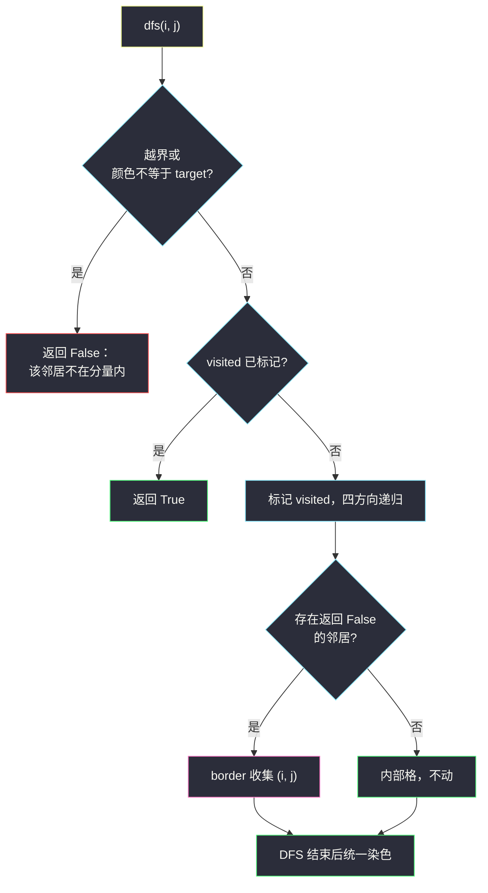

# 边界着色（网格图 DFS · 连通分量 + 贴边判定）

## 一、问题描述

给你 `m x n` 的整数矩阵 `grid`、整数 `row`、`col`、`color`。`(row, col)` 所在的**同色连通分量**定义：从 `(row, col)` 出发，反复移动到上下左右相邻且**颜色相同**的格子所能到达的全部格子。

该分量的**边界**定义：分量中满足以下任一条件的格子——

1. 位于**网格边界**（第一/最后一行或第一/最后一列）；
2. 上下左右**任一相邻格颜色与分量颜色不同**。

请把分量中所有边界格染成 `color`，返回染色后的矩阵。

> 🔗 LeetCode 1034：https://leetcode.cn/problems/coloring-a-border/
>
> 数据范围：`1 <= m, n <= 50`，`1 <= grid[i][j], color <= 1000`。保证 `(row, col)` 合法。

**示例 1**

```
输入：grid = [[1,1],[1,2]], row = 0, col = 0, color = 3
输出：[[3,3],[3,2]]
解释：分量是三个 1；每个 1 都贴边或邻着 2，全部染色。
```

**示例 2**

```
输入：grid = [[1,2,2],[2,3,2]], row = 0, col = 1, color = 3
输出：[[1,3,3],[2,3,3]]
解释：分量是三个 2，都贴边，全部染成 3；左下角的 3 是原值，不在分量内。
```

**示例 3**

```
输入：grid = [[1,1,1],[1,1,1],[1,1,1]], row = 1, col = 1, color = 2
输出：[[2,2,2],[2,1,2],[2,2,2]]
解释：分量是全部 9 格；只有外圈 8 格是边界，中心 (1,1) 四邻同色，不染。
```

**直观理解**

两步走：先用 DFS 找出 `(row, col)` 所在的同色连通分量；再对分量里每个格子判断「是不是边界」。坑在第二步——如果一边 DFS 一边就地改色，改过的格子颜色变了，会**污染**后续「邻居是否同色」的判断。安全做法是**先收集、后统一改色**。

---

## 二、暴力解法

按定义直译，两遍扫描：第一遍用栈找出分量全部格子；第二遍对每个分量格子重新检查四邻与边界，是边界格才染色。

```python
class Solution:
    def colorBorder(self, grid: List[List[int]], row: int, col: int, color: int) -> List[List[int]]:
        m, n = len(grid), len(grid[0])
        target = grid[row][col]              # 分量的颜色，判断的基准
        DIRS = (1, 0), (-1, 0), (0, 1), (0, -1)

        comp = []                            # 第一遍：收集分量
        visited = [[False] * n for _ in range(m)]
        st = [(row, col)]
        visited[row][col] = True
        while st:
            i, j = st.pop()
            comp.append((i, j))
            for dx, dy in DIRS:
                x, y = i + dx, j + dy
                if 0 <= x < m and 0 <= y < n and not visited[x][y] and grid[x][y] == target:
                    visited[x][y] = True
                    st.append((x, y))

        for i, j in comp:                    # 第二遍：逐格判边界再染色
            is_border = (i == 0 or i == m - 1 or j == 0 or j == n - 1)
            if not is_border:
                for dx, dy in DIRS:
                    if grid[i + dx][j + dy] != target:
                        is_border = True
                        break
            if is_border:
                grid[i][j] = color
        return grid
```

### 复杂度

- **时间**：`O(mn)`——两遍都是每个格子常数次邻居检查。
- **空间**：`O(mn)`——`visited` 与分量列表。

### 🔴 瓶颈在哪里

渐进复杂度已是最优，问题是**结构割裂**：找分量、判边界分两趟、两套循环，而且第二趟的「邻格异色」判断完全重复了第一趟 DFS 已经做过的「邻居是否在分量内」判断。更危险的是这种写法容易诱导人「合并成一趟、边走边染」——而边走边染会出 bug（见 3.3）。能不能一趟搞定，又不踩污染的坑？

---

## 三、优化探索（核心章节）

> 📚 本题出自灵茶题单 **「网格图 DFS 基础 · 一、网格图 DFS」** 小节，套路是**连通分量遍历 + 边界格判定**：DFS 的递归返回值天然携带「邻居是否属于分量」的信息，一趟收集边界格、最后统一改色。

### 3.1 边界格判定的统一视角

两种边界条件其实是一回事：**存在某个邻居「不在分量内」**。

| 情形 | 为什么算边界 |
|------|--------------|
| 贴网格边界 | 越界方向的「邻居」不存在，自然不在分量内 |
| 邻格颜色不同 | 异色格不属于同色分量 |

于是判定收敛成一句话：分量内的格子 `(i, j)`，若四邻中存在「越界或颜色 ≠ `target`」的格子，它就是边界格。

### 3.2 让 DFS 的返回值干活

把 `dfs(i, j)` 的语义定为「`(i, j)` 是否属于分量」，那么对分量内的格子来说，**邻居的返回值就是它的边界判定依据**：

```python
def dfs(i: int, j: int) -> bool:
    if not (0 <= i < m and 0 <= j < n) or grid[i][j] != target:
        return False                  # 越界或异色：不在分量内
    if visited[i][j]:
        return True                   # 已访问过：在分量内
    visited[i][j] = True
    is_border = False
    for dx, dy in DIRS:
        if not dfs(i + dx, j + dy):   # 有邻居不在分量内
            is_border = True          #   → (i,j) 是边界格
    if is_border:
        border.append((i, j))
    return True
```

注意 `is_border` 用布尔标志而不是「发现即 append」——一个格子可能有多个分量外邻居，标志保证每格只进一次 `border`。找分量与判边界在**同一次 DFS** 里完成，两趟并一趟。

### 3.3 陷阱：边走边染会污染判断

假设省掉 `border` 列表，DFS 访问完 `(i, j)` 就直接 `grid[i][j] = color`：

- 后面某个内部格 `(x, y)` 检查邻居时，看到 `(i, j)` 的颜色是 `color`；
- 若 `color != target`：`(i, j)` 被误判为「异色邻居」，`(x, y)` 这个**内部格被误染**；
- 若 `color == target`：所有已访问格看起来仍是 `target`，无法区分「访问过/没访问过」，分量会被反复进入、**死循环**。

所以正确姿势只有一种：**判断阶段只读不写，收集完 `border` 后统一改色**。「先收集后改色」与访问标记 `visited`（而不是改色本身）配合，两个坑一起填掉。



### 3.4 显式栈写法：判定改用「位置 + 颜色」

栈/BFS 版没有递归返回值可借用，边界判定回到「位置 + 邻色」的直接判断：`i` 贴边，或某邻格（此时必在界内）颜色 ≠ `target`。

### 3.5 一句话核心

> 一趟 DFS 找分量：邻居「越界或异色」即分量外，出现分量外邻居的格子收集进 `border`；DFS 结束后统一染 `color`。**先收集后改色**，判断阶段零写入。

---

## 四、代码实现

### Python（主解：递归 DFS + 先收集后改色）

```python
class Solution:
    def colorBorder(self, grid: List[List[int]], row: int, col: int, color: int) -> List[List[int]]:
        m, n = len(grid), len(grid[0])
        target = grid[row][col]              # 分量颜色基准，全程不变
        DIRS = (1, 0), (-1, 0), (0, 1), (0, -1)
        visited = [[False] * n for _ in range(m)]
        border = []

        def dfs(i: int, j: int) -> bool:     # (i, j) 是否属于分量
            if not (0 <= i < m and 0 <= j < n) or grid[i][j] != target:
                return False                 # 越界或异色：分量外
            if visited[i][j]:
                return True                  # 已访问：分量内
            visited[i][j] = True
            is_border = False
            for dx, dy in DIRS:
                if not dfs(i + dx, j + dy):  # 邻居在分量外
                    is_border = True
            if is_border:
                border.append((i, j))
            return True

        dfs(row, col)
        for i, j in border:                  # 统一改色：判断已全部结束
            grid[i][j] = color
        return grid
```

**变量含义**

| 变量 | 含义 |
|------|------|
| `target` | 起点（即分量）的颜色，所有判断以它为基准 |
| `dfs(i, j)` 返回值 | `(i, j)` 是否属于分量（越界 / 异色为 False） |
| `border` | 边界格坐标列表，DFS 结束后统一染色 |
| `visited` | 独立访问标记，与改色解耦 |

**递归深度提示**：`m, n ≤ 50`，最坏 2500 格同色、递归 2500 层，Python 默认上限 1000 可能不够，提交时可调大递归限制或改用下面的栈版。

### Python（显式栈版：位置 + 邻色判定）

```python
class Solution:
    def colorBorder(self, grid: List[List[int]], row: int, col: int, color: int) -> List[List[int]]:
        m, n = len(grid), len(grid[0])
        target = grid[row][col]
        DIRS = (1, 0), (-1, 0), (0, 1), (0, -1)
        visited = [[False] * n for _ in range(m)]
        border = []

        visited[row][col] = True
        st = [(row, col)]
        while st:
            i, j = st.pop()
            if i == 0 or i == m - 1 or j == 0 or j == n - 1:
                border.append((i, j))            # 条件 1：贴网格边界
            else:
                for dx, dy in DIRS:              # 条件 2：邻格异色
                    if grid[i + dx][j + dy] != target:
                        border.append((i, j))
                        break
            for dx, dy in DIRS:
                x, y = i + dx, j + dy
                if 0 <= x < m and 0 <= y < n and not visited[x][y] and grid[x][y] == target:
                    visited[x][y] = True
                    st.append((x, y))

        for i, j in border:
            grid[i][j] = color
        return grid
```

细节：内部格（`0 < i < m-1` 且 `0 < j < n-1`）的邻居必然都在界内，所以 `grid[i + dx][j + dy]` 不会越界，无需再加边界检查。

---

## 五、具体例子演示

### 例 1：示例 2 端到端跟踪

`grid = [[1,2,2],[2,3,2]]`，`row=0, col=1, color=3`，`target = 2`。分量 = 三个 2。方向顺序：下、上、右、左。`V` 为 visited 快照：

| # | 进入 dfs | visited 变化 | 下 | 上 | 右 | 左 | 判定 |
|---|----------|--------------|----|----|----|----|------|
| 1 | (0,1) | V(0,1)=T | `(1,1)=3` 异色 → F | 越界 → F | 递归 → #2 | `(0,0)=1` 异色 → F | 有分量外邻居 → border += (0,1) |
| 2 | (0,2) | V(0,2)=T | 递归 → #3 | 越界 → F | 越界 → F | 已访 → T | 有 F 邻居 → border += (0,2) |
| 3 | (1,2) | V(1,2)=T | 越界 → F | 已访 → T | 越界 → F | `(1,1)=3` 异色 → F | border += (1,2) |

逐步 visited 快照（`T` 已访问）：

```
步骤1后:        步骤3后:        步骤4后:
. T .           . T T           . T T
. . .           . . .           . . T
```

收集到 `border = [(0,1), (0,2), (1,2)]`，统一染 3：

```
1 3 3        ← (0,1)、(0,2) 改色
2 3 3        ← (1,2) 改色；(1,1)=3 是原值，不在分量内、未被动过
```

输出 `[[1,3,3],[2,3,3]]` ✓

### 例 2：自拟 4 x 4 全同色（展示内部格不染）

```
grid（全 2），row = 1, col = 1，color = 7
```

分量 = 全部 16 格。贴边 12 格是边界格；`(1,1)、(1,2)、(2,1)、(2,2)` 四邻全为 2，是内部格。染色前后：

```
染色前          染色后
2 2 2 2        7 7 7 7
2 2 2 2        7 2 2 7
2 2 2 2        7 2 2 7
2 2 2 2        7 7 7 7
```

若用「边走边染」的写法，`(1,1)` 的邻居 `(0,1)` 先被染成 7，`(1,1)` 就会被误判为边界格——这正是「先收集后改色」要防的事故。

### 例 3：示例 3 验证

3 x 3 全 1，中心出发：分量 9 格，边界 = 贴边 8 格，输出 `[[2,2,2],[2,1,2],[2,2,2]]` ✓

---

## 六、复杂度分析

| 方法 | 时间 | 空间 | 说明 |
|------|------|------|------|
| 两遍扫描（暴力） | `O(mn)` | `O(mn)` | 找分量、判边界两趟 |
| 一趟 DFS + 统一改色 | `O(mn)` | `O(mn)` | `visited` + `border` + 递归栈 |

---

## 七、对比总结

**「分量 + 位置属性」家族**：DFS 的职责从「遍历」扩展到「遍历时顺带判定」。

| 题 | 遍历时判定什么 |
|----|----------------|
| #695 岛屿最大面积 | 无，只累加 |
| #463 岛屿周长 | 越界/水邻居 → 暴露边 |
| **#1034 本篇** | **越界/异色邻居 → 边界格，先收集后改色** |
| #1020 飞地数量 | 从边界反向淹没（判定反过来做） |

**易错点**

1. **边走边染污染判断**：改色必须等 DFS 全部结束；`color == target` 时边走边染还会因无法标记已访问而死循环。
2. **`visited` 与改色解耦**：本题不能学 #2658 用「改值当标记」，因为改值会破坏颜色判断的基准。
3. **同格多次满足边界条件**：用 `is_border` 布尔或 `break`，保证每格只进一次 `border`。
4. **`target` 在 DFS 开头取一次**：不要在递归里读 `grid[row][col]` 当基准——若中途改色（错误写法）基准就漂了。
5. 贴边判断用 `i == 0 or i == m-1 or j == 0 or j == n-1`；内部格查邻色可省越界检查（见栈版细节）。

主解 `dfs` 就是本类题的骨架：入口合并「越界 / 异色」为分量外信号、`visited` 与改色解耦、布尔标志收边界——把它和 #463 的「淹 2」、#2658 的「清零」对照着记，能看穿「标记」在不同题里的一物千面。

---

## 八、举一反三

| 题目 | 关系 |
|------|------|
| [733. 图像渲染](https://leetcode.cn/problems/flood-fill/) | 同色连通分量的「全染」版，本题是「只染边界」版 |
| [463. 岛屿的周长](https://leetcode.cn/problems/island-perimeter/) | 「暴露边 = 分量外邻居」同一判定的周长应用，见同批 `island-perimeter.md` |
| [2658. 网格中的最大鱼数](https://leetcode.cn/problems/maximum-number-of-fish-in-a-grid/) | 分量权值和，原地改值当标记的反例对照，见同批 `maximum-number-of-fish-in-a-grid.md` |
| [1020. 飞地的数量](https://leetcode.cn/problems/number-of-enclaves/) | 「贴边与否」反过来用：从边界淹没，见同批 `number-of-enclaves.md` |
| [1254. 统计封闭岛屿的数目](https://leetcode.cn/problems/number-of-closed-islands/) | 贴边 ⟺ 不封闭，同款淹没套路，见同批 `number-of-closed-islands.md` |
| [417. 太平洋大西洋水流问题](https://leetcode.cn/problems/pacific-atlantic-water-flow/) | 从边界反向 DFS 收集可达集，边界视角的进阶应用 |

**思想迁移**

- 「分量内的格子满足某邻居条件」类问题，让 **DFS 返回值携带分量归属信息**，判定与遍历一趟完成。
- 一切「遍历 + 修改」的网格题，先问一句：**修改会不会污染后续判断**？会，就先收集后统一写。
- 口诀：**「同色走四方，分量外为墙；先收边界格，归来再上妆。」**
