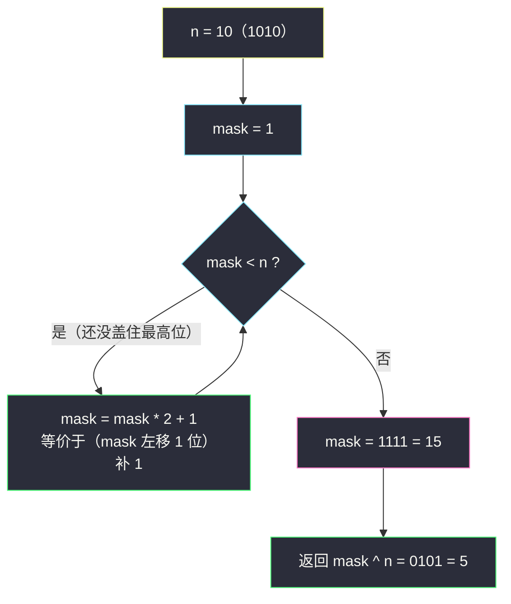

# 十进制整数的补数（同位长全 1 掩码异或）

## 一、问题描述

给定一个十进制整数 `n`，求它的**补数**：把 `n` 的二进制表示**按位取反**（`0` 变 `1`、`1` 变 `0`），再以十进制返回。

> 🔗 LeetCode 1009：https://leetcode.cn/problems/complement-of-base-10-integer/
>
> 数据范围：`0 <= n < 10^9`。

**示例**

```
输入：n = 5    输出：2
解释：5 的二进制是 101，取反得 010，即 2。

输入：n = 7    输出：0
解释：7 的二进制是 111，取反得 000，即 0。

输入：n = 10   输出：5
解释：10 的二进制是 1010，取反得 0101，即 5。

输入：n = 0    输出：1
解释：0 的二进制是 0，取反得 1。
```

**直观理解**

关键在「位长」二字：补数不是补码里那个 `~n`（Python 中 `~5 = -6`，前面拖着无穷多个符号位 1），而是**只翻转有效位**——`101 → 010`，位数保持 3 位不变。所以问题变成两步：确定位长 `L`，再翻转这 `L` 位。灵神题单把它放在 **位运算 · 一、基础题**，模板一句话：**补数 = 同位长全 1 掩码 与 n 异或**。全 1 掩码 `111…1`（L 个 1）正是同批姊妹题 #3370 要构造的 `2^L - 1`（见 `smallest-number-with-all-set-bits.md`）。

---

## 二、暴力解法

转字符串逐字符翻转，最直白：

```python
class Solution:
    def bitwiseComplement(self, n: int) -> int:
        s = bin(n)[2:]                        # '0b101' -> '101'
        t = ''.join('0' if c == '1' else '1' for c in s)
        return int(t, 2)
```

`n = 0` 时 `bin(0)[2:] = '0'`，翻转得 `'1'`，恰好返回 1，天然正确，无需特判。

### 复杂度

- **时间**：`O(L)`，`L` 为二进制位数（`n < 10^9` 时 `L ≤ 30`）。
- **空间**：`O(L)`（字符串）。

### 🔴 瓶颈在哪里

字符串是「人眼视角」，机器视角下翻转就是一次**按位异或**：拿一个同位长的全 1 掩码去异或 `n`，1 的位置翻转、0 的位置也翻转——所有 L 位一起翻。剩下的问题只有一个：**怎么造出这个掩码**。

---

## 三、优化探索

> 📚 本题在灵茶题单中属于 **位运算 · 一、基础题**。灵神模板要点：**补数 = 同位长全 1 异或**；掩码用 `1 → 11 → 111` 的翻倍增长循环，或 `2^k - 1` 直接构造；特别注意 `n = 0` 的边界（位长视为 1，掩码取 1）。

### 3.1 关键观察：n ^ mask = 翻转

设 `L` 为 `n` 的二进制位数（`n = 0` 时约定 `L = 1`），`mask = 111…1`（L 个 1，即 `2^L - 1`）。`mask` 的低 L 位全 1，与 `n` 异或后：`n` 中为 1 的位变成 0，为 0 的位变成 1——恰好是「同位长按位取反」。

```
n    = 1010      (10)
mask = 1111      (15 = 2^4 - 1)
xor  = 0101      (5) ✓
```

而 `mask` 有个增量性质：`1` 二进制是 `1`，`(1 << 1) | 1 = 3` 是 `11`，再翻一倍是 `111`——**每轮「左移一位再补 1」，位长 +1**，直到盖住 `n` 的最高位。

### 3.2 掩码增长循环（主解）



循环条件是 `mask < n` 而不是 `mask <= n` 的原因：只要 `mask` 已 ≥ `n`，它的位长就 ≥ `n` 的位长，且必然与 `n` **同位长**（前一轮还 `< n` 说明短一位不够），异或不会越界污染高位。

### 3.3 n = 0 边界：为什么循环法天然正确

`n = 0` 时初始 `mask = 1`，条件 `1 < 0` 不成立，循环体一次都不进，直接返回 `1 ^ 0 = 1` ✓。`n = 1` 时 `1 < 1` 不成立，返回 `1 ^ 1 = 0` ✓。「初始 mask 恰为一位全 1」这个起点，把位长下限 1 自动兜住了。

### 3.4 位技巧版：自体繁殖掩码（O(1) 级移位）

另一个构造：让 `n` 的最高位 1 向低位「传染」——`mask |= mask >> 1` 把最高位 1 复制到低一位，`>> 2`、`>> 4`、`>> 8`、`>> 16` 指数加速，五次操作后最高位以下全部变 1：

```python
mask = n
mask |= mask >> 1    # 最高位 1 传染到低 1 位
mask |= mask >> 2    # 再传染 2 位
mask |= mask >> 4
mask |= mask >> 8
mask |= mask >> 16   # n &lt; 10^9 &lt; 2^30，移到 16 足够
```

⚠️ 但这版依赖「n 自身有 1 可传染」，`n = 0` 时 `mask` 恒为 0，返回 `0 ^ 0 = 0`，**必须特判 `return 1`**。这正是题目备注里强调的 `n = 0` 边界坑。

### 3.5 一句话核心

> **补数 = `n ^ mask`，mask 是与 n 同位长的全 1 数（`2^L - 1`）；掩码从 1 翻倍生长，`n = 0` 时天然落回 mask = 1。**

---

## 四、代码实现

### Python（主解：掩码增长循环）

```python
class Solution:
    def bitwiseComplement(self, n: int) -> int:
        mask = 1                        # 一位全 1
        while mask < n:                 # 还没盖住 n 的最高位
            mask = (mask << 1) | 1      # 1 -> 11 -> 111 -> ...
        return mask ^ n                 # 同位长按位翻转
```

### Python（位技巧版，需特判 n = 0）

```python
class Solution:
    def bitwiseComplement(self, n: int) -> int:
        if n == 0:
            return 1                    # 无高位可传染，必须特判
        mask = n
        mask |= mask >> 1
        mask |= mask >> 2
        mask |= mask >> 4
        mask |= mask >> 8
        mask |= mask >> 16
        return mask ^ n
```

**变量含义**

| 变量 | 含义 |
|------|------|
| `mask` | 与 `n` 同位长的全 1 掩码，即 `2^L - 1` |
| `mask < n` | 掩码位长尚不足，还要增长 |
| `mask ^ n` | 1 的位翻转、0 的位也翻转 = 同位长取反 |

### Java（主解同款）

```java
class Solution {
    public int bitwiseComplement(int n) {
        int mask = 1;
        while (mask < n) {
            mask = (mask << 1) | 1;
        }
        return mask ^ n;
    }
}
```

---

## 五、具体例子演示

### 例 A：`n = 10`（主演示，二进制逐位表）

位长 `L = 4`，`mask = 2^4 - 1 = 15`：

| 位权 | 8 | 4 | 2 | 1 |
|------|---|---|---|---|
| n = 10 | 1 | 0 | 1 | 0 |
| mask = 15 | 1 | 1 | 1 | 1 |
| n ^ mask | 0 | 1 | 0 | 1 |

`0101 = 5` ✓。

### 例 A（续）：掩码逐步增长表

| 轮次 | mask（二进制） | mask（十进制） | mask < n = 10 ? | 动作 |
|------|----------------|----------------|------------------|------|
| 初始 | `1` | 1 | 1 < 10 ✓ | 继续长 |
| 1 | `11` | 3 | 3 < 10 ✓ | 继续长 |
| 2 | `111` | 7 | 7 < 10 ✓ | 继续长 |
| 3 | `1111` | 15 | 15 < 10 ✗ | 停，返回 15 ^ 10 = 5 |

### 例 B：`n = 5`

掩码增长 `1 → 3 → 7`，`7 ≥ 5` 停：

| 位权 | 4 | 2 | 1 |
|------|---|---|---|
| n = 5 | 1 | 0 | 1 |
| mask = 7 | 1 | 1 | 1 |
| 结果 | 0 | 1 | 0 | → `010` = 2 ✓

### 例 C：`n = 7`（全 1 特例）

`mask = 7` 时 `7 < 7` 不成立，直接 `7 ^ 7 = 0` ✓。全 1 的数补数必为 0，循环一次都不进。

### 例 D：`n = 0`（边界）

`mask = 1`，`1 < 0` 不成立 → `1 ^ 0 = 1` ✓。对照位技巧版：`mask` 从 0 出发无 1 可传染，五次移位后仍是 0，会错返回 0——除非加上 3.4 的特判。三个小例子 `0 / 1 / 7` 各踩一个形态（空值、一位、全 1），提交前用它们各跑一遍最保险。

---

## 六、复杂度分析

| 方法 | 时间 | 空间 |
|------|------|------|
| 字符串翻转 | `O(L)`，`L ≤ 30` | `O(L)` |
| 掩码增长循环 | `O(L)`（每轮位长 +1，至多 30 轮） | `O(1)` |
| 自体传染移位 | `O(1)`（固定 5 次移位 + 5 次或） | `O(1)` |

三种方法在 `n < 10^9` 下都是瞬杀，差异只在常数与边界健壮性：循环法零特判、最短；移位法快但必须记住 `n = 0` 特判。

---

## 七、对比总结

**与补码 `~` 的区别**：`~n` 是按补码语义翻转**无限位**（Python 中 `~5 = -6`），而补数只翻「有效位」。两者恰好差在高位的全 1 前缀——`(2^L - 1) ^ n` 正是把 `~n` 截断到 L 位的结果。

**方法取舍**

| 场景 | 推荐 |
|------|------|
| 面试手写、追求稳 | 掩码循环（无特判、五行） |
| 位运算炫技 | 自体传染（记得 n = 0 特判） |
| 讲给人听 | 字符串翻转（最直白） |

**易错点**

1. **n = 0**：位技巧版必须特判返回 1；循环法与字符串法天然正确。
2. **别用 `~n`**：负数结果说明翻越了有效位长。
3. **循环条件**：`mask < n` 即可，写成 `mask <= n` 会多长一位（如 `n = 7` 时 mask 长成 15，返回 8 ✗）。
4. 位长从**最高有效位**算起，不是固定 32 位——高位的 0 不参与翻转。

---

## 八、举一反三

| 题目 | 关系 |
|------|------|
| [476. 数字的补数](https://leetcode.cn/problems/number-complement/) | 同题正数版（`n >= 1`），模板完全一致 |
| [3370. 全 1 子序列的最小数](https://leetcode.cn/problems/smallest-number-with-all-set-bits/) | 本题的 mask 正是它构造的 `2^L - 1`，见同批 `smallest-number-with-all-set-bits.md` |
| [832. 翻转图像](https://leetcode.cn/problems/flipping-an-image/) | 「翻转 + 反转」组合拳，`^ 1` 批量翻位，见同目录 `flipping-an-image.md` |
| [190. 颠倒二进制位](https://leetcode.cn/problems/reverse-bits/) | 对照：位序颠倒 vs 按位取反，两个不同的「翻转」 |
| [191. 位 1 的个数](https://leetcode.cn/problems/number-of-1-bits/) | 位遍历基础，配合掩码思想食用 |

**思想迁移**

- 「按位取反」=「与全 1 异或」：见到翻转类操作，先找**位长**，再套 `mask ^ x`，比逐位循环干净得多。
- `2^k - 1` 是位运算世界的「万能橡皮」：擦低位（`x & mask`）、翻转（`x ^ mask`）、判低位全 1（`x & mask == mask`），处处是它。
- 边界 `0` 是位运算题的高频坑：凡是「从最高位出发」的技巧（传染、位扫描），0 都没有出发点，先想好兜底。
- 口诀：**「取反就找全 1 掩，掩码翻倍长到位；n 等于零别心慌，mask 起手就是 1。」**
