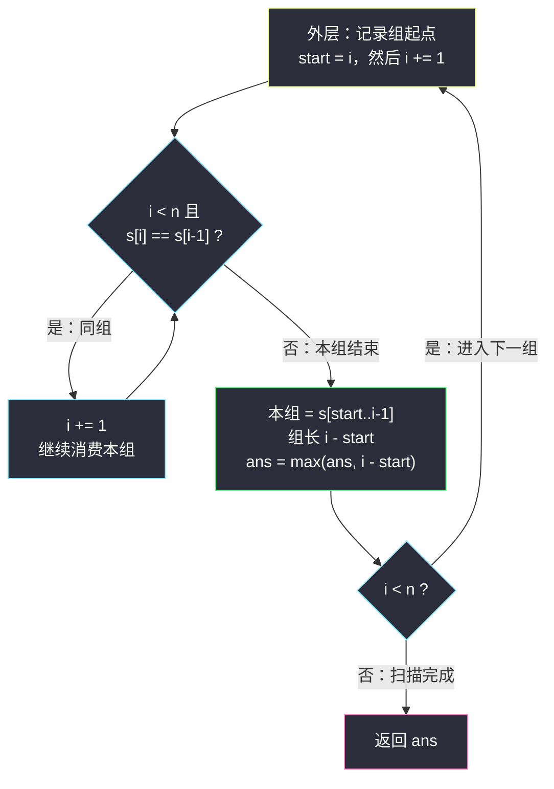
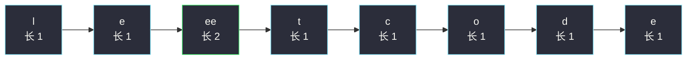

# 连续字符（分组循环入门：最长连续同字符段）

## 一、问题描述

给定字符串 `s`，定义它的「能量值」为：**只包含一种字符**的**最长连续非空子字符串**的长度。返回 `s` 的能量值。

> 🔗 LeetCode 1446 连续字符：https://leetcode.cn/problems/consecutive-characters/
> 难度：Easy · 出自灵神题单「**六、分组循环**」小节（入门第一题）

**示例 1**

```
输入：s = "leetcode"
输出：2
解释：最长子字符串是 "ee"，长度为 2。
```

**示例 2**

```
输入：s = "abbcccddddeeeeedcba"
输出：5
解释：最长子字符串是 "eeeee"，长度为 5。
```

**直观理解**

要找的是「连续相同字符」最长能连成一段多长。把字符串按「连续相同字符」切成一段一段，答案就是最长那一段的长度。这正是**分组循环**的标准形态：串 = 若干「组」，组内字符相同，组与组天然分界，一次遍历切完所有组。

---

## 二、暴力解法

### 思路

枚举每个起点 `i`，从 `i` 开始向右延伸，统计与 `s[i]` 相同的连续字符个数，取所有起点的最大值。

```python
class Solution:
    def maxPower(self, s: str) -> int:
        n = len(s)
        ans = 0
        for i in range(n):
            j = i
            while j < n and s[j] == s[i]:
                j += 1
            ans = max(ans, j - i)   # [i, j) 是以 i 开头的连续同字符段
        return ans
```

### 复杂度

- **时间**：`O(n²)`。最坏 `s` 全同字符，每个起点都扫到结尾。
- **空间**：`O(1)`。

### 🔴 瓶颈在哪里

起点从 `i` 挪到 `i+1` 时，如果两者同组，刚才扫过的整段**几乎原样可用**，却被完整重扫了一遍。相邻信息没有传递下去——典型的「按组重复劳动」。

（本题数据范围小，暴力也能过；但同一家族后面的题数据范围放大，就必须一次遍历了。）

---

## 三、优化探索（核心章节）

### 3.1 特征观察

| 特征 | 说明 |
|------|------|
| 关心的是连续段 | 字符串天然被切分成「连续相同字符」的组 |
| 组与组互相独立 | 每组的答案只看自己，跨组的子串不可能更长 |
| 每个下标只属于一个组 | 从左到右扫一遍即可切完所有组，没有重叠 |

### 3.2 推导：外层定起点，内层吃整组

> **题单出处**：本题出自灵神题单「**六、分组循环**」小节，讲法对齐 lyl 的分组循环模板：
> **外层循环确定每组起点，内层 `while` 消费同组的连续段；组内收集答案，组间重置。**

关键全在指针 `i` 的走法上：

1. 外层进来先记 `start = i`，然后 `i += 1`（组内至少含 `s[start]` 一个字符）；
2. 内层 `while i < n and s[i] == s[i-1]: i += 1` 把同组剩余字符一次性吃完；
3. 内层退出时，`[start, i-1]` 恰好是一整组，长度为 `i - start`，用它更新答案；
4. 回到外层，`i` 已经站在下一组的开头，「组间切换」天然完成，不需要显式重置任何变量。



### 3.3 为什么是 `O(n)`

`i` 在外层和内层都**只前进、不后退**：每个下标最多被外层碰到一次、被内层消费一次，均摊每个下标 `O(1)` 次操作。

### 3.4 一句话核心

> **把字符串切成「连续相同字符」的组，答案 = 最长组的长度；`i` 一路向前不回头，扫完即得。**

---

## 四、代码实现

### Python（主解：分组循环模板）

```python
class Solution:
    def maxPower(self, s: str) -> int:
        n = len(s)
        ans = 0
        i = 0
        while i < n:
            start = i                    # 本组起点
            i += 1                       # 组内至少一个字符
            while i < n and s[i] == s[i - 1]:
                i += 1                   # 消费同组的后续字符
            ans = max(ans, i - start)    # 组内收集答案
        return ans
```

**变量含义**

| 变量 | 含义 |
|------|------|
| `i` | 全局扫描指针（外层/内层共用，只增不减） |
| `start` | 当前组的起点下标 |
| `i - start` | 当前组 `[start, i-1]` 的长度 |
| `ans` | 目前见过的最长组 |

### Python（等价简化版：维护当前连续长度）

如果暂时不习惯分组循环，也可以用「当前连续长度 `cur`」的写法，两者完全等价：

```python
class Solution:
    def maxPower(self, s: str) -> int:
        ans = cur = 1
        for i in range(1, len(s)):
            cur = cur + 1 if s[i] == s[i - 1] else 1
            ans = max(ans, cur)
        return ans
```

（题目保证 `n ≥ 1`，`cur` 初始化为 1 是安全的。）

> 本题是 Easy、单指针一遍扫描已是最优解，没有更进一步的进阶优化环节，Java 版从略；同家族的 Medium 题（#1578 / #1839 / #3255）题解中会补 Java 版。

---

## 五、具体例子演示

### 端到端跟踪：s = "abbcccddddeeeeedcba"

下标对照：`0:a 1:b 2:b 3:c 4:c 5:c 6:d 7:d 8:d 9:d 10:e 11:e 12:e 13:e 14:e 15:d 16:c 17:b 18:a`

| 组号 | 组字符 | start | 组尾下标（i-1） | 组长 i-start | ans 更新后 |
|------|--------|-------|-----------------|--------------|------------|
| 1 | a | 0 | 0 | 1 | 1 |
| 2 | b | 1 | 2 | 2 | 2 |
| 3 | c | 3 | 5 | 3 | 3 |
| 4 | d | 6 | 9 | 4 | 4 |
| 5 | e | 10 | 14 | 5 | **5** |
| 6 | d | 15 | 15 | 1 | 5 |
| 7 | c | 16 | 16 | 1 | 5 |
| 8 | b | 17 | 17 | 1 | 5 |
| 9 | a | 18 | 18 | 1 | 5 |

扫到第 5 组（`e` 段）时 `ans` 达到 5，后面每组都更短，最终返回 **5**。

### 再快速过一遍 s = "leetcode"

分组结果：`l / e / ee / t / c / o / d / e`，最长组是 `ee`（长度 2），答案 **2**。



---

## 六、复杂度分析

| 方法 | 时间 | 空间 | 说明 |
|------|------|------|------|
| 暴力枚举起点 | `O(n²)` | `O(1)` | 同一段被不同起点反复扫 |
| 分组循环 | `O(n)` | `O(1)` | `i` 只前进不后退，每组消费一次 |
| 一遍计数 cur | `O(n)` | `O(1)` | 与分组循环完全等价 |

---

## 七、对比总结与易错点

**易错点**

1. 内层 `while` 的条件是与 `s[i-1]`（**相邻比较**），不是与 `s[start]` 比较。在「组内字符全相同」时两者等价，但相邻比较才是分组循环的通用形态——能直接平移到 #3255 那种「+1 递增组」。
2. 必须先 `i += 1` 再进内层 `while`，否则组至少含一个字符的语义就被破坏，容易死循环或漏组。
3. 分组循环**不需要任何「组间重置」代码**：组信息（`start`）每轮外层重新记录，这正是模板的好处。

**模板（分组循环 · Python）**

```python
i = 0
while i < n:
    start = i
    i += 1
    while i < n and 同组条件:       # 本题：s[i] == s[i-1]
        i += 1
    # 此处 [start, i-1] 是完整的一组，组内收集答案
```

---

## 八、举一反三

| 题目 | 关系 |
|------|------|
| [#830 较大分组的位置](https://leetcode.cn/problems/positions-of-large-groups/) | 同模板直出，只是组内收集的不再是长度而是下标区间 |
| [#485 最大连续 1 的个数](https://leetcode.cn/problems/max-consecutive-ones/) | 只关心字符 `1` 的那一组 |
| [#1869 哪种连续子字符串更长](https://leetcode.cn/problems/longer-contiguous-segments-of-ones-than-zeros/) | 分别统计 `0` 组与 `1` 组（本批题解：`longer-contiguous-segments-of-ones-than-zeros.md`） |
| [#1578 使绳子变成彩色的最短时间](https://leetcode.cn/problems/minimum-time-to-make-rope-colorful/) | 组内不再只数长度，而是收集代价信息（本批题解：`minimum-time-to-make-rope-colorful.md`） |
| [#3255 长度为 K 的子数组的能量值 II](https://leetcode.cn/problems/find-the-power-of-k-size-subarrays-ii/) | 「组」推广为连续 +1 递增段（本批题解：`find-the-power-of-k-size-subarrays-ii.md`） |

**思想迁移**：看到「连续相同 / 连续满足某种关系」就先想分组——一次遍历切组，**组内收集答案，组间重置**。分组循环是不定长滑动窗口的近亲，但代码更短、更适合「同质连续段」类问题。
