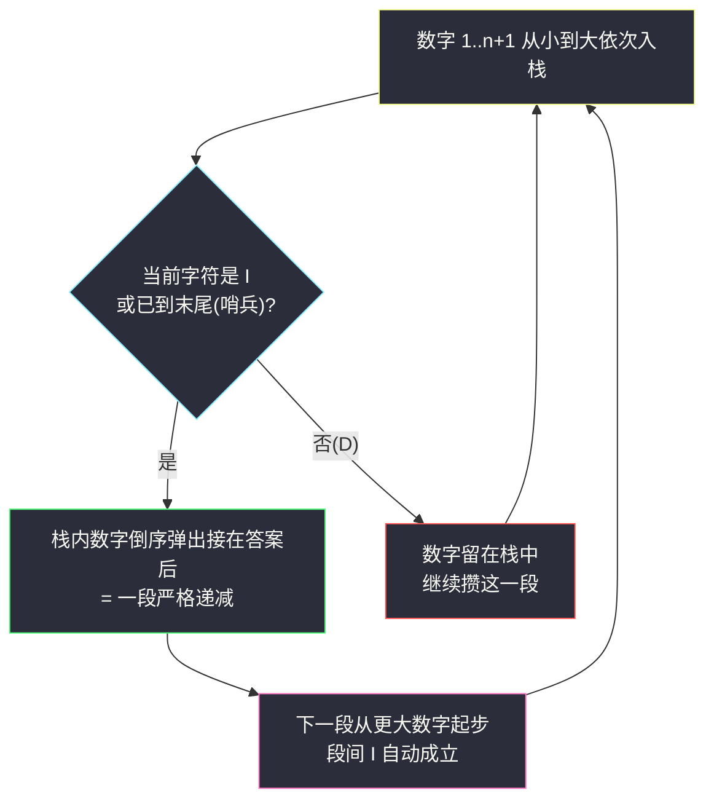

# 根据模式串构造最小数字（字典序贪心 · 分段递减 + 栈）

## 一、问题描述

给定一个长度为 `n` 的字符串 `pattern`，只包含 `'I'`（**递增**）和 `'D'`（**递减**）。定义「`1` 到 `n + 1` 的一个排列 `num`」满足：对所有 `i`，

- `pattern[i] == 'I'` 时，`num[i] < num[i + 1]`；
- `pattern[i] == 'D'` 时，`num[i] > num[i + 1]`。

请返回满足条件的、**字典序最小**的排列 `num`（以字符串形式）。

> 🔗 LeetCode 2375：https://leetcode.cn/problems/construct-smallest-number-from-di-string/
>
> 数据范围：`1 <= pattern.length <= 8`。

**示例 1**

```
输入：pattern = "IIIDIDDD"
输出："123549876"
解释：逐位核对 1<2（I）、2<3（I）、3<5（I）、5>4（D）、4<9（I）、9>8>7>6（DDD）✓
```

**示例 2**

```
输入：pattern = "DDD"
输出："4321"
解释：4>3>2>1 是 1..4 排列里唯一满足三连降的，也天然最小。
```

**直观理解**

这是字典序贪心（灵茶题单 §3.1）的进阶形态：不仅要构造合法解，还要**字典序最小**。与 #1323「高位尽量大」相对，这里要让**高位尽量小**。但直接逐位取「能放的最小数字」会被「后面的模式还满足吗」卡住——突破口是发现**连续的 D 段是一个不可分割的整体**，必须整段一起决策。

---

## 二、暴力解法

`n <= 8`，排列空间只有 `9! = 362880` 个。枚举 `1..n+1` 的全部排列，按**字典序**逐个检查，返回第一个满足模式串的——`itertools.permutations` 对升序输入恰好按字典序生成，所以「第一个合法」就是「最小合法」。

```python
from itertools import permutations

class Solution:
    def smallestNumber(self, pattern: str) -> str:
        n = len(pattern)
        for p in permutations('123456789'[:n + 1]):
            if all((p[i] < p[i + 1]) == (pattern[i] == 'I') for i in range(n)):
                return ''.join(p)
        return ''
```

### 复杂度

- **时间**：`O((n+1)! * n)`，本题 `n <= 8` 约几百万次比较，能过但毫无推广性。
- **空间**：`O(n)`。

### 🔴 瓶颈在哪里

排列规模是阶乘级的，`pattern` 长到 15 就彻底不可行。而且暴力完全无视「字典序最小」的结构信息：答案的前缀有极强的规律（示例 1 的答案以 `123` 开头绝非偶然），这些规律可以把搜索空间直接压缩成**一次线性扫描**。

---

## 三、优化探索（核心章节）

> 📚 本题在灵茶题单中属于 **§3.1 字典序最小/最大**，与 #1323（见 `maximum-69-number.md`）同一小节：**求最小 ⇒ 高位尽量小，高位定了看次高位**；本题的新难点是「高位取小的同时必须保住后缀的可行性」。

### 3.1 先看逐位贪心卡在哪里

想让第 1 位尽量小，直接放 `1` 行吗？看 `pattern = "DII"`：第 1 位放 `1` 后，位置 2 必须 `> 1` 似乎没问题……但看 `pattern = "DDI"`：第 1 位放 `1`，则后面两个位置都要**小于** `1` 且互不相同——无解！可见**连续的 D 会强迫前缀「垫高」**：一段长度为 `L` 的开头下降链，链首至少是 `L + 1`。逐位贪心必须以「整段 D」为单位考虑可行性。

### 3.2 按 I 切段：结构浮出水面

把 `pattern + 'I'`（末尾补一个哨兵 `I`）按 `I` 切开，第 1 段形如 `DD...DI`（含 `k` 个 `D`），它管辖排列的**前 `k + 1` 个位置**：这 `k + 1` 个数字必须**严格递减**，随后在 `I` 处转为大于下一段开头。每一段都是「一段下降链」。

```
pattern: I  I  I  D  I  D  D  D |(哨兵)
num:     1  2  3  5  4  9  8  7  6
         └─段1┘└段2┘ └段3┘└─ 段4 ─┘
```

### 3.3 构造：第 1 段填 1..k+1 的倒序，然后归纳

设第一段覆盖前 `k + 1` 个位置（`k` 个 `D` 加 1 个 `I`）。构造：

- **第 1 段**填数字 `{1, 2, ..., k+1}`，按**递减**排成 `k+1, k, ..., 2, 1`；
- 其余位置是**同构子问题**：剩余数字 `{k+2, ..., n+1}`、剩余模式串，整体减 `k+1` 后与原问题形式完全相同，递归（或迭代）处理。

### 3.4 证明（合法性 + 最优性）

**合法性**：每段内部按段内所选数字的倒序排列，满足所有 `D`；段的结束处是 `I`，而该段用的数字全部小于后续任何段用的数字，故段尾 `1`（段内最小）必然小于下一段开头，`I` 成立。∎

**最优性（对段数归纳）**：

1. 第一段是 `k + 1` 个互异数字的严格下降链，链首 `num[0]` 后面要压着 `k` 个比它小的互异数字，故任何合法解都有 `num[0] >= k + 1`。
2. 因此构造的 `num[0] = k + 1` 取到了理论下界；若某解 `num[0] > k + 1`，则它与构造解在首位已经分出胜负，构造解字典序更小。
3. 若 `num[0] = k + 1`，为让链合法且后面仍互异，前 `k + 1` 位**必须**恰是 `{1, ..., k+1}` 且唯一排法就是倒序 `k+1, ..., 1`。
4. 前缀完全锁定后，剩余子问题同构（相对大小关系在平移下不变），归纳即得构造唯一最优。∎

### 3.5 用栈一段一段吐出来

实现上述「分段倒序」最优雅的方式是**栈**：数字 `i` 从小到大依次入栈，遇到 `I`（或扫完）就把栈内数字**全部倒序弹出**拼到答案尾部。

- 栈内从底到顶递增，倒序弹出即递减——恰好是一段 `D`；
- 弹空后下一段从更大的数字开始入栈，天然大于之前所有数字——满足段间的 `I`。



### 3.6 等价实现：升序打底 + 反转每个极大 D 段

先写出 `123...(n+1)`，再把每个极大连续 `D` 段对应的区间**反转**，得到的串与栈解法完全一致（两种视角：一个是「倒序吐栈」，一个是「先升序再局部反转」）。

### 3.7 一句话核心

> **按 I 分段，每段用「尚未使用的最小数字」倒序填**；字典序最小由「段首取理论下界 `k+1`」+ 归纳保证。

---

## 四、代码实现

### Python（主解：栈，一趟扫描）

```python
class Solution:
    def smallestNumber(self, pattern: str) -> str:
        ans, stk = [], []
        for i, c in enumerate(pattern + 'I', 1):   # 哨兵 I 保证最后一段被弹出
            stk.append(str(i))                     # 数字 i 先入栈
            if c == 'I':                           # 段结束：倒序吐栈
                ans += stk[::-1]
                stk = []
        return ''.join(ans)
```

**逐行拆解**

| 片段 | 作用 |
|------|------|
| `pattern + 'I'` | 末尾哨兵：最后一段若是 `D` 结尾，靠它触发弹出 |
| `enumerate(..., 1)` | 数字与位置对齐：第 `i` 轮把数字 `i` 入栈 |
| `stk[::-1]` | 栈底到栈顶递增 → 倒序即递减段 |
| `stk = []` | 弹空，下一段从 `i+1` 重新攒 |

### Python（等价写法：升序 + 反转 D 段）

```python
class Solution:
    def smallestNumber(self, pattern: str) -> str:
        s = list('123456789'[:len(pattern) + 1])
        i = 0
        while i < len(pattern):
            if pattern[i] == 'D':
                j = i
                while j < len(pattern) and pattern[j] == 'D':
                    j += 1
                s[i:j + 1] = reversed(s[i:j + 1])   # 反转极大 D 段对应的数字
                i = j
            else:
                i += 1
        return ''.join(s)
```

### Java（最优解同款：栈）

```java
class Solution {
    public String smallestNumber(String pattern) {
        StringBuilder ans = new StringBuilder();
        Deque<Character> stk = new ArrayDeque<>();
        for (int i = 1; i <= pattern.length() + 1; i++) {
            stk.push((char) ('0' + i));
            if (i > pattern.length() || pattern.charAt(i - 1) == 'I') {
                while (!stk.isEmpty()) {
                    ans.append(stk.pop());          // 后进先出 = 倒序
                }
            }
        }
        return ans.toString();
    }
}
```

---

## 五、具体例子演示

### 例 1：pattern = "IIIDIDDD"（示例 1）

栈解法逐步表（「当前入栈的数字、剩余数字、触发弹出的时机」）：

| 轮次 i | pattern 字符 | 入栈数字 | 栈（底→顶） | 动作 | 答案累积 | 剩余未用数字 |
|--------|--------------|----------|--------------|------|----------|----------------|
| 1 | I | 1 | [1] | 弹出倒序 → 拼接 | `1` | {2..9} |
| 2 | I | 2 | [2] | 弹出倒序 | `12` | {3..9} |
| 3 | I | 3 | [3] | 弹出倒序 | `123` | {4..9} |
| 4 | D | 4 | [4] | 留栈攒段 | `123` | {5..9} |
| 5 | I | 5 | [4,5] | 弹出倒序 `54` | `12354` | {6..9} |
| 6 | D | 6 | [6] | 留栈 | `12354` | {7..9} |
| 7 | D | 7 | [6,7] | 留栈 | `12354` | {8,9} |
| 8 | D | 8 | [6,7,8] | 留栈 | `12354` | {9} |
| 9 | 哨兵 I | 9 | [6,7,8,9] | 弹出倒序 `9876` | `123549876` | {} |

逐位核对：`1<2`（I）`2<3`（I）`3<5`（I）`5>4`（D）`4<9`（I）`9>8>7>6`（DDD）✓。对照 3.4 节：第一段长 1（0 个 D + 1 个 I），开头理论下界 `1`，构造取到 `1`；第 4 段长 4，开头理论下界 `6`，构造取到 `6`——每一段都压着下界，故字典序最小。

### 例 2：pattern = "DDD"（示例 2）

| 轮次 i | pattern 字符 | 入栈数字 | 栈（底→顶） | 动作 | 答案累积 |
|--------|--------------|----------|--------------|------|----------|
| 1 | D | 1 | [1] | 留栈 | 空 |
| 2 | D | 2 | [1,2] | 留栈 | 空 |
| 3 | D | 3 | [1,2,3] | 留栈 | 空 |
| 4 | 哨兵 I | 4 | [1,2,3,4] | 弹出倒序 `4321` | `4321` |

唯一的段长 4，开头理论下界 `4`，构造 `4321` 即最优 ✓。这也解释了 3.1 节的直觉：三连降逼着首位至少是 `4`，第一位放 `1` 的「贪心」根本不可行。

### 例 3：pattern = "DIDI"

| 轮次 i | 字符 | 入栈 | 栈 | 动作 | 答案累积 |
|--------|------|------|-----|------|----------|
| 1 | D | 1 | [1] | 留栈 | 空 |
| 2 | I | 2 | [1,2] | 弹 `21` | `21` |
| 3 | D | 3 | [3] | 留栈 | `21` |
| 4 | I | 4 | [3,4] | 弹 `43` | `2143` |
| 5 | 哨兵 I | 5 | [5] | 弹 `5` | `21435` |

核对：`2>1`（D）`1<4`（I）`4>3`（D）`3<5`（I）✓，输出 `21435`。

---

## 六、复杂度分析

| 方法 | 时间 | 空间 | 说明 |
|------|------|------|------|
| 暴力枚举排列 | `O((n+1)! * n)` | `O(n)` | 本题 `n <= 8` 勉强可过，无推广性 |
| **栈分段构造（本篇）** | `O(n)` | `O(n)` | 每个数字恰好入栈、出栈各一次 |

---

## 七、对比总结

**与 #1323 对照：同一小节（§3.1）的一体两面**

| 维度 | #1323 最大 69 数 | #2375 本篇 |
|------|------------------|-------------|
| 目标 | 字典序**最大** | 字典序**最小** |
| 决策单位 | 单个位 | **一整段连续 D** |
| 可行性约束 | 无（怎么变都合法） | 强（段长逼高段首） |
| 实现 | 一次 `replace` | 栈 + 哨兵 |

两题的公共骨架：**从高位向低位，在不破坏可行性的前提下让当前位取极值**。本篇的「可行性」以段为单位整体处理——这是字典序贪心带约束时的常见升级（#3170 的贪心栈、#402 的删数字同理）。

**易错点**

1. **忘加哨兵 `I`**：`pattern` 以 `D` 结尾时最后一段永远弹不出来，答案缺一截（例 2 会输出空串）。
2. 弹出方向搞反：要的是**倒序**（递减段），写成栈序（递增）则 `D` 不满足。
3. 误以为逐位放「最小可用数字」即可：`"DDI"` 首位放 `1` 立刻死局，必须整段一起决策。
4. Java 版注意 `i > pattern.length()` 与 `pattern.charAt(i - 1)` 的下标对齐。

---

## 八、举一反三

| 题目 | 关系 |
|------|------|
| [1323. 6 和 9 组成的最大数字](https://leetcode.cn/problems/maximum-69-number/) | 同节 §3.1 的「最大」方向热身题，见同批 `maximum-69-number.md` |
| [942. 增减字符串匹配](https://leetcode.cn/problems/di-string-match/) | 弱化版：同样按段构造 `0..n` 排列但不要求字典序最小，双指针即可 |
| [3170. 删除星号以后字典序最小的字符串](https://leetcode.cn/problems/lexicographically-minimum-string-after-removing-stars/) | 字典序最小 + 贪心栈，见同目录 `lexicographically-minimum-string-after-removing-stars.md` |
| [402. 移掉 K 位数字](https://leetcode.cn/problems/remove-k-digits/) | 「高位尽量小」思想的经典载体：贪心 + 单调栈删数 |
| [2384. 最大回文数字](https://leetcode.cn/problems/largest-palindromic-number/) | 同批构造 lane 的下一篇：频次贪心构造回文，见 `largest-palindromic-number.md` |

**思想迁移**

- 遇到「构造 + 字典序最小/最大」，先找**约束强迫的局部结构**（本题：连续 D 段必须整体递减），结构往往直接给出构造。
- 证明字典序最优的标配两步：**首位取到理论下界 + 剩余部分同构归纳**。
- 口诀：**「遇 I 吐栈倒着排，攒 D 入栈等花开；哨兵补在末尾处，段首压线最小来。」**
