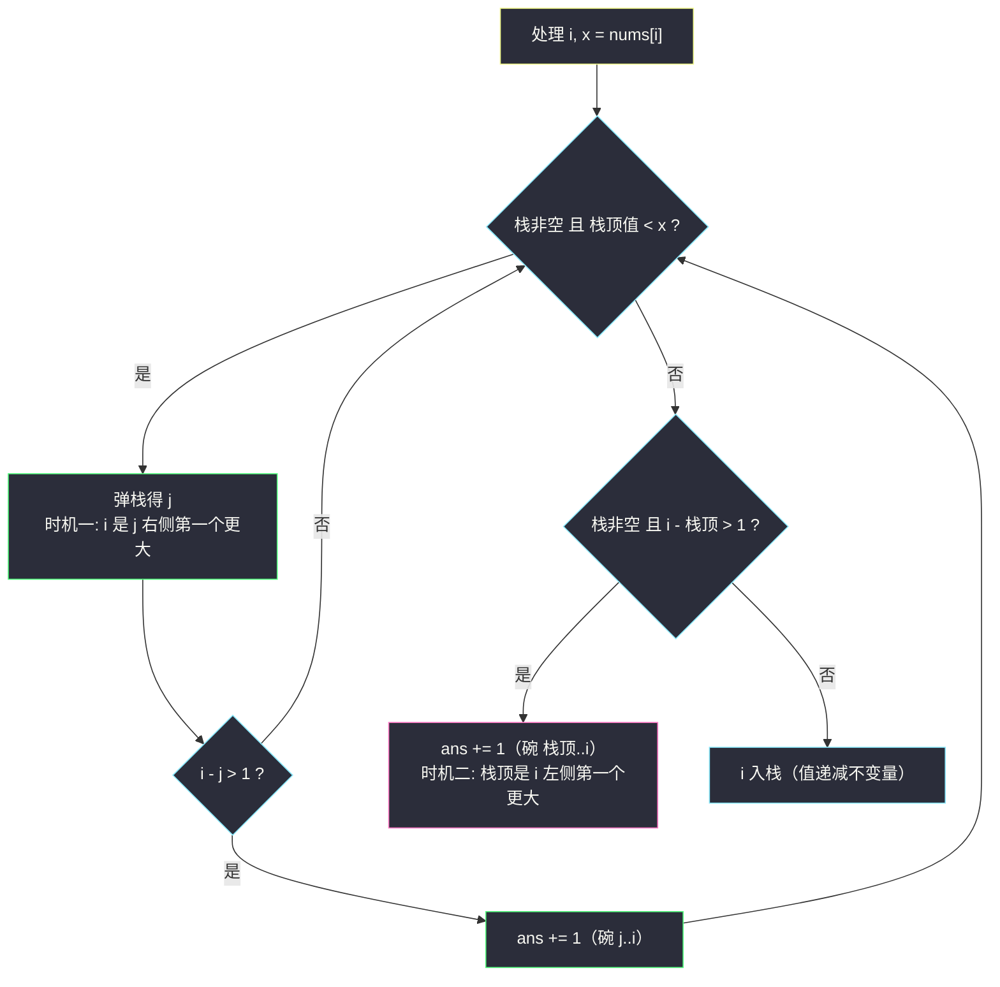
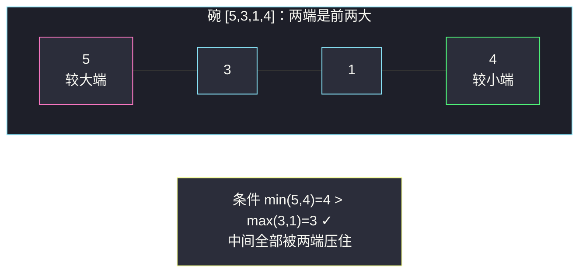

# 碗子数组的数目（单调栈 · 弹栈瞬间结算子数组计数）

## 一、问题描述

给你一个**元素互不相同**的整数数组 `nums`。

子数组 `nums[l..r]`（连续）称为一个**碗**，当且仅当：

- 长度 `r - l + 1 >= 3`；
- 两端元素的最小值严格大于中间所有元素的最大值：`min(nums[l], nums[r]) > max(nums[l+1..r-1])`。

返回 `nums` 中碗的数目。

> 🔗 LeetCode 3676：https://leetcode.cn/problems/count-bowl-subarrays/
>
> 数据范围：`3 <= n <= 10^5`，`1 <= nums[i] <= 10^9`，且**元素互不相同**。

**示例 1**

```
输入：nums = [2,5,3,1,4]    输出：2
解释：两个碗分别是
- [3,1,4]   (l=2, r=4)：min(3,4)=3 > max(1)=1 ✓
- [5,3,1,4] (l=1, r=4)：min(5,4)=4 > max(3,1)=3 ✓
```

**直观理解**

把子数组画成折线，碗就是一个「两边高、中间低」的凹坑：**两端恰好是这个子数组里最大的两个元素**（都严格大于中间的一切）。反过来，只要两端是子数组的前两大，中间再怎么起伏都是碗。于是「数碗」等价于：对每个元素 `j`，问「以 `j` 为较小端、另一端落在 `j` 左/右第一个更大元素处」的合法配对有几个——「第一个更大元素」正是单调栈的主场（灵茶题单 **§1.2 进阶**）。

---

## 二、暴力解法

枚举左右端点，增量维护中间段最大值：

```python
class Solution:
    def countBowlSubarrays(self, nums: List[int]) -> int:
        n = len(nums)
        ans = 0
        for l in range(n):
            mx = 0                                  # nums[l+1..r-1] 的最大值
            for r in range(l + 2, n):
                mx = max(mx, nums[r - 1])           # 新纳入中间段的元素
                if min(nums[l], nums[r]) > mx:
                    ans += 1
        return ans
```

### 复杂度

- **时间**：`O(n^2)`，`n = 10^5` 时约 `10^10`，超时。
- **空间**：`O(1)`。

### 🔴 瓶颈在哪里

两端 `min` 与中间 `max` 的比较被反复重算。但碗的结构性极强：**较小端 `j` 的「对侧端点」只有两个候选——`j` 左侧第一个更大、`j` 右侧第一个更大**。中间段必须全部小于 `nums[j]`，这正是「第一个更大」的定义。抓住这一点，每个元素只需 `O(1)` 次结算。

---

## 三、优化探索（核心章节）

> 📚 本题在灵茶题单中属于 **§1.2 单调栈进阶**。灵神模板要点：**栈存下标、值递减；新元素入栈前弹出所有值更小的栈顶，并在弹栈瞬间结算答案**。本题在两处时机结算（弹栈时 + 入栈前各一次），是「弹栈结算」用得最满的一道题。

### 3.1 关键观察：碗 ↔ 「较小端 × 第一个更大元素」

设碗 `[l..r]`，两端中较小的是 `nums[j]`（互不相同保证唯一，`j = l` 或 `j = r`）：

- 若 `j = l`（左端较小）：中间全 `< nums[l]`，说明 `r` 是 `l` **右侧第一个更大**的位置（更近的更大者会截断中间段）；
- 若 `j = r`（右端较小）：对称地，`l` 是 `r` **左侧第一个更大**的位置。

于是**碗与「元素 j + 它某一侧的第一个更大元素」一一对应**，长度条件 `>= 3` 翻译成间隔条件：`|间隔| > 1`。数碗 = 数满足间隔的配对，`O(n)` 可解。

### 3.2 单调栈的两处结算时机

从左往右扫，维护**值递减**的下标栈。处理 `nums[i] = x` 时：

**时机一（弹栈结算——右端方向）**：弹出所有值 `< x` 的栈顶 `j`。此刻 `i` 恰是 `j` 右侧第一个更大元素，若 `i - j > 1`（长度 ≥ 3），碗 `[j..i]` 计数 +1。

**时机二（入栈前结算——左端方向）**：弹栈结束后，若栈非空，栈顶 `t` 恰是 `i` **左侧第一个更大**元素（`(t, i)` 内的元素值都 `< nums[i]`，否则轮不到 `t` 露头）。若 `i - t > 1`，碗 `[t..i]` 计数 +1。



### 3.3 为什么「弹完后的栈顶」一定是左侧第一个更大（不变量证明）

栈内值从底到顶严格递减。若 `(t, i)` 中间存在值 `> nums[i]` 的元素 `q`，取其中最大者 `q`：`q` 入栈后只能被右侧更大者弹出，而 `(q, i)` 内没有比它大的（它就是区间最大）、`i` 也弹不动它（`nums[q] > nums[i]`）——`q` 必然还在栈中，且位于 `t` 之上，与「弹完后的栈顶是 `t`」矛盾。故 `(t, i)` 内的值全部 `< nums[i]`，`t` 就是左侧第一个更大元素。✓

（这个论证同时说明：**时机二在「本次一个都没弹」时同样成立**——中间的更小元素早在它们各自入栈后被弹光了。）

### 3.4 完备性核对 + 对拍验证

- **不重**：每个 `j` 被弹出至多一次（时机一至多结算一次）；每个 `i` 入栈前至多结算一次（时机二）。
- **不漏**：任意碗 `[l..r]`，设较小端 `j`。若 `j = l`，则 `r` 是 `j` 右侧第一个更大——`j` 恰在处理 `r` 时被弹出（时机一捕获，`r - l > 1` 成立）；若 `j = r`，则 `l` 是 `r` 左侧第一个更大且 `l` 一直留在栈中（`(l, r)` 内无更大者弹不动它）——处理 `r` 弹完中间段后栈顶正是 `l`（时机二捕获）。

**写作前已用暴力 `O(n^2)` 对拍**：长度 3..7 的全部互异排列（穷举）、2 万组随机互异数组（`n <= 10`）、300 组 `n <= 150` 随机、以及递增/递减/山谷/山峰等专项形态，单调栈解法与暴力**全部一致**。（注意对拍用例必须保证元素互不相同，见 7 节易错点。）

### 3.5 碗的形状图景

以 `[5,3,1,4]` 为例（`min(5,4)=4 > max(3,1)=3` ✓ 是碗）：两端高、中间塌——左端 `5` 与右端 `4` 恰好是整个子数组的前两大：



粉色是较大端、绿色是较小端（碗的定义由它把关：它必须压住中间所有元素），青色是中间段。**数碗 = 数「绿色端 × 它某一侧的粉色端」的合法配对**，而每个元素的粉色端只有两个：左侧第一个更大、右侧第一个更大。

### 3.6 组合计数公式（结算总数的封闭形式）

把 3.1 的翻译写成求和式：设 `R(j)` 为 `j` 右侧第一个更大元素的下标（不存在记为 `+inf`），`L(j)` 为左侧第一个更大元素的下标（不存在记为 `-inf`）：

```text
ans = Σ_j [ R(j) - j > 1 ]  +  Σ_j [ j - L(j) > 1 ]
      └── j 作较小左端的碗 ──┘  └── j 作较小右端的碗 ──┘
```

单调栈的两处结算时机分别实现这两个求和：时机一在 `j` 被弹出时知道 `R(j)`，时机二在 `i` 入栈前知道 `L(i)`。公式也解释了为什么递增/递减数组答案为 0——每个元素的第一个更大元素都紧贴着自己，间隔恒为 1。

### 3.7 一句话核心

> **值递减栈扫一遍；弹栈瞬间结算「弹出者作左端」的碗，入栈前结算「自己作右端」的碗——间隔大于 1 才计数。**

---

## 四、代码实现

### Python（主解：下标递减栈 + 两处结算）

```python
class Solution:
    def countBowlSubarrays(self, nums: List[int]) -> int:
        ans = 0
        st = []                                  # 下标栈，对应值自底向顶严格递减
        for i, x in enumerate(nums):
            while st and nums[st[-1]] < x:       # 弹掉所有比 x 小的
                j = st.pop()
                if i - j > 1:                    # 时机一：j 为左端、i 为右端
                    ans += 1
            if st and i - st[-1] > 1:            # 时机二：栈顶为左端、i 为右端
                ans += 1
            st.append(i)
        return ans
```

**变量含义**

| 变量 | 含义 |
|------|------|
| `st` | 值严格递减的下标栈——「还没等到右侧更大者的元素」 |
| `j` | 刚被弹出的下标：`i` 是它的右侧第一个更大元素 |
| `i - j > 1` | 碗长 `i - j + 1 >= 3` 的间隔写法 |
| `st[-1]`（弹完后） | `i` 的左侧第一个更大元素下标 |

### Java（最优解同款写法）

```java
class Solution {
    public int countBowlSubarrays(int[] nums) {
        long ans = 0;                            // 最坏 O(n) 个碗，防溢出用 long 累加
        Deque<Integer> st = new ArrayDeque<>();
        for (int i = 0; i < nums.length; i++) {
            while (!st.isEmpty() && nums[st.peek()] < nums[i]) {
                int j = st.pop();
                if (i - j > 1) ans++;
            }
            if (!st.isEmpty() && i - st.peek() > 1) ans++;
            st.push(i);
        }
        return (int) ans;
    }
}
```

---

## 五、具体例子演示

以示例 1 端到端走一遍：`nums = [2,5,3,1,4]`。

| 步 | i | x | 弹栈过程（时机一） | 时机二（入栈前） | 栈（底→顶，`下标:值`） | ans |
|----|---|---|---------------------|------------------|--------------------------|-----|
| 1 | 0 | 2 | 栈空，不弹 | 栈空不结算 | `0:2` | 0 |
| 2 | 1 | 5 | 弹 `0:2`，`i-j=1` 不计 | 栈空不结算 | `1:5` | 0 |
| 3 | 2 | 3 | `5 > 3` 不弹 | 栈顶 `1:5`，`2-1=1` 不计 | `1:5 2:3` | 0 |
| 4 | 3 | 1 | `3 > 1` 不弹 | 栈顶 `2:3`，`3-2=1` 不计 | `1:5 2:3 3:1` | 0 |
| 5 | 4 | 4 | 弹 `3:1`，`4-3=1` 不计 | — | `1:5 2:3` | 0 |
|   |   |   | 弹 `2:3`，`4-2=2 > 1` ✓ **碗 `[2..4]=[3,1,4]`** | — | `1:5` | **1** |
|   |   |   | `5 > 4` 停止弹栈 | 栈顶 `1:5`，`4-1=3 > 1` ✓ **碗 `[1..4]=[5,3,1,4]`** | `1:5 4:4` | **2** |

输出 `2` ✓，与示例吻合。

注意第 5 步的三次动作一气呵成：弹 `3:1`（间隔 1，白弹但不亏——它本来就不配对）、弹 `2:3`（间隔 2，碗 +1）、弹完后栈顶 `1:5` 与 `i=4` 间隔 3（碗 +1）。**「弹栈」和「结算」是两回事**：弹栈是维护单调性的例行公事，只有间隔 `> 1` 时才真正入账。

**配对视角总表**（把 3.6 节公式套在示例 1 上逐个核对）：

| j | 值 | R(j) 右侧第一个更大 | 结算右端碗 | L(j) 左侧第一个更大 | 结算左端碗 |
|---|----|--------------------|-----------|--------------------|-----------|
| 0 | 2 | 1（值 5），间隔 1 | ✗ | 无 | ✗ |
| 1 | 5 | 无 | ✗ | 无 | ✗ |
| 2 | 3 | 4（值 4），间隔 2 | ✓ 碗 `[2..4]` | 1（值 5），间隔 1 | ✗ |
| 3 | 1 | 4（值 4），间隔 1 | ✗ | 2（值 3），间隔 1 | ✗ |
| 4 | 4 | 无 | ✗ | 1（值 5），间隔 3 | ✓ 碗 `[1..4]` |

五行合计恰好 2 个碗，与逐步跟踪表相互印证。

**两个碗的视角对照**：

- 碗 `[3,1,4]` 由**时机一**捕获：较小端 `3`（下标 2）在更大的 `4` 到来时被弹出，`4` 就是 `3` 的右侧第一个更大元素；
- 碗 `[5,3,1,4]` 由**时机二**捕获：较小端 `4`（下标 4）入栈前，中间段 `3,1` 刚被弹光，露出的栈顶 `5` 正是 `4` 的左侧第一个更大元素。

**再看几个形态**（均已对拍验证）：

- 严格递增 `[1,2,3,4,5]`：碗数 `0`。每个元素的「第一个更大」都是紧邻的下一个，间隔恒 1，拼不出长度 ≥ 3。
- 严格递减 `[5,4,3,2,1]`：碗数 `0`。同理，右侧无更大者，时机一不触发；时机二间隔恒 1。
- 山谷 `[5,3,1,2,4]`：碗数 `3`，分别是 `[3,1,2]`、`[3,1,2,4]`、`[5,3,1,2,4]`。捕获时机各不相同：`[3,1,2]` 走**时机二**（较小端是右端的 2，它的左侧第一个更大是 3）；`[3,1,2,4]` 走**时机一**（较小端是左端的 3，它的右侧第一个更大是 4）；`[5,3,1,2,4]` 走**时机二**（较小端是右端的 4，它的左侧第一个更大是 5）。两个走时机二、一个走时机一，可见双时机缺一不可。

---

## 六、复杂度分析

| 方法 | 时间 | 空间 |
|------|------|------|
| 暴力枚举端点 | `O(n^2) = 10^10`，超时 | `O(1)` |
| 单调栈 + 两处结算 | `O(n)`（每下标入栈/出栈至多各一次） | `O(n)`（最坏严格递减全进栈） |

每个碗恰好被结算一次，结算总次数即答案，因此**计数与弹栈操作同阶**，总代价 `O(n)`。

---

## 七、对比总结

**本批单调栈题的「结算时机」光谱**：

| 题 | 结算时机 | 结算内容 |
|----|----------|----------|
| #901 股票跨度 | 新元素弹栈瞬间 | 跨度累加（`online-stock-span.md`） |
| #962 最大宽度坡 | 右端点从右往左配对瞬间 | `j - i` 取 max（`maximum-width-ramp.md`） |
| #3676 本篇 | **弹栈瞬间 + 入栈前** 双时机 | 子数组计数 +1 |

**易错点**

1. **元素互不相同是严格前提**：弹栈条件严格 `<`、以及「两端恰为前两大」的一一对应，都建立在互异性上。反例 `[5,3,1,3,5]`（有重复值）：单调栈解会多算 `[3,1,3,5]`（`min(3,5)=3` 不大于中间 `3`，不是碗），输出 3 而正确答案是 2。题目已保证互异，但自己改造题目/迁移模板时必须重新审视。
2. **两处结算缺一不可**：只写时机一会漏掉「较小端在右侧」的碗（如 `[5,3,1,2,4]` 里的 `[5,3,1,2,4]` 自己——较小端 4 在右）；只写时机二会漏掉相反方向。
3. **间隔条件是 `> 1` 不是 `>= 1`**：长度 ≥ 3 ⇔ `i - j >= 2` ⇔ `i - j > 1`。相邻配对（间隔恰 1）不是碗。
4. **时机二的判断要在入栈之前**做（此时栈顶才是 `i` 的左侧第一个更大）。
5. 时机二**不需要等真的弹出过元素**：中间更小的元素可能在更早的轮次就已被弹光（3.3 节不变量），入栈前看一眼栈顶即可。

---

## 八、举一反三

| 题目 | 关系 |
|------|------|
| [962. 最大宽度坡](https://leetcode.cn/problems/maximum-width-ramp/) | 同批姊妹篇（同 §1.2）：同样靠「第一个更大元素」配对，见 `maximum-width-ramp.md` |
| [901. 股票价格跨度](https://leetcode.cn/problems/online-stock-span/) | 同批姊妹篇：弹栈瞬间结算的最基础形态，见 `online-stock-span.md` |
| [907. 子数组的最小值之和](https://leetcode.cn/problems/sum-of-subarray-minimums/) | 「中间段最大/最小值」贡献法计数的经典：单调栈统计每个元素作为极值管辖的子数组数 |
| [2104. 子数组范围和](https://leetcode.cn/problems/sum-of-subarray-ranges/) | #907 的双向扩展（max 与 min 贡献相减） |
| [1856. 子数组最小乘积的最大值](https://leetcode.cn/problems/maximum-subarray-min-product/) | 单调栈定界 + 前缀和，同样是「以某元素为最值的子数组」视角 |
| [1944. 队列中可见的人数](https://leetcode.cn/problems/number-of-visible-people-in-a-queue/) | 「两侧第一个更大」阻断可见性的计数，单调栈 Hard 进阶 |

**思想迁移**

- 遇到「区间两端 vs 中间极值」的条件，先做**结构翻译**：把「中间全部更小」翻译成「对侧端点是第一个更大元素」，条件就从「区间性质」坍缩成「单点配对」——单调栈 O(n) 收网。
- 「弹栈瞬间结算」是单调栈题的万能落点：弹出的元素此刻恰好获得完整的全局信息（它右/左侧第一个更大者是谁），错过这一刻就要付出重算代价。
- 对拍是不变量的试金石：本题解法先与 `O(n^2)` 暴力在全排列 + 随机互异数据上对拍一致，才敢落到纸面；重复值反例（易错点 1）也是对拍阶段主动构造边界揪出来的。
- 「互不相同」假设的威力：它把「两端 ≥ 中间」强化成「两端是前两大、且第一个更大元素唯一」，一一对应才成立。迁移到允许重复的变体时，相等值会同时破坏弹栈条件（`<` 还是 `<=`）与对应唯一性，需要重新设计（例如同时统计 `>=` 与 `>` 两个方向的边界）。
- 口诀：**「递减栈存待配，来大弹小碗即来；弹完再看栈顶眼，间隔过一才入账。」**
