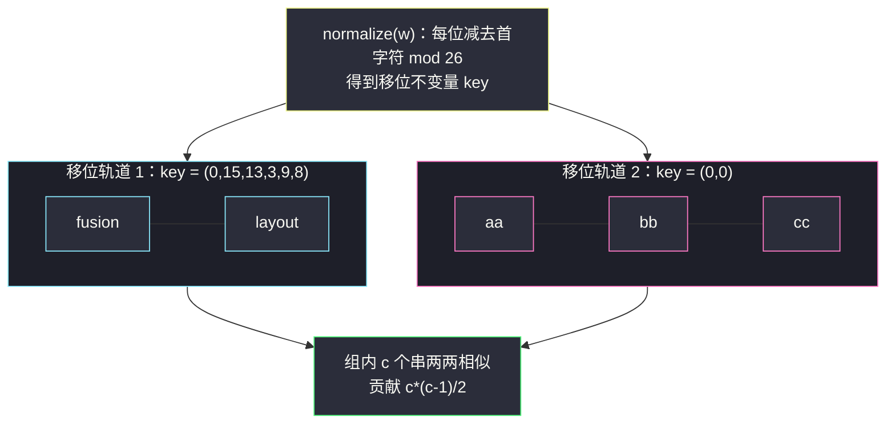
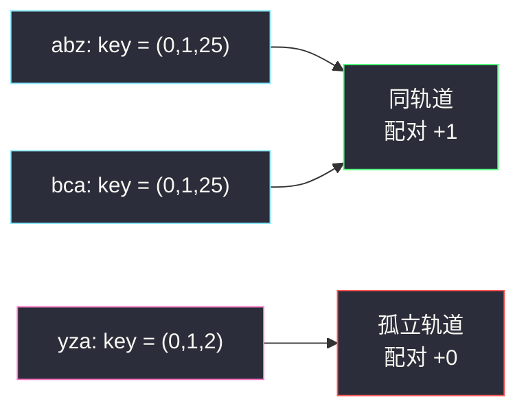

# 统计凯撒加密对数目（规范化 key + 哈希分组配对）

## 一、问题描述

给你一个字符串数组 `words`，其中所有字符串**长度相同**（记为 `m`）且只含小写字母。

一次**操作**：选择 `s` 或 `t` 中的一个字符串，把**所选字符串的每个字母**替换为字母表中的下一个字母（特例：`z` 替换为 `a`）。可以对任意字符串执行**任意次**操作。

若通过若干次操作能使 `s == t`，则称 `(i, j)` 是一对**相似**字符串（`i < j`）。返回相似对的总数。

> 🔗 LeetCode 3805：https://leetcode.cn/problems/count-caesar-cipher-pairs/
>
> 数据范围：`n` 个等长小写串，`n`、`m` 均为常规量级（具体上界以官方题面为准），哈希做法 `O(n·m)` 远低于时限。

**示例 1**

```
输入：words = ["fusion","layout"]
输出：1
解释：把 fusion 整体移位 6 次：f→l, u→a, s→y, i→o, o→u, n→t，
      恰好得到 layout，两串相似。
```

**示例 2**（帮助理解分组）

```
输入：words = ["abz","bca","yza"]
输出：1
解释：abz 整体移位 1 次得到 bca（a→b, b→c, z→a），二者相似；
      yza 不与任何串相似。
```

**直观理解**

「整体加一、循环回绕」就是 **mod 26 的加法**。执行任意次操作 = 给整串加上任意常数 `d`。于是「两串能否变相等」只取决于一件事：**两串逐位的差是否恒等于同一个常数**。把每个串「减去自己的首字符」得到一个**移位不变量**（规范形），相似 ⟺ 规范形相同——再套 [#1512 好数对](https://leetcode.cn/problems/number-of-good-pairs/)（同批 `number-of-good-pairs.md`）的哈希分组配对即可。

---

## 二、暴力解法

枚举每一对 `(i, j)`，判定逐位差是否恒定：先算首位差 `d`，再验证每一位：

```python
class Solution:
    def countPairs(self, words: List[str]) -> int:
        n, ans = len(words), 0
        for i in range(n):
            for j in range(i + 1, n):
                d = (ord(words[j][0]) - ord(words[i][0])) % 26
                if all((ord(b) - ord(a)) % 26 == d
                       for a, b in zip(words[i], words[j])):
                    ans += 1
        return ans
```

### 复杂度

- **时间**：`O(n² · m)`。`n`、`m` 上千上万时（如 `n = m = 1000` 达 `10^9` 量级）必然超时。
- **空间**：`O(1)`。

### 🔴 瓶颈在哪里

每一对都要重头逐位比较，而「相似」其实是一个**等价关系**：相似 ⟺ 属于同一「移位轨道」。等价关系意味着**传递性**——`abz` 与 `bca` 相似、`bca` 与（`bca` 再移位两次的）`dea` 相似，则 `abz` 与 `dea` 也相似。逐对判定完全浪费了这层结构，正确姿势是**先把每个串归入轨道（分组），再在组内数对数**。

---

## 三、优化探索（核心章节）

> 📚 本题在灵茶题单中属于 **§0.1 枚举右，维护左**（常用数据结构 A · 哈希表），配对计数部分与 #1512 同模板：枚举右端点、哈希表维护左边。新增的一步是**规范化（normalize）**——把「逐位差恒定」这个二元关系，压成「一元 key 相等」，才能进哈希表。

### 3.1 操作的代数本质

把字母映射成编号 `a=0, b=1, ..., z=25`。一次操作把整串每位加 1（mod 26）；执行 `d` 次就是每位加 `d`：

```text
s 与 t 相似  ⟺  存在 d ∈ [0, 26)，使得对每个位置 k 都有 t[k] == s[k] + d (mod 26)
            ⟺  (t[k] - s[k]) mod 26 对所有 k 恒等于同一个 d
```

也就是说：**每个字符串可到达的串恰好构成一条「移位轨道」**（该串加 0、加 1、……、加 25 得到的 26 个串），两串相似 ⟺ **在同一轨道上**。

### 3.2 规范形：减去首字符

轨道需要一个「身份证」。取每串**减去自己首字符**（mod 26）的结果作为 key：

```text
key(w) = ( (w[1] - w[0]) mod 26, (w[2] - w[0]) mod 26, ..., (w[m-1] - w[0]) mod 26 )
```

（首位的 key 值恒为 0，写不写进元组都行，本文保留以示完整。）

**两个断言**：

1. **移位不变**：整串加 `d` 后，任意两位的差 `(w[k] + d) - (w[0] + d) = w[k] - w[0]` 不变 → 同一轨道的串 key 相同；
2. **判定充分**：若 `key(s) == key(t)`，即每位 `t[k] - t[0] == s[k] - s[0]`，整理得 `t[k] - s[k] == t[0] - s[0]`（对所有 `k` 成立）——逐位差恒等于 `d = t[0] - s[0] mod 26`，相似。

断言 1 + 2 合起来：**相似 ⟺ key 相同**。二元关系成功压成一元相等。



### 3.3 分组配对：#1512 模板复用

key 相同的串两两相似。设某组有 `c` 个串，贡献 `c*(c-1)/2` 对。两种等价写法：

- **单趟「枚举右，维护左」**：从左往右扫，`ans += cnt[key]`（与左边每个同 key 的串配对），再 `cnt[key] += 1`——与 #1512 一字不差，只是 key 从整数换成元组；
- **先 Counter 分组再求和**：`Σ c*(c-1)/2`。

### 3.4 复杂度账单

每个串构造 key 花 `O(m)`，哈希表操作均摊 `O(m)`（元组哈希需扫一遍），总共 `O(n·m)`——恰好等于「读入全部输入」的代价，已是信息论下界，不可能更快。

### 3.5 一句话核心

> **「减去首字符」把凯撒移位轨道压成规范形 key；相似 ⟺ key 相等，枚举右端点 `ans += cnt[key]`，单趟 `O(n·m)` 数完全部相似对。**

---

## 四、代码实现

### Python（主解：枚举右，维护左）

```python
class Solution:
    def countPairs(self, words: List[str]) -> int:
        ans = 0
        cnt = defaultdict(int)                     # 规范形 key -> 左边出现次数
        for w in words:                            # 枚举右端点（当前串 w）
            b = ord(w[0])
            key = tuple((ord(c) - b) % 26 for c in w)
            ans += cnt[key]                        # 先查：与左边同轨道的每个串配对
            cnt[key] += 1                          # 后存：登记本串
        return ans
```

**变体（先分组再组合数，两视角等价）**

```python
class Solution:
    def countPairs(self, words: List[str]) -> int:
        cnt = Counter(
            tuple((ord(c) - ord(w[0])) % 26 for c in w) for w in words
        )
        return sum(c * (c - 1) // 2 for c in cnt.values())
```

**变量含义**

| 变量 | 含义 |
|------|------|
| `b = ord(w[0])` | 首字符编号，作为轨道零点 |
| `key` | 规范形：每位与首字符的差（mod 26）的元组 |
| `cnt[key]` | 左边同轨道串的个数 |
| `ans += cnt[key]` | 当前串与左边每个同轨道串各配一对 |

**循环不变式**：处理 `w` 之前，`cnt` 恰记录已扫过串的 key 计数；`cnt[key]` 正是与 `w` 相似的左侧串数。

### Java（String 作 key）

```java
// 统计凯撒加密对数目
// 测试链接 : https://leetcode.cn/problems/count-caesar-cipher-pairs/
class Solution {
    public long countPairs(String[] words) {
        HashMap<String, Long> cnt = new HashMap<>();
        long ans = 0;
        for (String w : words) {                    // 枚举右端点，先查后存
            int b = w.charAt(0) - 'a';
            StringBuilder sb = new StringBuilder();
            for (char c : w.toCharArray()) {
                sb.append((char) ('a' + ((c - 'a' - b + 26) % 26)));
            }
            String key = sb.toString();             // 规范形（首字符归一到 'a'）
            ans += cnt.getOrDefault(key, 0L);
            cnt.merge(key, 1L, Long::sum);
        }
        return ans;
    }
}
```

Java 版把每位差转回小写字母拼成字符串（首字符规范化为 `a`），语义与元组版完全一致，还省去手写哈希。

---

## 五、具体例子演示

### 示例 1：words = ["fusion","layout"]

逐位计算两串的规范形（字母编号 `a=0`，`f=5`，`l=11` 等）：

| k | s[k] / t[k] | 编号 | fusion 相对 f | layout 相对 l |
|---|-------------|------|---------------|---------------|
| 0 | f / l | 5 / 11 | 0 | 0 |
| 1 | u / a | 20 / 0 | (20-5) mod 26 = 15 | (0-11) mod 26 = 15 |
| 2 | s / y | 18 / 24 | 13 | 13 |
| 3 | i / o | 8 / 14 | 3 | 3 |
| 4 | o / u | 14 / 20 | 9 | 9 |
| 5 | n / t | 13 / 19 | 8 | 8 |

两串 key 均为 `(0,15,13,3,9,8)`。注意第 1 位 `u - f = 15` 而 `a - l = -11`，靠 `mod 26` 归一到同一个 15——这正是 `z` 循环回 `a` 的体现（`fusion` 移 6 次时 `u(20) + 6 = 26 ≡ 0 = a`）。

**单趟跟踪表**：

| j | 串 | key | 哈希表（查询前） | cnt[key] | ans 累计 | 哈希表（登记后） |
|---|-----|-----|------------------|----------|----------|------------------|
| 0 | fusion | (0,15,13,3,9,8) | `{}` | 0 | 0 | `{(0,15,13,3,9,8):1}` |
| 1 | layout | (0,15,13,3,9,8) | `{(0,15,13,3,9,8):1}` | 1 | **1** | `{(0,15,13,3,9,8):2}` |

答案 `1` ✓。

### 分组示例：words = ["aa","bb","cc","ab"]

| 串 | 逐位计算 | key | 分组 |
|----|----------|-----|------|
| aa | (0, 0) | (0,0) | A |
| bb | (0, 0) | (0,0) | A |
| cc | (0, 0) | (0,0) | A |
| ab | (0, 1) | (0,1) | B |

`aa`、`bb`、`cc` 同轨道（依次移位 1 可互达），`ab` 孤立。组 A 贡献 `3*2/2 = 3`，组 B 贡献 0，共 **3** 对。单趟累加验证：`ans` 依次 `0 → 1 → 2 → 2` ✓。

### 示例 2：words = ["abz","bca","yza"]

| 串 | key |
|----|-----|
| abz | (0, 1, 25)（`z-a = 25`） |
| bca | (0, 1, 25)（`a-b = -1 ≡ 25 mod 26`） |
| yza | (0, 1, 2)（`a-y = -24 ≡ 2 mod 26`） |

前两串 key 相同（`abz` 移 1 次：`a→b, b→c, z→a` 即 `bca` ✓），第三串不同。答案 `1` ✓。`bca` 的 `a - b = -1` 被 mod 26 修正为 25——**负数必须取模**，否则会错把 `bca` 拆出轨道。



---

## 六、复杂度分析

| 方法 | 时间 | 空间 | 说明 |
|------|------|------|------|
| 暴力逐对判定 | `O(n² · m)` | `O(1)` | 逐位比较，浪费等价关系的传递性 |
| 规范形 + 哈希（主解） | `O(n · m)` | `O(n · m)` | 构造 key 逐串 `O(m)`；哈希表需存下所有 key |

空间 `O(n·m)` 来自最多 `n` 个长度 `m` 的 key；答案最大可达 `n(n-1)/2`，Java 中记得用 `long`。

---

## 七、对比总结

**「规范化 key」家族**——凡是「定义了某种变换的等价关系、问有多少对等价」，都先设计一个变换不变的规范形：

| 题 | 等价关系 | 规范化手段 |
|----|----------|-----------|
| 本篇 #3805 | 凯撒移位可互达 | 每位减首字符 mod 26 |
| #49 字母异位词分组 | 重排可互达 | 排序（或 26 位计数串） |
| #2506 相似字符串对 | 字符集相同 | 26 位掩码（出现过记 1） |
| #2001 可互换矩形 | 宽高比相同 | 宽高约分 |

**与 #1512 的模板对比**：骨架完全一致（枚举右、先查后存、`ans += cnt[key]`），升级点只有「key 的构造」——整数 → 元组/字符串。哈希表不挑 key 类型，只要可哈希且「相等 ⟺ 题目要的配对」。

**易错点**

1. **负数取模**：`ord(c) - b` 可能为负，Python 的 `% 26` 天然返回非负，没问题；**Java/C++ 必须先 `+26` 再 `%`**（见 Java 代码 `(c - 'a' - b + 26) % 26`），否则同一轨道被拆散。
2. key 必须可哈希：Python 用 `tuple`（`list` 不行）；Java 用 `String`。
3. 别用「枚举 26 种移位逐个比较」的思路——白白多乘一个 26，规范化一次到位。
4. `m = 1` 时所有串 key 都是 `(0)`，答案 `n*(n-1)/2`，属正确行为而非 bug。

**模板（normalize + 枚举右维护左，Python）**

```python
ans = 0
cnt = defaultdict(int)
for w in words:                 # 枚举右端点
    key = normalize(w)          # 题目定义的等价类「身份证」
    ans += cnt[key]             # 先查
    cnt[key] += 1               # 后存
```

---

## 八、举一反三

| 题目 | 关系 |
|------|------|
| [2506. 统计相似字符串对的数目](https://leetcode.cn/problems/count-pairs-of-similar-strings/) | 最近亲：字符集掩码作 key，分组数对，`c*(c-1)/2` 求和 |
| [49. 字母异位词分组](https://leetcode.cn/problems/group-anagrams/) | 规范化 key 的鼻祖题，分组思想的源头 |
| [242. 有效的字母异位词](https://leetcode.cn/problems/valid-anagram/) | 两个串判等价的原子操作，可与本篇的 key 设计互证 |
| [2001. 可互换矩形的数目](https://leetcode.cn/problems/number-of-pairs-of-interchangeable-rectangles/) | 约分 key + 组合数配对，与本题分组视角一致 |
| [1512. 好数对的数目](https://leetcode.cn/problems/number-of-good-pairs/) | 同批 `number-of-good-pairs.md`，同模板的整数版入门 |
| [2364. 统计坏数对的数目](https://leetcode.cn/problems/count-number-of-bad-pairs/) | 同批 `count-number-of-bad-pairs.md`，key 来自移项变形 `nums[k] - k`，与本题「减首字符」异曲同工 |
| [3371. 识别数组中的最大异常值](https://leetcode.cn/problems/identify-the-largest-outlier-in-an-array/) | 同批 `identify-the-largest-outlier-in-an-array.md`，哈希从「计数配对」变「恒等式验证」 |

**思想迁移**

- 遇到「施加可逆变换后能否相等」的等价关系，先找**变换不变量**，把它编码成规范形 key；等价类一确定，配对计数就是 #1512 的老模板。
- 凯撒密码类问题的关键视角：**单串的操作集合是一个循环群，轨道 = 等价类，规范形 = 轨道代表元**。
- 口诀：**「移位轨道归一化，首字符作零点；mod 二十六莫忘负，同 key 两两配对。」**
