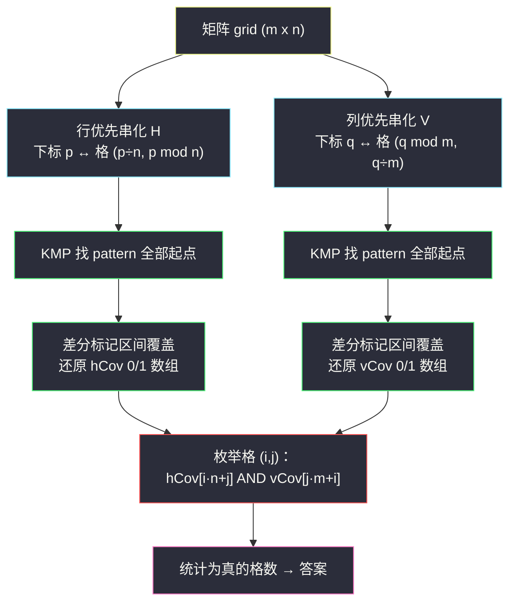

# 3529. 统计水平与垂直子串重叠的单元格（Count Cells in Overlapping Horizontal and Vertical Substrings）

> 题目来源：[https://leetcode.cn/problems/count-cells-in-overlapping-horizontal-and-vertical-substrings/](https://leetcode.cn/problems/count-cells-in-overlapping-horizontal-and-vertical-substrings/)
>
> 灵茶题单小节：§字符串匹配（KMP）

## 一、问题描述

给你一个 `m x n` 的字符矩阵 `grid` 和一个字符串 `pattern`，均由小写英文字母组成。

- **水平子串**：从矩阵的某个单元格出发、向右移动得到的字符串；走到行末时 **接到下一行的行首** 继续读（最后一行读完即止，不折回第一行）。等价于把矩阵 **按行优先** 逐行拼接成一个大字符串后取连续一段。
- **垂直子串**：从某个单元格出发、向下移动；走到列底时 **接到下一列的列首** 继续（不折回第一列）。等价于 **按列优先** 逐列拼接成大字符串后取连续一段。

统计同时满足以下两个条件的单元格数量：

1. 属于 **至少一个** 等于 `pattern` 的水平子串（该格是匹配覆盖到的格子之一）；
2. 属于 **至少一个** 等于 `pattern` 的垂直子串。

**数据范围**：

- `1 <= m, n <= 1000`
- `1 <= m * n <= 10⁵`
- `1 <= pattern.length <= m * n`

**示例 1**：

```text
输入：grid = [["a","a","c","c"],
             ["b","b","b","c"],
             ["a","a","b","a"],
             ["c","a","a","c"],
             ["a","a","b","a"]], pattern = "abaca"
输出：1
```

**示例 2**：

```text
输入：grid = [["c","a","a","a"],
             ["a","a","b","a"],
             ["b","b","a","a"],
             ["a","a","b","a"]], pattern = "aba"
输出：4
```

**示例 3**：

```text
输入：grid = [["a"]], pattern = "a"
输出：1
```

**核心思考点**：两个方向本质是 **同一个「串匹配 + 区间覆盖」问题** 跑两遍——把矩阵按行优先串成串 `H`、按列优先串成串 `V`，各自用 KMP 找出 `pattern` 的全部出现位置，用差分数组标记覆盖区间，再把两套覆盖 **映射回统一的格子坐标** 求交集。最容易踩的坑正是坐标映射：`H` 与 `V` 中同一个下标对应 **不同的格子**。

## 二、暴力解法

### 思路

以每个单元格为起点，分别在水平方向、垂直方向逐字符比对 `pattern`；匹配成功就把覆盖到的格子打上对应方向的标记。最后统计两个标记都为真的格子数。

### 代码

```python
def countCellsBrute(grid: list[list[str]], pattern: str) -> int:
    m, n = len(grid), len(grid[0])
    L = len(pattern)
    hCov = [[False] * n for _ in range(m)]      # 水平覆盖标记
    vCov = [[False] * n for _ in range(m)]      # 垂直覆盖标记

    def match_and_mark(a: int, b: int, rowMajor: bool) -> bool:
        """起点格 (a,b)，rowMajor=True 水平 / False 垂直；匹配则标记覆盖格"""
        for t in range(L):
            if rowMajor:
                p = a * n + b + t               # 行优先大串下标
                if p >= m * n or grid[p // n][p % n] != pattern[t]:
                    return False
            else:
                p = a + b * m + t               # 列优先大串下标
                if p >= m * n or grid[p % m][p // m] != pattern[t]:
                    return False
        for t in range(L):                      # 二次走一遍只做标记
            p = (a * n + b + t) if rowMajor else (a + b * m + t)
            i, j = (p // n, p % n) if rowMajor else (p % m, p // m)
            (hCov if rowMajor else vCov)[i][j] = True
        return True

    for a in range(m):
        for b in range(n):
            match_and_mark(a, b, True)
            match_and_mark(a, b, False)
    return sum(1 for a in range(m) for b in range(n)
               if hCov[a][b] and vCov[a][b])
```

### 复杂度

- 时间：`O(mn · L)`——`mn` 个起点各花 `O(L)` 比对。最坏 `L ≈ mn` 时达 `O((mn)²)`，`m n = 10⁵` 规模完全不可行。
- 空间：`O(mn)` 两个标记矩阵。

## 三、优化探索

### 3.1 降维打击：矩阵串化

水平方向的「行末接下一行行首」读法，恰好等于把矩阵按行优先拼成一维串 `H`（长 `mn`）后读连续一段。这样「水平子串等于 `pattern`」就从二维网格匹配坍缩成 **一维串匹配**。垂直方向同理拼成 `V`（列优先：先第 0 列自上而下，再第 1 列……）。

串匹配一步到位的工具是 KMP：`O(|H| + |pattern|)` 找出 **全部** 出现起点。

### 3.2 区间覆盖：差分数组

`pattern` 在 `H` 的起点 `st` 意味着大串下标区间 `[st, st + L - 1]` 被覆盖。多个出现的区间可能重叠（如 `pattern = "aa"`、`H = "aaaa"` 时三个区间叠在一起），但重叠与否无所谓——我们只要每个位置「是否被覆盖」。

对每个出现起点做 `diff[st] += 1, diff[st+L] -= 1`，前缀和一遍还原出 0/1 覆盖数组。区间加法聚合到端点，`O(1)` 处理一个区间。

### 3.3 命门：两套坐标必须各自映射回格子

`H` 的下标 `p` 对应格 `(p // n, p % n)`；`V` 的下标 `q` 对应格 `(q % m, q // m)`。**直接写 `hCov[p] AND vCov[p]` 是错的**——同一个 `p` 在两个串里指着不同的格子！只有 `n == m` 且网格恰好对称的特殊数据才会侥幸不出错（本文验证阶段就靠随机对拍抓出过这个 bug）。正确做法：枚举格子 `(i, j)`，取 `hCov[i * n + j]` 与 `vCov[j * m + i]` 相与。



## 四、代码实现

### 主解：串化 + KMP + 差分 + 坐标映射

```python
def countCells(grid: list[list[str]], pattern: str) -> int:
    m, n = len(grid), len(grid[0])
    L = len(pattern)

    def kmp_starts(text: str) -> list[int]:
        """返回 pattern 在 text 中的全部出现起点"""
        pi = [0] * L                       # 失配跳转表（前缀函数）
        k = 0
        for i in range(1, L):
            while k and pattern[i] != pattern[k]:
                k = pi[k - 1]
            if pattern[i] == pattern[k]:
                k += 1
            pi[i] = k
        starts, k = [], 0
        for i, ch in enumerate(text):      # 扫描 text
            while k and ch != pattern[k]:
                k = pi[k - 1]
            if ch == pattern[k]:
                k += 1
            if k == L:                     # 完整匹配一次
                starts.append(i - L + 1)
                k = pi[k - 1]              # 继续找下一处（允许重叠）
        return starts

    def cover(total: int, starts: list[int]) -> list[int]:
        """差分标记每个起点覆盖 [st, st+L-1]，还原 0/1 数组"""
        diff = [0] * (total + 1)
        for st in starts:
            diff[st] += 1
            diff[st + L] -= 1
        res, cur = [], 0
        for i in range(total):
            cur += diff[i]
            res.append(1 if cur > 0 else 0)
        return res

    H = "".join(grid[i][j] for i in range(m) for j in range(n))  # 行优先
    V = "".join(grid[i][j] for j in range(n) for i in range(m))  # 列优先
    hCov = cover(m * n, kmp_starts(H))
    vCov = cover(m * n, kmp_starts(V))

    ans = 0
    for i in range(m):
        for j in range(n):
            if hCov[i * n + j] and vCov[j * m + i]:   # 各自映射回格 (i,j)
                ans += 1
    return ans
```

### 细节说明

- **KMP 找全部起点**：匹配成功后 `k = pi[k-1]` 回退而非清零，保证 **重叠出现** 也被统计（如 `"aa"` 在 `"aaa"` 中出现两次）。
- **差分数组长度 `total + 1`**：`st + L` 可能等于 `mn`（匹配贴到大串末尾），下标必须能落到 `diff[mn]`。
- **映射公式成对记忆**：行优先是「先除后模按 `(n, m)`」——`H` 模 `n`（每行 `n` 个），`V` 模 `m`（每列 `m` 个）。两式除数与被除数互换，写反是高频 bug，本文验证阶段即由随机对拍捕获。
- **复杂度与暴力对比**：`O(mn + L)` 对 `O(mn·L)`，本质是把「每个起点都重比对一遍」变成「大串线性扫一遍」。

## 五、例子演示

用示例 2 端到端走一遍：`4 x 4` 矩阵，`pattern = "aba"`（`L = 3`）。

```text
grid：
c a a a
a a b a
b b a a
a a b a
```

**第一步：串化**。`H`（行优先）与 `V`（列优先）：

| 串 | 拼接方式 | 内容 |
|---|---|---|
| H | 逐行：`caaa` + `aaba` + `bbaa` + `aaba` | `"caaaaababbaaaaba"`（长 16） |
| V | 逐列：`caba` + `aaba` + `abab` + `aaaa` | `"cabaaabaababaaaa"`（长 16） |

**第二步：KMP 找全部起点**（`"aba"` 的前缀函数 `pi = [0,0,1]`；`"aba"` 在 V 里竟藏了 4 处，手眼扫串极易漏数，这正是必须用 KMP 批量找起点的理由）：

| 串 | 匹配起点 | 覆盖区间（大串下标） |
|---|---|---|
| H | `5`, `13` | `[5,7]`, `[13,15]` |
| V | `1`, `5`, `8`, `10` | `[1,3]`, `[5,7]`, `[8,10]`, `[10,12]` |

核对 H 起点区间的字符：`H[5..7] = a,b,a`（行 1 的 `a,b,a` 跨入？`H = caaaaababbaaaaba`，`H[5]='a', H[6]='b', H[7]='a'` ✓）；`H[13..15] = a,b,a` ✓。V 的 4 处分别落在第 0 列尾部接第 1 列首、第 1 列内部、第 2 列内部两处重叠。

**第三步：差分还原覆盖，映射回格**：

| 覆盖 | 大串区间 | 格子（映射公式） |
|---|---|---|
| H `[5,7]` | 行优先 `p÷n, p mod n` | `(1,1)`, `(1,2)`, `(1,3)` |
| H `[13,15]` | 同上 | `(3,1)`, `(3,2)`, `(3,3)` |
| V `[1,3]` | 列优先 `p mod m, p÷m` | `(1,0)`, `(2,0)`, `(3,0)` |
| V `[5,7]` | 同上 | `(1,1)`, `(2,1)`, `(3,1)` |
| V `[8,10]` | 同上 | `(0,2)`, `(1,2)`, `(2,2)` |
| V `[10,12]` | 同上 | `(2,2)`, `(3,2)`, `(0,3)` |

水平覆盖集 = `{(1,1),(1,2),(1,3),(3,1),(3,2),(3,3)}`；垂直覆盖集 = `{(1,0),(2,0),(3,0),(1,1),(2,1),(3,1),(0,2),(1,2),(2,2),(3,2),(0,3)}`。

**第四步：求交**：交集 = `{(1,1),(1,2),(3,1),(3,2)}`，共 **4** 格 ✅。

**手推的两点教训**（本文写作过程中真实踩过）：① 肉眼扫 V 找 `"aba"` 只找到 2 处，漏掉 4 处中的 2 处——批量匹配交给 KMP 才不遗漏；② 两套映射公式写反时，只有 `n == m` 且方向恰好对称的数据才侥幸不错，随机对拍一上就现形（验证阶段即由对拍抓出）。

最后用一个一眼可验的小例收尾，看映射公式怎么影响交集：`grid = [["a","b"],["b","a"]]`，`pattern = "ba"`。`H = "ab"+"ba" = "abba"`，起点 2 → 水平覆盖 `(1,0),(1,1)`；`V = 列 0 (a,b) + 列 1 (b,a) = "abba"`，起点 2 → 映射 `(2%2, 2/2) = (0,1)`、`(3%2, 3/2) = (1,1)` → 垂直覆盖 `(0,1),(1,1)`。交集 = `{(1,1)}`，答案 **1**——此时若两个方向错用同一套映射，就会得到 0 或 2。

```mermaid
flowchart LR
    subgraph S["小例：ab/ba 网格，pattern = ba"]
        HC["水平覆盖<br>(1,0) (1,1)"] --- X{"交集"}
        VC["垂直覆盖<br>(0,1) (1,1)"] --- X
        X --> R["答案 = 1（格 (1,1)）"]
    end
    style S fill:#1e1f29,stroke:#6272a4
    style HC fill:#2b2d3a,stroke:#8be9fd,color:#f8f8f2
    style VC fill:#2b2d3a,stroke:#8be9fd,color:#f8f8f2
    style X fill:#2b2d3a,stroke:#ff5555,color:#f8f8f2
    style R fill:#2b2d3a,stroke:#50fa7b,color:#f8f8f2
```



## 六、复杂度分析

设 `N = m · n`，`L = len(pattern)`：

- **时间复杂度：`O(N + L)`**
  - 两次串化各 `O(N)`；两次 KMP 各 `O(N + L)`；两次差分还原各 `O(N)`；最终求交 `O(N)`。全程线性。
  - 对比暴力 `O(N·L)`：匹配从「逐起点重复比对」变成「大串单遍扫描」。
- **空间复杂度：`O(N)`**
  - 两个大串、两张差分/覆盖数组，均为 `O(N)`；KMP 失配表 `O(L)`。

## 七、对比总结

| 维度 | 暴力 | 主解（串化 + KMP + 差分） |
|---|---|---|
| 时间 | `O(N·L)` 最坏 `O(N²)` | `O(N + L)` |
| 空间 | `O(N)` | `O(N)` |
| 思维 | 二维网格逐起点试匹配 | 降维成一维串匹配跑两遍 |
| 易错点 | 起点越界、行末列底衔接 | 两套坐标映射混淆、差分数组长度、重叠匹配 |

**套路归纳**：「网格 + 蛇形/逐行/逐列读法 + 模式匹配」的固定套路是 **串化降维**——把二维阅读顺序固化成一维串后，KMP/Z 函数/后缀自动机等一维武器全部可用；收尾时再老老实实把一维下标映射回二维坐标。凡涉及两个不同阅读顺序的题（本题水平与垂直），映射公式必须分别推导、分别对拍。

## 八、举一反三

1. **[28. 找出字符串中第一个匹配项的下标](https://leetcode.cn/problems/find-the-index-of-the-first-occurrence-in-a-string/)**：KMP 的裸模板题，本文 `kmp_starts` 的最小可用版本。
2. **[214. 最短回文串](https://leetcode.cn/problems/shortest-palindrome/)**：KMP 前缀函数的另类应用（求最长回文前缀），体会失配表不止用于「找子串」。
3. **[459. 重复的子字符串](https://leetcode.cn/problems/repeated-substring-pattern/)**：前缀函数判周期结构，`pi[n-1]` 与整除性的经典组合。
4. **[3008. 找出数组中的美丽下标 II](https://leetcode.cn/problems/find-beautiful-indices-in-the-array-ii/)**：多次模式匹配 + 有序区间查询，KMP 输出全部起点后做区间处理的进阶版。
5. **[56. 合并区间](https://leetcode.cn/problems/merge-intervals/)**：本文差分覆盖的姊妹思路——当覆盖区间需要「合并后」的信息（而非布尔覆盖）时的通用工具。

**同族互引**：本篇与 `substring-xor-queries.md`（子串值哈希预处理）、`sum-of-prefix-scores-of-strings.md`（前缀函数批量统计）同属「一维化预处理 + 线性扫描」家族：三个题分别用了「串化 + KMP」「定长子串枚举 + 哈希」「前缀树/前缀函数」，收尾都是 `O(N)` 级的批量查询，建议连刷体会「预处理一次、查询处处」的共性。
