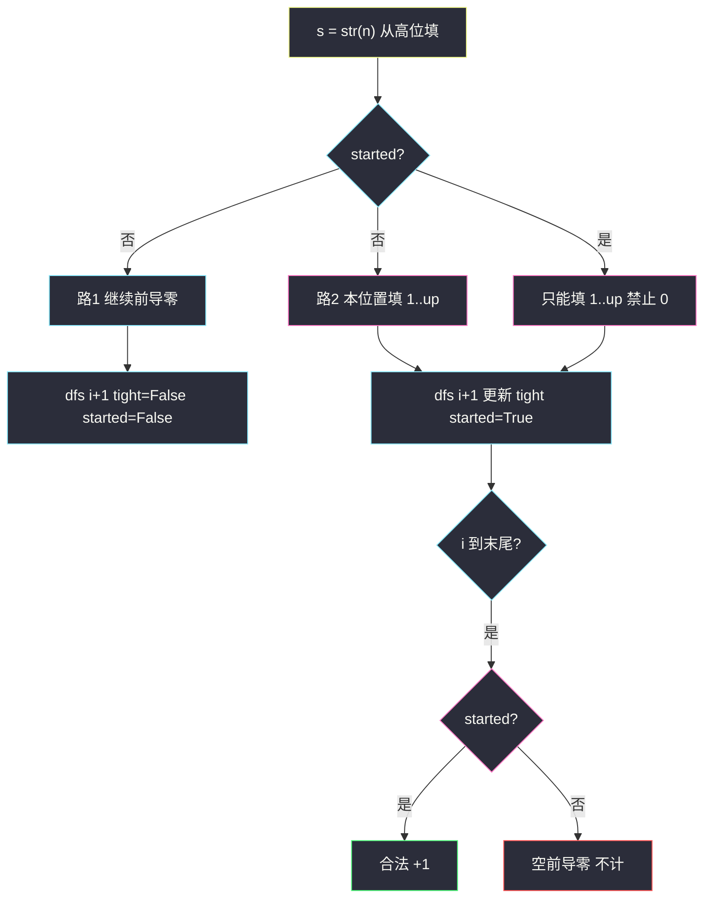

# 3747. 统计移除零后不同整数的数目（Count Distinct Integers After Removing Zeros）

> 题目来源：[https://leetcode.cn/problems/count-distinct-integers-after-removing-zeros/](https://leetcode.cn/problems/count-distinct-integers-after-removing-zeros/)
>
> 灵茶题单小节定位：§10.1 统计合法元素的数目

## 一、问题描述

给你一个正整数 `n`。对每个 `x ∈ [1, n]`，把 `x` 的十进制表示里**所有的 0 删掉**，得到一个整数（例如 `10 → 1`，`101 → 11`，`20 → 2`）。问这些结果里有多少个**不同**的值。

**数据范围**：

- `1 <= n <= 10^15`

**示例 1**：

```text
输入：n = 10
输出：9
解释：记下 1,2,3,4,5,6,7,8,9,1，不同值是 1..9，共 9 个。
```

**示例 2**：

```text
输入：n = 3
输出：3
解释：记下 1,2,3，三个都不同。
```

**核心思考点**：`n` 到 `10^15`，枚举每个 `x` 再丢进集合绝对不行。先问清楚「不同值」到底是哪些数：含 0 的 `x` 去零之后，一定变成一个**更小、且自身不含 0** 的数；那个数作为自己也会在 `[1, n]` 里被记一次。所以集合里的元素，不多不少，正好是 `[1, n]` 中**十进制不含数字 0** 的整数。§10.1 的标准动作：判定「不含 0」+ 按位统计个数——数位 DP，不要枚举到 `n`。

## 二、暴力解法

### 思路

对每个 `x` 删掉字符 `'0'`，丢进 `set`，最后取大小。用来核对小数，以及看清「去零后的值有哪些」。

### 代码

```python
def countDistinctBrute(n: int) -> int:
    seen = set()
    for x in range(1, n + 1):
        t = str(x).replace("0", "")
        if t:
            seen.add(int(t))
    return len(seen)
```

### 复杂度

- 时间：`O(n · D)`，`D` 是十进制位数。`n = 10^15` 时完全不可用。
- 空间：`O(答案)`，答案本身也可到 `10^14` 量级，集合也存不下。

瓶颈不在实现细节，而在「枚举 `x`」这条路本身。必须改成**按位计数**。

## 三、优化探索

### 3.1 去零集合 = 不含 0 的数 ⭐

记 `f(x)` = 删掉 `x` 十进制里所有 0 得到的整数。

- `x` 本来就不含 0：`f(x) = x ≤ n`，它在集合里。
- `x` 至少有一个 0：删掉至少一位后位数变少。`d` 位数至少是 `10^{d-1}`，`d-k` 位数（`k ≥ 1`）至多 `10^{d-k} - 1 < 10^{d-1}`，所以 `f(x) < x ≤ n`。`f(x)` 不含 0，于是 `f(x)` 作为自己也会被记下。

反过来，每个不含 0 的 `y ∈ [1, n]` 都有 `f(y) = y`。两边一夹：

```text
{ f(x) | 1 ≤ x ≤ n }  =  { y | 1 ≤ y ≤ n 且 y 的每一位都在 1..9 }
```

`n = 10`：`f(10) = 1`，集合 `{1..9}`，等于 `[1,10]` 里不含 0 的数（`10` 被踢掉）。`n = 11`：多一个 `11`，`10` 仍然并进 `1`，答案 10。`n = 100`：`1..9` 与 `11..19, 21..29, …, 91..99`，共 `9 + 81 = 90`，`100` 并进 `1`。

### 3.2 从高位填 1..9，不要填 0 ⭐⭐

把 `n` 看成数字串 `s`，从左到右填每一位。这是 §10.1 的通用骨架，本题的「合法数字」特别干净——**真实数位只能是 1..9**。

状态 `dfs(i, tight, started)`：

- `i`：填到 `s` 的第 `i` 位（0 是最高位）；
- `tight`：前面是否一直贴着 `s` 的前缀（本界 `up = s[i]`，否则 `up = 9`）；
- `started`：前面是否已经填过非前导零（真正开始组成一个数）。

转移只有两类：

1. 还没 `started`：可以继续前导零（跳过本位置，相当于构造更短的数），此时更短的数一定 `< n`，所以 `tight` 变成 `False`。
2. 本位置填 `d ∈ [1, up]`：数字 0 **根本不进循环**——这就是「不含 0」的全部约束。填完后 `started = True`。

填到末尾：`started == True` 计 1（空串是数值 0，题目从 1 起，不计）。



和「先填 0..9、再用一个 `hasZero` 位把含 0 的方案丢掉」是同一回事，只是多一维状态。本题合法集不含 0，**循环从 1 起**更短。

### 3.3 组合视角：短的全部是 `9^k` ⭐

`k` 位、每位 1..9 的数有 `9^k` 个，且都 `< 10^k ≤ n`（当 `n` 有超过 `k` 位时）。所以比 `n` 短的全部合法数可以直接加：

```text
9 + 9² + … + 9^{L-1}     L = len(str(n))
```

最高位开始贴着 `n` 往下贪心：当前位是 `d`，先把本位填 `1..d-1` 的方案整段加上 `9^{剩余位数}`；若 `d == 0`，上界本身已经含 0，后面无法继续贴着走，停。若每位都非 0 走到末尾，`n` 自己合法，再 `+1`。

这就是把上面 DP 沿「贴界那一条链」展开后的封闭形式，对拍用它核对数位 DP 很方便。主解仍写记忆化，因为 §10.1 要的是可迁到「合法集更复杂」的模板（相邻限制、数位和、出现过的数字掩码……）。

**核心一句**：去零不产生新数；答案 = `[1, n]` 里不含数字 0 的个数，数位 DP 只填 1..9。

## 四、代码实现

### 主解：数位 DP（只填 1..9）

```python
from functools import cache

class Solution:
    def countDistinct(self, n: int) -> int:
        s = str(n)

        @cache
        def dfs(i: int, tight: bool, started: bool) -> int:
            if i == len(s):
                return int(started)          # 空前导零不计
            res = 0
            if not started:                  # 继续更短的数
                res += dfs(i + 1, False, False)
            up = int(s[i]) if tight else 9
            for d in range(1, up + 1):       # 从不填 0
                res += dfs(i + 1, tight and d == up, True)
            return res

        return dfs(0, True, False)
```

### 对照：Java

```java
class Solution {
    private char[] s;
    private Long[][][] memo;

    public long countDistinct(long n) {
        s = Long.toString(n).toCharArray();
        memo = new Long[s.length][2][2];
        return dfs(0, 1, 0);
    }

    private long dfs(int i, int tight, int started) {
        if (i == s.length) {
            return started;
        }
        if (memo[i][tight][started] != null) {
            return memo[i][tight][started];
        }
        long res = 0;
        if (started == 0) {
            res += dfs(i + 1, 0, 0);
        }
        int up = tight == 1 ? s[i] - '0' : 9;
        for (int d = 1; d <= up; d++) {
            int nt = (tight == 1 && d == up) ? 1 : 0;
            res += dfs(i + 1, nt, 1);
        }
        return memo[i][tight][started] = res;
    }
}
```

Java 必须用 `long`：`n` 与答案都超过 `2^31`。Python 无此问题。

### 细节说明

- **`tight` 在跳过前导零时改成 `False`**：更短的数位数更少，一定严格小于 `n`，后面每位都可以到 9。
- **上界这一位是 0**：`started == True` 时 `up = 0`，`range(1, 1)` 为空——贴着走的这条路死掉，因为再填下去必然在这一位放 0。这正是 `10`、`20`、`100` 自己不合法的原因。
- **不要从 `d = 0` 循环再特判**：真实数字里的 0 一律非法；前导零已经用 `not started` 那条转移覆盖。
- **`n = 1`**：只填出 `1`，答案 1。`n = 9` 答案 9；`n = 10` 答案 9。

## 五、例子演示

**示例 1：`n = 10`，`s = "10"`**

| 调用 | 转移 | 贡献 |
|---|---|---|
| `dfs(0, T, F)` | 跳过最高位；或填 `d=1` | 见下两行 |
| 跳过 → `dfs(1, F, F)` | 再跳过得空串 0；或填 `1..9` | **9**（就是 1..9） |
| 填 `1` → `dfs(1, T, T)` | 已组数，本界 `up=0`，不能填 1..9 | **0**（`10` 含 0，丢掉） |

返回 **9** ✅。

**再看 `n = 25`，`s = "25"`**（官方没给，用来把「贴界 / 不贴界」走完）：

- 跳过最高位：1 位数 `1..9` → 9；
- 最高位填 `1`（`< 2`，不贴界）：第二位自由 `1..9` → `11..19` 共 9；
- 最高位填 `2`（贴界）：第二位 `1..5` → `21..25` 共 5。

合计 `9 + 9 + 5 = 23`。枚举验证：`1..9`、`11..19`、`21..25`，没有 `10/20`。✅

**`n = 100`**：比 3 位短的合法数 `9 + 81 = 90`；最高位只能试 `1`，但第二位上界是 `0`，贴界立刻断。`100` 自己含 0。答案 **90**。`n = 111` 时 `111` 三位都不为 0，在 90 上再 `+1` 得 **91**。

## 六、复杂度分析

设 `D = len(str(n)) ≤ 16`：

| 项目 | 量级 |
|---|---|
| 时间 | 状态 `D · 2 · 2`，每状态枚举最多 9 个数字，`O(D)` |
| 空间 | 记忆化 `O(D)`（再加递归栈 `O(D)`） |

`n = 10^15` 只扫 16 位，和 `n` 的数值大小无关。

## 七、对比总结

| 维度 | 暴力 set | 组合 `9^k` + 贴界 | 数位 DP（主解） |
|---|---|---|---|
| 时间 | `O(n · D)` | `O(D)` | `O(D)` |
| `n = 10^15` | 不可用 | 可用 | 可用 |
| 可迁移性 | 无 | 合法集必须是「每位独立 ∈ S」 | 可加相邻/掩码/数位和 |

**套路归纳**：§10.1 先找判定 `isGood(x)`，再把判定嵌进「贴着上界从高位填」。本题判定是「每一位 ∈ {1..9}」，所以循环从 1 起、前导零单独跳过。看到 `n ≤ 10^18` 且问「有多少个合法数」，不要写 `for x in 1..n`。

## 八、举一反三

1. **[902. 最大为 N 的数字组合](https://leetcode.cn/problems/numbers-at-most-n-given-digit-set/)**：本题的一般形态——合法数字集改成题目给的 `digits`，骨架同一个 `dfs(i, tight, started)`。
2. **[233. 数字 1 的个数](https://leetcode.cn/problems/number-of-digit-one/)**：统计变成「价值总和」，每位贡献 1 的出现次数。
3. **[1012. 至少有 1 位重复的数字](https://leetcode.cn/problems/numbers-with-repeated-digits/)**：合法/非法依赖「出现过哪些数字」，状态加一个 `mask`。
4. **[600. 不含连续 1 的非负整数](https://leetcode.cn/problems/non-negative-integers-without-consecutive-ones/)**：二进制版，状态带「上一位是不是 1」。
5. **[788. 旋转数字](https://leetcode.cn/problems/rotated-digits/)**：同一小节的判定计数；`n` 小时枚举，大了同样数位 DP。
6. **[2719. 统计整数数目](https://leetcode.cn/problems/count-of-integers/)**：区间 + 数位和约束，`count(high) - count(low-1)`。

**同族互引**：灵茶 §10.1 要的就是「判定函数 → 填位计数」。本题合法集最干净（禁 0），适合当模板第一题；迁到 902 / 1012 时只改「这一位能填谁」。
