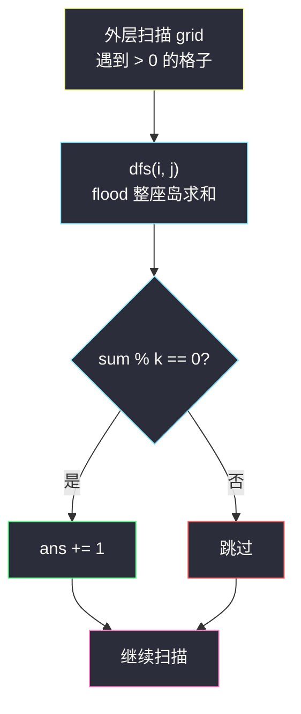
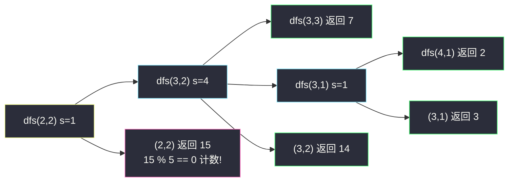

# 总价值可以被 K 整除的岛屿数目(岛屿价值和 · flood 求和取模)

## 一、问题描述

给你一个 `m x n` 的矩阵 `grid` 和一个正整数 `k`。`0` 表示水,**正整数**表示陆地;岛屿是四方向连通的正整数格子集合。一座岛屿的**总价值**是它所有格子的数值之和。

返回总价值能被 `k` 整除(`总和 % k == 0`)的岛屿数量。

> 🔗 LeetCode 3619:https://leetcode.cn/problems/count-islands-with-total-value-divisible-by-k/
>
> 数据范围:`m, n <= 1000` 量级,`1 <= k`,`1 <= 格子值 <= 10^5`,水为 `0`。

**示例 1**

```text
grid = [[0,2,1,0,0],
        [0,5,0,0,5],
        [0,0,1,0,0],
        [0,1,4,7,0],
        [0,2,0,0,8]]
k = 5
输出:2
```

先标出 4 座岛屿(注意 `(2,2)` 与 `(3,2)` 上下连通,别看漏):

```text
.  A  A  .  .
.  A  .  .  B
.  .  C  .  .
.  C  C  C  .
.  C  .  .  D
```

| 岛屿 | 格子与数值 | 总价值 | 能被 5 整除? |
|------|-----------|--------|--------------|
| A | 2, 1, 5 | 8 | ✗ |
| B | 5 | 5 | ✓ |
| C | 1, 1, 4, 7, 2 | 15 | ✓ |
| D | 8 | 8 | ✗ |

答案 2。

**示例 2**

```text
grid = [[3,0,3,0],
        [0,3,0,3],
        [3,0,3,0]]
k = 3
输出:6
```

6 个 `3` 互不相邻,是 6 座岛屿,每座总价值 3,都能被 3 整除,答案 6。

**直观理解**

这是 [#695 岛屿的最大面积](https://leetcode.cn/problems/max-area-of-island/) 的带权版:DFS flood 一座岛时**累加格值**得到总价值,再加一个 `% k == 0` 的判定。基础模板题,重点是把 flood 求和写扎实、不重不漏。

---

## 二、暴力解法

对 `grid` 的每个陆地格,重新 flood 整座岛求和(不持久标记,回溯还原):

```python
class Solution:
    def countIslands(self, grid: List[List[int]], k: int) -> int:
        m, n = len(grid), len(grid[0])

        def get_sum(x: int, y: int) -> int:      # 重扫整岛求和
            if not (0 <= x < m and 0 <= y < n) or grid[x][y] == 0:
                return 0
            v = grid[x][y]                       # 暂存原值
            grid[x][y] = 0                       # 临时标记
            s = v + get_sum(x + 1, y) + get_sum(x - 1, y)
            s += get_sum(x, y + 1) + get_sum(x, y - 1)
            grid[x][y] = v                       # 还原,下次还能重扫
            return s

        ans = 0
        for i in range(m):
            for j in range(n):
                if grid[i][j] > 0 and get_sum(i, j) % k == 0:
                    ans += 1
        return ans
```

> 说明:严格暴力也可用独立的 `visited` 矩阵代替「置 0 还原」。要点是**同一座岛被它的每个格子各扫一遍**。

### 复杂度

- **时间**:`O((mn)²)`——`m, n = 1000` 时最坏 `10^12` 量级,完全不可行。
- **空间**:`O(mn)` 递归栈。

### 🔴 瓶颈在哪里

求和对「整座岛」是**一次性**的,却按格子重复算;而且整除判定只需要**总和模 k**,不需要总和本身多次。正确做法:一次 flood 顺手求和,结果对整块生效。

---

## 三、优化探索(核心章节)

> 📚 本题出自灵茶题单一期 **§一、网格图 DFS**(网格图 DFS 篇),是 #695 岛屿的最大面积的姊妹题:DFS 返回值从「面积(格数)」换成「总价值(格值之和)」,再对外层每次 flood 的结果做 `% k` 判定。

### 3.1 观察特征

| 特征 | 说明 |
|------|------|
| 统计对象是带权连通块 | flood 一次得到整块总和 |
| 判定只依赖 `sum % k` | 求和过程中维护 `s` 或 `s % k` 均可 |
| 格子值域正整数,`0` 是水 | flood 时**置 0 即标记**,免 visited |
| `mn` 可达 `10^6` | 递归深度风险(见 3.4) |

### 3.2 关键一步:DFS 返回「子树和」,逐层累加

`dfs(x, y)` flood 并返回包含 `(x, y)` 的整座岛的总价值:

```text
s = grid[x][y]                 # 先取当前格的值
grid[x][y] = 0                 # 再标记(顺序别反,先标记会取到 0)
s += dfs(四个界内且 > 0 的邻居)  # 子树和逐层上传
return s
```

外层扫到陆地格就 `if dfs(i, j) % k == 0: ans += 1`。每格恰进一次 DFS,整体 `O(mn)`。

### 3.3 模的性质:和取模 = 加完再模

`(a + b) % k == ((a % k) + (b % k)) % k`,所以累加过程中只存 `s % k` 也行(防止别的语言溢出);Python 整数无界,直接累加原值最直观。注意最大总和:`10^6 格 * 10^5 = 10^11`,**Java/C++ 必须用 long**,int 会溢出。



### 3.4 深度警告:`10^6` 格的递归

`m, n <= 1000` 时,蛇形长岛递归深度可达 `10^6`,Python 递归(即便调大 `setrecursionlimit`)有爆栈风险。提交推荐**显式栈**版(逻辑与递归一致:格值随格入栈、出栈累加,入栈的同时置 0 标记)。这也是灵神网格 DFS 模板在 Python 大网格上的标准注意事项。

### 3.5 一句话核心

> **flood 一岛算一和:取值 → 置 0 → 四方向子树和相加;外层每次 flood 判一次 `% k`。**

---

## 四、代码实现

### Python(主解:递归 DFS,模板清晰)

```python
class Solution:
    def countIslands(self, grid: List[List[int]], k: int) -> int:
        m, n = len(grid), len(grid[0])

        def dfs(x: int, y: int) -> int:          # 返回该岛总价值
            s = grid[x][y]                       # 先取值
            grid[x][y] = 0                       # 后标记:0 是水,天然判重
            for nx, ny in ((x + 1, y), (x - 1, y), (x, y + 1), (x, y - 1)):
                if 0 <= nx < m and 0 <= ny < n and grid[nx][ny] > 0:
                    s += dfs(nx, ny)             # 子树和上传
            return s

        ans = 0
        for i in range(m):
            for j in range(n):
                if grid[i][j] > 0:               # 新岛
                    if dfs(i, j) % k == 0:
                        ans += 1
        return ans
```

> 新题提示:提交时以题目给出的函数签名/返回类型为准,这里按 `countIslands(grid, k)` 书写。

**变量含义**

| 变量 | 含义 |
|------|------|
| `s` | 以 `(x, y)` 为根的子树(剩余未访问岛体)总价值 |
| `grid[x][y] = 0` | 就地标记(值域为正,0 即水) |
| `ans` | 满足 `sum % k == 0` 的岛数 |

**循环不变式**:外层扫到 `(i, j)` 时,先前所有岛的格子已全部置 0,故 `grid[i][j] > 0` 当且仅当它属于**尚未求和的岛**;每格恰被累加一次,不重不漏。

### Python(提交稳:显式栈版)

```python
class Solution:
    def countIslands(self, grid: List[List[int]], k: int) -> int:
        m, n = len(grid), len(grid[0])
        ans = 0
        for i in range(m):
            for j in range(n):
                if grid[i][j] == 0:
                    continue
                s = 0
                stack = [(i, j, grid[i][j])]      # 携带格值:入栈前就要取好
                grid[i][j] = 0                     # 入栈前标记(置 0 判重)
                while stack:
                    x, y, v = stack.pop()
                    s += v                          # 出栈累加的是入栈时暂存的值
                    for nx, ny in ((x + 1, y), (x - 1, y), (x, y + 1), (x, y - 1)):
                        if 0 <= nx < m and 0 <= ny < n and grid[nx][ny] > 0:
                            stack.append((nx, ny, grid[nx][ny]))  # 先取值入栈
                            grid[nx][ny] = 0                       # 再置 0 判重
                ans += (s % k == 0)
        return ans
```

### Java(最优解环节,注意 long)

```java
class Solution {
    public int countIslands(int[][] grid, int k) {
        int m = grid.length, n = grid[0].length, ans = 0;
        for (int i = 0; i < m; i++)
            for (int j = 0; j < n; j++)
                if (grid[i][j] > 0 && dfs(i, j, grid) % k == 0)
                    ans++;
        return ans;
    }

    private long dfs(int x, int y, int[][] g) {  // 总和最高 1e11,必须 long
        long s = g[x][y];
        g[x][y] = 0;
        int m = g.length, n = g[0].length;
        for (int[] d : new int[][]{{1, 0}, {-1, 0}, {0, 1}, {0, -1}}) {
            int nx = x + d[0], ny = y + d[1];
            if (0 <= nx && nx < m && 0 <= ny && ny < n && g[nx][ny] > 0)
                s += dfs(nx, ny, g);
        }
        return s;
    }
}
```

---

## 五、具体例子演示

以示例 1(`k = 5`)走主解。外层扫描依次在 `(0,1)`、`(1,4)`、`(2,2)`、`(4,4)` 触发 flood。

**连通分量标记矩阵**:

```text
.  A  A  .  .
.  A  .  .  B
.  .  C  .  .
.  C  C  C  .
.  C  .  .  D
```

**岛 A(起点 (0,1),方向序:下、上、右、左)**

| 步 | 访问格 | 本格值 | 累计 s |
|----|--------|--------|--------|
| ① | (0,1) | 2 | 2 |
| ② | (1,1) | 5 | 2 + 5 = 7 |
| ③ | (0,2) | 1 | 7 + 1 = 8 |

`8 % 5 = 3 ≠ 0` → 不计数。

**岛 B**:`(1,4)` 单格,和 = 5,`5 % 5 == 0` → `ans = 1` ✓

**岛 C(起点 (2,2),注意 (2,2)-(3,2) 的竖向连通)**

| 步 | 访问格 | 本格值 | 说明 |
|----|--------|--------|------|
| ① | (2,2) | 1 | 向下递归 |
| ② | (3,2) | 4 | 向右递归 |
| ③ | (3,3) | 7 | 叶子,返回 7 |
| ④ | (3,1) | 1 | (3,2) 向左,向下递归 |
| ⑤ | (4,1) | 2 | 叶子,返回 2 |
| 回传 | (3,1) | — | 返回 1 + 2 = 3 |
| 回传 | (3,2) | — | 返回 4 + 7 + 3 = 14 |
| 回传 | (2,2) | — | 返回 1 + 14 = **15** |

`15 % 5 == 0` → `ans = 2` ✓。递归树:

```text
(2,2)=1 → 总和 15
└─ (3,2)=4 → 子树和 14
   ├─ (3,3)=7 → 7
   └─ (3,1)=1 → 3
      └─ (4,1)=2 → 2
```

**岛 D**:`(4,4)` 单格,和 = 8,`8 % 5 = 3` → 不计数。

**最终 `ans = 2`** ✓,与第一章表格一致。全部 flood 结束后 `grid` 中岛屿格子均已置 0(矩阵变全 0 岛区),天然防重。



---

## 六、复杂度分析

| 方法 | 时间 | 空间 | 说明 |
|------|------|------|------|
| 暴力逐格重扫 | `O((mn)²)` | `O(mn)` | 同岛重复求和,超时 |
| 一次 flood 一岛(主解) | `O(mn)` | `O(mn)` | 每格取值一次;栈深最坏 `O(mn)` |

---

## 七、对比总结

**同构链**——flood 求值的三个层次:

| 题 | DFS 返回值 | 判定 |
|----|-----------|------|
| #200 岛屿数量 | 无(计数) | 岛的存在 |
| #695 岛屿的最大面积 | 格数 | 取最大 |
| #3619 本篇 | 格值之和 | `sum % k == 0` |
| #1905 统计子岛屿 | bool | 双网格对照(见同批 `count-sub-islands.md`) |

**易错点**

1. **先取值后置 0**:`grid[x][y] = 0` 写在取值之前会把自家值清掉,得到 0。
2. **连通看漏**:`(2,2)-(3,2)` 这类竖向拼接最容易漏看,导致数错岛数(示例 1 的关键)。
3. **Java/C++ 溢出**:总和最高 `10^11`,返回类型用 `long`,int 溢出会得出错误余数。
4. **递归深度**:`10^6` 格的蛇形岛,Python 递归有爆栈风险,提交用显式栈版。
5. `k = 1` 时所有岛都计数,别被边界吓到,模板无需特判。

**模板(flood 求和,Python)**

```python
def dfs(x, y):                # 返回整座岛的总价值
    s = grid[x][y]            # 先取值
    grid[x][y] = 0            # 后标记
    for nx, ny in 四方向:
        if 界内 and grid[nx][ny] > 0:
            s += dfs(nx, ny)  # 子树和上传
    return s
```

---

## 八、举一反三

| 题目 | 关系 |
|------|------|
| [695. 岛屿的最大面积](https://leetcode.cn/problems/max-area-of-island/) | 本篇前置:flood 返回格数 |
| [200. 岛屿数量](https://leetcode.cn/problems/number-of-islands/) | flood 计数鼻祖 |
| [463. 岛屿的周长](https://leetcode.cn/problems/island-perimeter/) | flood 或直接扫格,统计「贡献」的另一口径 |
| [827. 最大人工岛](https://leetcode.cn/problems/making-a-large-island/) | flood 给每座岛编号 + 记录面积/权和,再枚举翻转格拼接——本篇求和思想的进阶用法 |
| [560. 和为 K 的子数组](https://leetcode.cn/problems/subarray-sum-equals-k/) | 「和的整除/相等判定」在一维前缀和世界的镜像,同目录 `subarray-sums-divisible-by-k.md` 讲「和 % k 分组」 |
| [974. 和可被 K 整除的子数组](https://leetcode.cn/problems/subarrays-divisible-by-k/) | 同上,`% k` 余数计数的标准套路 |

**思想迁移**

- 连通块上的**聚合统计**(个数、面积、权和、最值),统一姿势:flood 时把值写进**返回值**逐层上传。
- 「能被 k 整除」这类整除判定,记 `% k` 余数即可;多语言注意求和的溢出宽度。
- 口诀:**「flood 一岛算一和,先取值来后置 0;外层判次模,余零才计数。」**
