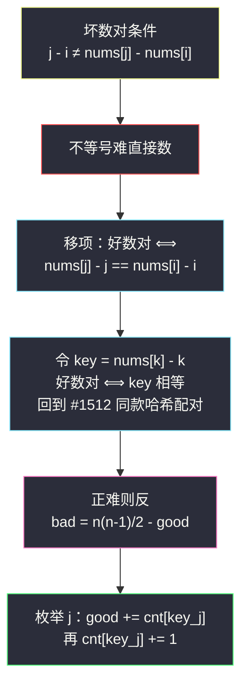
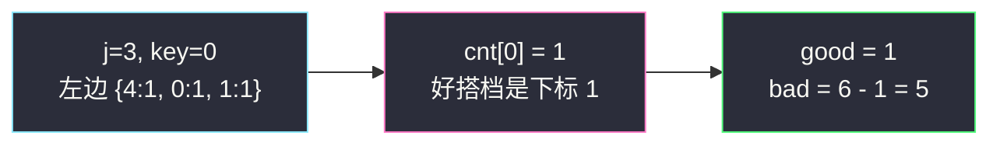

# 统计坏数对的数目（条件变形 · 正难则反 + 枚举右维护左）

## 一、问题描述

给你一个下标从 `0` 开始的整数数组 `nums`。如果 `i < j` 且 `j - i != nums[j] - nums[i]`，则称 `(i, j)` 是一个**坏数对**。返回坏数对的**总数**。

> 🔗 LeetCode 2364：https://leetcode.cn/problems/count-number-of-bad-pairs/
>
> 数据范围：`1 <= nums.length <= 10^5`，`1 <= nums[i] <= 10^9`。

**示例 1**

```
输入：nums = [4,1,3,3]
输出：5
解释：下标对 (0,1)、(0,2)、(0,3)、(1,2)、(2,3) 都是坏数对。
```

逐对验证（好数对条件 `j - i == nums[j] - nums[i]`）：

| (i, j) | j - i | nums[j] - nums[i] | 相等? | 判定 |
|--------|-------|-------------------|-------|------|
| (0, 1) | 1 | 1 - 4 = -3 | 否 | 坏 |
| (0, 2) | 2 | 3 - 4 = -1 | 否 | 坏 |
| (0, 3) | 3 | 3 - 4 = -1 | 否 | 坏 |
| (1, 2) | 1 | 3 - 1 = 2 | 否 | 坏 |
| (1, 3) | 2 | 3 - 1 = 2 | **是** | 好 |
| (2, 3) | 1 | 3 - 3 = 0 | 否 | 坏 |

坏数对共 5 个。

**示例 2**

```
输入：nums = [1,2,3,4,5]
输出：0
解释：数组严格递增且步长为 1，所有下标对都满足 j - i == nums[j] - nums[i]。
```

**直观理解**

这是 [#1512 好数对的数目](https://leetcode.cn/problems/number-of-good-pairs/)（同批 `number-of-good-pairs.md`）的 Medium 进化版：配对条件从裸的「值相等」变成一条**带下标的等式**，而且要数的是「不满足」的一侧。两步定式：先把条件**移项变形**成「某个 key 相等」，再**正难则反**用总数减好数对。

---

## 二、暴力解法

双重循环枚举所有下标对，逐对判定：

```python
class Solution:
    def countBadPairs(self, nums: List[int]) -> int:
        n, ans = len(nums), 0
        for i in range(n):
            for j in range(i + 1, n):
                if j - i != nums[j] - nums[i]:
                    ans += 1
        return ans
```

### 复杂度

- **时间**：`O(n²)`，`n = 10^5` 时约 `5 * 10^9` 次判定，严重超时。
- **空间**：`O(1)`。

### 🔴 瓶颈在哪里

不等号条件没法直接哈希——坏数对的「值域」不连续也没规律。突破口是：**不满足等式的对 = 全部对 − 满足等式的对**，而满足等式的一侧可以变形出「相等」结构。

---

## 三、优化探索（核心章节）

> 📚 本题在灵茶题单中属于 **§0.1 枚举右，维护左**（常用数据结构 A · 哈希表），是 #1512 的直接加强：同样「枚举右端点、哈希表维护左边计数」，只是哈希键从元素值换成了**移项变形后的 `nums[j] - j`**。

### 3.1 观察特征

| 特征 | 说明 |
|------|------|
| 条件带不等号，直接数困难 | 正难则反：总数 − 好数对 |
| 好数对条件是含 `i`、`j` 的等式 | 尝试移项，把 `i`、`j` 分离到两侧 |
| `n = 10^5` | 必须 `O(n)` 或 `O(n log n)` |

### 3.2 关键一步：移项变形

好数对条件：

```text
j - i == nums[j] - nums[i]
```

把 `j` 和 `nums[j]` 挪到同侧、`i` 和 `nums[i]` 挪到同侧：

```text
nums[j] - j == nums[i] - i
```

定义 **key(k) = nums[k] - k**，则好数对 ⟺ `key(i) == key(j)`——这正是 #1512 的「值相等配对」，只不过「值」换成了变形后的 key！坏数对 ⟺ key 不相等。



### 3.3 数好数对：#1512 模板原样复用

从左往右枚举右端点 `j`，哈希表 `cnt` 维护左边各 key 的出现次数，**先查后存**：

- `good += cnt[key(j)]`：左边与 `j` 同 key 的下标全部与 `j` 构成好数对；
- `cnt[key(j)] += 1`：把 `j` 登记进表。

最后 `bad = n*(n-1)/2 - good`。

### 3.4 变体：不绕弯，直接数坏数对

固定 `j` 时，左边共有 `j` 个下标（`0..j-1`），其中 `cnt[key(j)]` 个是 `j` 的好搭档，**其余全是坏搭档**：

```python
bad += j - cnt[key(j)]
```

两种写法完全等价（`Σ j = n(n-1)/2`，逐项相减即汇总相减）。主解用「总数 − 好数对」，逻辑更显式；直接法少一次最终减法，现场比赛按手感选。

### 3.5 一句话核心

> **不等先取反：`j - i == nums[j] - nums[i]` 移项成 `nums[k] - k` 相等；枚举右端点用哈希表数好对，`n(n-1)/2` 一减就是坏对。**

---

## 四、代码实现

### Python（主解：正难则反）

```python
class Solution:
    def countBadPairs(self, nums: List[int]) -> int:
        n = len(nums)
        good = 0
        cnt = defaultdict(int)          # key = nums[k] - k -> 左边出现次数
        for j, x in enumerate(nums):    # 枚举右端点 j
            key = x - j                 # 变形 key
            good += cnt[key]            # 先查：左边同 key 的都是好搭档
            cnt[key] += 1               # 后存：登记 j
        return n * (n - 1) // 2 - good  # 正难则反
```

**变体（直接数坏对，等价）**

```python
class Solution:
    def countBadPairs(self, nums: List[int]) -> int:
        bad, cnt = 0, defaultdict(int)
        for j, x in enumerate(nums):
            bad += j - cnt[x - j]       # 左边 j 个下标里，减去好搭档
            cnt[x - j] += 1
        return bad
```

**变量含义**

| 变量 | 含义 |
|------|------|
| `key = x - j` | 元素值减下标，移项后的「有效值」 |
| `cnt[key]` | 左边 key 相等的下标个数 |
| `good` / `bad` | 好数对 / 坏数对累计 |
| `n*(n-1)//2` | 全部下标对数 |

**循环不变式**：处理 `j` 之前，`cnt` 恰记录 `nums[0..j-1]` 的 key 计数，因此 `cnt[key]` 就是与 `j` 配好对的下标数——先查后存保证不自配。

### Java（注意用 long）

```java
// 统计坏数对的数目
// 测试链接 : https://leetcode.cn/problems/count-number-of-bad-pairs/
class Solution {
    public long countBadPairs(int[] nums) {
        int n = nums.length;
        Map<Integer, Long> cnt = new HashMap<>();
        long good = 0;
        for (int j = 0; j < n; j++) {
            int key = nums[j] - j;
            good += cnt.getOrDefault(key, 0L);   // 先查
            cnt.merge(key, 1L, Long::sum);       // 后存
        }
        return (long) n * (n - 1) / 2 - good;
    }
}
```

---

## 五、具体例子演示

以 `nums = [4,1,3,3]` 走主解。先列 key：`4-0=4`、`1-1=0`、`3-2=1`、`3-3=0`。

**逐步跟踪（枚举右端点，哈希表内容与配对数）**

| j | nums[j] | key | 哈希表（查询前） | cnt[key] | good 累计 | 哈希表（登记后） |
|---|---------|-----|------------------|----------|-----------|------------------|
| 0 | 4 | 4 | `{}` | 0 | 0 | `{4:1}` |
| 1 | 1 | 0 | `{4:1}` | 0 | 0 | `{4:1, 0:1}` |
| 2 | 3 | 1 | `{4:1, 0:1}` | 0 | 0 | `{4:1, 0:1, 1:1}` |
| 3 | 3 | 0 | `{4:1, 0:1, 1:1}` | 1 | **1** | `{4:1, 0:2, 1:1}` |

`j=3` 这一步配出唯一的好数对 `(1, 3)`——因为 `nums[1] - 1 == nums[3] - 3 == 0`。

**正难则反收尾**

```text
总数 = 4 * 3 / 2 = 6
坏数对 = 6 - 1 = 5 ✓
```

与第一章逐对验证表完全一致。

**示例 2 验证**：`nums = [1,2,3,4,5]`，key 依次为 `1,1,1,1,1`，每步 `cnt[key]` 为 0、1、2、3、4，`good = 0+1+2+3+4 = 10 = C(5,2)`，即全部对都是好数对，`bad = 10 - 10 = 0` ✓。

**直接法对照**（同一数据）：每步坏对贡献 `j - cnt[key]` 依次为 `0-0, 1-0, 2-0, 3-1 = 0,1,2,2`，累加同样得 `5` ✓。



---

## 六、复杂度分析

| 方法 | 时间 | 空间 | 说明 |
|------|------|------|------|
| 暴力双循环 | `O(n²)` | `O(1)` | `n = 10^5` 超时 |
| 枚举右维护左（主解） | `O(n)` | `O(n)` | 哈希表最多存 n 个不同 key |

---

## 七、对比总结

**同构链**——三道题本质是同一道题，只有「key 的构造」不同：

| 题 | 好对条件 | key |
|----|----------|-----|
| #1512 好数对 | `nums[i] == nums[j]` | `nums[k]` |
| #2364 本篇 | `j - i == nums[j] - nums[i]` | `nums[k] - k` |
| #1814 好数对（变位词） | `nums[i] + rev(nums[i]) == nums[j] + rev(nums[j])` | `nums[k] + rev(nums[k])`，答案还要取模 |

**易错点**

1. **溢出（Java/C++）**：`n(n-1)/2` 在 `n = 10^5` 时约 `5 * 10^9`，超过 32 位 int 上限（约 `2.1 * 10^9`），必须用 `long`；Python 无此虑但面试要能说清。
2. **移项方向统一**：`nums[k] - k` 与 `k - nums[k]` 等价（互为相反数），但同一张哈希表里不能混用两种方向。
3. 直接数坏对时，左边下标个数是 `j`（不是 `j + 1`）——当前元素还没登记。
4. 先查后存的老规矩：颠倒顺序会把 `(j, j)` 算成好对。

**模板（变形 + 正难则反，Python）**

```python
total = n * (n - 1) // 2
good = 0
cnt = defaultdict(int)
for j, x in enumerate(nums):
    key = x - j               # 题目变形出来的「有效值」
    good += cnt[key]          # 先查
    cnt[key] += 1             # 后存
ans = total - good            # 正难则反
```

---

## 八、举一反三

| 题目 | 关系 |
|------|------|
| [1512. 好数对的数目](https://leetcode.cn/problems/number-of-good-pairs/) | 同模板入门篇，同批 `number-of-good-pairs.md`，先看它再看本篇 |
| [1814. 统计一个数组中好对子的数目](https://leetcode.cn/problems/count-nice-pairs-in-an-array/) | **完全同构**：key 换成 `nums[k] + rev(nums[k])`，结果对 `10^9+7` 取模 |
| [1010. 总持续时间可被 60 整除的歌曲](https://leetcode.cn/problems/pairs-of-songs-with-total-durations-divisible-by-60/) | 配对条件 `(a+b) % 60 == 0` 变形成余数互补，同款哈希计数 |
| [2001. 可互换矩形的数目](https://leetcode.cn/problems/number-of-pairs-of-interchangeable-rectangles/) | 分组 + 组合数视角，key 是约分后的宽高比 |
| [2006. 差的绝对值为 K 的数对数目](https://leetcode.cn/problems/count-number-of-pairs-with-absolute-difference-k/) | 同时查 `x-k`、`x+k` 两个 key |
| [560. 和为 K 的子数组](https://leetcode.cn/problems/subarray-sum-equals-k/) | 变形思想迁移到前缀和家族：`pre[j] - pre[i] == k` ⟺ 前缀和哈希计数，见同目录 `binary-subarrays-with-sum.md` 的姊妹讨论 |

**思想迁移**

- 看到「统计满足**不等式**/不满足条件的对」，先写补集：**总数 − 满足侧**，再攻满足侧。
- 含 `i`、`j` 双下标的等式条件，先**移项把 `i`、`j` 分离**，把「二元关系」压成「一元 key 相等」，哈希计数即可。
- 口诀：**「不等先取反，移项造同 key；哈希数好对，总数减一减。」**
