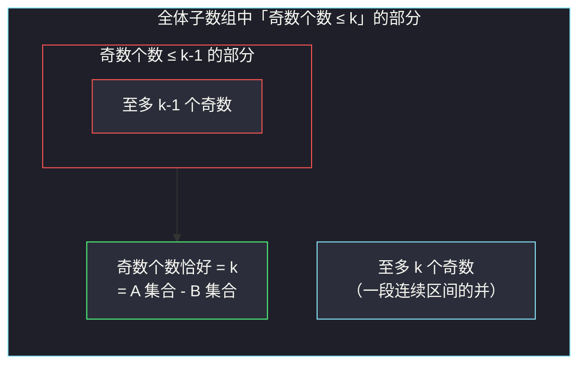
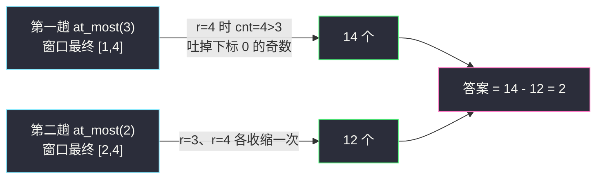

# 统计「优美子数组」（不定长滑窗 · 恰好 = 至多 − 至多）

## 一、问题描述

给你一个整数数组 `nums` 和一个整数 `k`。如果某个**连续子数组**中恰好有 `k` 个奇数数字，我们就认为这个子数组是「优美子数组」。请返回这个数组中「优美子数组」的**数目**。

> 🔗 LeetCode 1248：https://leetcode.cn/problems/count-number-of-nice-subarrays/
>
> 数据范围：`1 <= nums.length <= 5 * 10^4`，`1 <= nums[i] <= 10^5`，`1 <= k <= nums.length`。

**示例 1**

```
输入：nums = [1,1,2,1,1], k = 3
输出：2
解释：包含 3 个奇数的子数组是 [1,1,2,1] 和 [1,2,1,1]。
```

**示例 2**

```
输入：nums = [2,4,6], k = 1
输出：0
解释：数组中不含奇数，所以不存在优美子数组。
```

**直观理解**

每个元素只关心一件事：**是不是奇数**。把奇数记作 `1`、偶数记作 `0`，题意就变成——统计「元素和恰好等于 `k`」的子数组个数。这正是不定长滑动窗口「求子数组个数」家族里的**恰好型**，而恰好型的标准处理方式就是本篇主角：**恰好 = 至多 − 至多**。

---

## 二、暴力解法

枚举所有子数组 `[i..j]`，数一数里面有几个奇数，等于 `k` 就计入答案。

```python
class Solution:
    def numberOfSubarrays(self, nums: List[int], k: int) -> int:
        n, ans = len(nums), 0
        for i in range(n):
            cnt = 0                       # 当前子数组内的奇数个数
            for j in range(i, n):
                cnt += nums[j] % 2        # 奇偶性：奇数贡献 1，偶数贡献 0
                if cnt == k:
                    ans += 1
                elif cnt > k:             # 奇数只增不减，超过 k 可提前剪枝
                    break
        return ans
```

### 复杂度

- **时间**：`O(n²)`（剪枝后最好情况仍可能接近平方，比如全是奇数、`k` 很大时）。
- **空间**：`O(1)`。

### 🔴 瓶颈在哪里

`n = 5 * 10^4` 时 `n² = 2.5 * 10^9`，必然超时。根本原因和所有滑窗题一样：起点从 `i` 挪到 `i+1` 时，窗口内的信息几乎可以全部复用，我们却从零重数了一遍。

---

## 三、优化探索（核心章节）

> 📚 本题在灵茶题单中属于 **§2.3 求子数组个数**（不定长滑动窗口 · 第三类）。求子数组个数时，窗口的合法左端点是否**连成一段**是能否滑窗的关键；「恰好 k 个」不满足这一点，灵神（lyl）的标准套路是做一次 **恰好 = 至多(k) − 至多(k−1)** 的转换，把问题化归为两个「至多型」滑窗。

### 3.1 观察特征

| 特征 | 说明 |
|------|------|
| 连续子数组 | 滑动窗口 `[l..r]` |
| 每个元素只贡献 0/1 | 奇偶性 `nums[i] % 2`，窗口信息用一个计数器 `cnt` 即可 |
| 求「恰好 k 个奇数」的**个数** | 计数题，考虑固定右端点数左端点 |

### 3.2 为什么「恰好」不能直接滑窗

「求子数组个数」的滑窗写法依赖于：**固定右端点 `r` 时，合法的左端点连成一段前缀/后缀区间**，这样才能用 `r - l + 1` 之类的式子一段一段地数。

- 「**至多 k** 个奇数」：`l` 越大（窗口越短）奇数越少，合法左端点是 `l ∈ [L, r]` 一整段 → **可滑窗**。
- 「**恰好 k** 个奇数」：看反例 `nums = [1,1,1,1]`（全是奇数），`k = 2`，固定 `r = 3`：

| 左端点 l | 子数组 | 奇数个数 | 恰好为 2？ |
|---------|--------|---------|-----------|
| 0 | `[1,1,1,1]` | 4 | ✗ |
| 1 | `[1,1,1]` | 3 | ✗ |
| 2 | `[1,1]` | 2 | ✓ |
| 3 | `[1]` | 1 | ✗ |

合法左端点只有孤零零的 `{2}`，**不连续**——滑动窗口只会维护「一段连续的合法区间」，天生数不了这种「挖空」的集合。

### 3.3 恰好 = 至多(k) − 至多(k−1)

把集合画出来就一目了然（文氏图思想）：



「奇数 ≤ k」挖掉「奇数 ≤ k−1」剩下的，恰好就是「奇数 = k」。而两个「至多」的个数都能用同一套滑窗 O(n) 数出来，于是：

> **恰好(k) = 至多(k) − 至多(k−1)**

### 3.4 「至多」怎么数：固定 r，数以 r 结尾的合法子数组

灵神求子数组个数的框架：**枚举右端点 `r`，维护窗口 `[l..r]` 使其保持合法（奇数 ≤ m），则以 `r` 结尾的合法子数组恰好是左端点取 `l..r` 的那些，共 `r - l + 1` 个**。

- 纳入 `nums[r]`：`cnt += nums[r] % 2`；
- 若 `cnt > m`（窗口非法）：不断吐左 `cnt -= nums[l] % 2; l += 1`，直到恢复合法；
- 累加 `ans += r - l + 1`。

`l`、`r` 都只前进不后退，两趟窗口共 `O(n)`。

### 3.5 一句话核心

> **「恰好」的左端点不连续、数不了；拆成「至多 k」减「至多 k−1」，两个单调的窗口各数一遍，相减即答案。**

---

## 四、代码实现

### Python（主解：至多转换 + 求子数组个数模板）

```python
class Solution:
    def numberOfSubarrays(self, nums: List[int], k: int) -> int:
        def at_most(m: int) -> int:
            """奇数个数「至多 m」的子数组个数（不定长滑窗求子数组个数模板）"""
            ans = cnt = l = 0
            for r, x in enumerate(nums):
                cnt += x % 2                  # 纳入 nums[r]：奇数贡献 1
                while cnt > m:                # 窗口非法，收缩左端
                    cnt -= nums[l] % 2        # 吐出的元素若是奇数，计数减一
                    l += 1
                ans += r - l + 1              # 以 r 结尾的合法子数组共 r-l+1 个
            return ans
        return at_most(k) - at_most(k - 1)    # 恰好 = 至多(k) - 至多(k-1)
```

**变量含义**

| 变量 | 含义 |
|------|------|
| `m` | 「至多」的上限（先 `k` 后 `k-1`，各跑一遍） |
| `cnt` | 当前窗口 `[l..r]` 内的奇数个数 |
| `l` / `r` | 窗口左右端，`r` 是循环变量，`l` 只增不减 |
| `r - l + 1` | 以 `r` 结尾、奇数 ≤ m 的子数组个数 |
| `ans` | 所有右端点的个数之和 |

**循环不变式**：每轮累加前，窗口 `[l..r]` 内奇数个数 ≤ m，且 `l` 是满足该性质的最小值。

### Java（最优解同款写法）

```java
// 统计「优美子数组」
// 测试链接 : https://leetcode.cn/problems/count-number-of-nice-subarrays/
class Solution {
    public int numberOfSubarrays(int[] nums, int k) {
        return atMost(nums, k) - atMost(nums, k - 1);
    }

    // 奇数个数至多 m 的子数组个数
    private int atMost(int[] nums, int m) {
        int ans = 0, cnt = 0;
        for (int l = 0, r = 0; r < nums.length; r++) {
            cnt += nums[r] % 2;                 // 纳入右端
            while (cnt > m) {                   // 非法则收缩
                cnt -= nums[l] % 2;
                l++;
            }
            ans += r - l + 1;                   // 以 r 结尾的合法子数组个数
        }
        return ans;
    }
}
```

---

## 五、具体例子演示

以 `nums = [1,1,2,1,1]`、`k = 3` 端到端走一遍。奇偶性序列为 `[1,1,0,1,1]`。

**第一趟：`at_most(3)`（奇数 ≤ 3 的子数组个数）**

| r | nums[r] | 进窗后 cnt | 动作 | 窗口 [l, r] | 本轮累加 r-l+1 | ans |
|---|---------|-----------|------|------------|----------------|-----|
| 0 | 1 | 1 | 合法 | [0, 0] | 1 | 1 |
| 1 | 1 | 2 | 合法 | [0, 1] | 2 | 3 |
| 2 | 2 | 2 | 合法 | [0, 2] | 3 | 6 |
| 3 | 1 | 3 | 合法（=3 未超） | [0, 3] | 4 | 10 |
| 4 | 1 | 4 > 3 | 吐 nums[0]=1（奇），cnt=3，l=1 | [1, 4] | 4 | **14** |

**第二趟：`at_most(2)`（奇数 ≤ 2 的子数组个数）**

| r | nums[r] | 进窗后 cnt | 动作 | 窗口 [l, r] | 本轮累加 r-l+1 | ans |
|---|---------|-----------|------|------------|----------------|-----|
| 0 | 1 | 1 | 合法 | [0, 0] | 1 | 1 |
| 1 | 1 | 2 | 合法 | [0, 1] | 2 | 3 |
| 2 | 2 | 2 | 合法 | [0, 2] | 3 | 6 |
| 3 | 1 | 3 > 2 | 吐 nums[0]=1（奇），cnt=2，l=1 | [1, 3] | 3 | 9 |
| 4 | 1 | 3 > 2 | 吐 nums[1]=1（奇），cnt=2，l=2 | [2, 4] | 3 | **12** |

**相减：14 − 12 = 2** ✓（对应 `[1,1,2,1]` 与 `[1,2,1,1]`）



---

## 六、复杂度分析

| 方法 | 时间 | 空间 | 说明 |
|------|------|------|------|
| 暴力枚举 | `O(n²)` | `O(1)` | 每个起点重新数奇数 |
| 至多转换滑窗 | `O(n)` | `O(1)` | 两趟窗口，`l`、`r` 各自最多前进 n 次；只需常数个计数器 |

---

## 七、对比总结

**两种 O(n) 路线对比**

| | 至多转换（本篇） | 前缀和 + 哈希表 |
|--|------------------|------------------|
| 思路 | 恰好 = 至多 − 至多 | 「奇数前缀和」差分计数，与 #560 同构 |
| 空间 | `O(1)` | `O(n)`（哈希表存每个前缀值出现次数） |
| 可迁移性 | 「至多」套路可搬到 #930、#713 等 | 适合数值型「和恰好为 k」、含负数的场景 |

**易错点**

1. `ans += r - l + 1` 而不是 `+1`：以 `r` 结尾的合法子数组有 `r - l + 1` 个（左端点从 `l` 到 `r` 任选）。
2. 收缩条件是 `while cnt > m`，是 **while** 不是 if——一次进窗可能需要吐多个奇数（如 `k=0` 时进入一个奇数，左边连吐）。
3. 本题 `k >= 1`，`at_most(k - 1)` 不会传负数；若把模板搬到别的题（如 #930 的 `goal = 0`），必须对 `m < 0` 提前返回 0。
4. `nums[i] % 2` 对负数同样正确（Python 中 `-3 % 2 == 1`；本题 `nums[i] >= 1` 无此顾虑，但 Java 的 `-3 % 2 == -1`，迁移时注意）。

**模板（求子数组个数 · 至多型，对齐灵神 §2.3）**

```python
def at_most(m):                # 「条件至多 m 次」的子数组个数
    ans = cnt = l = 0
    for r, x in enumerate(nums):
        cnt += f(x)            # f: 元素对条件的贡献
        while cnt > m:         # 非法 → 收缩左端
            cnt -= f(nums[l])
            l += 1
        ans += r - l + 1       # 以 r 结尾的合法个数
    return ans
# 恰好 k 个 = at_most(k) - at_most(k - 1)
```

---

## 八、举一反三

| 题目 | 关系 |
|------|------|
| [930. 和相同的二元子数组](https://leetcode.cn/problems/binary-subarrays-with-sum/) | **完全同构**：和恰好为 goal → 至多 − 至多，见同批题解 `binary-subarrays-with-sum.md` |
| [713. 乘积小于 K 的子数组](https://leetcode.cn/problems/subarray-product-less-than-k/) | 灵神 §2.3 入门题，「越长越不合法」直接数 `r - l + 1`，无需转换 |
| [1358. 包含所有三种字符的子字符串数目](https://leetcode.cn/problems/number-of-substrings-containing-all-three-characters/) | 同小节另一形态：「越长越合法」，固定 r 数左边，见 `number-of-substrings-containing-all-three-characters.md` |
| [2962. 统计最大元素出现至少 K 次的子数组](https://leetcode.cn/problems/count-subarrays-where-max-element-appears-at-least-k-times/) | 「至少」型同样固定 r 数左边，见 `count-subarrays-where-max-element-appears-at-least-k-times.md` |
| [2302. 统计得分小于 K 的子数组数目](https://leetcode.cn/problems/count-subarrays-with-score-less-than-k/) | 同小节 Hard，两问合并：「至多」求最长 + 求个数 |
| [560. 和为 K 的子数组](https://leetcode.cn/problems/subarray-sum-equals-k/) | 恰好型的另一条路：前缀和 + 哈希（数组含负数时滑窗失效，只能走这条） |

**思想迁移**

- 看到「**恰好** k 个 / 和恰好为 k」且元素非负 → 优先想「**恰好 = 至多 − 至多**」两趟滑窗，空间 O(1)。
- 判断一个计数条件能否滑窗：固定右端点，看合法左端点**是否连成一段**；不连续就尝试用「至多 / 至少」做差把它挖出来。
- 口诀：**「恰好难数，至多来减；固定右端，加 `r - l + 1`。」**
