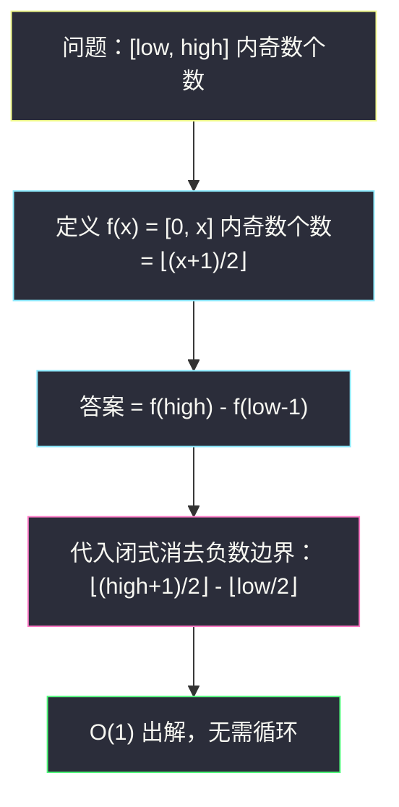

# 在区间范围内统计奇数数目（前缀和 · 区间计数 = 端点函数差）

## 一、问题描述

给你两个**非负整数** `low` 和 `high`。请你返回 `[low, high]`（**闭区间**，两端都包含）之间奇数的数目。

> 🔗 LeetCode 1523：https://leetcode.cn/problems/count-odd-numbers-in-an-interval-range/
>
> 数据范围：`0 <= low <= high <= 10^9`。

**示例 1**

```
输入：low = 3, high = 7
输出：3
解释：3 到 7 之间的奇数有 [3, 5, 7]，共 3 个。
```

**示例 2**

```
输入：low = 8, high = 10
输出：1
解释：8 到 10 之间的奇数只有 9。
```

**直观理解**

区间 `[low, high]` 里奇数、偶数几乎各占一半——「几乎」二字正是本题的全部考点：端点的奇偶性会让奇数多一个或少一个。逐个判断当然能算，但 `high` 高达 `10^9`，循环是行不通的。正确姿势是把「区间计数」拆成两个「前缀计数」相减——这正是前缀和家族最底层的思想。

---

## 二、暴力解法

从 `low` 扫到 `high`，逐个判断 `x % 2 == 1` 并计数。

```python
class Solution:
    def countOdds(self, low: int, high: int) -> int:
        ans = 0
        for x in range(low, high + 1):
            if x % 2 == 1:
                ans += 1
        return ans
```

小优化：奇偶交替，`low` 奇则答案从 1 开始按 `(high - low) // 2 + 1` 类公式拼——但每种端点组合都要分类，极易出错，不如公式化推导。

### 复杂度

- **时间**：`O(high - low + 1)`，最坏 `10^9 + 1` 次。
- **空间**：`O(1)`。

### 🔴 瓶颈在哪里

`10^9` 次循环在 Python 里要上百秒，在任何 OJ 都超时。区间长度是天文数字，但答案只依赖**两个端点**——这类「答案只依赖区间端点」的计数题，标准出路是构造前缀函数 `f(x)`，用 `f(high) - f(low - 1)` 一步出解。

---

## 三、优化探索（核心章节）

> 📚 本题在灵茶题单中属于 **§1.1 一维前缀和（入门）**：定义前缀函数 `f(x)` = 「前 x 个数里满足条件的个数」，任意区间 `[l, r]` 的答案 = `f(r) - f(l - 1)`。本题是这个思想最纯净的载体——前缀函数可以直接写成闭式。

### 3.1 定义前缀函数 f(x)

设

`f(x)` = 闭区间 `[0, x]` 内奇数的个数。

那么：

`[low, high] 内奇数个数 = f(high) - f(low - 1)`

减掉 `[0, low-1]` 这一段，剩下的正是 `[low, high]`——容斥的减法形式，与数组前缀和 `sum(l..r) = pre[r+1] - pre[l]` 同构。

### 3.2 推出 f(x) 的闭式

`[0, x]` 共 `x + 1` 个数：偶数 `0, 2, 4, ...` 与奇数 `1, 3, 5, ...` 成对出现，最后若剩下落单的一个：

| x | 区间内奇数 | 个数 |
|---|-----------|------|
| 0 | （无） | 0 |
| 1 | 1 | 1 |
| 2 | 1 | 1 |
| 3 | 1, 3 | 2 |
| 4 | 1, 3 | 2 |
| 5 | 1, 3, 5 | 3 |
| 6 | 1, 3, 5 | 3 |
| 7 | 1, 3, 5, 7 | 4 |

规律：`f(x) = ⌈x / 2⌉`。为了避开负数边界（见 3.3），写成**下取整**形式：

`f(x) = ⌊(x + 1) / 2⌋`

验证：`f(7) = ⌊8/2⌋ = 4` ✓，`f(6) = ⌊7/2⌋ = 3` ✓，`f(0) = ⌊1/2⌋ = 0` ✓。

### 3.3 边界：low = 0 时 low − 1 = −1

`low = 0` 会把 `f(low - 1) = f(-1)` 送进来。注意代数上的巧合：

`f(low - 1) = ⌊(low - 1 + 1) / 2⌋ = ⌊low / 2⌋`

于是干脆不提 `f(-1)`，答案直接写：

**`⌊(high + 1) / 2⌋ - ⌊low / 2⌋`**

负数下取整、`f(-1)` 特判全部消失，一条式子覆盖 `low = 0` 到 `low = high` 的所有情况。



### 3.4 用前缀函数视角再看一遍

如果把「整数轴」看成一个无限数组 `a = [0, 1, 2, 3, ...]`，其元素满足条件（是奇数）为 1，否则为 0，那么 `f(x)` 就是这个 0/1 数组的前缀和：

| 下标 x | 0 | 1 | 2 | 3 | 4 | 5 | 6 | 7 |
|--------|---|---|---|---|---|---|---|---|
| a[x] 是否奇数 | 0 | 1 | 0 | 1 | 0 | 1 | 0 | 1 |
| 前缀和 f(x) | 0 | 1 | 1 | 2 | 2 | 3 | 3 | 4 |

「区间和 = 两个前缀和之减」在这个视角下完全显形。理解了这一层，再看 §1.x 家族（一维前缀和、前缀和+哈希、状态压缩前缀和）都是同一件事的不同马甲。

### 3.5 一句话核心

> **区间计数 = 前缀函数之差；本题前缀函数有闭式 `⌊(x+1)/2⌋`，最终答案 `⌊(high+1)/2⌋ - ⌊low/2⌋`，O(1) 出解。**

---

## 四、代码实现

### Python 主解

```python
class Solution:
    def countOdds(self, low: int, high: int) -> int:
        # f(x) = [0..x] 内奇数个数 = (x + 1) // 2
        # 答案 = f(high) - f(low - 1) = (high + 1) // 2 - low // 2
        return (high + 1) // 2 - low // 2
```

**展开验证**（等价的分步写法，便于理解）：

```python
class Solution:
    def countOdds(self, low: int, high: int) -> int:
        def f(x: int) -> int:          # [0, x] 内奇数个数
            return (x + 1) // 2        # 即 ⌈x/2⌉
        if low == 0:
            return f(high)             # f(-1) = 0，其实 f(-1)=(−1+1)//2=0 也成立
        return f(high) - f(low - 1)
```

注意 `f(-1) = (-1 + 1) // 2 = 0` 恰好正确，所以 Python 里 `(high + 1) // 2 - (low - 1 + 1) // 2` 与一行版完全等价；但 C/Java 里 `(-1 + 1) / 2 = 0` 同样安全，`low // 2` 版本只是更省心。

### Java

```java
// 在区间范围内统计奇数数目
// 测试链接 : https://leetcode.cn/problems/count-odd-numbers-in-an-interval-range/
class Solution {
    public int countOdds(int low, int high) {
        // f(x) = [0..x] 内奇数个数 = (x + 1) / 2
        return (high + 1) / 2 - low / 2;
    }
}
```

---

## 五、具体例子演示

**第一步：把 f(x) 逐项列出来（0 到 10）**

| x | 0 | 1 | 2 | 3 | 4 | 5 | 6 | 7 | 8 | 9 | 10 |
|---|---|---|---|---|---|---|---|---|---|---|----|
| f(x) = ⌊(x+1)/2⌋ | 0 | 1 | 1 | 2 | 2 | 3 | 3 | 4 | 4 | 5 | 5 |
| 对应奇数 | — | 1 | 1 | 1,3 | 1,3 | 1,3,5 | 1,3,5 | 1,3,5,7 | 1,3,5,7 | 1,3,5,7,9 | 1,3,5,7,9 |

**示例 1：low = 3, high = 7**

| 步骤 | 计算 | 结果 |
|------|------|------|
| f(high) | f(7) = ⌊8/2⌋ | 4（奇数 1,3,5,7） |
| f(low-1) | f(2) = ⌊3/2⌋ | 1（奇数 1） |
| 相减 | 4 − 1 | **3** ✓ |

直观核对：`[0,7]` 有 4 个奇数，砍掉 `[0,2]` 的 1 个，剩 `[3,7]` 的 3 个（3、5、7）。

**示例 2：low = 8, high = 10**

| 步骤 | 计算 | 结果 |
|------|------|------|
| f(10) | ⌊11/2⌋ | 5（奇数 1,3,5,7,9） |
| f(7) | ⌊8/2⌋ | 4（奇数 1,3,5,7） |
| 相减 | 5 − 4 | **1** ✓（只剩 9） |

**边界：low = 0, high = 0** → `⌊1/2⌋ - ⌊0/2⌋ = 0 - 0 = 0` ✓；**low = 0, high = 1** → `⌊2/2⌋ - 0 = 1` ✓；**low = high = 10^9（偶）** → `⌊(10^9+1)/2⌋ - 5*10^8 = 5*10^8 - 5*10^8 = 0` ✓；**low = high = 10^9 - 1（奇）** → `low` 是奇数，`⌊low/2⌋ = ⌊(10^9-1)/2⌋ = 5*10^8 - 1`，答案 `5*10^8 - (5*10^8 - 1) = 1` ✓。提醒：套公式前代两个小端点值手算自查（如 low=3, high=7），能拦住绝大多数笔误。


---

## 六、复杂度分析

| 方法 | 时间 | 空间 | 说明 |
|------|------|------|------|
| 逐个判断 | `O(high - low + 1)` | `O(1)` | 区间长可达 10^9，超时 |
| 前缀函数差（本篇） | `O(1)` | `O(1)` | 一行公式，端点即答案 |

---

## 七、对比总结

**「区间计数 → 前缀函数差」三步法**

1. 定义 `f(x)`：`[0, x]`（或「前 x 个」）中满足条件的个数；
2. 答案 = `f(r) - f(l - 1)`；
3. 求 `f` 的闭式或用数组/哈希表递推存起来。

| 题型 | f(x) 的样子 |
|------|-------------|
| 数组区间和（#303） | `pre[i] = a[0] + … + a[i-1]`，数组递推 |
| 本题数奇数 | 闭式 `⌊(x+1)/2⌋` |
| 数子数组异或和（#1310） | `pre[i] = a[0] XOR … XOR a[i-1]` |
| 前缀和+哈希计数（#560） | `f` 退化为「前缀和出现次数」的哈希表 |

**易错点**

1. `low = 0` 时 `low - 1 = -1`，把 `f(low-1)` 直接写成 `⌊low/2⌋` 规避负数。
2. 别背 `(high - low + 1 + (low % 2)) / 2` 这类「修正公式」——分类讨论易错，前缀差法一式走天下。
3. 闭区间两端都算：`high` 本身是奇数时要计入。
4. `10^9 + 1` 在 Java 里仍在 `int` 范围内（约 2.1 * 10^9 上界），本题不溢出；但换成 `10^18` 级数据就要 `long`。

---

## 八、举一反三

| 题目 | 关系 |
|------|------|
| [303. 区域和检索 - 数组不可变](https://leetcode.cn/problems/range-sum-query-immutable/) | 一维前缀和最标准模板，`f` 从闭式变成数组 |
| [724. 寻找数组的中心下标](https://leetcode.cn/problems/find-pivot-index/) | 前缀和 + 容斥：左侧和 + 自身 = 右侧和 |
| [1310. 子数组异或查询](https://leetcode.cn/problems/xor-queries-of-a-subarray/) | 异或版前缀和：区间异或 = 两个前缀异或相减（XOR） |
| [1732. 找到最高海拔](https://leetcode.cn/problems/find-the-highest-altitude/) | 前缀和后取 max，一行 |
| 同批 [#3652 按策略买卖股票的最佳时机](https://leetcode.cn/problems/best-time-to-buy-and-sell-stock-using-strategy/) | 见同目录 `best-time-to-buy-and-sell-stock-using-strategy.md`：前缀和把 O(nk) 的窗口重算压到 O(1) |
| 同目录 [#930 和相同的二元子数组](https://leetcode.cn/problems/binary-subarrays-with-sum/) | 见 `binary-subarrays-with-sum.md`：前缀和思想的滑窗化身 |

**思想迁移**

- 区间计数/区间和问题的第一反应：**找一个只依赖单个端点的前缀函数 `f`，答案 = `f(r) − f(l−1)`**。
- `f` 能写闭式就 O(1)；写不了闭式就数组递推 O(n) 预处理 O(1) 查询；带负数、带取模、带奇偶性约束时升级成哈希/位掩码版。
- 口诀：**「区间问计数，先造 f 函数；右端减左前，边界负数护。」**

---
