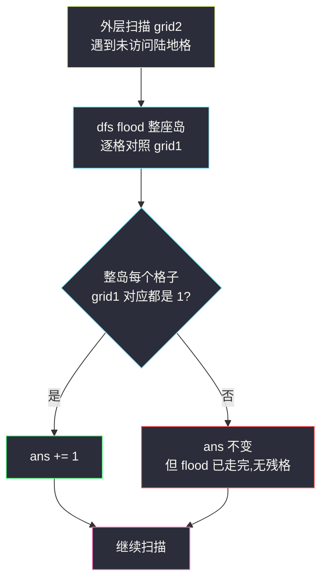
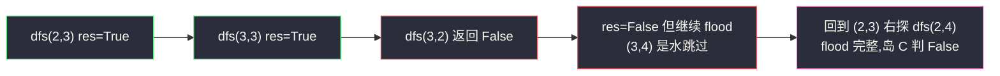

# 统计子岛屿(双网格对照 DFS · 全称量词判定)

## 一、问题描述

给你两个大小相同的 `m x n` 二进制矩阵 `grid1` 与 `grid2`,`1` 表示陆地、`0` 表示水域。**岛屿**是四方向相邻的 `1` 组成的极大连通块(同 [#200 岛屿数量](https://leetcode.cn/problems/number-of-islands/))。

如果 `grid2` 中某个岛屿的**每一个格子** `(r, c)`,在 `grid1` 的对应位置也都是陆地(即 `grid1[r][c] == 1`),则称它是 `grid1` 的**子岛屿**。注意这是「全称量词」:必须全部被覆盖,差一格都不算。

返回 `grid2` 中子岛屿的**数目**。

> 🔗 LeetCode 1905:https://leetcode.cn/problems/count-sub-islands/
>
> 数据范围:`1 <= m, n <= 500`,两矩阵同形,元素只有 `0/1`。

**示例 1**

```text
grid1:                grid2:
1 1 0 0 1             1 1 0 0 1
1 1 0 0 1             0 1 0 0 0
0 0 0 1 1             0 0 0 1 1
0 0 0 1 1             0 0 1 1 0
1 1 0 0 0             0 1 0 0 0

输出:3
```

`grid2` 共有 4 个岛屿,逐个对照 `grid1`:

| 岛屿 | 格子 | 对照 grid1 | 是否子岛屿 |
|------|------|------------|-----------|
| A | (0,0) (0,1) (1,1) | 对应位置全为 1 | ✓ |
| B | (0,4) | grid1[0][4] = 1 | ✓ |
| C | (2,3) (2,4) (3,2) (3,3) | grid1[3][2] = **0** | ✗ |
| D | (4,1) | grid1[4][1] = 1 | ✓ |

答案为 3。岛屿 C 只差 `(3,2)` 一格就不合格——全称量词的严格之处。

**示例 2**

```text
grid1 = [[1,0],[0,1]]
grid2 = [[1,1],[1,1]]
输出:0
```

`grid2` 整个是一个大岛,但 `(0,1)`、`(1,0)` 在 `grid1` 处是水,所以它不是子岛屿,答案 0。**部分覆盖不算数**。

**直观理解**

这是「flood-fill 计数」家族的双网格版:在 [#695 岛屿的最大面积](https://leetcode.cn/problems/max-area-of-island/) 的 DFS 模板上,把「数格子个数」换成「逐格对照另一张表打真假标记」。一句话:**在 grid2 上 flood,拿 grid1 当验收表。**

---

## 二、暴力解法

对 `grid2` 的**每个**陆地格,都重新 flood 它所在的整座岛并逐格对照 `grid1`,全程**不做标记**:

```python
class Solution:
    def countSubIslands(self, grid1: List[List[int]], grid2: List[List[int]]) -> int:
        m, n = len(grid1), len(grid1[0])

        def check(x: int, y: int) -> bool:     # flood 整岛并检查,不写标记
            if not (0 <= x < m and 0 <= y < n) or grid2[x][y] != 1:
                return True                    # 越界或水,视为"合格",不影响判定
            ok = grid1[x][y] == 1
            grid2[x][y] = 2                    # 临时标记,回溯时还原
            ok &= check(x + 1, y) and check(x - 1, y)
            ok &= check(x, y + 1) and check(x, y - 1)
            grid2[x][y] = 1                    # 还原,下次还能重扫
            return ok

        ans = 0
        for i in range(m):
            for j in range(n):
                if grid2[i][j] == 1:
                    if check(i, j):
                        ans += 1
        return ans
```

### 复杂度

- **时间**:`O((mn)²)`——同一个岛被它的每个格子各重扫一遍。`m = n = 500` 时约 `1.56 * 10^11` 次格子访问,严重超时。
- **空间**:`O(mn)` 递归栈(最深一条链)。

### 🔴 瓶颈在哪里

同一座岛被重复验证成千上万次。岛屿是**连通块**结构:一次 flood 就能走完整座岛,判定结果对整块成立——把「逐格重复验证」压成「每岛一次验证」即可。

---

## 三、优化探索(核心章节)

> 📚 本题出自灵茶题单一期 **§一、网格图 DFS**(网格图 DFS 进阶篇),与 #695 岛屿的最大面积同模板:DFS flood 一座岛,只是返回值从「面积」换成「bool:整岛是否被 grid1 完全覆盖」。

### 3.1 观察特征

| 特征 | 说明 |
|------|------|
| 判定对象是 grid2 的连通块 | 一次 DFS flood 整块,结果对全块生效 |
| 条件是全称量词「每个格子」 | flood 过程中逐格检查,一票否决但**不中断遍历** |
| `m, n <= 500`,共 `2.5 * 10^5` 格 | 必须 `O(mn)` 整体一遍 |

### 3.2 关键一步:DFS 返回 bool,把「验收」揉进 flood

`dfs(x, y)` 负责 flood 掉 `grid2` 中包含 `(x, y)` 的整座岛(走过的格子直接置 `0`),并返回这座岛是否为子岛屿:

```text
res = (grid1[x][y] == 1)          # 当前格在验收表上是否合格
grid2[x][y] = 0                   # 先标记,保证整块 flood 干净
对 4 个邻居:若未访问,则 res &= dfs(邻居)   # 任一邻居子树 False,res 变 False
return res
```

外层按行列扫描,遇到 `grid2` 的陆地格就调用一次 `dfs`,返回真则计数 `+1`。**每格至多进一次 DFS**,总量 `O(mn)`。

### 3.3 ⚠️ 经典坑:发现不合格后不能提前 return

直觉写法是「一旦 `grid1[x][y] == 0` 就 `return False`」——**错**!提前退出会让这座岛的剩余格子保持 `1`,外层扫描会把这些残格当成**新岛屿**重新 flood。残块对应的 `grid1` 位置可能恰好全是 1,于是被误判为子岛屿,答案偏大。

正确姿势:**真假只影响返回值,flood 必须走完整座岛**。写法上把递归调用放在 `if not dfs(...)` 里,先递归、再取反判断,天然不会短路:

```python
if not dfs(nx, ny):   # 先完成递归(邻居整棵子树 flood 完),再看真假
    res = False
```

### 3.4 反例:先挖坑再数岛?不成立

有人想到「先把 grid2 中 grid1 对应为 0 的格子置 0,再数剩下岛屿」。反例:

```text
grid1 = [[0,1],          grid2 = [[1,1],
         [1,1]]                   [1,1]]
```

大岛因 `(0,0)` 不合格应计 0;但挖掉 `(0,0)` 后剩下 `{(0,1),(1,1)}` 与 `{(1,0)}`,它们在 grid1 全 1,会被数成 2 个子岛。**挖坑会割裂连通块、制造假岛**。



### 3.5 一句话核心

> **在 grid2 上 flood、拿 grid1 验收;真假写进返回值,flood 一定要走完——提前 return 必留残格。**

---

## 四、代码实现

### Python(主解:递归 DFS)

```python
class Solution:
    def countSubIslands(self, grid1: List[List[int]], grid2: List[List[int]]) -> int:
        m, n = len(grid1), len(grid2[0])

        def dfs(x: int, y: int) -> bool:
            res = grid1[x][y] == 1        # 验收当前格
            grid2[x][y] = 0               # 先标记,整岛 flood 干净(0 即水)
            for nx, ny in ((x + 1, y), (x - 1, y), (x, y + 1), (x, y - 1)):
                if 0 <= nx < m and 0 <= ny < n and grid2[nx][ny] == 1:
                    if not dfs(nx, ny):   # 先递归,后判断,不短路
                        res = False       # 一票否决,但继续 flood
            return res

        ans = 0
        for i in range(m):
            for j in range(n):
                if grid2[i][j] == 1:      # 发现新岛
                    if dfs(i, j):
                        ans += 1
        return ans
```

**变量含义**

| 变量 | 含义 |
|------|------|
| `res` | 以 `(x, y)` 为根的整座岛是否为子岛屿 |
| `grid2[x][y] = 0` | 就地标记,免掉 visited 数组 |
| `ans` | 子岛屿计数 |

**循环不变式**:外层扫描到 `(i, j)` 时,`grid2` 中所有「行序在前的岛」已被 flood 为 0,因此 `grid2[i][j] == 1` 当且仅当它属于一座**尚未处理的岛**。

**递归深度提示**:`500 x 500` 最坏(蛇形长岛)深度 `2.5 * 10^5`,Python 需 `sys.setrecursionlimit(10 ** 6)`;更稳的提交姿势是下面的显式栈版。

### Python(变体:显式栈,防深递归)

```python
class Solution:
    def countSubIslands(self, grid1: List[List[int]], grid2: List[List[int]]) -> int:
        m, n = len(grid1), len(grid2[0])
        ans = 0
        for i in range(m):
            for j in range(n):
                if grid2[i][j] != 1:
                    continue
                ok = True
                grid2[i][j] = 0
                stack = [(i, j)]
                while stack:
                    x, y = stack.pop()
                    if grid1[x][y] != 1:          # 验收:不合格只改 ok,不中断
                        ok = False
                    for nx, ny in ((x + 1, y), (x - 1, y), (x, y + 1), (x, y - 1)):
                        if 0 <= nx < m and 0 <= ny < n and grid2[nx][ny] == 1:
                            grid2[nx][ny] = 0     # 入栈即标记
                            stack.append((nx, ny))
                ans += ok
        return ans
```

### Java(最优解环节)

```java
class Solution {
    public int countSubIslands(int[][] grid1, int[][] grid2) {
        int m = grid1.length, n = grid1[0].length, ans = 0;
        for (int i = 0; i < m; i++)
            for (int j = 0; j < n; j++)
                if (grid2[i][j] == 1 && dfs(i, j, grid1, grid2))
                    ans++;
        return ans;
    }

    private boolean dfs(int x, int y, int[][] g1, int[][] g2) {
        boolean res = g1[x][y] == 1;
        g2[x][y] = 0;
        int m = g1.length, n = g1[0].length;
        for (int[] d : new int[][]{{1, 0}, {-1, 0}, {0, 1}, {0, -1}}) {
            int nx = x + d[0], ny = y + d[1];
            if (0 <= nx && nx < m && 0 <= ny && ny < n && g2[nx][ny] == 1)
                if (!dfs(nx, ny, g1, g2))   // 先递归后判断,不短路
                    res = false;
        }
        return res;
    }
}
```

---

## 五、具体例子演示

以示例 1 走主解。外层按行扫描,依次在 `(0,0)`、`(0,4)`、`(2,3)`、`(4,1)` 触发四次 flood。

**连通分量标记矩阵**(flood 完成后,岛 A/B/C/D 的访问位置):

```text
A A . B .
. A . . B
. . . C C
. . C C .
. D . . .
```

**岛 A / B / D(合格,快进)**

| 岛 | flood 序列(下、上、右、左) | 对照结果 | 计数 |
|----|------------------------------|----------|------|
| A | (0,0) → (0,1) → (1,1) | 全 1 | ans = 1 |
| B | (0,4) | grid1[0][4] = 1 | ans = 2 |
| D | (4,1) | grid1[4][1] = 1 | ans = 4(最后一格) |

**岛 C(关键:一票否决但不中断)**

| 步 | 访问格 | grid1 对照 | 说明 |
|----|--------|-----------|------|
| ① | (2,3) | 1 ✓ | `res = True`,向下递归 |
| ② | (3,3) | 1 ✓ | `res = True`,先下后上为空,向左递归 |
| ③ | (3,2) | **0 ✗** | `res = False`;四邻已访问/是水,**返回 False** |
| 出栈 | (3,3) | — | 收到 False → `res = False`,**继续**向右试 (3,4) 是水,返回 False |
| ④ | (2,3) 的右侧 (2,4) | 1 ✓ | 局部合格返回 True,但整岛 `res` 已定 False |
| 出栈 | (2,3) | — | 返回 False,**岛 C 不计数,且 4 格已全部置 0** |

访问序号矩阵(岛 C):

```text
.  .  .  ①  ④
.  .  ③  ②  .
```

**如果第 ③ 步提前 return 会怎样?** `(2,4)` 将保持 `1`,外层扫到它时被当成新岛 `{(2,4)}`,而 `grid1[2][4] = 1` → 被误判为子岛屿,答案错成 4(正确是 3)。

**最终**:`ans = 3` ✓,与第一章逐岛对照表一致。



---

## 六、复杂度分析

| 方法 | 时间 | 空间 | 说明 |
|------|------|------|------|
| 暴力逐格重扫 | `O((mn)²)` | `O(mn)` | 同岛重复验证,超时 |
| 一次 flood 一岛(主解) | `O(mn)` | `O(mn)` | 每格至多访问一次;递归/显式栈深度最坏 `O(mn)` |

---

## 七、对比总结

**同构链**——flood-fill 家族四连,只有「DFS 返回什么」不同:

| 题 | flood 对象 | DFS 返回值 |
|----|-----------|-----------|
| #200 岛屿数量 | 单网格 | 无(计数 +1) |
| #695 岛屿的最大面积 | 单网格 | 面积(格数) |
| #3619 总价值可被 K 整除的岛屿 | 单网格带权 | 岛屿价值和 |
| #1905 本篇 | 双网格 | bool(整岛是否被 grid1 覆盖) |

**易错点**

1. **提前 return False 留残格** → 残块被当成新岛,答案偏大(见第五章演示)。
2. **「先挖坑再数岛」** 会割裂连通块制造假岛(见 3.4 反例)。
3. 标记必须写在**进入格子的第一时刻**(函数开头/入栈前),否则同一格重复入队入栈。
4. Python 深递归:极端蛇形岛深度 `2.5 * 10^5`,`setrecursionlimit` 或显式栈二选一。

**模板(对照型 flood,Python)**

```python
def dfs(x, y):                 # flood grid2 的岛,拿 grid1 验收
    res = grid1[x][y] == 1
    grid2[x][y] = 0
    for nx, ny in 四方向:
        if 界内 and grid2[nx][ny] == 1:
            if not dfs(nx, ny):
                res = False    # 一票否决,不中断
    return res
```

---

## 八、举一反三

| 题目 | 关系 |
|------|------|
| [200. 岛屿数量](https://leetcode.cn/problems/number-of-islands/) | flood 计数的鼻祖,先补它 |
| [695. 岛屿的最大面积](https://leetcode.cn/problems/max-area-of-island/) | DFS 返回 int(面积)的模板,本篇的直接前置 |
| [3619. 总价值可以被 K 整除的岛屿数目](https://leetcode.cn/problems/count-islands-with-total-value-divisible-by-k/) | 同批姊妹题 `count-islands-with-total-value-divisible-by-k.md`:返回值换成价值和 |
| [1020. 飞地的数量](https://leetcode.cn/problems/number-of-enclaves/) | flood + 边界条件判定的另一变体 |
| [1568. 使陆地分离的最少天数](https://leetcode.cn/problems/minimum-number-of-days-to-disconnect-island/) | flood 判连通的思想反过来用(割岛) |

**思想迁移**

- 「**每个元素都要满足条件**」的全称量词判定,在图遍历里的标准做法:结果写进**返回值**,用逻辑与累积,**绝不提前退出遍历**。
- 多张图对照时,通常只在**一张图**上 flood 做标记,其余图只读——标记与验收分离,互不干扰。
- 口诀:**「flood 在 grid2,验收看 grid1;真假进返回值,走完整岛再回头。」**
