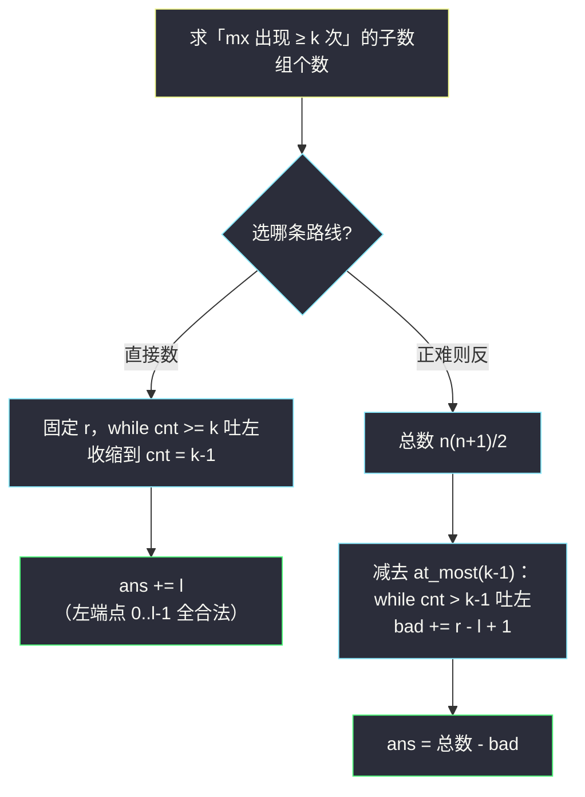
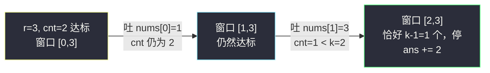

# 统计最大元素出现至少 K 次的子数组（不定长滑窗 · 固定 r 数左边）

## 一、问题描述

给你一个整数数组 `nums` 和一个正整数 `k`。设 `mx` 为 `nums` 中的**最大元素**。返回**元素中 `mx` 出现至少 `k` 次**的子数组（连续）数目。

> 🔗 LeetCode 2962：https://leetcode.cn/problems/count-subarrays-where-max-element-appears-at-least-k-times/
>
> 数据范围：`1 <= nums.length <= 10^5`，`1 <= nums[i] <= 10^6`，`1 <= k <= 10^5`。

**示例 1**

```
输入：nums = [1,3,2,3,3], k = 2
输出：6
解释：包含至少 2 个最大值 3 的子数组：
[3,2,3]、[3,2,3,3]、[1,3,2,3]、[1,3,2,3,3]、[3,3]、[2,3,3]。
```

**示例 2**

```
输入：nums = [1,4,2,1], k = 3
输出：0
解释：最大值 4 只出现 1 次，不足 k 次。
```

**直观理解**

「出现**至少** `k` 次」是一个**越长越合法**的条件：子数组越长，圈进来的 `mx` 只会更多。这与 [#1358 包含所有三种字符](https://leetcode.cn/problems/number-of-substrings-containing-all-three-characters/)（见同批题解 `number-of-substrings-containing-all-three-characters.md`）是同一个模板——**固定右端点 `r`，把窗口收缩到「恰好不合法」，左边的 `l` 个左端点全部合法**。

本题还有一条「正难则反」的备选路线：总数减去「至多 `k-1` 次」的个数，与 [#1248](https://leetcode.cn/problems/count-number-of-nice-subarrays/) 的至多套路遥相呼应。两条路线都写给大家。

---

## 二、暴力解法

先求出 `mx`，再枚举所有子数组，数一数 `mx` 出现几次。

```python
class Solution:
    def countSubarrays(self, nums: List[int], k: int) -> int:
        mx = max(nums)
        n, ans = len(nums), 0
        for i in range(n):
            cnt = 0                          # 子数组内 mx 的出现次数
            for j in range(i, n):
                if nums[j] == mx:
                    cnt += 1
                    if cnt >= k:             # 达标后，j 到末尾的右端点全合法
                        ans += n - j
                        break
        return ans
```

（同样有个小剪枝：从 `i` 出发一旦达标，更长的右端点必然继续达标，可一次加完提前 break。）

### 复杂度

- **时间**：`O(n²)`（`mx` 稀疏、`k` 大时退化为完整平方级）。
- **空间**：`O(1)`。

### 🔴 瓶颈在哪里

`n = 10^5` 时 `n² = 10^10`，远超时限。老问题：起点右移时，「窗口里有几个 `mx`」这个信息明明可以增量维护，却被暴力推倒重来。

---

## 三、优化探索（核心章节）

> 📚 本题在灵茶题单中属于 **§2.3 求子数组个数**（不定长滑动窗口 · 第三类），是「越长越合法」的计数形态。灵神（lyl）的标准写法：**枚举右端点，维护窗口内 `mx` 的出现次数 `cnt`，收缩到 `cnt < k`，累加 `l`**；另一条「正难则反」路线是用总数减「至多 k-1 次」。

### 3.1 观察特征

| 特征 | 说明 |
|------|------|
| 连续子数组 | 滑动窗口 `[l..r]` |
| 合法条件「`mx` 出现 ≥ k 次」 | 越长越合法：加元素次数不减，去元素次数不增 |
| 求合法子数组**个数** | 固定 r 数左边，或正难则反 |

### 3.2 路线一：固定 r 数左边（与 #1358 完全同款）

固定右端点 `r`：若 `[l..r]` 内有至少 `k` 个 `mx`，则左端点左移后只会更多。所以以 `r` 结尾的合法子数组的左端点是 `0..L` 一整段，`L` 为最短合法左端点，个数 `L + 1`。

维护方式：`r` 每进一个元素（若是 `mx` 则 `cnt += 1`），**只要 `cnt >= k` 仍成立就吐左**，吐到 `cnt < k` 为止。退出循环时：

- 窗口 `[l..r]` 内恰好 `k - 1` 个 `mx`（刚吐掉一个，或者从未达标）；
- 最短合法左端点是 `l - 1`，合法左端点 `0..l-1` 共 `l` 个；
- 本轮累加 `ans += l`。

### 3.3 路线二：正难则反（总数 − 至多(k−1)）

「至少 k 次」的补集是「至多 k-1 次」：

> **答案 = n(n+1)/2 − 「mx 出现至多 k−1 次的子数组个数」**

「至多」个数正是 [#1248](https://leetcode.cn/problems/count-number-of-nice-subarrays/) 里那个 `at_most` 模板：窗口非法（次数 > k-1）时收缩，每轮 `bad += r - l + 1`。



两条路线复杂度相同，直接数版的常数更小、也和 #1358 的肌肉记忆一致，**推荐主写路线一**。

### 3.4 为什么「至少」型能直接数，而「恰好」型不行？

「至少 k 次」的合法左端点连成前缀一段（窗口越短次数越少），滑窗能维护；「恰好 k 次」的合法左端点孤立不连续（见 #1248 的反例表），只能拆成两个「至多」做差。**判断形态，是这类计数题的第一步。**

### 3.5 一句话核心

> **「至少 k 次」越长越合法：收缩到窗口里只剩 k−1 个 `mx`，左端点 `0..l-1` 各成一条合法子数组，`ans += l`。**

---

## 四、代码实现

### Python（主解：路线一，固定 r 数左边）

```python
class Solution:
    def countSubarrays(self, nums: List[int], k: int) -> int:
        mx = max(nums)
        ans = cnt = l = 0
        for r, x in enumerate(nums):
            if x == mx:
                cnt += 1                      # 窗口内 mx 的出现次数
            while cnt >= k:                   # 还合法就继续吐左
                if nums[l] == mx:
                    cnt -= 1
                l += 1
            ans += l                          # 左端点 0..l-1 共 l 个合法子数组
        return ans
```

**变量含义**

| 变量 | 含义 |
|------|------|
| `mx` | 数组全局最大值（一次 `max` 预处理） |
| `cnt` | 当前窗口 `[l..r]` 内 `mx` 的出现次数 |
| `l` / `r` | 窗口左右端；while 退出时窗口内恰好 `k-1` 个 `mx` |
| `ans += l` | 以 `r` 结尾的合法子数组个数 |

**循环不变式**：每轮 while 结束时，`[l..r]` 内 `mx` 恰好出现 `k-1` 次（或从未达到过 `k` 次），而 `[l-1..r]` 内至少 `k` 次。

### Python（路线二：正难则反，总数 − 至多(k−1)）

```python
class Solution:
    def countSubarrays(self, nums: List[int], k: int) -> int:
        n, mx = len(nums), max(nums)
        ans = cnt = l = 0
        for r, x in enumerate(nums):
            if x == mx:
                cnt += 1
            while cnt > k - 1:               # 窗口内 mx 个数 > k-1 则非法
                if nums[l] == mx:
                    cnt -= 1
                l += 1
            ans += r - l + 1                  # 以 r 结尾、至多 k-1 次的个数
        return n * (n + 1) // 2 - ans         # 总数减补集
```

### Java（最优解：路线一）

```java
// 统计最大元素出现至少 K 次的子数组
// 测试链接 : https://leetcode.cn/problems/count-subarrays-where-max-element-appears-at-least-k-times/
class Solution {
    public long countSubarrays(int[] nums, int k) {
        int mx = 0;
        for (int x : nums) {
            mx = Math.max(mx, x);
        }
        long ans = 0;
        int cnt = 0;
        for (int l = 0, r = 0; r < nums.length; r++) {
            if (nums[r] == mx) {
                cnt++;
            }
            while (cnt >= k) {              // 合法就收缩，吐到 cnt = k-1
                if (nums[l] == mx) {
                    cnt--;
                }
                l++;
            }
            ans += l;                       // 左端点 0..l-1 全合法
        }
        return ans;
    }
}
```

注意：`n = 10^5` 时子数组总数可达 `n(n+1)/2 ≈ 5 * 10^9`，**超过 int 上限**，Java 必须用 `long`（Python 天然大数无此问题）。

---

## 五、具体例子演示

以 `nums = [1,3,2,3,3]`、`k = 2` 端到端走一遍路线一（`mx = 3`）。

| r | nums[r] | 进窗后 cnt | while 收缩过程 | 退出时窗口 [l, r] | ans += l | ans |
|---|---------|-----------|----------------|-------------------|----------|-----|
| 0 | 1 | 0 | 不达标，不收缩 | [0,0] | 0 | 0 |
| 1 | 3 | 1 | 不达标，不收缩 | [0,1] | 0 | 0 |
| 2 | 2 | 1 | 不达标，不收缩 | [0,2] | 0 | 0 |
| 3 | 3 | 2 | 吐 nums[0]=1（cnt 不变）→ 吐 nums[1]=3，cnt=1 | [2,3] | 2 | 2 |
| 4 | 3 | 2 | 吐 nums[2]=2（cnt 不变）→ 吐 nums[3]=3，cnt=1 | [4,4] | 4 | **6** |

核对：`r = 3` 时合法左端点 `0, 1` → 子数组 `[1,3,2,3]`、`[3,2,3]`；`r = 4` 时合法左端点 `0,1,2,3` → `[1,3,2,3,3]`、`[3,2,3,3]`、`[2,3,3]`、`[3,3]`，共 `2 + 4 = 6` ✓。

**路线二同样验证**：总数 `5 * 6 / 2 = 15`；「至多 1 次」的个数逐轮为 `1, 2, 3, 2, 1` 合计 `9`；`15 - 9 = 6` ✓。



（关键点：吐掉非 `mx` 元素时 `cnt` 不变、循环继续；只有吐到 `mx` 本身才让 `cnt` 减一。）

---

## 六、复杂度分析

| 方法 | 时间 | 空间 | 说明 |
|------|------|------|------|
| 暴力枚举 | `O(n²)` | `O(1)` | 每个起点重新数 mx |
| 路线一：直接数 | `O(n)` | `O(1)` | `l`、`r` 各至多前进 n 次 |
| 路线二：正难则反 | `O(n)` | `O(1)` | 同一趟滑窗数补集，减法收尾 |

---

## 七、对比总结

**三种条件的滑窗形态速查**

| 条件形态 | 合法左端点 | 处理方式 | 代表题 |
|----------|-----------|----------|--------|
| 恰好 k | 不连续 | 至多 − 至多 | #1248、#930 |
| 至少 k / 覆盖型 | 前缀一段 | 收缩到恰好不合法，`ans += l` | 本题、#1358 |
| 至多 k | 后缀一段 | 非法才收缩，`ans += r - l + 1` | #713、#2302 |

**易错点**

1. `mx` 是**全局最大值**，别在窗口里动态求「当前窗口最大值」——那是另一类题（需要单调队列/堆）。
2. 吐左时先判断 `nums[l] == mx` 再决定是否 `cnt -= 1`，顺序别颠倒。
3. Java 返回值是 `long`，`ans` 用 `int` 会溢出（`ans += l` 每轮累加，最大约 `n(n+1)/2`）。
4. while 条件是 `cnt >= k`（仍然合法就吐），与 #1358 的「合法就吐」一致；别照搬求最长窗口题里的「非法才收缩」。

**模板（求子数组个数 · 至少型，对齐灵神 §2.3）**

```python
ans = cnt = l = 0
for r, x in enumerate(nums):
    cnt += f(x)              # f: 命中关键元素记 1，否则 0
    while cnt >= k:          # 合法 → 收缩到恰好不合法
        cnt -= f(nums[l])
        l += 1
    ans += l                 # 左端点 0..l-1 全合法
```

---

## 八、举一反三

| 题目 | 关系 |
|------|------|
| [1358. 包含所有三种字符的子字符串数目](https://leetcode.cn/problems/number-of-substrings-containing-all-three-characters/) | **同款模板**的覆盖型版本，见同批题解 `number-of-substrings-containing-all-three-characters.md`，建议连着刷 |
| [1248. 统计「优美子数组」](https://leetcode.cn/problems/count-number-of-nice-subarrays/) | 「恰好型」对照题，至多转换，见 `count-number-of-nice-subarrays.md` |
| [930. 和相同的二元子数组](https://leetcode.cn/problems/binary-subarrays-with-sum/) | 「恰好型」同构题，见 `binary-subarrays-with-sum.md` |
| [2302. 统计得分小于 K 的子数组数目](https://leetcode.cn/problems/count-subarrays-with-score-less-than-k/) | 同小节 Hard：「求最长 + 求个数」合并的双窗口思维 |
| [992. K 个不同整数的子数组](https://leetcode.cn/problems/subarrays-with-k-different-integers/) | 「恰好 k 个不同整数」：恰好 = 至多 − 至多的经典 Hard 练习 |
| [2841. 几乎唯一子数组的最大和](https://leetcode.cn/problems/maximum-sum-of-almost-unique-subarray/) | 「至少 m 个不同元素」的求最大值变体，条件判断同源 |

**思想迁移**

- 「至少 / 覆盖 / 包含」型条件 → 窗口越长越合法 → **固定 r 收缩到恰好不合法，`ans += l`**。
- 「恰好」型别硬数，拆成两个「至多」做差；「至少」型既可以直接数也可以用总数减补集——**先判形态，再套模板**。
- 计数题答案常达平方量级，**看清题目返回类型**（int/long），Java/C++ 溢出是高频翻车点。
- 口诀：**「至少好数，破时即停；左边全体，个个入账。」**
