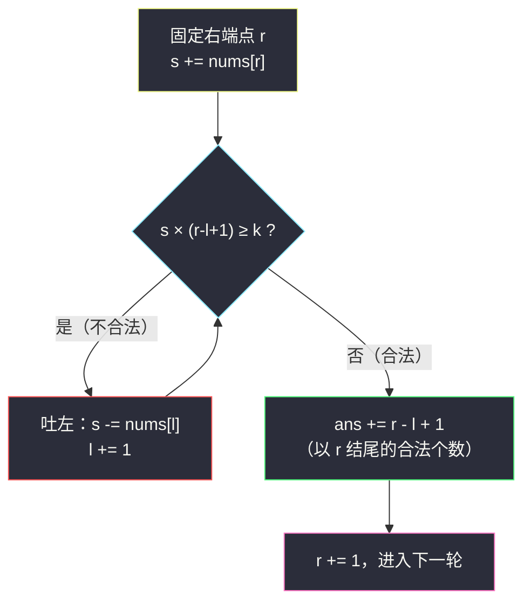
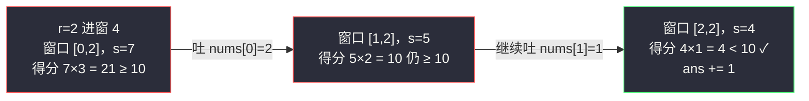

# 统计得分小于 K 的子数组数目（不定长滑窗 · 固定 r 数左边）

## 一、问题描述

给你一个正整数数组 `nums` 和一个整数 `k`，定义子数组的**得分**为：

> 得分 = （子数组的元素和）×（子数组的长度）

请你返回 `nums` 中得分**严格小于** `k` 的**非空子数组**数目。

> 🔗 LeetCode 2302：https://leetcode.cn/problems/count-subarrays-with-score-less-than-k/
>
> 数据范围：`1 <= nums.length <= 10^5`，`1 <= nums[i] <= 10^5`，`1 <= k <= 10^15`。

**示例 1**

```
输入：nums = [2,1,4,3,5], k = 10
输出：6
解释：满足条件的子数组是 [2]、[1]、[4]、[3]、[5]、[2,1]。
     其中 [2,1] 的得分 = (2+1) × 2 = 6 < 10；而 [1,4] 的得分 = 5 × 2 = 10，不满足。
```

**直观理解**

「子数组和 × 长度」这个得分有两个同时增长的因素：窗口变长，和变大、长度也变大，得分**加速膨胀**。反过来，窗口变短时得分严格缩小——这是标准的「**越短越合法**」单调性。再配合「正整数」保证元素和没有负数捣乱，不定长滑窗（灵神 §2.3 固定右端点数左边）可以直接秒杀。

---

## 二、暴力解法

枚举所有子数组，一边扩展一边累加，统计得分小于 `k` 的个数。由于元素为正，得分随扩展单调不减，可以在得分达到 `k` 时提前剪枝。

```python
class Solution:
    def countSubarrays(self, nums: List[int], k: int) -> int:
        n, ans = len(nums), 0
        for i in range(n):
            s = 0                        # 子数组 [i..j] 的元素和
            for j in range(i, n):
                s += nums[j]
                if s * (j - i + 1) < k:  # 得分 = 和 × 长度
                    ans += 1
                else:
                    break                # 正数：再扩展得分只会更大
        return ans
```

### 复杂度

- **时间**：`O(n²)`（最坏如全 `1` 且 `k` 很大，无剪枝可言）。
- **空间**：`O(1)`。

### 🔴 瓶颈在哪里

`n = 10^5` 时 `n²/2 = 5 * 10^9`，超时。每个左端点都从零累加，完全没复用「右端点固定时，合法左端点连成一段」的结构。

---

## 三、优化探索（核心章节）

> 📚 本题在灵茶题单中属于 **§2.3 求子数组个数（不定长滑动窗口 · 第三类）**。这一类的通用姿势：**固定右端点 r，数一数有多少个合法的左端点**；当「越短越合法」时，合法左端点是一段连续后缀 `[l..r]`，答案逐轮累加 `r - l + 1`。

### 3.1 单调性从哪来

得分 = 和 × 长度。固定右端点 `r`，把左端点 `l` 从 `r` 向左移动（窗口变长）：

- **和**：每纳入一个正数，`s` **严格增大**（关键：元素全为正，没有 0 原地踏步，更没有负数反向）；
- **长度**：`r - l + 1` 每步 `+1`。

两个严格正的因子同时增大，乘积严格增大 → **窗口越长越不合法（得分越大越不合法）**。于是固定 `r` 时：

- 合法的 `l` 是一段**连续后缀**（从某个 `l0` 到 `r`）；
- 该后缀的长度 `r - l0 + 1` 就是以 `r` 结尾的合法子数组个数。

### 3.2 滑窗三步（对齐灵神口径）

「越短越合法 / 求个数」的循环体：

1. **进**：`s += nums[r]`；
2. **不合法才收缩**：`while s * (r - l + 1) >= k: s -= nums[l]; l += 1`；
3. **数左边**：`ans += r - l + 1`。

**窗口会不会收缩到「空」？** 会，而且安全。比如 `nums = [100]`、`k = 50`：纳入 `100` 后得分 `100 >= 50`，`l` 一路推到 `r + 1`，窗口为空、`s = 0`，此时 `0 * 0 = 0 < k` 收缩停止，本轮贡献 `r - (r+1) + 1 = 0`——单元素都不合法时恰好计 0 个。由于 `k >= 1`，空窗口的得分恒为 `0 < k`，`while` 必然终止，不存在死循环或越界。



### 3.3 与同小节兄弟题的对齐

| 题 | 单调性来源 | 贡献 |
|----|-----------|------|
| #713 乘积小于 K 的子数组 | 正数乘积随窗口扩大不减 | `ans += r - l + 1` |
| #930 和相同的二元子数组（恰好型） | 0/1 和单调 + 恰好 = 至多 − 至多 | 两趟相减，见同目录 `binary-subarrays-with-sum.md` |
| #2302 本篇 | **正数和与长度双因子**，乘积单调 | `ans += r - l + 1` |
| #1358 包含所有三种字符 | 越长越合法（反向），数左边前缀 | `ans += l`，见同目录 `number-of-substrings-containing-all-three-characters.md` |

本题不需要「恰好 = 至多 − 至多」的转换，因为条件本身就是单向的 `< k`，直接数。

### 3.4 一句话核心

> **正整数保证「和」与「长度」同向增长，得分随窗口扩张单调膨胀；固定 r 收缩到合法，`r - l + 1` 逐轮入账。**

---

## 四、代码实现

### Python（主解：越短越合法 / 求个数）

```python
class Solution:
    def countSubarrays(self, nums: List[int], k: int) -> int:
        ans = s = l = 0
        for r, x in enumerate(nums):
            s += x                          # 进窗
            while s * (r - l + 1) >= k:     # 得分 >= k，不合法才收缩
                s -= nums[l]
                l += 1
            ans += r - l + 1                # 以 r 结尾、得分 < k 的子数组个数
        return ans
```

**变量含义**

| 变量 | 含义 |
|------|------|
| `s` | 当前窗口 `[l..r]` 的元素和 |
| `s * (r - l + 1)` | 当前窗口得分（和 × 长度） |
| `l` / `r` | 窗口左右端点，均只前进 |
| `r - l + 1` | 以 `r` 结尾的合法子数组个数（左端点取遍 `[l, r]`） |

**循环不变式**：每轮累加答案时 `s * (r - l + 1) < k`，且 `l` 是满足该条件的最大左端点（窗口最长合法）。

### Java（最优解同款写法）

```java
class Solution {
    public long countSubarrays(int[] nums, long k) {
        long ans = 0, s = 0;
        for (int l = 0, r = 0; r < nums.length; r++) {
            s += nums[r];
            while (s * (r - l + 1) >= k) {   // s ≤ 10^10，乘长度最大 10^15，long 足够
                s -= nums[l];
                l++;
            }
            ans += r - l + 1;
        }
        return ans;
    }
}
```

**溢出提醒**：`s` 最大 `10^5 * 10^5 = 10^10`，长度最大 `10^5`，乘积上界 `10^15`——超过 `int`，Java 必须 `long`；Python 天然大整数无此忧。

---

## 五、具体例子演示

以示例 1 `nums = [2,1,4,3,5]`、`k = 10` 端到端走一遍。

| r | nums[r] | 进窗后 s | 得分 s×len | 收缩动作 | 窗口 [l, r] | 得分 | 本轮 r-l+1 | ans |
|---|---------|----------|-----------|----------|-------------|------|------------|-----|
| 0 | 2 | 2 | 2×1 = 2 < 10 | 无 | [0,0] = [2] | 2 | 1 | 1 |
| 1 | 1 | 3 | 3×2 = 6 < 10 | 无 | [0,1] = [2,1] | 6 | 2 | 3 |
| 2 | 4 | 7 | 7×3 = 21 ≥ 10 | 吐 2 → s=5, l=1（5×2=10 仍 ≥）→ 吐 1 → s=4, l=2 | [2,2] = [4] | 4 | 1 | 4 |
| 3 | 3 | 7 | 7×2 = 14 ≥ 10 | 吐 4 → s=3, l=3 | [3,3] = [3] | 3 | 1 | 5 |
| 4 | 5 | 8 | 8×2 = 16 ≥ 10 | 吐 3 → s=5, l=4 | [4,4] = [5] | 5 | 1 | **6** ✓ |

逐轮核对累加的含义：`r = 1` 时窗口 `[2,1]` 合法，同时它的后缀 `[1]` 也合法，共 2 个；`r = 2` 时收缩连吐两个（`[2,1,4]`、`[1,4]` 都不合法，恰好停在 `[4]`），只计 1 个。总计 `1 + 2 + 1 + 1 + 1 = 6`，与枚举 `[2]、[1]、[4]、[3]、[5]、[2,1]` 完全一致 ✓。



（上图：`r = 2` 一轮内的连续收缩——注意 `[1,4]` 得分恰好等于 `k=10` 也不算，条件是**严格小于**。）

**再看一个窗口收缩到空的例子**：`nums = [100000]`、`k = 1`。进窗后 `s = 100000`，得分 `100000 ≥ 1`，`l` 一路推到 `1`，窗口变空、`s = 0`，本轮贡献 `r - l + 1 = 0 - 1 + 1 = 0`，答案 `0` ✓（单元素得分 `10^5` 不小于 `k = 1`，本就不该计入）。

---

## 六、复杂度分析

| 方法 | 时间 | 空间 | 说明 |
|------|------|------|------|
| 暴力枚举 | `O(n²)` | `O(1)` | 每个左端点重新累加 |
| 不定长滑窗 | `O(n)` | `O(1)` | `l`、`r` 各至多前进 `n` 次，其余全是 `O(1)` 运算 |

---

## 七、对比总结

**§2.3 「求子数组个数」速查**

| 形态 | 判断方向 | 贡献式 | 代表 |
|------|----------|--------|------|
| 越短越合法（本篇） | 固定 `r` 收缩到合法 | `ans += r - l + 1` | #713、#2302 |
| 越长越合法 | 固定 `r` 收缩到恰好合法 | `ans += l` | #1358，见 `number-of-substrings-containing-all-three-characters.md` |
| 恰好型 | 转换：恰好 = 至多 − 至多 | 两趟相减 | #930，见 `binary-subarrays-with-sum.md`；#1248 见 `count-number-of-nice-subarrays.md` |
| 至少型 | 越长越合法，数前缀 | `ans += l` | #2962，见 `count-subarrays-where-max-element-appears-at-least-k-times.md` |

**易错点**

1. **严格小于**：`>= k` 就收缩，等于 `k` 不算答案（示例 1 里 `[1,4]` 得分恰好 10 被排除）。
2. **别怕窗口收缩到空**：`l` 可以到 `r + 1`，此时 `s = 0`、贡献 `0`，逻辑自洽。
3. **Java 溢出**：`s * (r - l + 1)` 上界 `10^15`，必须 `long`。
4. 本解法**依赖元素为正**：若含 0（不影响单调性，0 只是和不变）尚可，含负数则得分不再单调，滑窗失效。
5. 收缩条件里现算 `s * (r - l + 1)` 即可，无需额外维护「得分」变量——长度是免费信息。

**模板（越短越合法求个数，Python 版）**

```python
ans = s = l = 0
for r, x in enumerate(nums):
    s += x
    while s * (r - l + 1) >= k:   # 换成你的不合法条件
        s -= nums[l]
        l += 1
    ans += r - l + 1
```

---

## 八、举一反三

| 题目 | 关系 |
|------|------|
| [713. 乘积小于 K 的子数组](https://leetcode.cn/problems/subarray-product-less-than-k/) | 同款「正数 + 固定 r 数左边」，把得分换成乘积 |
| [930. 和相同的二元子数组](https://leetcode.cn/problems/binary-subarrays-with-sum/) | §2.3 恰好型（至多 − 至多），见同目录 `binary-subarrays-with-sum.md` |
| [1358. 包含所有三种字符的子字符串数目](https://leetcode.cn/problems/number-of-substrings-containing-all-three-characters/) | 反方向「越长越合法」，贡献 `ans += l`，见同目录 `number-of-substrings-containing-all-three-characters.md` |
| [2962. 统计最大元素出现至少 K 次的子数组](https://leetcode.cn/problems/count-subarrays-where-max-element-appears-at-least-k-times/) | 「至少」形态，见同目录 `count-subarrays-where-max-element-appears-at-least-k-times.md` |
| [2762. 不间断子数组](https://leetcode.cn/problems/continuous-subarrays/) | 「max − min ≤ 限制」的至多型计数，结合单调队列/有序集合 |

**思想迁移**

- 得分、代价、惩罚凡是「窗口越长越大」的量，都可以问一句：**能否固定 r 数左边？**
- 两个单调因子相乘仍是单调的——本题的「和 × 长度」是「复合单调性」的最小样本。
- 口诀：**「和乘长度双膨胀，收缩直到小于 k；左边逐个来入账，r 减 l 再加一。」**
