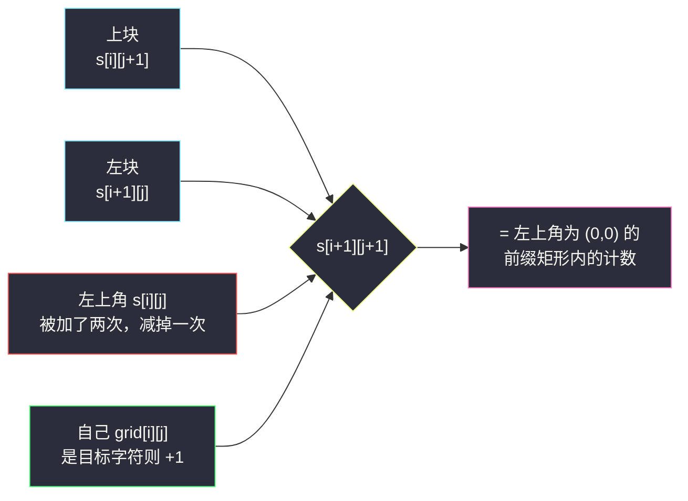
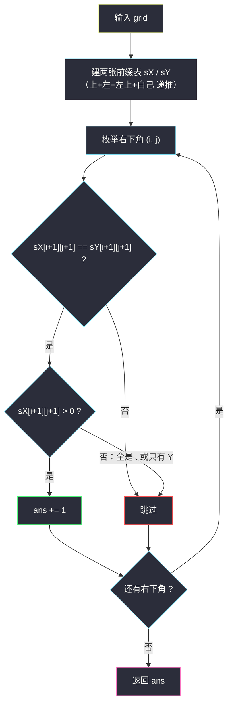

# 统计 X 和 Y 频数相等的子矩阵数量（二维前缀和）

## 一、问题描述

给你一个二维字符矩阵 `grid`，元素为 `'X'`、`'Y'` 或 `'.'`。统计同时满足以下全部条件的**子矩阵**（矩形区域）的数量：

1. 包含 `grid[0][0]`（左上角单元格）；
2. 子矩阵中 `'X'` 与 `'Y'` 的**频数相等**；
3. 至少包含一个 `'X'`。

**示例 1**

```
输入：grid = [["X","Y","."],
             ["Y",".","."]]
输出：3
解释：满足条件的是右下角分别为 (0,1)、(0,2)、(1,0) 的三个前缀矩形。
```

**示例 2**

```
输入：grid = [["X","X"],
             ["X","Y"]]
输出：0
```

**示例 3**

```
输入：grid = [[".","."],
             [".","."]]
输出：0     // 频数处处相等（都是 0），但一个 X 都没有
```

> 🔗 LeetCode 3212：https://leetcode.cn/problems/count-submatrices-with-equal-frequency-of-x-and-y/
>
> 数据范围：`1 <= n, m <= 1000`。

**直观理解**：条件 1 是本题最大的「减负」——要求包含左上角 `(0,0)` 的矩形，左上角就被**锁死**了，每个子矩阵只剩一个自由度（右下角）。剩下的问题变成：对每个右下角，`O(1)` 读出「从 (0,0) 到这里的 X 数、Y 数」——这正是二维前缀和的主场。

---

## 二、暴力解法

先利用条件 1 把候选收敛到「以 `(0,0)` 为左上角、右下角 `(i, j)` 任取」的 `n x m` 个矩形，然后对每个候选重新数一遍格子：

```python
class Solution:
    def numberOfSubmatrices(self, grid: List[List[str]]) -> int:
        n, m = len(grid), len(grid[0])
        ans = 0
        for i in range(n):                 # 右下角行
            for j in range(m):             # 右下角列
                cx = cy = 0
                for r in range(i + 1):     # 重扫整个前缀矩形
                    for c in range(j + 1):
                        if grid[r][c] == 'X':
                            cx += 1
                        elif grid[r][c] == 'Y':
                            cy += 1
                if cx == cy and cx > 0:
                    ans += 1
        return ans
```

### 复杂度

- **时间**：`O(n²m²)`——`nm` 个候选 × 每个重扫 `O(nm)`；`1000 * 1000 = 10^6` 个候选、每个最多 `10^6` 步，总数 `10^12`，必然超时。
- **空间**：`O(1)`。

### 🔴 瓶颈在哪里

候选 `(i, j)` 与候选 `(i, j-1)` 的前缀矩形只差一列格子，暴力却每次从头数起。注意到**所有候选的统计量都是从 `(0,0)` 出发逐格累加出来的**——每个格子的贡献会被它右下方向的所有候选重复消费。这就是前缀和登场的标准信号：**把「从头数」换成「查表」**。

---

## 三、优化探索（核心章节）

> 📚 本题在灵茶题单中属于 **§1.6 二维前缀和**。讲法对齐灵神模板：建 `(n+1) x (m+1)` 的表、下标整体偏移一位，用「上 + 左 − 左上 + 自己」递推，边界天然为 0，不需要特判。

### 3.1 关键观察：子矩阵由右下角唯一确定

矩形是连续区域，要包含 `(0,0)`，左上角 `(r1, c1)` 必须满足 `r1 <= 0` 且 `c1 <= 0`，即**只能是 `(0,0)` 本身**。

于是子矩阵 ⇔ 前缀矩形 `[0..i] x [0..j]` ⇔ 右下角 `(i, j)`，候选只有 `nm` 个（本题 `10^6` 个）。这一步把「任意子矩阵的 `O(n²m²)` 搜索空间」直接砍到线性规模。

### 3.2 二维前缀和：`O(1)` 读出前缀矩形里的 X 数 / Y 数

分别给 `X` 和 `Y` 建一张前缀计数表（灵神模板，下标从 1 开始，`s[0][*] = s[*][0] = 0` 是天然的虚拟边界）：



```
sX[i+1][j+1] = sX[i][j+1] + sX[i+1][j] - sX[i][j] + (grid[i][j] == 'X')
sY[i+1][j+1] = sY[i][j+1] + sY[i+1][j] - sY[i][j] + (grid[i][j] == 'Y')
```

> 容斥口诀：**竖着一刀、横着一刀，交叉处被数了两遍，补一个减号；最后加上自己这一格**。建两张表而不是一张，是因为 X 与 Y 的计数互相独立、判定要同时看两者——若只维护差值 `sX - sY`，还得额外带一张「是否出现过 X」，反而绕。

### 3.3 判定条件：相等，且不是「都为零」

右下角 `(i, j)` 对应的子矩阵合法 ⇔

```
sX[i+1][j+1] == sY[i+1][j+1]  且  sX[i+1][j+1] > 0
```

第二个条件**不能省**：全 `'.'` 或只有 `'Y'` 的前缀矩形，两张表都是 0，「相等」照样成立——示例 3 的输出 0 就是在提醒这件事。

### 3.4 整体流程



### 3.5 一句话核心

> **左上角被条件 1 锁死，`nm` 个前缀矩形各自只差一次 `O(1)` 查表：`sX == sY` 且 `sX > 0`。**

---

## 四、代码实现

### Python（主解：两张二维前缀表，对齐灵神模板）

```python
class Solution:
    def numberOfSubmatrices(self, grid: List[List[str]]) -> int:
        n, m = len(grid), len(grid[0])
        sX = [[0] * (m + 1) for _ in range(n + 1)]   # 前缀矩形内 X 的个数
        sY = [[0] * (m + 1) for _ in range(n + 1)]   # 前缀矩形内 Y 的个数
        for i, row in enumerate(grid):
            for j, ch in enumerate(row):
                sX[i + 1][j + 1] = (sX[i][j + 1] + sX[i + 1][j]
                                    - sX[i][j] + (1 if ch == 'X' else 0))
                sY[i + 1][j + 1] = (sY[i][j + 1] + sY[i + 1][j]
                                    - sY[i][j] + (1 if ch == 'Y' else 0))

        ans = 0
        for i in range(n):                    # 枚举右下角
            for j in range(m):
                a = sX[i + 1][j + 1]
                if a == sY[i + 1][j + 1] and a > 0:
                    ans += 1
        return ans
```

**变量含义**

| 变量 | 含义 |
|------|------|
| `sX[i+1][j+1]` | 前缀矩形 `[0..i] x [0..j]` 中 `'X'` 的个数 |
| `sY[i+1][j+1]` | 同一矩形中 `'Y'` 的个数 |
| 第 0 行 / 第 0 列 | 虚拟边界，恒为 0，免去 `i-1`、`j-1` 的越界特判 |

### Python（进阶：滚动数组压到 `O(m)` 空间）

递推时其实只用到「上一行末的值 + 本行行内前缀」，两行可以并成一行：

```python
class Solution:
    def numberOfSubmatrices(self, grid: List[List[str]]) -> int:
        m = len(grid[0])
        rX = [0] * (m + 1)          # 逐行滚动的前缀 X 计数
        rY = [0] * (m + 1)
        ans = 0
        for row in grid:
            rowX = rowY = 0         # 本行行内前缀
            for j, ch in enumerate(row):
                if ch == 'X':
                    rowX += 1
                elif ch == 'Y':
                    rowY += 1
                rX[j + 1] += rowX   # 上一行末 + 本行行内前缀
                rY[j + 1] += rowY
                if rX[j + 1] == rY[j + 1] and rX[j + 1] > 0:
                    ans += 1
        return ans
```

### Java（可选：与主解同构）

主解的 Python 代码已完整覆盖逻辑；若需 Java，把两张 `int[n+1][m+1]` 表与双重循环逐行翻译即可（`(grid[i][j] == 'X' ? 1 : 0)` 对应 `(1 if ch == 'X' else 0)`），结构与变量含义完全同上，不再赘述。

---

## 五、具体例子演示

以示例 1 端到端走一遍：`grid = [["X","Y","."],["Y",".","."]]`（`n = 2, m = 3`）。

**第一步：递推 `sX`（含虚拟的第 0 行 / 第 0 列）**

| 步 | `(i, j)` | 字符 | 递推：上 + 左 − 左上 + 自己 | `sX[i+1][j+1]` |
|----|----------|------|------------------------------|-----------------|
| 1 | (0,0) | X | `0 + 0 − 0 + 1` | 1 |
| 2 | (0,1) | Y | `0 + 1 − 0 + 0` | 1 |
| 3 | (0,2) | . | `0 + 1 − 0 + 0` | 1 |
| 4 | (1,0) | Y | `1 + 0 − 0 + 0` | 1 |
| 5 | (1,1) | . | `1 + 1 − 0 + 0` | 1 |
| 6 | (1,2) | . | `1 + 1 − 0 + 0` | 1 |

**第二步：递推 `sY`（同一套公式）**

| 步 | `(i, j)` | 字符 | 递推：上 + 左 − 左上 + 自己 | `sY[i+1][j+1]` |
|----|----------|------|------------------------------|-----------------|
| 1 | (0,0) | X | `0 + 0 − 0 + 0` | 0 |
| 2 | (0,1) | Y | `0 + 0 − 0 + 1` | 1 |
| 3 | (0,2) | . | `0 + 1 − 0 + 0` | 1 |
| 4 | (1,0) | Y | `0 + 0 − 0 + 1` | 1 |
| 5 | (1,1) | . | `1 + 1 − 0 + 0` | 2 |
| 6 | (1,2) | . | `1 + 2 − 1 + 0` | 2 |

注意第 6 步：左上角 `sY[1][2] = 1` 被上、左两块**重复计入**，必须减掉——这正是容斥的意义所在。递推完成后两张表长这样（去掉虚拟行列）：

```
sX:  1 1 1        sY:  0 1 1
     1 1 1             1 2 2
```

**第三步：枚举右下角逐格判定**

| 右下角 `(i, j)` | 子矩阵 | `sX` | `sY` | 相等? | `sX > 0`? | 计入 |
|-----------------|--------|------|------|-------|-----------|------|
| (0,0) | `X` | 1 | 0 | ✗ | ✓ | ✗ |
| (0,1) | `XY` | 1 | 1 | ✓ | ✓ | ✓ |
| (0,2) | `XY.` | 1 | 1 | ✓ | ✓ | ✓ |
| (1,0) | `X / Y` | 1 | 1 | ✓ | ✓ | ✓ |
| (1,1) | 2x2 | 1 | 2 | ✗ | ✓ | ✗ |
| (1,2) | 全图 | 1 | 2 | ✗ | ✓ | ✗ |

**输出：3** ✓。

**特判演示（示例 3）**：`grid` 全 `'.'` 时两张表处处相等且处处为 0，第二个条件 `sX > 0` 把所有右下角全部拦下，输出 **0** ✓——「相等」与「非空」是两个独立条件，缺一不可。

---

## 六、复杂度分析

| 方法 | 时间 | 空间 |
|------|------|------|
| 暴力重扫 | `O(n²m²) = 10^12`，超时 | `O(1)` |
| 二维前缀和 | `O(nm) = 10^6` | `O(nm)` |
| 二维前缀和 + 滚动数组 | `O(nm)` | `O(m)` |

递推与判定各扫一遍矩阵，每格都是常数次加减；`1000 x 1000` 的规模下约两百万次基本操作，毫无压力。

---

## 七、对比总结

**§1.6 家族对照**

| 题 | 前缀和统计什么 | 判定什么 |
|----|----------------|----------|
| #3212 本篇 | X 数、Y 数两张表 | 两表相等且 X 数为正 |
| #303 / #304 区域和检索 | 元素和 | 区间和查询（模板题） |
| #1314 矩阵区域和 | 元素和 | 方形窗口和（查询任意子矩形） |
| #1738 异或坐标值 | 前缀异或 | 排序取第 K 大 |

**易错点**

1. **`sX > 0` 这个条件最容易丢**：频数「相等」在双方都是 0 时也成立，示例 3 专门卡这一点。
2. **别枚举任意子矩阵**：条件「包含 `grid[0][0]`」把左上角锁死在 `(0,0)`，误用 `(n²m²)` 枚举既超时也无必要。
3. **容斥符号**：`+ 上 + 左 − 左上 + 自己`，漏掉减号会让重复覆盖的区域被数两遍。
4. **虚拟边界的妙用**：表开成 `(n+1) x (m+1)`、下标整体 +1，第 0 行列恒 0，`i-1`、`j-1` 永不越界——灵神模板的标配写法。
5. 滚动数组版里 `rX[j+1] += rowX` 依赖「旧值恰是上一行末的前缀」，先算行内前缀再原地覆盖，顺序不能反。

---

## 八、举一反三

| 题目 | 关系 |
|------|------|
| [303. 区域和检索 - 数组不可变](https://leetcode.cn/problems/range-sum-query-immutable/) | 一维前缀和模板题，本题的地基 |
| [304. 二维区域和检索 - 矩阵不可变](https://leetcode.cn/problems/range-sum-query-2d-immutable/) | 二维前缀和 + 容斥查询的模板题 |
| [1314. 矩阵区域和](https://leetcode.cn/problems/matrix-block-sum/) | 查询从「前缀矩形」放开到「任意子矩形」，同一张表的两次容斥 |
| [1074. 元素和为目标值的子矩阵数量](https://leetcode.cn/problems/number-of-submatrices-that-sum-to-target/) | 进阶：任意子矩阵 + 前缀和 + 哈希计数，本题去掉限制 1 后的完全体 |
| [2536. 子矩阵元素加 1](https://leetcode.cn/problems/increment-submatrices-by-one/) | 同目录姊妹篇：二维差分（前缀和的逆运算），见 `increment-submatrices-by-one.md` |
| [1738. 找出第 K 大的异或坐标值](https://leetcode.cn/problems/find-kth-largest-xor-coordinate-value.md/) | 同目录姊妹篇：二维前缀和的异或版，见 `find-kth-largest-xor-coordinate-value.md` |
| [3933. 矩阵中的局部最大值 II](https://leetcode.cn/problems/largest-local-values-in-a-matrix-ii/) | 本批（灵茶一期第 9 批 C 路）姊妹篇：矩阵计数换成树状数组在线版，见 `largest-local-values-in-a-matrix-ii.md` |

**思想迁移**

- 看到「包含某个固定格子」的限制，先想它能砍掉多少枚举自由度——本题直接把子矩阵数量从平方级砍到线性。
- 两张前缀表并列（`sX` / `sY`）是「频数配平」类题的通用套路；若配平的量更多（三种字符），照样各建一张，判定取交集。
- 前缀和的本质是**用 `O(nm)` 的预处理换 `O(1)` 的查询**；只要候选查询次数是「满矩阵」量级，这笔交换就稳赚。
- 口诀：**「左上锁死原点，右下走遍全场；两表同式递推，相等还须有 X。」**
