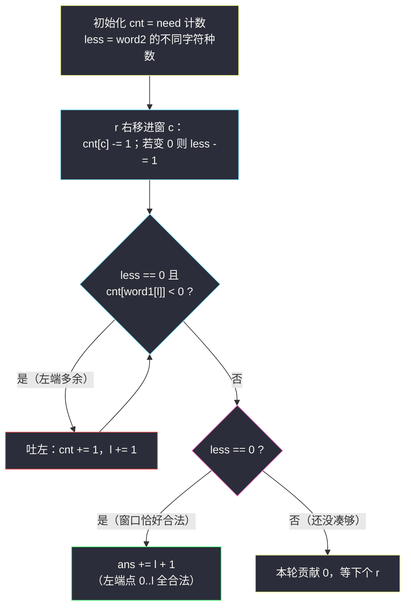
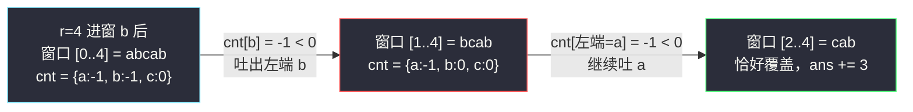

# 统计重新排列后包含另一个字符串的子字符串数目 II（不定长滑窗 · 越长越合法 + less 计数）

## 一、问题描述

给你两个字符串 `word1` 和 `word2`。如果 `word1` 的一个子串 `s` 满足：将 `s` 重新排列后，`word2` 是它的**前缀**，那么称 `s` 是「合法」的。

请你返回 `word1` 中合法子串的**数目**。

> 「重排后 word2 是前缀」等价于：`s` 包含 `word2` 的所有字符且**每种字符的出现次数不少于** `word2` 中该字符的次数（多重集包含）。前缀长度只占 `|word2|`，`s` 只要比它长即可，所以唯一的硬性要求就是字符多重集覆盖。

> 🔗 LeetCode 3298：https://leetcode.cn/problems/count-substrings-that-can-be-rearranged-to-contain-a-string-ii/
>
> 数据范围：`1 <= word1.length <= 10^6`，`1 <= word2.length <= 10^4`，两串均只含小写字母；`word1`、`word2` 都可能含重复字符。注意答案可达约 `5 * 10^11`，需 64 位整数（Java 用 `long`）。

**示例 1**

```
输入：word1 = "bcca", word2 = "abc"
输出：1
解释：唯一合法的子串是整个 "bcca"：重排成 "abcc"，前缀 "abc" ✓。
     例如 "bcc" 只有 1 个 c，凑不出 "abc"。
```

**示例 2**

```
输入：word1 = "abcabc", word2 = "abc"
输出：10
解释：所有长度 ≥ 3 且覆盖 {a:1, b:1, c:1} 的子串都合法，共 10 个。
```

**直观理解**

「覆盖另一串的字符多重集」是典型的**越长越合法**条件：窗口越大，攒下的字符只多不少。于是按灵神 §2.3 的姿势**固定右端点 `r` 数左边**——与 [#1358 包含所有三种字符](https://leetcode.cn/problems/number-of-substrings-containing-all-three-characters/)（见同目录 `number-of-substrings-containing-all-three-characters.md`）同一副骨架，只是「每种字符至少 1 个」升级为「每种字符至少 `need[c]` 个」。本题作为 #3297（I 版）的加强版，数据规模放大到 `10^6`，逐字母扫 26 个桶的判断方式不再从容，需要 **less（未凑够的种类数）** 技巧把每步判断压到 `O(1)`。

---

## 二、暴力解法

枚举 `word1` 的所有子串，用计数数组逐个验证是否覆盖 `word2`。

```python
class Solution:
    def validSubstringCount(self, word1: str, word2: str) -> int:
        need = Counter(word2)
        n, ans = len(word1), 0
        for i in range(n):
            cnt = Counter()                     # 子串 [i..j] 的字符计数
            for j in range(i, n):
                cnt[word1[j]] += 1
                if all(cnt[c] >= need[c] for c in need):
                    ans += 1                    # 覆盖成立即合法
        return ans
```

### 复杂度

- **时间**：`O(n² · |Σ|)`（每个子串结束位置都要验一遍计数，`|Σ| <= 26` 种字符）。
- **空间**：`O(|Σ|)`。

### 🔴 瓶颈在哪里

`n = 10^6` 时连 `O(n²)` 的枚举本身都不可行。而且每一步都在「重新验证合法性」，没有利用两个关键结构：**右端点推进时计数只需增量更新**、**合法左端点随 r 增大单调右移**。

---

## 三、优化探索（核心章节）

> 📚 本题在灵茶题单中属于 **§2.3 求子数组个数（不定长滑动窗口 · 第三类）**，是「越长越合法 / 数左边」的形态：固定右端点 `r`，把左端点收缩到**恰好合法**的位置 `l`，则左端点取 `0..l` 的子串全部合法，每轮 `ans += l + 1`。

### 3.1 题意化简：多重集包含

「重排后 `word2` 是前缀」⟺ `s` 的某种排列以 `word2` 的某个排列开头 ⟺ `s` 的字符多重集 ⊇ `word2` 的字符多重集。证明两个方向都显然：能排出这样的前缀说明字符够用；字符够用就先把 `word2` 的字符排前面、剩下的垫后。

于是合法条件完全与「顺序」无关，只看窗口内每种字符的计数——这就是滑动窗口的地盘。

### 3.2 单调性与「数左边」

窗口 `[l..r]` 扩张（`l` 左移或 `r` 右移）只会让计数变大：

- 固定 `r`，若 `[l..r]` 合法，则 `[l-1..r]`、`[l-2..r]`…… 全部合法（多拿字符不亏）；
- 所以合法左端点是一段**前缀 `[0..lmax]`**，本轮贡献 `lmax + 1`；
- `r` 右移后阈值只会更宽松，`lmax` **单调不减**——左端点指针不回头，总移动量 `O(n)`。

「收缩到恰好合法」：在合法的前提下，能吐就吐（吐出后仍合法就继续），停下来的 `l` 正是 `lmax`。

### 3.3 less 技巧：O(1) 判断「窗口是否覆盖」

朴素判断要扫 26 个桶（`O(|Σ|)`）。维护一个整数代替整次扫描：

> `cnt[c]` = `need[c]` −（窗口内 `c` 的个数），即「窗口里 `c` 还差几个」；
> **`less` = 满足 `cnt[c] > 0` 的字符种类数**（还没凑够的种类数）。
>
> **`less == 0` ⟺ 窗口合法。**

进窗一个 `c`：`cnt[c] -= 1`；若 `cnt[c]` 恰好变成 `0`，说明 `c` 刚刚凑够，`less -= 1`。
吐出一个 `x`：`cnt[x] += 1`；若 `cnt[x]` 变成 `1`，说明 `x` 变回欠缺，`less += 1`（本题用「能吐才吐」的条件规避了这步：见下）。

**收缩条件一步到位**：合法时，吐出 `word1[l] = x` 后仍合法 ⟺ 吐前 `cnt[x] < 0`（窗口里 `x` 比需求多出至少 1 个）。于是：

```python
while less == 0 and cnt[word1[l]] < 0:   # 左端是多余字符，吐了仍合法
    cnt[word1[l]] += 1
    l += 1
```

这是 #76 最小覆盖子串同款的「`less`/`kind` 计数」技巧，判断、收缩全是 `O(1)`。



### 3.4 为什么 II 版必须这么写

I 版（#3297）`word1` 长度至多 `10^5`，每步扫 26 个桶的 `O(26·n)` 写法约 `2.6 * 10^6` 次操作，轻松通过。II 版把 `word1` 放大到 `10^6` 且内存限制收紧，逐桶扫描与额外统计数组的做法都变得不稳；`less` 技巧让**每次窗口移动只碰 1 个桶、判断只看 1 个整数**，整体 `O(n + m)` 时间、`O(|Σ|)` 额外空间，是本题的标准姿势。

### 3.5 一句话核心

> **「重排成前缀」=「多重集覆盖」=「越长越合法」；固定 r 收缩到恰好合法，less 归零即合法，答案逐轮 `+= l + 1`。**

---

## 四、代码实现

### Python（主解：滑窗 + less 计数）

```python
class Solution:
    def validSubstringCount(self, word1: str, word2: str) -> int:
        if len(word1) < len(word2):
            return 0
        cnt = Counter(word2)          # cnt[c] = 窗口内 c 还差几个才能凑够 need[c]
        less = len(cnt)               # 未凑够的字符种类数（less == 0 即合法）
        ans = l = 0
        for r, c in enumerate(word1):
            cnt[c] -= 1               # 窗口多了一个 c，缺口减一
            if cnt[c] == 0:           # 恰好从「缺」变「够」
                less -= 1
            while less == 0 and cnt[word1[l]] < 0:   # 左端是多余字符，吐了仍合法
                cnt[word1[l]] += 1
                l += 1
            if less == 0:             # 窗口 [l..r] 恰好是最小合法窗口
                ans += l + 1          # 左端点取 0..l 的子串全部合法
        return ans
```

**变量含义**

| 变量 | 含义 |
|------|------|
| `cnt[c]` | `need[c]` − 窗口内 `c` 的个数；负数 = 富余，`0` = 恰好，正数 = 欠缺 |
| `less` | 尚未凑够（`cnt[c] > 0`）的字符种类数，`0` ⟺ 窗口覆盖 `word2` |
| `cnt[word1[l]] < 0` | 左端字符是富余的，吐掉后窗口仍合法 |
| `l + 1` | 以 `r` 结尾的合法子串个数（左端点 `0..l`） |

**循环不变式**：每轮结束（若合法）时，`[l..r]` 是以 `r` 结尾的**最短**合法子串，`l` 为最大合法左端点。

### Java（最优解同款写法）

```java
class Solution {
    public long validSubstringCount(String word1, String word2) {
        if (word1.length() < word2.length()) {
            return 0;
        }
        int[] cnt = new int[26];
        int less = 0;
        for (char b : word2.toCharArray()) {
            if (cnt[b - 'a'] == 0) {
                less++;                       // 新出现一种待凑字符
            }
            cnt[b - 'a']++;
        }
        long ans = 0;
        char[] s = word1.toCharArray();
        int l = 0;
        for (int r = 0; r < s.length; r++) {
            if (--cnt[s[r] - 'a'] == 0) {     // 缺口归零：该字符恰好凑够
                less--;
            }
            while (less == 0 && cnt[s[l] - 'a'] < 0) {   // 左端富余，吐掉仍合法
                cnt[s[l] - 'a']++;
                l++;
            }
            if (less == 0) {
                ans += l + 1;
            }
        }
        return ans;
    }
}
```

**溢出提醒**：`n = 10^6` 时答案上界约 `n(n+1)/2 ≈ 5 * 10^11`，超出 `int`，返回 `long`；`10^6` 长度的字符串在 Java 里建议 `toCharArray()` 后按下标访问，避免反复 `charAt`。

---

## 五、具体例子演示

以示例 2 `word1 = "abcabc"`、`word2 = "abc"` 端到端走一遍。`need = {a:1, b:1, c:1}`，初始 `less = 3`。

| r | 进窗 c | cnt 变化 | less | 收缩动作 | l | 本轮 l+1 | ans |
|---|--------|----------|------|----------|---|----------|-----|
| 0 | a | cnt[a]: 1→0 | 2 | 未合法，不收缩 | 0 | 0 | 0 |
| 1 | b | cnt[b]: 1→0 | 1 | 未合法 | 0 | 0 | 0 |
| 2 | c | cnt[c]: 1→0 | 0 | cnt[a]=0 不 < 0，不吐 | 0 | **1** | 1 |
| 3 | a | cnt[a]: 0→-1 | 0 | cnt[a]=-1 < 0 → 吐 a（l=1）；cnt[b]=0 停 | 1 | **2** | 3 |
| 4 | b | cnt[b]: 0→-1 | 0 | cnt[b]=-1 < 0 → 吐 b（l=2）；cnt[c]=0 停 | 2 | **3** | 6 |
| 5 | c | cnt[c]: 0→-1 | 0 | cnt[c]=-1 < 0 → 吐 c（l=3）；l=3=r 停 | 3 | **4** | **10** ✓ |

读懂 `r = 3` 这一行：进窗第二个 `a` 后窗口是 `[0..3] = "abca"`，`a` 富余 1 个（`cnt[a] = -1`），于是吐出开头的 `a`，窗口缩成 `[1..3] = "bca"`——仍覆盖 `{a,b,c}` 各 1 个，且再吐 `b` 就会缺 `b`（`cnt[b] = 0` 不小于 0，条件不满足）。最大合法左端点是 `1`，所以左端点 `0`、`1` 的两个子串 `"abca"`、`"bca"` 都计入。✓

**示例 1 快速核对**：`word1 = "bcca"`、`word2 = "abc"`。`r = 0,1` 进 `b, c` 后 `less = 1`；`r = 2` 再进 `c`（`cnt[c] = -1`，`less` 不变仍 1）；`r = 3` 进 `a` 后 `less = 0`，此时 `cnt[b] = 0`、`cnt[c] = -1`：左端是 `b`，`cnt[b] = 0` 不 < 0，不能吐——`l = 0`，`ans += 1`。总答案 `1` ✓（唯一合法子串就是整个 `"bcca"`）。



（上图：`r = 4` 一轮内的收缩——每吐一个都要重新看新的左端字符是否仍富余。）

---

## 六、复杂度分析

| 方法 | 时间 | 空间 | 说明 |
|------|------|------|------|
| 暴力枚举验证 | `O(n² · \|Σ\|)` | `O(\|Σ\|)` | 每个子串重新验证 |
| 滑窗 + less | `O(n + m)` | `O(\|Σ\|)` | `l`、`r` 各至多前进 `n` 次，每步只碰 1 个桶 |

（`|Σ| = 26`；`m = |word2|` 用于初始化计数。）

---

## 七、对比总结

**同骨架三兄弟（固定 r 数左边）**

| 题 | 合法条件 | 贡献 | 判断成本 |
|----|----------|------|----------|
| #1358 包含所有三种字符 | a、b、c 各 ≥ 1 | `ans += l`（1-indexed 感） | 3 个计数 |
| #3297 / #3298 本篇 | 每种字符 ≥ `need[c]` | `ans += l + 1`（0-indexed） | `less` 一发入魂 |
| #76 最小覆盖子串 | 同上（求最短而非计数） | 收缩时更新最短 | 同款 `less`/`kind` |

**易错点**

1. **贡献是 `l + 1` 不是 `l`**：合法左端点含 `0`，共 `l + 1` 个（0-indexed；#1358 用 1-indexed 习惯写 `ans += l`，两题口径不同别抄错）。
2. **收缩条件是「吐后仍合法」**（`cnt[左端] < 0`），不是「不合法才收缩」——本题是「越长越合法」方向，收缩目标是**恰好合法**。
3. **less 只在恰好归零时减**：`cnt[c]` 从 `1 → 0` 减 `less`，从 `0 → -1` 不动（本来就够，富余不减种类数）。
4. **先判长度**：`|word1| < |word2|` 直接返回 0（否则初始 `less` 永远凑不齐也无妨，但提前返回省一趟）。
5. **Java 用 `long` 计答案**，`10^6` 规模平方级计数超 `int`。
6. 若 `word1` 含 `word2` 没有的字符，`cnt` 里它天生为负（富余），逻辑自动兼容，无需特判。

**模板（越长越合法 + less，Python 版）**

```python
cnt = Counter(word2)
less = len(cnt)
ans = l = 0
for r, c in enumerate(word1):
    cnt[c] -= 1
    if cnt[c] == 0:
        less -= 1
    while less == 0 and cnt[word1[l]] < 0:   # 收缩到恰好合法
        cnt[word1[l]] += 1
        l += 1
    if less == 0:
        ans += l + 1                          # 左端点 0..l 都合法
```

---

## 八、举一反三

| 题目 | 关系 |
|------|------|
| [3297. 统计重新排列后包含另一个字符串的子字符串数目 I](https://leetcode.cn/problems/count-substrings-that-can-be-rearranged-to-contain-a-string-i/) | 姊妹题（数据规模小，可先用朴素判断过渡），本文算法直接通吃 |
| [76. 最小覆盖子串](https://leetcode.cn/problems/minimum-window-substring/) | `less`/`kind` 技巧的鼻祖：同款滑窗求「最短」而非「计数」 |
| [1358. 包含所有三种字符的子字符串数目](https://leetcode.cn/problems/number-of-substrings-containing-all-three-characters/) | 同为「越长越合法数左边」，见同目录 `number-of-substrings-containing-all-three-characters.md` |
| [30. 串联所有单词的子串](https://leetcode.cn/problems/substring-with-concatenation-of-all-words/) | 多重集包含的定长版（按单词计数），对比「变长 vs 定长」 |
| [2302. 统计得分小于 K 的子数组数目](https://leetcode.cn/problems/count-subarrays-with-score-less-than-k/) | §2.3 反方向「越短越合法数左边」，见同目录 `count-subarrays-with-score-less-than-k.md` |

**思想迁移**

- 「重排 / 排列 / 异位词」类条件一律先转成**字符计数**，与顺序解耦后滑窗才可用。
- 判断「集合是否被覆盖」时，维护「还差几种」（`less`）比每次全量扫桶便宜一个 `|Σ|` 因子——规模一大就是过与不过的差别。
- 口诀：**「覆盖即合法，越长越凑齐；恰好合法时，左端点入账 l 加一。」**
