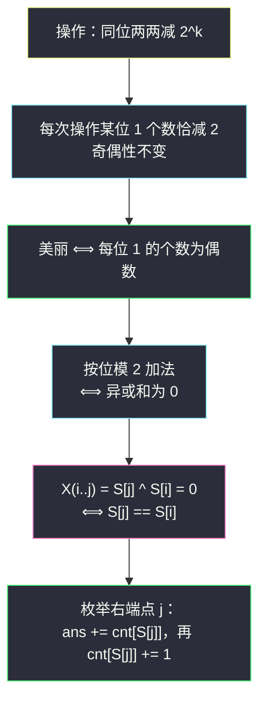
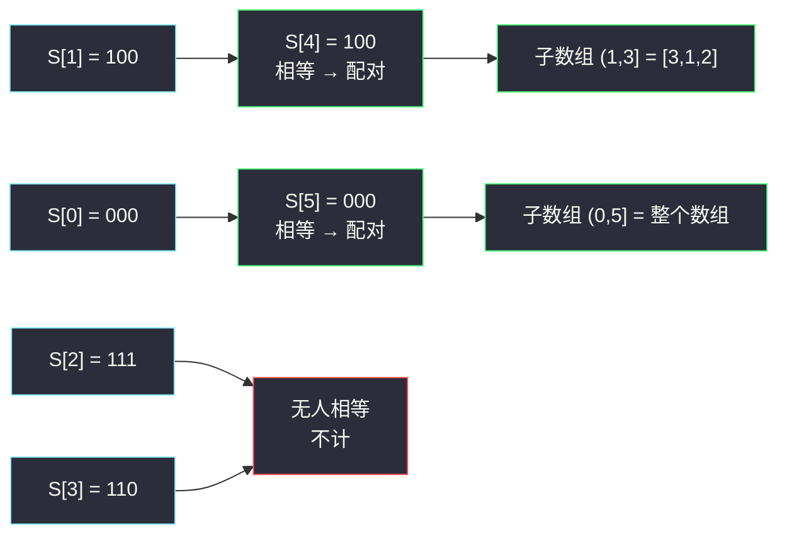

# 统计美丽子数组数目（异或前缀和 + 哈希 · 同值配对）

## 一、问题描述

给你一个正整数数组 `nums`。

在一次操作中，你可以：

1. 选择两个**不同**的下标 `i` 和 `j`；
2. 选择一个非负整数 `k`，使得 `nums[i]` 和 `nums[j]` 的二进制表示的第 `k` 位**都是 1**；
3. 将 `nums[i]` 和 `nums[j]` 都减去 `2^k`。

如果某个子数组能够通过上述操作**任意多次**（也可以 0 次）全部变成 `0`，则称它是**美丽的**。请你返回 `nums` 中美丽子数组的数目。

> 🔗 LeetCode 2588：https://leetcode.cn/problems/count-the-number-of-beautiful-subarrays/
>
> 数据范围：`1 <= nums.length <= 10^5`，`1 <= nums[i] <= 10^9`。

**示例 1**

```
输入：nums = [4,3,1,2,4]
输出：2
解释：[3,1,2] 与 [4,3,1,2,4] 是美丽的。
```

**示例 2**

```
输入：nums = [1,10,4]
输出：0
```

**直观理解**

操作的语义是「**同一位上成对地消掉两个 1**」。于是能否全消成 0，只取决于初始时**每一位上 1 的个数是不是偶数**——与顺序无关。而「每位 1 的个数都是偶数」用一句话概括就是：整个子数组的**按位异或和为 0**。剩下的事交给异或前缀和 + 哈希配对，与 [#974 和可被 K 整除的子数组](https://leetcode.cn/problems/subarray-sums-divisible-by-k/)（见同批 `subarray-sums-divisible-by-k.md`）完全同构。

---

## 二、暴力解法

枚举所有子数组，边延伸右端点边维护异或和，等于 0 就计数。

```python
class Solution:
    def beautifulSubarrays(self, nums: List[int]) -> int:
        n, ans = len(nums), 0
        for i in range(n):
            x = 0                        # 子数组 nums[i..j] 的异或和
            for j in range(i, n):
                x ^= nums[j]
                if x == 0:
                    ans += 1
        return ans
```

### 复杂度

- **时间**：`O(n²)`（异或可以增量维护，省掉了重算，但枚举数量没变）。
- **空间**：`O(1)`。

### 🔴 瓶颈在哪里

`n = 10^5` 时约 `5 * 10^9` 次运算，超时。本质问题：判断「子数组能否全消为 0」时反复从头算异或，没有复用前缀信息。

---

## 三、优化探索（核心章节）

> 📚 本题在灵茶题单中属于 **§1.2 前缀和与哈希表**（常用数据结构 A），模板是 **枚举右维护左**。它与 #974 是同一小节的姊妹题：把「前缀和模 k 同余」换成「异或前缀**字面相等**」，其余一字不改。#2588 也是题单中「**状态压缩前缀和**」的代表——30 个二进制位的奇偶性压缩成一个整数。

### 3.1 从操作语义到「每位 1 的个数」

每次操作把某一位上的 1 **成对**消掉两个，即该位 1 的个数恰减 2：

- **必要性**：若初始某位 1 的个数是奇数，操作只改变偶数，奇偶性永远不变，不可能变成 0；
- **充分性**：若每位 1 的个数都是偶数，把该位的 1 两两任意配对、逐对操作即可全部消光（位与位互不干扰，操作可以按位独立进行）。

所以：**美丽 ⟺ 子数组中每个二进制位上 1 的总个数都是偶数**。

### 3.2 「每位偶数」⟺ 「异或和为 0」

异或就是「按位模 2 加法」：某位 1 的个数是偶数，该位异或结果为 0；所有位都满足，整体异或和为 0。把 30 个「位上奇偶布尔值」压缩成一个 30 位整数（状态压缩 bitmask），异或运算天然维护它。

```
美丽 ⟺ nums[i] ^ nums[i+1] ^ ... ^ nums[j] == 0
```

示例验证 `[3,1,2]`：`3 = 011`、`1 = 001`、`2 = 010`，逐位 1 的个数为 `2, 2, 0` 全偶，且 `011 ^ 001 ^ 010 = 000` ✓。

### 3.3 异或前缀和：配对条件是「相等」

记 `S[j] = nums[0] ^ ... ^ nums[j-1]`（`S[0] = 0` 为空前缀），子数组 `(i, j]` 的异或和为：

```
X(i..j) = S[j] ^ S[i]
```

异或满足自消性 `x ^ x = 0`，所以：

```
X(i..j) == 0  ⟺  S[j] == S[i]
```

**两个异或前缀相等 ⟺ 它们夹出的子数组美丽**。计数 = 数「同值前缀对」的个数。

### 3.4 与 #974 的同构映射

| | #974（模 k 同余） | #2588（本篇） |
|--|---------------------|----------------|
| 子数组条件 | 和 ≡ 0 (mod k) | 每位 1 的个数为偶数 |
| 前缀结构 | 前缀和 | 异或前缀和 |
| 等价类变换 T | `T(x) = x mod k` | `T(x) = x`（异或前缀已自带压缩） |
| 配对条件 | `T(pre[i]) == T(pre[j])` | `S[i] == S[j]` |
| 计数容器 | 长度 k 的数组 | 哈希表（值域可达 2^30） |
| 初始化 | `cnt[0] = 1` | `cnt[0] = 1` |

统一框架：**满足条件的子数组个数 = Σ 满足关系的（左，右）前缀对数**，枚举右端点、哈希表查左边。



### 3.5 一句话核心

> **美丽 = 异或和为 0 = 两个异或前缀相等**；一趟扫描维护前缀出现次数，`ans += cnt[s]`，与 #974 的同余配对逐行对应。

---

## 四、代码实现

### Python（主解：枚举右维护左，哈希表计数）

```python
class Solution:
    def beautifulSubarrays(self, nums: List[int]) -> int:
        cnt = defaultdict(int)
        cnt[0] = 1                       # 预置空前缀 S[0] = 0
        ans = s = 0
        for x in nums:
            s ^= x                       # 异或前缀和，增量维护
            ans += cnt[s]                # 左边与当前前缀相等的个数
            cnt[s] += 1                  # 当前前缀入表
        return ans
```

**变量含义**

| 变量 | 含义 |
|------|------|
| `s` | 当前异或前缀 `S[j+1]` |
| `cnt[v]` | 左边异或前缀中值为 `v` 的个数，初始 `{0: 1}` |
| `cnt[s]` | 本轮查询到的同值配对数 |

**循环不变式**：处理第 `j` 个元素前，`cnt` 恰好统计了 `S[0..j]`（共 `j+1` 个前缀）的出现次数。

**注意返回值规模**：`n = 10^5` 时答案最多约 `n * (n+1) / 2 ≈ 5 * 10^9`，超出 32 位整数——Python 无感，Java/C++ 必须用 64 位。

### Java（最优解同款）

```java
import java.util.HashMap;
import java.util.Map;

class Solution {
    public long beautifulSubarrays(int[] nums) {
        Map<Integer, Integer> cnt = new HashMap<>();
        cnt.put(0, 1);
        long ans = 0;
        int s = 0;
        for (int x : nums) {
            s ^= x;
            ans += cnt.getOrDefault(s, 0);
            cnt.merge(s, 1, Integer::sum);
        }
        return ans;
    }
}
```

---

## 五、具体例子演示

### 例 1：nums = [4,3,1,2,4]（示例 1）

先列二进制与异或前缀（`S[j] = nums[0] ^ ... ^ nums[j-1]`）：

| j | nums[j-1] | 二进制 | S[j] | S[j] 二进制 |
|---|-----------|--------|------|-------------|
| 0 | —（空前缀） | — | 0 | 000 |
| 1 | 4 | 100 | 4 | 100 |
| 2 | 3 | 011 | 7 | 111 |
| 3 | 1 | 001 | 6 | 110 |
| 4 | 2 | 010 | 4 | 100 |
| 5 | 4 | 100 | 0 | 000 |

逐步扫描（`cnt` 为更新后的哈希表内容）：

| j | nums[j] | s = S[j+1] | 查询 cnt[s] | 配对的前缀 | ans | 更新后 cnt |
|---|---------|------------|--------------|------------|-----|------------|
| 0 | 4 | 100 | 0 | 无 | 0 | `{000:1, 100:1}` |
| 1 | 3 | 111 | 0 | 无 | 0 | `{000:1, 100:1, 111:1}` |
| 2 | 1 | 110 | 0 | 无 | 0 | `{000:1, 100:1, 111:1, 110:1}` |
| 3 | 2 | 100 | 1 | S[1]=4 | 1 | `{000:1, 100:2, 111:1, 110:1}` |
| 4 | 4 | 000 | 1 | S[0]=0 | 2 | `{000:2, 100:2, 111:1, 110:1}` |

答案 `2` ✓。两对配对还原：

- `S[4] = S[1] = 4`：夹出子数组 `(1, 3]` 即 `[3,1,2]`；
- `S[5] = S[0] = 0`：夹出子数组 `(0, 5]` 即整个数组 `[4,3,1,2,4]`。

**组合视角验证**：值 0 出现 2 次、值 4 出现 2 次、其余各 1 次，`C(2,2) + C(2,2) = 1 + 1 = 2` ✓。

### 例 2：nums = [1,10,4]（示例 2）

异或前缀 `0, 1, 11, 15`，四个值互不相同，每轮查询都是 0，答案 0 ✓——任何一位上 1 的个数都凑不成偶（`1=001`、`10=1010`、`4=100` 逐位 1 的个数分别为 1、1、1、1）。



---

## 六、复杂度分析

| 方法 | 时间 | 空间 | 说明 |
|------|------|------|------|
| 暴力枚举 | `O(n²)` | `O(1)` | 异或增量维护，但枚举量平方级 |
| 异或前缀 + 哈希 | `O(n)` | `O(n)` | 一趟扫描，哈希表最多存 n+1 个前缀值 |

---

## 七、对比总结

**前缀 + 哈希家族：本题把「同余」换成「同值」**

| 题 | 前缀结构 | 配对条件 | 一句话 |
|----|----------|----------|--------|
| #560 和为 K 的子数组 | 前缀和 | `pre[i] == pre[j] - k` | 差为 k |
| #974 和可被 K 整除 | 前缀和 mod k | 余数相等 | 差是 k 的倍数 |
| #1524 和为奇数 | 前缀和 mod 2 | 余数不同 | 差是奇数 |
| **#2588 本篇** | **异或前缀** | **前缀相等** | **异或差为 0** |

#974 的哈希键是「模 k 等价类」，本题的哈希键是「异或前缀本身」——异或运算已经把 30 个位的奇偶性压缩进键里，所以连取模都省了。这正是题单「状态压缩前缀和」的思想：26 个字母 / 5 个元音的奇偶性同理压缩成一个整数（见 #1371）。

**易错点**

1. **`cnt[0] = 1` 预置空前缀**：漏了会丢掉所有「从下标 0 开始的美丽子数组」。
2. **先查后加**：当前前缀先查询再入表。
3. **返回类型**：答案可达约 `5 * 10^9`，Java 用 `long`、C++ 用 `long long`。
4. 别把「美丽」误判成「元素两两相等」——与排列无关，只与逐位 1 的奇偶性有关。

**模板（同值配对，Python 版）**

```python
cnt = defaultdict(int)
cnt[0] = 1
ans = s = 0
for x in nums:
    s ^= x                 # 换成 s += x、s = (s + x) % k 即得 #560 / #974
    ans += cnt[s]
    cnt[s] += 1
return ans
```

---

## 八、举一反三

| 题目 | 关系 |
|------|------|
| [974. 和可被 K 整除的子数组](https://leetcode.cn/problems/subarray-sums-divisible-by-k/) | 直接同构（同余 vs 同值），见同批 `subarray-sums-divisible-by-k.md` |
| [1524. 和为奇数的子数组数目](https://leetcode.cn/problems/number-of-sub-arrays-with-odd-sum/) | 家族最简形态（模 2 配反号），见同批 `number-of-sub-arrays-with-odd-sum.md` |
| [1442. 形成两个异或相等数组的方案数](https://leetcode.cn/problems/count-triplets-that-can-form-two-arrays-of-equal-xor/) | 同为异或前缀配对，从「数对」变形为「数三元组」 |
| [1371. 每个元音包含偶数次的最长子字符串](https://leetcode.cn/problems/find-the-longest-substring-containing-vowels-in-even-counts/) | 状态压缩前缀 + 同值配对求**最长**（哈希存首次下标而非计数） |
| [560. 和为 K 的子数组](https://leetcode.cn/problems/subarray-sum-equals-k/) | 加法版前缀配对，家族鼻祖 |
| [1542. 找出最长的超赞子字符串](https://leetcode.cn/problems/find-the-longest-awesome-substring/) | 10 位数字奇偶性 bitmask 前缀 + 同值/近同值配对 |

**思想迁移**

- 看到「每位出现偶数次 / 恰好配对消除」→ 立刻想**异或前缀和**，配对条件退化为「相等」。
- 异或是加法在 GF(2) 上的版本：加法题的「前缀差」套路平移过来就是「前缀异或」，模 k 同余、模 2 同余、GF(2) 逐位同余，一家人。
- 口诀：**「成对消一为美丽，异或为零是等价；前缀相等即配对，先查后加莫忘记。」**
