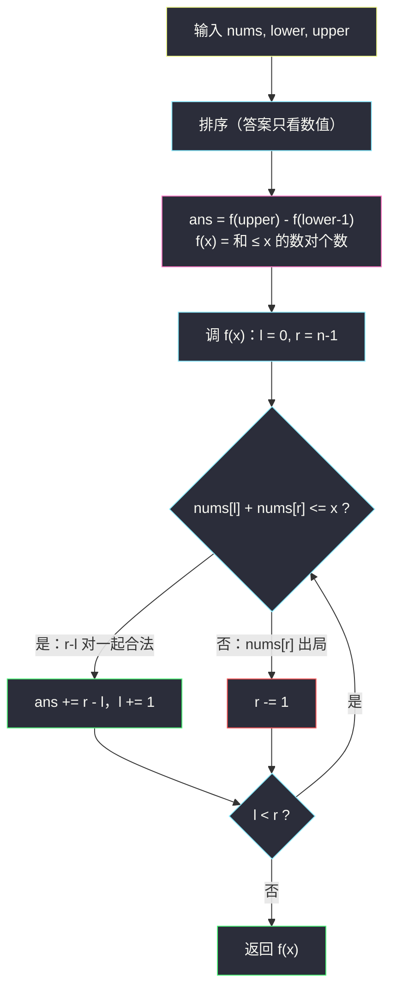

# 统计公平数对的数目（排序 + 相向双指针 · 区间计数作差）

## 一、问题描述

给一个下标从 0 开始、长度为 `n` 的整数数组 `nums`，以及两个整数 `lower` 和 `upper`。「公平数对」定义如下：一对下标 `(i, j)`（`0 <= i < j < n`）满足

```
lower <= nums[i] + nums[j] <= upper
```

返回公平数对的数目。

> 🔗 LeetCode 2563：https://leetcode.cn/problems/count-the-number-of-fair-pairs/
>
> 数据范围：`1 <= nums.length <= 10^5`，`nums.length == n`，`-10^9 <= nums[i] <= 10^9`，`-10^9 <= lower <= upper <= 10^9`。

**示例 1**

```
输入：nums = [0,1,7,4,4,5], lower = 3, upper = 6
输出：6
解释：6 个公平数对对应的和依次为：(0,4)→4、(0,4)→4、(0,5)→5、(1,4)→5、(1,4)→5、(1,5)→6。
```

**示例 2**

```
输入：nums = [1,7,9,2,5], lower = 11, upper = 11
输出：1
解释：唯一的公平数对是 nums[0] + nums[3] = 2 + 9 = 11。
```

**直观理解**

「和落在某个区间里」的数对计数题。它是「两数之和 = target」的推广：等号变成了一段区间，于是答案天然可以拆成「和 ≤ upper 的对数」减去「和 ≤ lower-1 的对数」——这个**作差（前缀思想）**是全题的第一把钥匙。

## 二、暴力解法（双重循环枚举数对）

### 直观思路

枚举所有 `i < j`，验证 `lower <= nums[i] + nums[j] <= upper`。数组**不需要排序**，直接按原顺序扫。

```python
class Solution:
    def countFairPairs(self, nums: List[int], lower: int, upper: int) -> int:
        n = len(nums)
        ans = 0
        for i in range(n):
            for j in range(i + 1, n):
                if lower <= nums[i] + nums[j] <= upper:
                    ans += 1
        return ans
```

### 复杂度

- **时间**：`O(n^2)`。`n = 10^5` 时约 `5 * 10^9` 次判断，必然超时。
- **空间**：`O(1)` 额外空间。

### 🔴 瓶颈在哪里

我们在为「每一个数对」单独验证，但合法性只依赖两个数的**数值和**。既然只看数值，数组原来的顺序毫无用处——把「逐对验证」换成「按值组织 + 整段计数」，平方级就能塌到线性对数级。

## 三、优化探索（核心章节）

> 📚 本题在灵茶题单中属于 **§3.2 相向双指针家族**：排序后用 `l`、`r` 相向而行，数「和 ≤ x」的数对个数。灵神的套路是**先把双边界问题作差成两个单边界问题**，再对每个单边界跑一遍双指针（或二分）。

### 3.1 排序为什么不破坏答案

要数的对象是「下标对 `(i, j)` 且 `i < j`」，由于每对下标只被数一次且合法性与顺序无关，它本质上是一个**无序对**的集合。排序只是重新排列了这些无序对中元素的相对位置，不增不减——答案不变。于是可以放心 `nums.sort()`。

### 3.2 第一把钥匙：区间计数作差

设 `f(x)` = 排序数组中满足 `nums[i] + nums[j] <= x` 的下标对个数（`i < j`）。那么：

```
答案 = f(upper) - f(lower - 1)
```

```
[lower, upper]  区间  =  ( -∞, upper ]  减去  ( -∞, lower-1 ]
```

双边界变成两个**单边界**问题，每个只需数「和不超过某个阈值」的对数。`lower` 最小到 `-10^9`，`lower - 1` 不会溢出（Python 无所谓；Java/C++ 用 `long` 也安全）。

### 3.3 第二把钥匙：数「和 ≤ x」的数对 —— 相向双指针

对排序数组，固定阈值 `x`，用 `l = 0, r = n - 1` 相向而行：

- 若 `nums[l] + nums[r] <= x`：`nums[l]` 配上**当前最大的候选** `nums[r]` 都没超，那么区间 `(l, r]` 里的任何数（都 ≤ `nums[r]`）与 `nums[l]` 配对同样不超 → `(l, l+1), (l, l+2), ..., (l, r)` 共 `r - l` 对**一起合法**，计入后 `l` 右移。
- 若 `nums[l] + nums[r] > x`：`nums[r]` 配上**当前最小的候选** `nums[l]` 都超了，左边任何更大的数配上它更超 → `nums[r]` 与区间 `[l, r)` 里任何数都不行，`r` 左移。

每步淘汰一个元素，`l`、`r` 合计至多 `n` 步，单趟 `O(n)`。这两次调用共用同一个排序结果，总时间被排序的 `O(n log n)` 主导。



### 3.4 另一条等价路：二分

固定每个 `i`（在排序数组上），合法的 `j > i` 需满足 `nums[j] <= x - nums[i]`。由于数组有序，合法的 `j` 恰好是后缀 `(i, pos-1]` 里的一段前缀——用 `bisect_right(nums, x - nums[i])` 找到「第一个 > x - nums[i]」的位置 `pos`，个数就是 `max(0, pos - i - 1)`。逐个 `i` 累加，`f(x)` 同样到手，单趟 `O(n log n)`，整体与双指针版同阶。双指针版胜在常数小、无库依赖；二分版胜在「单点查询」时可增量应对（比如边界不停变化时）。

### 3.5 一个易错点：不要用「≥ lower 的对数」作差

直觉上也可以数「和 ≥ lower」再减「和 > upper」，但这要求写「和 ≥ y」的双指针（左端递增方向的版本），边界讨论反而绕。统一成「和 ≤ x」一个方向，两次调用完全复用同一份代码，最不容易错——**化归到同一个单边界原语**，是这类题的通用心法。

## 四、代码实现

**主解：排序 + 相向双指针（两次作差调用）**

```python
from typing import List

class Solution:
    def countFairPairs(self, nums: List[int], lower: int, upper: int) -> int:
        nums.sort()

        def count_not_greater(x: int) -> int:
            """数 i < j 且 nums[i] + nums[j] <= x 的对数（相向双指针）"""
            l, r = 0, len(nums) - 1
            cnt = 0
            while l < r:
                if nums[l] + nums[r] <= x:
                    cnt += r - l          # (l, l+1) 到 (l, r) 一起合法
                    l += 1
                else:
                    r -= 1                # nums[r] 与 [l, r) 内任何数都超
            return cnt

        return count_not_greater(upper) - count_not_greater(lower - 1)
```

**备选：排序 + 二分（等价解，供对照）**

```python
from bisect import bisect_right

class Solution:
    def countFairPairs(self, nums: List[int], lower: int, upper: int) -> int:
        nums.sort()

        def count_not_greater(x: int) -> int:
            cnt = 0
            for i, v in enumerate(nums):
                pos = bisect_right(nums, x - v)   # 第一个 > x - v 的下标
                cnt += max(0, pos - i - 1)        # 去掉 j <= i 的部分
            return cnt

        return count_not_greater(upper) - count_not_greater(lower - 1)
```

**逐行要点**

- `cnt += r - l`：不是 `r - l + 1`，因为数对要求两个下标不同，`(l, l)` 不算；区间 `(l, r]` 共 `r - l` 个搭档。
- `max(0, pos - i - 1)`：二分结果可能落在 `i + 1` 之前（包括 `pos = i + 1` 时个数为 0），截断负数。
- 作差后的结果非负：`lower - 1 < upper` 保证「和 ≤ upper」的对集合真包含「和 ≤ lower - 1」的对集合。

## 五、例子演示

以示例 1 为例：`nums = [0,1,7,4,4,5]`，`lower = 3`，`upper = 6`。排序后：

```
下标:  0  1  2  3  4  5
值:    0  1  4  4  5  7
```

**第一步：f(6) —— 数「和 ≤ 6」的对数**，`l = 0, r = 5`：

| 轮 | l | r | nums[l] | nums[r] | 和 | 与 6 比较 | 动作 | 本轮贡献 | 累计 |
|----|---|---|---------|---------|-----|-----------|------|----------|------|
| 1 | 0 | 5 | 0 | 7 | 7 | 7 > 6 | r = 4，7 出局 | 0 | 0 |
| 2 | 0 | 4 | 0 | 5 | 5 | 5 ≤ 6 | 加 r-l = 4：即 (0,1)(0,2)(0,3)(0,4)，l = 1 | 4 | 4 |
| 3 | 1 | 4 | 1 | 5 | 6 | 6 ≤ 6 | 加 r-l = 3：即 (1,2)(1,3)(1,4)，l = 2 | 3 | 7 |
| 4 | 2 | 4 | 4 | 5 | 9 | 9 > 6 | r = 3 | 0 | 7 |
| 5 | 2 | 3 | 4 | 4 | 8 | 8 > 6 | r = 2，l == r 结束 | 0 | **7** |

第 2 轮展开看：`nums[0] = 0` 很小，它和剩下区间里**最大的 5** 配对都 ≤ 6，所以它与 `(0, 4]` 区间内的 `1, 4, 4, 5` 全部 4 个搭档一起合法，`+4` 之后 0 这个数功成身退。

**第二步：f(2) —— 数「和 ≤ 2」的对数**，`l = 0, r = 5`：

| 轮 | l | r | nums[l] | nums[r] | 和 | 与 2 比较 | 动作 | 本轮贡献 | 累计 |
|----|---|---|---------|---------|-----|-----------|------|----------|------|
| 1 | 0 | 5 | 0 | 7 | 7 | 7 > 2 | r = 4 | 0 | 0 |
| 2 | 0 | 4 | 0 | 5 | 5 | 5 > 2 | r = 3 | 0 | 0 |
| 3 | 0 | 3 | 0 | 4 | 4 | 4 > 2 | r = 2 | 0 | 0 |
| 4 | 0 | 2 | 0 | 4 | 4 | 4 > 2 | r = 1 | 0 | 0 |
| 5 | 0 | 1 | 0 | 1 | 1 | 1 ≤ 2 | 加 r-l = 1：即 (0,1)，l = 1，结束 | 1 | **1** |

**第三步：作差**。`f(6) - f(2) = 7 - 1 = 6`，与示例输出一致。✅

验证示例 2：`nums = [1,7,9,2,5]` 排序为 `[1,2,5,7,9]`。`f(11)`：`l=0,r=4`：`1+9=10 ≤ 11` 加 4，`l=1`；`2+9=11 ≤ 11` 加 3，`l=2`；`5+9=14 > 11`，`r=3`；`5+7=12 > 11`，`r=2` 结束，`f(11) = 7`。`f(10)`：`1+9=10 ≤ 10` 加 4；`2+9=11 > 10` `r=3`；`2+7=9 ≤ 10` 加 2；`5+7=12 > 10` `r=2` 结束，`f(10) = 6`。答案 `7 - 6 = 1`。✅

## 六、复杂度

- **时间**：排序 `O(n log n)`；两次 `count_not_greater` 各 `O(n)`（双指针版）或 `O(n log n)`（二分版）。整体 `O(n log n)`，`n = 10^5` 时百万级操作，轻松通过。
- **空间**：`O(1)` 额外空间（原地排序；Python Timsort 的辅助空间如前述不苛求。二分版同理）。

## 七、对比总结

| 解法 | 时间 | 空间 | 说明 |
|------|------|------|------|
| 双重循环 | `O(n^2)` | `O(1)` | `n=10^5` 必超时 |
| 排序 + 相向双指针（作差） | `O(n log n)` | `O(1)` | 本文主解，常数最小 |
| 排序 + 两次二分（作差） | `O(n log n)` | `O(1)` | 代码更短，同阶 |

**方法论提炼**：

1. **区间问题作差成单边界问题**——`[lower, upper]` 拆成 `≤ upper` 减 `≤ lower-1`，一次实现、两次调用；
2. **只看数值的问题可以排序**——下标对的「无序性」保证排序不丢答案；
3. **单调结构上双指针淘汰**——每一步让一个元素「确定出局或确定收割一整批」，`O(n)` 清场。

这三个套路几乎复用所有「数满足和约束的数对」题：把阈值 `x` 换个条件，框架原封不动。

## 八、举一反三

本题练的是「排序 + 相向双指针 + 区间计数作差」，同一家族的题目：

1. **LeetCode 2824 统计和小于目标的下标对数目**：https://leetcode.cn/problems/count-pairs-whose-sum-is-less-than-target/ —— 就是本文的 `count_not_greater(x-1)` 单独成题，先做它再回来本题会非常顺。
2. **LeetCode 611 有效三角形的个数**：https://leetcode.cn/problems/valid-triangle-number/ —— 排序后枚举最大边，双指针数「两边之和 > 最大边」的对数，同样是「整段收割」的打法。
3. **LeetCode 15 三数之和**：https://leetcode.cn/problems/3sum/ —— 相向双指针家族的原型题，枚举首数后内层双指针。
4. **LeetCode 923 三数之和的多种可能**：https://leetcode.cn/problems/3sum-with-multiplicity/ —— 双指针命中后对相同值**批量计数**（组合数），是本题「计数」方向的加强版。
